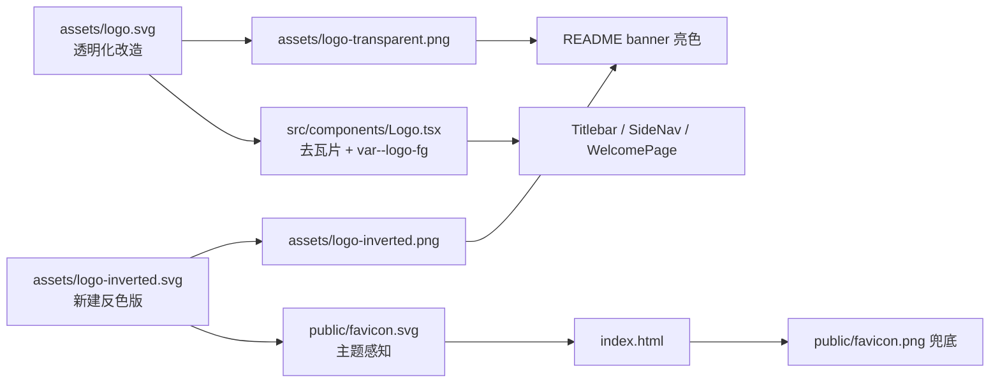

## 产品概述

将项目现有品牌 Logo（`assets/logo.svg`，IDE 窗口 + 代码符号图形）改造为透明背景版本，并生成暗色主题反色版本，全面应用到项目各处。保留原始图形元素、形状、比例和风格不变，仅处理背景。

## 核心功能

- 透明背景 Logo：移除浅灰底瓦片，图形（圆角窗口外框 + 标题栏 + `</>` 代码符号）原样保留，输出透明 PNG
- 暗色反色版本：图形颜色反转为浅色（#F5F5F5），透明背景，确保深色主题下视觉一致、可识别
- 全面应用：favicon（主题感知）、应用内 Logo（header/标题栏/侧栏/欢迎页，随主题自动反色）、README 文档 banner
- 桌面/任务栏应用图标（`src-tauri/icons/`）保持现状（浅灰瓦片底），不透明化（用户已确认）

## 技术栈选择

- 现有项目：Tauri v2 + React 19 + TypeScript + Vite + Tailwind v4，无需引入新技术
- 资产栅格化：复用项目已有的 `sharp ^0.35.3`（devDependency，`scripts/generate-app-icon.js` 已在用），零新依赖
- 主题感知 favicon：纯 SVG 内嵌 `@media (prefers-color-scheme)`，无需 JS

## 实现方案

### 资产生成

1. `assets/logo.svg` 原地透明化：仅删除底瓦片 `<rect fill="#F5F5F5" .../>`，补充 `viewBox="0 0 614.4 614.4"`（保证渲染一致），图形 `<g>` 内全部元素（1 stroke rect + 5 path + 3 circle）与 transform、比例、风格完全不变
2. 新建 `assets/logo-inverted.svg`：镜像 logo.svg 结构，透明背景，所有图形颜色 `#1A1A1A` → `#F5F5F5`
3. 新建 `scripts/generate-logo.js`：用 sharp 将两个 SVG 栅格化为 1024×1024 透明 PNG（`assets/logo-transparent.png`、`assets/logo-inverted.png`），并输出 32×32 `public/favicon.png` 兜底图；一次执行生成全部资产

### 应用内 Logo 改造（header/侧栏/欢迎页）

- `src/components/Logo.tsx`：删除背景 rect，图形元素全部使用 `var(--logo-fg)` —— 该变量在 `globals.css` 已按 `data-palette` 自动反色（亮色 #1A1A1A / 深色 #F5F5F5），无需新增逻辑即可实现透明背景 + 暗色反色
- `src/styles/globals.css`：删除两处 `--logo-bg` 定义，仅保留 `--logo-fg`，同步更新注释
- `src/components/SideNav.tsx`：更新"Logo 自带底色瓦片"注释

### favicon

- 新建 `public/favicon.svg`：透明背景，内嵌 CSS 类，`@media (prefers-color-scheme: dark)` 下图形颜色自动从 #1A1A1A 切换为 #F5F5F5（外框 stroke 类单独处理 `fill:none`，避免 CSS 覆盖）
- `index.html`：新增 `<link rel="icon" type="image/svg+xml" href="/favicon.svg">` + PNG 兜底 link；当前 CSP `img-src 'self'` 不受影响

### 文档

- `README.md`：标题下加 `<picture>` 双图 banner（GitHub 支持 prefers-color-scheme），亮色引用 `assets/logo-transparent.png`，暗色引用 `assets/logo-inverted.png`，URL 指向 main 分支
- `CHANGELOG.md`：Unreleased 追加本次变更条目

### 保持不变（用户确认）

- 桌面图标链路：`assets/app-icon.svg` → `scripts/generate-app-icon.js` → `assets/source-icon.png` → `src-tauri/icons/` 全套，均不修改
- `docs/`、`temp-logo-check.cjs`（去瓦片后其 rect-size 比对出现 MISMATCH 属预期，脚本本身不动）

## 性能与可靠性

- 无运行时热路径：sharp 为一次性构建期工具，PNG 资产生成成本可忽略
- 图形数据零改动：仅删背景 rect / 换颜色值，视觉比例 100% 保留，不引入手误风险
- 测试保障：更新 `Logo.test.tsx` 断言（rect 数量 2→1、移除 `--logo-bg` 断言、新增"无背景瓦片"断言），跑通 `pnpm test` / `pnpm lint` / `pnpm typecheck`

## 架构设计

本任务为资产与资源替换，无新增系统组件；数据流为静态资产 → 引用点展示：



## 目录结构

```
project-root/
├── assets/
│   ├── logo.svg              # [MODIFY] 原地透明化：删除底瓦片 rect，补充 viewBox；图形元素/形状/比例不变
│   ├── logo-inverted.svg     # [NEW] 透明背景反色版：图形颜色 #F5F5F5，镜像 logo.svg 结构
│   ├── logo-transparent.png  # [NEW] 1024px 透明 PNG（由脚本生成）
│   └── logo-inverted.png     # [NEW] 1024px 反色 PNG（由脚本生成）
├── scripts/
│   └── generate-logo.js      # [NEW] sharp 栅格化脚本：生成两个 1024px PNG + public/favicon.png(32px)
├── public/
│   ├── favicon.svg           # [NEW] 主题感知 SVG favicon（prefers-color-scheme 切换图形颜色）
│   └── favicon.png           # [NEW] 32×32 PNG 兜底（由脚本生成）
├── src/
│   ├── components/
│   │   ├── Logo.tsx          # [MODIFY] 删除背景 rect，图形统一 var(--logo-fg)，更新注释
│   │   └── Logo.test.tsx     # [MODIFY] rect 断言 2→1，移除 --logo-bg 断言，新增无背景瓦片断言
│   ├── components/SideNav.tsx# [MODIFY] 更新"自带底色瓦片"注释
│   └── styles/globals.css    # [MODIFY] 删除两处 --logo-bg 定义，保留 --logo-fg，更新注释
├── index.html                # [MODIFY] 新增 SVG favicon + PNG 兜底 link
├── README.md                 # [MODIFY] 标题下加 <picture> 亮/暗双图 banner
└── CHANGELOG.md              # [MODIFY] Unreleased 追加本次透明/反色 Logo 变更条目
```

## Agent Extensions

### SubAgent

- **code-explorer**
- 用途：在执行阶段复核全仓库所有 logo/favicon 引用点（含 html、md、tsx 等），确保"全面应用"无遗漏，与已有调研结果交叉验证
- 预期结果：输出完整引用清单，确认除计划内文件外无其他需修改的引用位置