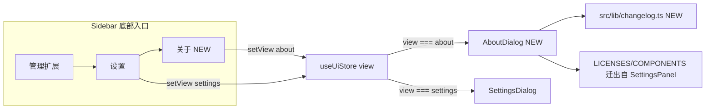

## 产品概述

将 qraft 中的「关于」从设置弹窗中独立出来,形成独立的「关于」对话框(参考 wait-home/desktop 项目的 about 页面布局),并在主侧边栏「设置」下方新增「关于」入口;同时新增版本更新日志功能,首版提供 v0.1.0 条目(内容基于 2026-08-21 凌晨 0 点前的 git 历史与代码提炼)。

## 核心功能

- 独立「关于」对话框:左右分栏布局,左侧导航含四个分区(应用信息 / 更新日志 / 开源许可 / 开源组件),右侧展示对应内容
- 主侧边栏入口:在「设置」导航项下方新增「关于」入口(展开态文本项 + 折叠态图标按钮)
- 设置弹窗瘦身:SettingsDialog 中移除「关于」菜单项,设置与关于彻底分离
- 更新日志:v0.1.0 条目按 新增/修复/优化/其他 四类组织,使用折叠面板展示版本摘要与变更明细
- 应用信息:应用名称、版本号、技术栈、UI 框架、更新源等基础信息展示

## 技术栈

- 前端:React 19 + TypeScript + Vite(现有)
- 桌面壳:Tauri 2(现有)
- UI:shadcn/ui + Tailwind CSS v4 + Radix UI(现有)
- 状态管理:zustand(现有,`useUiStore`)
- 测试:Vitest + Testing Library(现有)

## 实现方案

沿用 qraft 现有「视图驱动弹窗」模式:扩展 `AppView` 联合类型新增 `'about'`,AboutDialog 与 SettingsDialog 一样由 `view === 'about'` 控制开合,复用现有 Radix Dialog 基础设施与语义色 token,不引入新的架构模式。

更新日志数据采用前端硬编码(`src/lib/changelog.ts`),结构对齐 wait-home 的 `VersionInfo` 模型(version/date/summary/changes),字段类型与变更类别映射(新增/修复/优化/其他)保持一致,便于后续发版时按同一格式追加 v0.2.0 等条目。v0.1.0 内容从 `git log --until="2026-08-21 00:00"` 的约 80 条提交中按类型提炼合并(如:GitHub Releases 更新源与安装方式分流、Monaco 语言模式/代码折叠/中文右键菜单、编辑器标签页拖拽排序与对比差异、Base64 多模式、字符命名风格切换、keepalive、侧边栏收藏排序等 feature;Tailwind v4/ScrollArea/Monaco CSP/Vite8 等 fix;版本号统一数据源/语义色 token/性能优化等 refactor;CI 多平台 arm64 与审计等 chore)。

关于对话框布局完全参考 wait-home 的 about-page:左侧 4 项 ghost 导航按钮(应用信息/更新日志/开源许可/开源组件)+ 右侧滚动内容区。应用信息/开源许可/开源组件数据(ABOUT_INFO_ITEMS、LICENSES、COMPONENTS)从 `SettingsPanel.tsx` 整体迁出复用,`__APP_VERSION__`(Vite 注入)保持不变。

## 实现注意事项

- `SettingsPanel.tsx` 中 AboutSection(约 244-971 行)整体迁出,避免重复维护;`SettingsPanel` 底部渲染的 `<AboutSection />` 一并移除
- `SettingsDialog.test.tsx` 第 29-30、44-47 行断言「关于」菜单与 AboutSection 内容,必须同步更新,否则测试失败
- qraft 当前无 accordion 组件,需新增(shadcn 标准实现,依赖 `@radix-ui/react-accordion`,需 `pnpm add`),参考 wait-home 更新日志与开源组件的折叠交互
- 入口修改目标是 `src/components/layout/Sidebar.tsx`(App.tsx 实际使用);`src/components/SideNav.tsx` 未被 App 挂载,不做修改,避免无关重构
- Esc 关闭逻辑:App.tsx `close_panel` 快捷键需补充 `view === 'about'` 分支,与 settings 行为一致

## 架构设计



## 目录结构

```
project-root/
├── src/
│   ├── lib/
│   │   └── changelog.ts              # [NEW] v0.1.0 更新日志硬编码数据,导出 CHANGELOG_VERSIONS 数组与 VersionInfo/ChangeEntry 类型
│   ├── components/
│   │   ├── AboutDialog.tsx           # [NEW] 独立关于弹窗:左侧四区导航+右侧内容;含 InfoSection/ChangelogSection/LicensesSection/ComponentsSection;迁入 AboutSection 原有数据与 __APP_VERSION__
│   │   ├── AboutDialog.test.tsx      # [NEW] 四区切换、更新日志渲染、关闭行为测试
│   │   ├── SettingsDialog.tsx        # [MODIFY] 移除 about 菜单项及 Info/AboutSection import
│   │   ├── SettingsDialog.test.tsx   # [MODIFY] 移除关于菜单断言,补充验证关于已独立
│   │   ├── SettingsPanel.tsx         # [MODIFY] 删除 AboutSection 相关代码块(244-971行)与 SettingsPanel 中的渲染引用
│   │   ├── layout/
│   │   │   └── Sidebar.tsx           # [MODIFY] 展开态底部「设置」下新增「关于」NavItem;折叠态新增「关于」RailButton
│   │   └── ui/
│   │       └── accordion.tsx         # [NEW] shadcn 标准 Accordion 组件(基于 @radix-ui/react-accordion)
│   ├── store/
│   │   └── uiStore.ts                # [MODIFY] AppView 联合类型新增 'about'
│   └── App.tsx                       # [MODIFY] 挂载 AboutDialog(open=view==='about');close_panel 处理 about 视图
```

## 关键代码结构

```ts
// src/lib/changelog.ts —— 更新日志数据结构(与 wait-home VersionInfo 对齐)
type ChangeCategory = 'feature' | 'fix' | 'refactor' | 'chore';
interface ChangeEntry {
  category: ChangeCategory;
  description: string;
}
interface VersionInfo {
  version: string;
  date: string;
  summary: string;
  changes: ChangeEntry[];
}
export const CHANGELOG_VERSIONS: VersionInfo[] = [
  {
    version: '0.1.0',
    date: '2026-08-20',
    summary: '首个版本迭代:代码编辑器工作区、GitHub Releases 更新、品牌重塑与 CI 加固',
    changes: [/* 按四类提炼 */],
  },
];
```

## 设计风格

延续 qraft 现有 shadcn/ui + Tailwind v4 语义化设计语言(暗色优先、圆角卡片、层次分明的 muted/foreground 层次),参考 wait-home about-page 的左右分栏结构:

- 顶部:标题栏「关于」(border-b + 拖拽区,与 SettingsDialog 一致),可拖拽移动、四角缩放、视口内 clamp
- 左侧导航:约 w-48 窄栏,4 个 ghost 导航按钮(应用信息/更新日志/开源许可/开源组件),选中态 bg-accent + 前景高亮,带 lucide 图标(Info/ScrollText/BookOpen/Code)
- 右侧内容区:flex-1 滚动区,内容 max-w-3xl 居中;每区顶部有区块标题+描述,信息类用 Card 的 label-value 行
- 更新日志:Accordion 折叠面板,默认展开最新版本;版本号+日期 Badge+摘要;变更条目用彩色 Badge 标注类别(新增=default、修复=destructive、优化=secondary、其他=outline)
- 开源组件:Card 内 Accordion 列表 + Tabs 切换前端 npm / Rust crates 依赖
- 微交互:导航 hover/active 过渡、Accordion 展开动画(tw-animate-css)、按钮 hover 态,保持轻量克制的工具型应用气质

## Agent Extensions

### Skill

- **shadcn**
- Purpose: 按 shadcn 标准新增 Accordion 组件(src/components/ui/accordion.tsx),确保与现有组件体系、类名约定和 components.json 配置一致
- Expected outcome: 生成可直接使用的 Accordion/AccordionItem/AccordionTrigger/AccordionContent,样式与 qraft 现有 shadcn 组件统一
- **test-driven-development**
- Purpose: 指导 AboutDialog 与更新日志功能的测试编写,先写测试再实现,覆盖四区切换、changelog 渲染、关闭行为
- Expected outcome: AboutDialog.test.tsx 完整覆盖核心交互;SettingsDialog.test.tsx 同步更新后全部通过
- **requesting-code-review**
- Purpose: 实现完成后对本次改动(迁移、入口、视图扩展)做代码评审,验证未破坏设置弹窗与既有测试
- Expected outcome: 变更符合项目约定,无回归,测试与 lint 全绿
