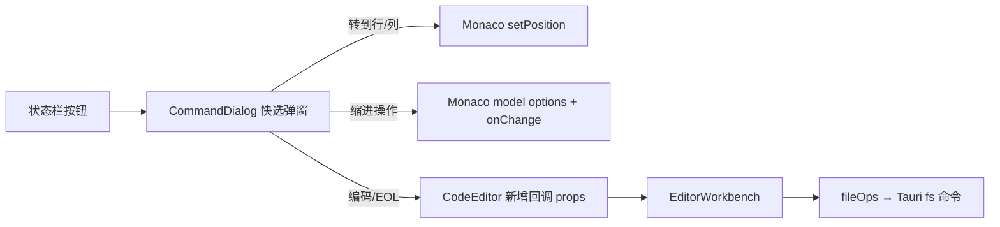

## 需求概述

将编辑器底部状态栏中所有带功能的按钮/入口，全部改造为“全局搜索”模式（CommandDialog / VS Code Quick Pick 风格）的居中弹窗，弹窗内完整实现搜索、筛选、选择、确认等交互，键盘 ↑↓ 导航 + Enter 确认，参考 VS Code。

## 产品概述

qraft 桌面工具箱中的代码编辑器（通用 CodeEditor 组件 + EditorWorkbench 工作台）底部状态栏目前使用小 Popover 或点击循环切换，交互能力弱且与全局搜索/语言模式选择器的弹窗形态不统一。本次改造统一为快选弹窗形态。

## 核心功能

1. **「转到行/列」弹窗**（点击“行 x， 列 y”）：单输入框 + 范围提示文案（“键入要转到的行号(从 1 到 N)”），支持“行”或“行：列”格式输入，Enter 确认跳转并居中显示。
2. **「选择缩进操作」弹窗**（点击“空格：N”）：完整实现 VS Code 缩进菜单——使用空格缩进（当前宽度打勾）、使用制表符缩进、更改制表符显示大小（二级宽度列表）、从内容中检测缩进方式、将缩进转换为空格、将缩进转换为制表符、裁剪尾随空格。
3. **「选择编码」弹窗**（点击编码徽章）：顶部“通过编码重新打开 / 通过编码保存”两个动作项 + 可搜索的编码列表（当前编码打勾）；“重新打开”按所选编码重读磁盘文件，“保存”以所选编码立即写盘；无磁盘路径的 Tab 禁用“重新打开”。
4. **「选择行尾序列」弹窗**（点击 CRLF/LF 徽章）：LF / CRLF 可搜索列表，当前项打勾，选择后转换内容。
5. 语言模式徽章已是 CommandDialog 弹窗（EditorLanguagePicker），保持现状作为形态基准。

## 技术栈（复用现有）

- React 19 + TypeScript + Tailwind CSS（shadcn 体系）
- 弹窗壳：`src/components/ui/command.tsx` 的 CommandDialog/CommandInput/CommandList（cmdk），形态对齐 `EditorLanguagePicker.tsx`（宽 48rem、hideCloseButton、sr-only DialogTitle）
- 编辑器：Monaco（model.updateOptions / 检测缩进 / onChange 同步宿主）
- Tauri：`src-tauri/src/commands/fs.rs`、`src/media/text_encoding.rs`（decode_text/encode_text 已存在）
- 测试：Vitest + Testing Library

## 实现方案

### 1. 通用快选弹窗组件

在 `src/components/ui/` 新建状态栏快选弹窗（可合并为一个文件或分文件），统一使用 CommandDialog 壳：顶部搜索框、CommandList 列表、当前项打勾（Check 图标）、CommandEmpty 空态、↑↓/Enter 键盘导航。筛选由受控 query + 自行过滤（`shouldFilter={false}`，与 EditorLanguagePicker 一致），避免 cmdk 对中文 value 匹配不佳的问题。

### 2. 转到行/列

CommandDialog + 单输入框（复用 CommandInput 或普通 Input），下方提示文案显示有效范围（1 到总行数）；解析 “121” / “121:5” / “:5” 格式，夹取到有效范围后 setPosition + revealLineInCenter + focus。移除现有双输入 Popover。

### 3. 缩进操作

- `使用空格缩进`：insertSpaces=true（子列表 2/4/8 或展开二级项，当前项打勾）
- `使用制表符缩进`：insertSpaces=false
- `更改制表符显示大小`：二级列表 1/2/4/8（当前打勾）
- `从内容中检测缩进方式`：扫描 model 前 N 行非空行前导空白推断（空格宽度/Tab），updateOptions 应用
- `将缩进转换为空格/制表符`：按当前 tabSize 变换全文前导空白，经 onChange 写回宿主（保持宿主状态同步，dirty 语义正确）
- `裁剪尾随空格`：逐行去除行尾空白，经 onChange 写回
- 作用于当前 Monaco model；未挂载时安全返回

### 4. 编码弹窗与宿主回调

- CodeEditor 新增可选 props：`onEncodingReopen?: (encodingId) => void`、`onEncodingSave?: (encodingId) => void`；提供了才显示对应动作项（保持向后兼容：仅 onEncodingChange 的宿主退化为纯切换列表）
- EditorWorkbench 实现：`重新打开` = readTextFileEncoded(path, encoding) 重读并覆盖 Tab 内容（标记保存状态）；`保存` = setTabEncoding + saveToPathEncoded 立即写盘；无 path 时动作项禁用
- 后端：`fs_read_text_file_encoded` 增加可选 `encoding` 参数（提供时跳过探测直接 decode_text），前端 fileOps.readTextFileEncoded 同步增加可选参数

### 5. 行尾序列弹窗

LF/CRLF 两项可搜索列表，选择后与现有 onToggleEol 逻辑一致：宿主完成内容转换（保留 EditorWorkbench 的 CRLF↔LF 转换实现，改为带目标值回调 `onEolChange?(eol)`，保留 onToggleEol 兼容或一并迁移——EditorWorkbench 是唯一使用方，直接迁移）

### 6. i18n

在 locale 资源中补充全部新文案键（zh/en 双语），沿用 `chrome.code_editor.*` 命名空间

## 架构



## 关键接口

```ts
// code-editor.tsx 新增 props(向后兼容,均可选)
interface CodeEditorProps {
  /** 通过编码重新打开(需宿主有磁盘路径);提供时编码弹窗显示该动作项 */
  onEncodingReopen?: (encodingId: string) => void;
  /** 通过编码保存:设置编码并立即写盘;提供时编码弹窗显示该动作项 */
  onEncodingSave?: (encodingId: string) => void;
  /** 行尾序列设置(带目标值);替代原 onToggleEol */
  onEolChange?: (eol: 'LF' | 'CRLF') => void;
}
```

## 性能与影响面

- 弹窗为按需挂载（open 时渲染），编码列表 < 20 项，线性过滤无性能问题
- 缩进全文转换为单次字符串处理 + 一次 onChange，O(n)
- CodeEditor 被多个工具复用：所有新 props 可选、默认行为不变；未提供编码/EOL 回调的宿主徽章退化为纯展示（现状保持）

## Agent Extensions

### Skill

- **test-driven-development**
- Purpose: 状态栏快选弹窗、缩进转换、编码重开/保存均为可测交互，先写失败测试再实现
- Expected outcome: CodeEditor 状态栏四个弹窗与 EditorWorkbench 编码动作均有覆盖用例
- **requesting-code-review**
- Purpose: 改造完成后对涉及 CodeEditor/EditorWorkbench/Tauri 命令的变更发起代码审查
- Expected outcome: 确认向后兼容与边界情况（无 path Tab、只读编辑器）处理正确