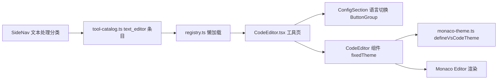

## 产品概述

在 Qraft（本地优先开发工具箱）中新增一个独立的「文本编辑器」工具页，提供 VSCode 风格的纯文本/代码编辑体验，作为「文本处理」分类下的新菜单入口。不修改现有 `CodeEditor` 组件的既有行为，不动 Rust 后端。

## 核心功能

- 在侧边栏「文本处理」分类下新增「文本编辑器」工具入口，可正常打开与切换
- 满屏单编辑器：开启缩略图（minimap）、行号、当前行高亮、括号配对着色、平滑滚动等 VSCode 式编辑体验
- 语言切换：支持纯文本、JSON、YAML、SQL、HTML、CSS、JavaScript、TypeScript、Markdown 等，类似 VSCode 右下角语言选择器
- 编辑器区使用固定的 VSCode 深色（Visual Studio Dark 风格）配色，不随应用调色板变化，视觉还原 VSCode 截图观感
- 底部状态栏显示行/列、选区、字符数及当前语言

## 边界

- 纯前端实现；新增工具懒加载，不影响首屏 bundle
- 现有 code-editor.tsx 仅做向后兼容的增量扩展（新增可选 prop），所有既有工具行为不变

## 技术栈

- 前端：React 19 + TypeScript（沿用项目现有技术栈）
- 编辑器内核：Monaco Editor（项目已依赖 monaco-editor@0.56.0 + @monaco-editor/react，即 VSCode 编辑器内核，无需引入 microsoft/vscode 仓库）
- 样式：Tailwind CSS + shadcn 风格组件（ConfigSection/ConfigRow/ButtonGroup/CodeEditor 均为项目既有模式）
- 测试：Vitest + Testing Library（沿用 TextProcessor.test.tsx 的 jsdom mock 模式）

## 实现方案

复用现有 `CodeEditor` 组件与 Monaco 主题体系，新增「固定 VSCode 深色主题」能力后在其上构建工具页：

1. **主题层（monaco-theme.ts）**：新增 `VSCODE_THEME_NAME` 常量与 `defineVsCodeTheme(monaco)`，硬编码 VSCode vs-dark 配色（背景 #1e1e1e、行号 #858585、当前行 #2f2f2f、光标 #aeafad、选区 #264f78），不依赖 CSS 变量，与 app 调色板完全解耦。
2. **组件层（code-editor.tsx）**：新增可选 prop `fixedTheme?: string`（向后兼容，默认缺省）。提供时 `beforeMount` 定义固定主题并跳过 palette 主题逻辑，`useEffect` 只切换不重定义；未提供时行为与现在完全一致。现有 40+ 工具不受影响。
3. **工具页（tools/CodeEditor.tsx）**：新建 `CodeEditorTool` 组件（导出名避开与 UI 组件 `CodeEditor` 冲突）。顶部 `ConfigSection + ConfigRow` 放语言切换 ButtonGroup；主体为满屏 `CodeEditor`，`minimap` 开启、`title="untitled"`、`fixedTheme={VSCODE_THEME_NAME}`；`statusBarRight` 显示当前语言。
4. **登记（tool-catalog.ts + registry.ts）**：在 text 分类新增 `text_editor` 条目（图标复用已 import 的 `FileCode2`），并通过 `registerTool` 懒加载注册。

## 实现要点

- **向后兼容**：`fixedTheme` 为可选 prop，缺省路径保持现有 palette 主题逻辑一字不动；避免无关注册表/配置改动
- **主题切换正确性**：`useMonacoTheme()` 为 hook 不能条件调用，用 `fixedTheme ?? useMonacoTheme()` 方式让 hook 始终执行；effect 依赖数组加入 `fixedTheme`
- **测试隔离**：CodeEditor.test.tsx 沿用 TextProcessor.test.tsx 的 `vi.mock('@/components/ui/code-editor')` textarea 替身模式，jsdom 下不加载真实 Monaco
- **性能**：工具通过 React.lazy 独立 chunk，首屏不受影响；语言切换只改 `language` prop，Monaco 增量更新不重建

## 架构设计



## 目录结构

```
src/components/ui/monaco-theme.ts   # [MODIFY] 新增 VSCODE_THEME_NAME 常量与 defineVsCodeTheme(monaco)。
                                    # 硬编码 VSCode vs-dark 配色(背景/行号/当前行/光标/选区/滚动条等),
                                    # 不读 CSS 变量,复用现有 resolveColor 思路但全部 hex 硬编码。
src/components/ui/code-editor.tsx   # [MODIFY] 新增可选 prop fixedTheme?: string,向后兼容。
                                    # fixedTheme 提供时 beforeMount 调 defineVsCodeTheme 并跳过 palette 主题,
                                    # useEffect 仅 setTheme;缺省时保持现有逻辑不变。
src/tools/CodeEditor.tsx            # [NEW] 工具页主组件,导出 CodeEditorTool。
                                    # 语言切换(plaintext/json/yaml/sql/html/css/javascript/typescript/markdown)
                                    # + 满屏编辑区(minimap 开启,title="untitled",fixedTheme)+ 状态栏语言标识。
src/tools/CodeEditor.test.tsx       # [NEW] 单测:mock CodeEditor 为 textarea,验证语言按钮渲染/切换、
                                    # 初始语言、状态栏、输入回显,参照 TextProcessor.test.tsx 模式。
src/lib/tool-catalog.ts             # [MODIFY] text 分类新增 text_editor 条目(name 文本编辑器,
                                    # icon 复用已 import 的 FileCode2,keywords 含 vscode/monaco/编辑器 等)。
src/tools/registry.ts               # [MODIFY] 追加 registerTool('text_editor', () => import('./CodeEditor')
                                    # .then((m) => ({ default: m.CodeEditorTool })))。
```

## 设计风格

新工具页「文本编辑器」采用「VSCode 深色编辑区 + 应用既有配置区」的组合式设计：

- 顶部配置区沿用项目 DevToys 风格卡片（ConfigSection/ConfigRow），放置语言切换 ButtonGroup，当前语言高亮为 default 变体，视觉上与 SQL/文本处理工具一致
- 主体编辑区使用固定 VSCode Visual Studio Dark 配色（背景 #1e1e1e），与周边界面形成明确的功能边界，一眼即识别为 VSCode 体验
- 编辑器开启缩略图、行号、当前行高亮、括号配对着色，还原截图中的 VSCode 观感
- 底部状态栏左侧显示行/列与选区，右侧显示字符数与当前语言标识（仿 VSCode 状态栏语言按钮），紧凑小字号
- 页面纵向布局：配置卡片（自适应高度）→ 编辑器（flex-1 占满剩余空间），无多余装饰

## Agent 扩展

### Skill

- **test-driven-development**
- 用途：实现 CodeEditor 工具页前先编写 CodeEditor.test.tsx（mock CodeEditor 为 textarea），以测试驱动实现语言切换、状态栏、输入回显等功能
- 预期产出：测试先行通过，工具页功能按测试契约实现，回归有保障
- **requesting-code-review**
- 用途：全部改动完成后对新增/修改的 6 个文件做代码审查，核对向后兼容性、主题切换逻辑与测试覆盖
- 预期产出：确认 fixedTheme 缺省路径行为不变、无 lint/typecheck/test 失败、无无关改动