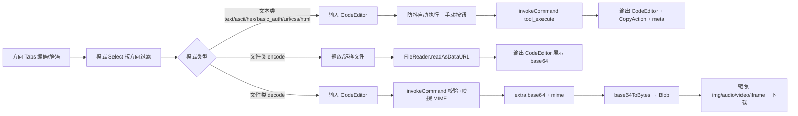

## 产品概述

将现有「Base64文本编码/解码」(base64_codec) 与「Base64图片编码/解码」(base64_image) 两个独立工具统一整合为一个一体化的 Base64 转换工具，深度融合 base64.guru/converter 的 Decoders 与 Encoders 全部功能模块，并参考文本处理工具(TextProcessor)与 JSON 格式化器(JsonFormatter)的 UI/UX 优化思路进行全面界面与交互升级。

## 核心功能

- **方向切换**：顶部 Tabs 在「编码 Encode」与「解码 Decode」两大方向间切换，双栏输入/输出工作区（参考 base64.guru 交互）。
- **Encoders（10 种）**：Text、URL、CSS、HTML、Hex → Base64（Rust 后端）；File、Image、Audio、Video、PDF → Base64（前端 FileReader 读取文件，支持拖放）。
- **Decoders（9 种）**：Base64 → Text、ASCII、Hex、Basic Auth（Rust 后端）；Base64 → File、Image、Audio、Video、PDF（Rust 校验规范化 + 前端 Blob 预览/下载）。
- **预览增强**：图片渲染、音频/视频内嵌播放器、PDF iframe 预览、通用文件下载卡片（文件名/大小/MIME 徽标）；Hex 输出支持大小写切换；可选输出 Data URL 前缀。
- **交互优化**：文本类模式输入防抖自动执行（参考 JsonFormatter）、执行按钮置于编辑器标题栏（ActionButton 风格）、错误信息写入输出框、meta 展示 input_bytes → output_bytes · duration_ms、输出一键复制；文件类模式提供拖放区 + 选择按钮（参考 ImageConverter）。
- **向后兼容**：复用 toolId `base64_codec`，历史收藏/最近使用不失效；默认模式为「Text 编码」，保留既有 `input`/`output` 测试标识。

## 技术栈

- 前端：React + TypeScript + Tailwind CSS + shadcn 风格组件（沿用项目现有 Tabs/Select/Switch/CodeEditor/ButtonGroup/ConfigCard/Resizable 等）
- 后端：Tauri v2 + Rust，扩展现有 `base64_codec` 工具，复用 `base64`、`hex` crate
- 构建：Vite + Vitest（前端测试）、cargo test（Rust 测试）

## 实现方案

- **后端扩展（全 Rust 改造）**：在 `src-tauri/src/tools/base64_codec.rs` 中新增 `mode` 参数（text/ascii/hex/basic_auth/binary）与 `hex_case` 参数（lower/upper），保留 `url_safe`。文本类解码（text/ascii/hex/basic_auth）输出写入 `ToolOutput.text`；二进制类解码（file/image/audio/video/pdf）仅做 base64 校验、规范化（剥离 data URL 前缀与空白）并嗅探 MIME，将规范 base64 + MIME + 字节数放入 `ToolOutput.extra`，前端经 `base64ToBytes` 还原为 Blob 预览/下载——避免 IPC 传输二进制、保持职责清晰。MIME 嗅探在 Rust 端通过 magic bytes 实现（PNG/JPEG/GIF/WebP/BMP/SVG/ICO/PDF/MP3/WAV/OGG/MP4/WebM），替代并删除前端 `sniffImageMime`（仅 Base64Image.tsx 内部使用）。
- **前端统一组件**：重构 `Base64Codec.tsx` 为一体化工具。布局：顶部 ConfigSection（第一行方向 Tabs：编码/解码；第二行模式 Select + 按需出现的附加开关：URL 安全 / Hex 大小写 / Data URL 前缀），下方 ResizablePanelGroup 双栏。文本类模式 = 双 CodeEditor（左输入可编辑 + 400ms 防抖自动执行，右输出只读 + CopyAction + meta 统计）；文件类 encode = 左拖放区/选择按钮，右只读 CodeEditor 输出；文件类 decode = 左 CodeEditor 输入 base64，右预览区（img/audio controls/video controls/iframe pdf/下载卡片）+ 另存按钮。
- **CSP 调整**：`src-tauri/tauri.conf.json` 的 csp 与 devCsp 均补充 `media-src 'self' data: blob:` 与 `frame-src 'self' data: blob:`，以支持音频/视频内嵌播放与 PDF iframe 预览；图片预览沿用现有 data URL（img-src 已含 data:），下载沿用 `downloadBlob`（现有 GzipCodec/Base64Image 已验证可用）。
- **向后兼容**：`base64_codec` toolId 与注册保持不变，删除 `base64_image`（目录条目、注册行、组件文件一并移除，历史收藏显示"未找到工具"，用户已确认接受）。

## 架构设计



## 目录结构

```
qraft/
├── src/
│   ├── tools/
│   │   ├── base64-utils.ts          # [NEW] 模式定义模块:Encoder/Decoder 模式列表(编码文本类5+文件类5、解码文本类4+文件类5)、每模式 id/label/Icon/accept/placeholder/kind(text|file)、方向过滤与模式元数据查询
│   │   ├── Base64Codec.tsx          # [MODIFY] 重构为统一 Base64 转换工具:方向 Tabs + 模式 Select + 双栏工作区;文本类走 Rust IPC(防抖+标题栏执行按钮+错误写输出框+meta),文件类前端读取/Blob 预览;默认 encode+text 模式保留 input/output 测试标识
│   │   ├── Base64Codec.test.tsx     # [MODIFY] 重写测试:默认渲染、文本编码参数断言(mode/url_safe)、hex 参数(hex_case)、basic_auth/ascii、错误显示、文件类 mock FileReader 与 Blob 预览
│   │   ├── Base64Image.tsx          # [DELETE] 删除(功能并入统一工具,含 sniffImageMime 一并移除)
│   │   └── registry.ts              # [MODIFY] 移除 registerTool('base64_image', ...) 注册行
│   └── lib/
│       └── tool-catalog.ts          # [MODIFY] base64_codec 条目改名"Base64 转换器"并更新描述/关键词;删除 base64_image 条目及 Images 图标引用(如需)
└── src-tauri/
    ├── src/tools/
    │   └── base64_codec.rs          # [MODIFY] 扩展 mode(text/ascii/hex/basic_auth/binary)+hex_case 参数;ascii 逐字节 Latin-1 映射、hex 编解码、basic_auth 剥离可选前缀、binary 校验规范化+MIME 嗅探(extra 返回 base64/mime/bytes);补充对应单元测试
    └── tauri.conf.json              # [MODIFY] csp 与 devCsp 补充 media-src 'self' data: blob:; frame-src 'self' data: blob:
```

## 关键代码结构

Rust 参数与输出契约（`base64_codec.rs`）：

```rust
// params: action = "encode" | "decode"
//         mode   = "text" | "ascii" | "hex" | "basic_auth" | "binary"   (默认 "text")
//         url_safe = bool (默认 false);hex_case = "lower" | "upper" (默认 "lower",仅 mode=hex)
// 文本类输出: ToolOutput.text = 结果字符串
// 二进制类输出(mode=binary, decode): ToolOutput.extra = { base64: 规范base64, mime: 嗅探MIME, bytes: 解码字节数 }
```

前端模式定义接口（`base64-utils.ts`）：

```ts
type Direction = 'encode' | 'decode';
type ModeKind = 'text' | 'file';
interface Base64Mode {
  id: string; // 'text' | 'ascii' | 'hex' | 'basic_auth' | 'url' | 'css' | 'html' | 'file' | 'image' | 'audio' | 'video' | 'pdf'
  label: string;
  hint: string; // 输出区占位/描述
  kind: ModeKind; // text → 双 CodeEditor;file → 拖放区/预览区
  accept?: string; // 文件类 input accept
  icon: LucideIcon;
}
const ENCODE_MODES: readonly Base64Mode[]; // text, url, css, html, hex(文本类) + file, image, audio, video, pdf(文件类)
const DECODE_MODES: readonly Base64Mode[]; // text, ascii, hex, basic_auth(文本类) + file, image, audio, video, pdf(二进制类)
```

## 设计风格

延续 Qraft 现有 DevToys Fluent 风格：配置卡片、双栏工作区、语义色徽标，整体专业、克制、高信息密度。顶部「配置」卡片内第一行用 Tabs 切换编码/解码方向（选中态 primary 高亮），第二行用 Select 选择具体模式并附带按模式动态出现的微开关（URL 安全 / Hex 大小写 / Data URL 前缀），开关前以竖分隔线隔开形成分组节奏。下方 ResizablePanelGroup 双栏：文本类模式左右两个 CodeEditor（输出框只读并带复制与统计），文件类模式左侧为虚线拖放区（拖拽时边框变 primary 高亮 + 半透明填充，参考 ImageConverter）或 base64 输入框，右侧为预览区（图片/音频/视频/PDF/下载卡片，下载卡片展示文件名、大小与 MIME 徽标）。执行按钮与快捷操作置于编辑器标题栏（ActionButton 风格，参考 JsonFormatter），悬停有 accent 背景过渡；错误以语义色文本写入输出框而非弹窗。所有交互均有 hover/active 过渡动画，整体平滑不喧哗。

## Agent Extensions

### Skill

- **test-driven-development**
- Purpose: 在扩展 Rust base64_codec 与重构前端 Base64Codec 组件前先编写测试，以测试驱动实现多模式编解码、参数契约与文件类交互
- Expected outcome: Rust 单元测试与前端组件测试先行通过验证，确保各模式参数与错误路径行为正确
- **requesting-code-review**
- Purpose: 实现完成后对统一 Base64 工具（Rust 扩展 + 前端组件 + 目录/CSP 改动）进行代码审查
- Expected outcome: 发现并修正潜在问题，确认功能完整、兼容性（ToolPanel keepalive/注册集成测试）与 CSP 安全无回归
