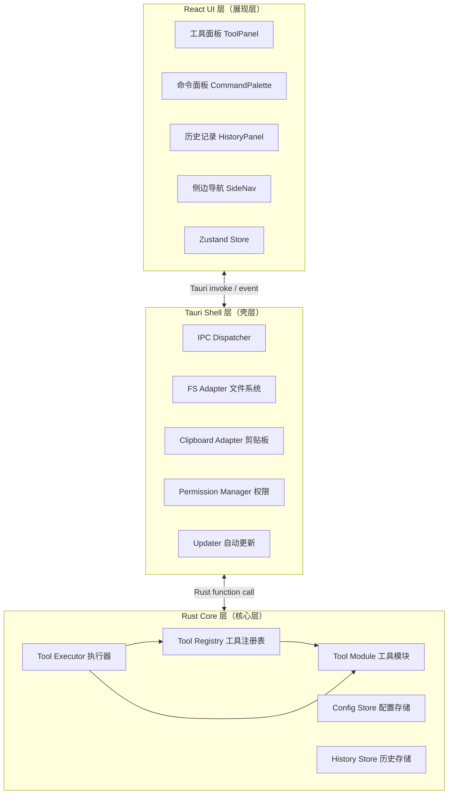
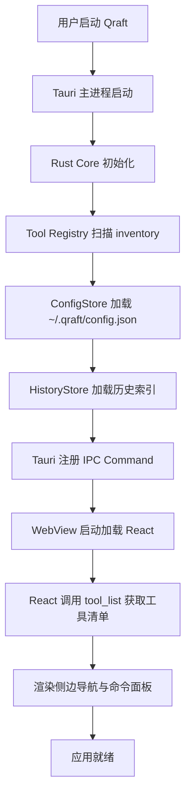
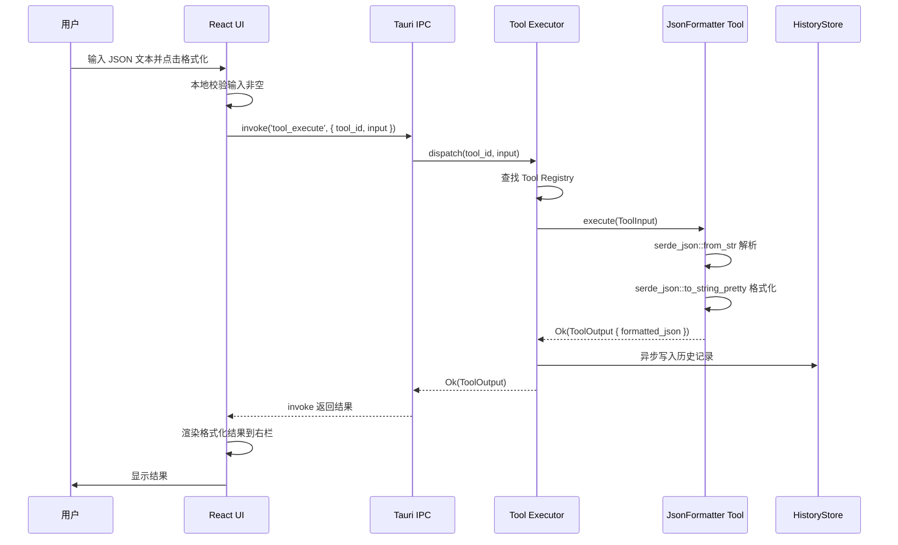

## 目录

- [1. 背景与目的](#1-背景与目的)
  - [1.1 痛点与动机](#11-痛点与动机)
  - [1.2 项目定位](#12-项目定位)
  - [1.3 目标用户画像](#13-目标用户画像)
  - [1.4 核心价值主张](#14-核心价值主张)
  - [1.5 与 DevToys 的差异点](#15-与-devtoys-的差异点)
- [2. 核心概念](#2-核心概念)
  - [2.1 三层架构](#21-三层架构)
  - [2.2 工具即插件](#22-工具即插件)
  - [2.3 Rust-first 原则](#23-rust-first-原则)
- [3. 详细设计](#3-详细设计)
  - [3.1 整体架构图](#31-整体架构图)
  - [3.2 项目目录结构](#32-项目目录结构)
- [4. 关键流程](#4-关键流程)
  - [4.1 应用启动流程](#41-应用启动流程)
  - [4.2 工具调用流程](#42-工具调用流程)
- [5. 设计决策记录](#5-设计决策记录)
  - [5.1 为何选择 Rust + Tauri 而非 Electron + Node](#51-为何选择-rust--tauri-而非-electron--node)
  - [5.2 为何选择 React 而非 Vue/Svelte](#52-为何选择-react-而非-vuesvelte)
  - [5.3 为何坚持 Rust-first](#53-为何坚持-rust-first)
- [6. 注意事项与约束](#6-注意事项与约束)
- [7. 相关文档](#7-相关文档)

---

## 1. 背景与目的

### 1.1 痛点与动机

开发者在日常工作中会反复遭遇大量"碎片化"的小操作：把一段压缩过的 JSON 格式化以便阅读、对一段 Base64 字符串解码查看原始内容、解析 JWT 调试登录态、生成 UUID 作为测试数据、计算文件的 SHA256 校验和、把 Unix 时间戳转成可读时间、验证一段 Cron 表达式是否正确……据社区调研，一名后端工程师每天平均要切换 8-15 次这类小工具，单次切换成本约 30-90 秒，日积月累形成显著的生产力损耗。

当前开发者处理这些操作主要有四类方案，但都存在明显痛点：

| 方案 | 代表产品 | 痛点 |
|------|----------|------|
| 在线工具 | jsonformatter.com、jwt.io | 网络依赖、隐私风险（敏感数据上传到第三方服务器）、广告干扰、不可定制 |
| 命令行工具 | `jq`、`openssl`、`uuidgen` | 学习曲线陡峭、无 GUI 反馈、参数记忆负担、不直观 |
| IDE 插件 | VSCode JSON Formatter | 绑定特定 IDE、占用 IDE 性能、跨 IDE 不可迁移 |
| 桌面工具箱 | DevToys | 仅 Windows（原版）、C# 生态、跨平台体验割裂 |

尤其值得关注的是**隐私风险**：开发者在调试过程中接触到的 JSON 数据、JWT Token、API Key、内部接口报文往往包含敏感信息，把这些数据粘贴到在线工具等同于将生产环境凭证泄露给未知第三方。Qraft 的诞生正是为了彻底解决这一痛点。

### 1.2 项目定位

**Qraft 是一款全方位本地开发工具箱（类 DevToys），覆盖 Windows / macOS / Linux 三大桌面平台，内置 30+ 常用开发小工具，所有数据计算 100% 在本机完成，零网络依赖。**

核心关键词：

- **本地优先（Local-first）**：所有解析、转换、计算逻辑在本机 Rust 进程中完成，不发送任何数据到外部
- **Rust 加速（Rust-accelerated）**：核心逻辑用 Rust 实现，性能显著优于 JS/Python 同类工具
- **跨平台一致（Cross-platform consistent）**：基于 Tauri V2 统一 WebView，三平台行为与视觉一致
- **工具即插件（Tool as Plugin）**：每个工具是独立 Rust 模块，可热插拔，支持社区贡献

### 1.3 目标用户画像

| 用户角色 | 核心场景 | 高频工具 |
|----------|----------|----------|
| 全栈开发者 | 前后端联调、API 调试、登录态排查 | JSON 格式化、JWT 解析、Base64、UUID |
| 后端工程师 | 日志分析、接口签名、定时任务配置 | Hash 计算、HMAC、Cron 解析、时间戳 |
| 运维 / DevOps | 配置文件处理、URL 拼接、证书校验 | URL 编解码、正则测试、证书解析 |
| 移动端开发者 | 接口抓包分析、编码转换 | Base64、Hex、JSON 校验 |
| 学生 / 学习者 | 理解工具原理、本地实验 | 颜色转换、Hash 演示、UUID 生成 |

### 1.4 核心价值主张

Qraft 向用户承诺四件事：

1. **数据不出本机**：默认禁止任何网络出站请求，Tauri CSP 强制锁定，从架构层杜绝数据泄露
2. **秒级响应**：Rust 原生实现 + 编译期静态注册，工具冷启动 <50ms，10MB JSON 解析 <500ms
3. **三平台一致**：同一份 Rust 代码 + 同一套 React UI，Windows/macOS/Linux 体验完全一致
4. **可扩展架构**：工具是独立模块，新增工具不需要修改核心引擎，社区可贡献工具包

### 1.5 与 DevToys 的差异点

DevToys 是本项目最重要的参考对象，但 Qraft 不是 DevToys 的简单复刻，而是在关键架构决策上做了重新选择：

| 维度 | DevToys | Qraft |
|------|---------|-------|
| 核心语言 | C# / .NET | Rust |
| 桌面框架 | WinUI 3（Windows）/ .NET MAUI（跨平台实验） | Tauri V2 |
| 跨平台策略 | Windows 原生，跨平台为后期补丁 | 三平台一等公民，Tauri 统一 WebView |
| UI 框架 | XAML / Blazor Hybrid | React 19 + shadcn/ui |
| 包体积 | ~80MB（含 .NET Runtime） | ~15-25MB（Tauri 无运行时） |
| 内存占用 | ~200-400MB | ~80-150MB（目标） |
| 工具实现 | C# + .NET 类库 | Rust + Tool trait 体系 |
| 插件机制 | 编译期内置，无动态加载 | MVP 静态注册，v2.0 探索动态加载 |
| 启动速度 | ~1-2s（.NET 冷启动） | <500ms（目标） |

最核心的差异是 **Rust-first** 与 **Tauri V2 跨平台**：Qraft 选择 Rust 既能获得更好的性能与内存安全，又能天然契合 Tauri 的 Rust 后端；选择 Tauri V2 而非 .NET MAUI 是因为 Tauri 使用系统原生 WebView，包体积小、启动快，三平台一致性更好。

---

## 2. 核心概念

### 2.1 三层架构

Qraft 采用严格的三层架构，每层职责明确、依赖方向单向向下：

- **Rust Core（核心层）**：所有业务逻辑（解析、转换、计算）100% 在此实现，定义 `Tool` trait 与工具注册表
- **Tauri Shell（壳层）**：进程宿主、IPC 桥接、文件系统/剪贴板 API 封装、权限管理
- **React UI（展现层）**：输入展示、用户交互、状态管理，不含任何业务逻辑

### 2.2 工具即插件

每个开发工具（如 JSON 格式化、Base64 编解码）是 Rust Core 中的一个独立模块，实现 `Tool` trait。工具通过 `inventory` crate 在编译期自动注册到全局工具表，新增工具不需要修改核心引擎代码。

### 2.3 Rust-first 原则

> 📌 **项目实际**
>
> Qraft 强制要求：**任何解析、转换、计算逻辑必须在 Rust 层实现**。React UI 层禁止包含业务逻辑，仅负责输入收集、结果展示与交互。这一原则的执行通过 PR Review 与代码规范保证，详见 [17-dev-workflow.md](./17-dev-workflow.md)。

Rust-first 的目的有三：

1. **性能**：Rust 原生性能远优于 JS，尤其对大 JSON、Hash 计算等场景
2. **安全**：Rust 的内存安全与类型系统降低工具实现中的漏洞风险
3. **可测试性**：Rust 工具是纯函数式的 `ToolInput → ToolOutput`，便于单元测试与属性测试

---

## 3. 详细设计

### 3.1 整体架构图



三层之间的通信规则：

- **UI ↔ Shell**：通过 Tauri 的 `invoke()` 调用 Command，通过 `listen()` 监听事件
- **Shell ↔ Core**：Rust 函数直接调用，无 IPC 开销
- **UI ↔ Core**：禁止直接通信，必须经 Shell 桥接

### 3.2 项目目录结构

```
qraft/
├── src-tauri/                  # Rust + Tauri 后端
│   ├── src/
│   │   ├── main.rs             # Tauri 应用入口
│   │   ├── lib.rs              # 库入口，注册 Command
│   │   ├── commands/           # Tauri IPC Command 实现
│   │   │   ├── mod.rs
│   │   │   ├── tool.rs         # tool_execute / tool_list
│   │   │   ├── config.rs       # config_get / config_set
│   │   │   └── history.rs      # history_add / history_list
│   │   ├── core/               # 核心引擎
│   │   │   ├── mod.rs
│   │   │   ├── tool.rs         # Tool trait 定义
│   │   │   ├── registry.rs     # Tool Registry
│   │   │   ├── executor.rs     # Tool Executor
│   │   │   ├── error.rs        # 错误类型层级
│   │   │   └── context.rs      # ToolContext
│   │   ├── store/              # 持久化存储
│   │   │   ├── config.rs       # ConfigStore
│   │   │   └── history.rs      # HistoryStore
│   │   └── tools/              # 工具模块（每个工具一个子模块）
│   │       ├── mod.rs          # 工具聚合，触发 inventory 注册
│   │       ├── json_formatter.rs
│   │       ├── base64_codec.rs
│   │       ├── jwt_parser.rs
│   │       └── ...
│   ├── Cargo.toml
│   ├── tauri.conf.json         # Tauri 配置
│   └── capabilities/           # Tauri 权限配置
├── src/                        # React 前端
│   ├── main.tsx                # React 入口
│   ├── App.tsx                 # 根组件
│   ├── components/             # 通用组件
│   │   ├── ui/                 # shadcn/ui 组件
│   │   ├── ToolPanel.tsx
│   │   ├── CommandPalette.tsx
│   │   └── SideNav.tsx
│   ├── tools/                  # 工具 UI（每个工具一个组件）
│   │   ├── JsonFormatter.tsx
│   │   ├── Base64Codec.tsx
│   │   └── ...
│   ├── store/                  # Zustand 状态管理
│   ├── lib/                    # Tauri invoke 封装
│   │   └── ipc.ts
│   ├── styles/
│   └── types/                  # TypeScript 类型
├── docs/                       # 项目文档（非 /prd）
├── prd/                        # 架构文档（本目录）
├── scripts/                    # 构建/发布脚本
├── .github/workflows/          # CI/CD
├── package.json
├── pnpm-lock.yaml
├── vite.config.ts
├── tsconfig.json
└── README.md
```

> 💡 **建议方案**
>
> 工具 UI 与工具 Rust 模块**不强制一一对应文件名**，但建议保持命名一致（如 `json_formatter.rs` ↔ `JsonFormatter.tsx`），便于跨层定位代码。

---

## 4. 关键流程

### 4.1 应用启动流程



启动性能目标：

| 阶段 | 目标耗时 |
|------|----------|
| Tauri 主进程启动 | <100ms |
| Rust Core 初始化（含工具注册） | <50ms |
| 加载配置与历史 | <30ms |
| WebView 首屏渲染 | <300ms |
| **总冷启动时间** | **<500ms** |

### 4.2 工具调用流程

以用户在 JSON 格式化工具中点击"格式化"按钮为例：



关键设计点：

1. **UI 不做业务校验**：仅检查输入非空，JSON 合法性由 Rust 校验
2. **同步返回结果**：MVP 阶段使用同步 invoke，简单直观；后续大文件场景改用事件流
3. **历史记录异步写入**：不阻塞主流程，失败仅记录日志不影响用户结果

---

## 5. 设计决策记录

### 5.1 为何选择 Rust + Tauri 而非 Electron + Node

| 方案 | 包体积 | 启动速度 | 内存占用 | 性能 | 跨平台一致性 |
|------|--------|----------|----------|------|--------------|
| **Rust + Tauri V2**（选定） | ~15-25MB | <500ms | 80-150MB | 原生性能 | 系统原生 WebView |
| Electron + Node | ~80-150MB | 1-3s | 200-400MB | V8 JIT | Chromium 内置 |
| Wails + Go | ~20-30MB | <1s | 100-200MB | GC 语言 | 系统原生 WebView |

**决策理由**：

- 包体积与内存是工具类应用的敏感指标，用户对常驻工具的内存容忍度低
- Tauri V2 在 2025-2026 年已稳定成熟，移动端支持也已就绪（虽然 Qraft 暂不涉及）
- Rust 与 Tauri 的语言栈天然契合，避免 Go/Rust 混用增加心智负担
- 性能维度上 Rust 原生优于 V8 JIT，对 Hash、大 JSON 场景优势明显

**备选方案风险**：Tauri 依赖系统 WebView，不同平台渲染差异需处理；Electron 内置 Chromium 一致性更好但体积过大。

### 5.2 为何选择 React 而非 Vue/Svelte

| 方案 | 生态规模 | shadcn/ui 支持 | 团队熟悉度 | 性能 |
|------|----------|----------------|------------|------|
| **React 19**（选定） | 最大 | 原生支持 | 高 | 优秀 |
| Vue 3 | 大 | shadcn-vue 社区版 | 中 | 优秀 |
| Svelte 5 | 中 | shadcn-svelte 社区版 | 低 | 最优（编译期） |

**决策理由**：

- shadcn/ui 是当前最主流的桌面/Web 应用组件方案，原版基于 React
- React 19 的 Server Actions / use 等新特性不直接相关，但生态最成熟
- Tauri 社区中 React 模板最完善，遇到问题易找参考

**备选方案风险**：Svelte 编译期优化更极致，但生态较小，shadcn-svelte 维护滞后。

### 5.3 为何坚持 Rust-first

| 方案 | 性能 | 安全 | 可测试性 | 实现成本 |
|------|------|------|----------|----------|
| **Rust-first**（选定） | 最优 | 最优 | 优 | 工具实现需写 Rust |
| JS-first + Rust 桥接 | 中 | 中 | 中 | 工具实现快 |
| 混合（按工具选择） | 不一致 | 不一致 | 差 | 看情况 |

**决策理由**：

- 性能与安全是 Qraft 的核心卖点，必须从架构层保证
- 强制 Rust 实现避免"图省事用 JS 写工具"的退化
- Rust 工具的纯函数式 trait 设计天然便于测试

**备选方案风险**：新增工具需写 Rust，对纯前端贡献者门槛较高。缓解措施：提供详细的工具开发模板与 Scaffold 脚本，详见 [05-rust-core-engine.md](./05-rust-core-engine.md)。

---

## 6. 注意事项与约束

### 6.1 纯桌面端约束

> 📌 **项目实际**
>
> Qraft 是**纯桌面端项目**，不涉及移动端、Web 部署、多端同步。所有设计决策基于此约束：
>
> - 不考虑 PWA、不部署到 Web 服务器
> - 不需要账号系统、不涉及多端数据同步
> - 不考虑触屏交互，专注键鼠体验
> - 不考虑响应式移动布局，最小窗口 800x600

### 6.2 性能约束

| 指标 | 目标值 | 约束来源 |
|------|--------|----------|
| 冷启动时间 | <500ms | 工具类应用用户期望 |
| 工具执行（小输入） | <50ms | 即时反馈 |
| 10MB JSON 解析 | <500ms | 大文件场景可用 |
| 内存占用（空闲） | <150MB | 常驻工具容忍度 |
| 安装包体积 | <30MB | 下载与磁盘占用 |

详见 [12-performance.md](./12-performance.md)。

### 6.3 安全约束

> 📌 **项目实际**
>
> 以下是不可妥协的安全底线：
>
> 1. **零网络出站**：默认禁止任何外网请求，Tauri CSP 配置 `default-src 'self'`
> 2. **文件系统沙箱**：仅允许用户显式选择的文件，禁止任意路径访问
> 3. **剪贴板显式触发**：不后台监听剪贴板，需用户点击按钮读取
> 4. **依赖审计**：CI 强制运行 `cargo audit` 与 `pnpm audit`
>
> 详见 [13-security.md](./13-security.md)。

### 6.4 [待补充: 需要用户调研数据确认高频工具清单]

当前 30+ 工具清单基于开发者社区经验与 DevToys 参考得出，缺乏真实用户调研数据。建议在 MVP 发布前对 50+ 开发者做工具使用频次问卷，校准 P0/P1 优先级。

---

## 7. 相关文档

- [02-glossary.md](./02-glossary.md) — 术语表（理解本文档中 Tool / Plugin / Engine 等概念的定义）
- [03-tech-stack.md](./03-tech-stack.md) — 技术栈全景（本文档涉及的所有技术的版本与选型理由）
- [04-system-architecture.md](./04-system-architecture.md) — 系统架构设计（本文档三层架构的详细展开）
- [05-rust-core-engine.md](./05-rust-core-engine.md) — Rust 核心引擎（Tool trait 体系与工具注册机制）
- [07-tool-catalog.md](./07-tool-catalog.md) — 工具目录（30+ 工具的完整清单与优先级）
- [13-security.md](./13-security.md) — 安全机制（零网络、沙箱、剪贴板控制）
- [18-known-issues.md](./18-known-issues.md) — 与 DevToys 的详细功能差距分析
- [19-roadmap.md](./19-roadmap.md) — 版本演进路线（MVP → v1.0 → v2.0 里程碑）
