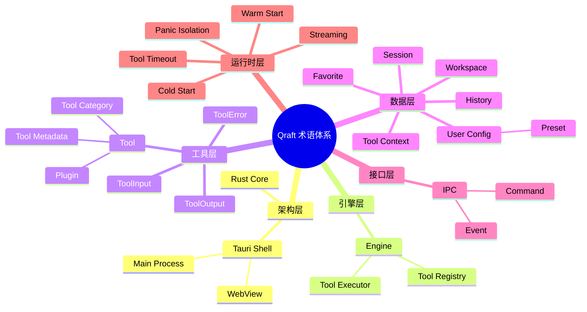
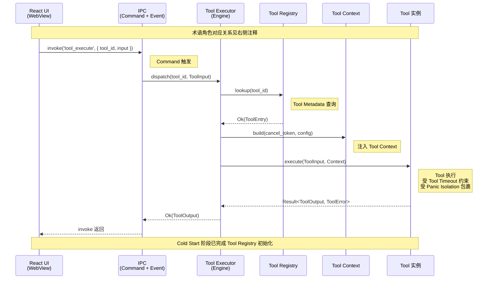

## 目录

- [1. 背景与目的](#1-背景与目的)
- [2. 核心概念](#2-核心概念)
- [3. 详细设计](#3-详细设计)
  - [3.1 架构层术语](#31-架构层术语)
  - [3.2 引擎层术语](#32-引擎层术语)
  - [3.3 工具层术语](#33-工具层术语)
  - [3.4 数据层术语](#34-数据层术语)
  - [3.5 接口层术语](#35-接口层术语)
  - [3.6 运行时层术语](#36-运行时层术语)
- [4. 关键流程](#4-关键流程)
  - [4.1 术语关系图](#41-术语关系图)
  - [4.2 术语在工具调用中的体现](#42-术语在工具调用中的体现)
- [5. 设计决策记录](#5-设计决策记录)
- [6. 注意事项与约束](#6-注意事项与约束)
- [7. 相关文档](#7-相关文档)

---

## 1. 背景与目的

Qraft 是一个跨 Rust / TypeScript / Tauri IPC 三层的技术项目，每层都有自己的概念体系。如果团队成员对同一术语理解不一致（例如把 "Tool" 理解为 UI 组件、Rust 模块、还是注册表条目），就会在代码命名、文档撰写、PR Review 中产生持续的沟通摩擦。

本文档的目标是建立**单一权威（Single Source of Truth）**的术语定义，要求：

1. **统一命名**：所有代码标识符、文档用词、PR 描述必须与本文档定义一致
2. **消除歧义**：同一概念在不同层级可能有不同表述（如 Rust 的 `Tool` trait 与 React 的 `ToolPanel` 组件），需明确区分
3. **降低门槛**：新成员通过阅读本文档即可理解后续 17 篇架构文档的全部术语

读者阅读建议：先通读一遍建立全局印象，后续遇到不确定的术语时回来查表。

---

## 2. 核心概念

Qraft 的术语体系按所属层级分为六类：

| 层级 | 涵盖术语数 | 关注点 |
|------|------------|--------|
| 架构层 | 4 | 系统整体组成与边界 |
| 引擎层 | 4 | Rust Core 的核心抽象 |
| 工具层 | 7 | 工具本身的组成与生命周期 |
| 数据层 | 5 | 持久化与运行时数据结构 |
| 接口层 | 4 | 跨进程通信机制 |
| 运行时层 | 5 | 运行时行为与性能概念 |

共 29 个核心术语，下文按层级分组定义。每个术语的定义包含四要素：**定义 / 所属层级 / 相关概念 / 使用示例**。

---

## 3. 详细设计

### 3.1 架构层术语

#### Qraft

- **定义**：本项目的代号与产品名，指代完整的本地开发工具箱应用
- **所属层级**：全局
- **相关概念**：Tauri Shell、Rust Core、React UI
- **使用示例**："Qraft 的 MVP 版本计划包含 10 个 P0 工具。"

#### Tauri Shell（Tauri 壳层）

- **定义**：基于 Tauri V2 的应用宿主进程，负责窗口管理、IPC 桥接、文件系统/剪贴板 API 封装、权限管理与自动更新
- **所属层级**：架构层中间层
- **相关概念**：Main Process、WebView、IPC、Command
- **使用示例**："剪贴板访问由 Tauri Shell 包装为 `clipboard_read` Command，工具不能直接调用系统 API。"

#### Main Process（主进程）

- **定义**：Tauri 应用的原生进程（Rust 编译产物），承载 Rust Core 与 Tauri Shell，独立于 WebView 进程运行
- **所属层级**：架构层
- **相关概念**：WebView、IPC、Tool Executor
- **使用示例**："工具的 Rust 实现在主进程中执行，通过 IPC 把结果返回给 WebView。"

#### WebView（Web 视图进程）

- **定义**：Tauri 启动的系统原生 WebView 进程（Windows: WebView2 / macOS: WKWebView / Linux: WebKitGTK），承载 React UI
- **所属层级**：架构层
- **相关概念**：React UI、IPC
- **使用示例**："React UI 运行在 WebView 进程中，无法直接访问文件系统。"

### 3.2 引擎层术语

#### Rust Core（Rust 核心层）

- **定义**：Qraft 的业务核心，包含所有工具实现、工具注册表、执行器、配置与历史存储。100% Rust 实现，不依赖任何 UI 框架
- **所属层级**：架构层最底层
- **相关概念**：Tool、Tool Registry、Tool Executor
- **使用示例**："JSON 格式化逻辑在 Rust Core 中实现，UI 仅负责展示。"

#### Engine（引擎）

- **定义**：Rust Core 中负责工具调度与执行的子系统，等同 Tool Executor + Tool Registry 的合称
- **所属层级**：引擎层
- **相关概念**：Tool Executor、Tool Registry
- **使用示例**："Engine 接收到 `tool_execute` Command 后，从 Registry 查找工具并交给 Executor 执行。"

#### Tool Registry（工具注册表）

- **定义**：全局的工具元数据与实例索引，键为 `tool_id`（如 `json_formatter`），值为 `ToolEntry { metadata, instance }`。在编译期通过 `inventory` crate 自动收集
- **所属层级**：引擎层
- **相关概念**：Tool、Tool Metadata、inventory
- **使用示例**："新增工具时通过 `inventory::submit!` 宏将条目注册到 Tool Registry。"

#### Tool Executor（工具执行器）

- **定义**：负责调用具体工具 `execute` 方法的运行时组件，处理超时、panic 捕获、上下文注入、异步任务调度
- **所属层级**：引擎层
- **相关概念**：Tool、Tool Context、Tool Timeout、Panic Isolation
- **使用示例**："Tool Executor 用 `catch_unwind` 包裹工具执行，避免单工具 panic 导致主进程崩溃。"

### 3.3 工具层术语

#### Tool（工具）

- **定义**：实现 `Tool` trait 的 Rust 类型，是 Qraft 中最小可执行单元。每个工具完成一个具体的开发任务（如 JSON 格式化、Base64 编码）
- **所属层级**：工具层
- **相关概念**：Plugin、Tool Metadata、ToolInput、ToolOutput
- **使用示例**："`JsonFormatter` 是一个 Tool，它接受未格式化的 JSON 字符串，返回格式化后的字符串。"

#### Plugin（插件）

- **定义**：在 Qraft 语境下，"Plugin" 与 "Tool" 在 MVP 阶段同义。v2.0 计划引入动态加载插件机制后，Plugin 将特指可独立分发的工具包（含多个 Tool）
- **所属层级**：工具层
- **相关概念**：Tool、Tool Registry
- **使用示例**："MVP 阶段所有工具静态编译进二进制，无独立插件包；v2.0 将支持 `.qraft-plugin` 格式的动态插件。"

> 💡 **建议方案**
>
> 在文档中优先使用 "Tool" 表达单工具，"Plugin" 仅在涉及未来动态加载机制时使用，避免概念混淆。

#### Tool Metadata（工具元数据）

- **定义**：描述工具静态属性的不可变数据结构，字段包括 `id` / `name` / `category` / `icon` / `description` / `input_schema` / `output_schema` / `tags` / `version`
- **所属层级**：工具层
- **相关概念**：Tool、Tool Registry
- **使用示例**："`base64_codec` 工具的 Metadata 中 `category: Encoder`，`tags: [encoding, base64]`。"

#### Tool Category（工具分类）

- **定义**：工具的分类标签，Qraft 定义六大类：Formatter（格式化）、Encoder（编解码）、Generator（生成器）、Parser（解析器）、Converter（转换器）、Comparator（对比器）
- **所属层级**：工具层
- **相关概念**：Tool、Tool Metadata
- **使用示例**："UUID 生成器属于 Generator 分类，JWT 解析器属于 Parser 分类。"

#### ToolInput（工具输入）

- **定义**：工具执行的输入参数，强类型封装。通常包含 `text`（主输入文本）、`params`（工具特定参数）、`context`（运行时上下文）
- **所属层级**：工具层
- **相关概念**：Tool、ToolOutput、Tool Context
- **使用示例**："`Base64Codec` 的 ToolInput 中 `params.action` 取值 `encode` 或 `decode`。"

#### ToolOutput（工具输出）

- **定义**：工具执行的返回结果，强类型封装。包含 `text`（主输出文本）、`meta`（附加元数据，如处理耗时、字节数）、`alerts`（警告信息列表）
- **所属层级**：工具层
- **相关概念**：Tool、ToolInput
- **使用示例**："JSON 格式化工具返回 `ToolOutput { text: formatted_json, meta: { bytes: 1024 } }`。"

#### ToolError（工具错误）

- **定义**：工具执行失败时返回的错误类型，是 `thiserror` 定义的 enum，包含 `InvalidInput` / `ParseFailed` / `Timeout` / `Internal` 等变体
- **所属层级**：工具层
- **相关概念**：Tool、Error Handling
- **使用示例**："用户输入非法 JSON 时，`JsonFormatter` 返回 `ToolError::InvalidInput("unexpected token at line 3")`。"

### 3.4 数据层术语

#### Tool Context（工具上下文）

- **定义**：工具执行时由 Executor 注入的运行时环境，包含 `config`（用户配置）、`history_sink`（历史记录写入接口）、`cancel_token`（取消令牌）
- **所属层级**：数据层
- **相关概念**：Tool Executor、ToolInput
- **使用示例**："工具通过 `context.cancel_token.is_cancelled()` 检查是否被用户取消。"

#### User Config（用户配置）

- **定义**：用户级偏好设置，存储于 `~/.qraft/config.json`。包含主题、字体大小、快捷键绑定、工具特定偏好（如 JSON 缩进空格数）
- **所属层级**：数据层
- **相关概念**：ConfigStore、Preset
- **使用示例**："用户在设置面板修改 JSON 缩进为 4 空格，写入 User Config 后所有 JSON 工具读取该值。"

#### Preset（预设）

- **定义**：工具输入参数的命名保存方案，允许用户为常用场景保存一组参数。如 Base64 工具可保存 "URL Safe 编码" 与 "标准编码" 两个 Preset
- **所属层级**：数据层
- **相关概念**：User Config、ToolInput
- **使用示例**："用户点击 'URL Safe' Preset，工具自动填入 `params.url_safe: true`。"

#### History（历史记录）

- **定义**：用户工具调用记录，按时间倒序存储。每条记录含 `timestamp` / `tool_id` / `input_summary` / `output_summary`。敏感数据脱敏后存储
- **所属层级**：数据层
- **相关概念**：HistoryStore、ToolInput、ToolOutput
- **使用示例**："用户从历史面板恢复昨天的 JWT 解析记录，无需重新粘贴 Token。"

#### Favorite（收藏）

- **定义**：用户标记的常用工具快捷入口，支持分组组织（如 "前端调试"、"接口联调"）
- **所属层级**：数据层
- **相关概念**：User Config、Tool
- **使用示例**："用户把 JSON 格式化、Base64、JWT 三个工具收藏到 'API 调试' 分组。"

### 3.5 接口层术语

#### Workspace（工作区）

- **定义**：用户当前的工具会话状态快照，包含当前打开的工具、各工具的输入输出、Preset 选择。允许保存与恢复
- **所属层级**：数据层
- **相关概念**：Session、User Config
- **使用示例**："用户保存当前 Workspace 后，下次启动 Qraft 自动恢复所有工具的输入状态。"

> 📌 **项目实际**
>
> Workspace 概念在 MVP 阶段仅实现"自动恢复上次会话"，完整的 Workspace 多实例管理与命名保存推迟到 v1.0。

#### Session（会话）

- **定义**：单次应用运行周期内的状态集合，从应用启动到关闭。Session 级状态不持久化（如当前展开的工具 Tab、命令面板历史）
- **所属层级**：数据层
- **相关概念**：Workspace、User Config
- **使用示例**："命令面板的搜索历史是 Session 级状态，关闭应用后清空。"

#### IPC（进程间通信）

- **定义**：Tauri 中 Main Process 与 WebView 之间的通信机制，Qraft 中特指基于 `invoke()` 的命令调用与基于 `listen()` 的事件订阅
- **所属层级**：接口层
- **相关概念**：Command、Event、Tauri Shell
- **使用示例**："UI 通过 IPC 调用 Rust Core 的工具执行能力，不直接访问 Rust 函数。"

#### Command（Tauri 命令）

- **定义**：Tauri 中跨进程可调用的 Rust 函数，使用 `#[tauri::command]` 宏标注。Qraft 中所有 Command 遵循 `snake_case` 命名与统一响应包络
- **所属层级**：接口层
- **相关概念**：IPC、Event、Tool Executor
- **使用示例**："`tool_execute`、`config_get`、`history_list` 都是 Qraft 暴露给前端的 Command。"

#### Event（事件）

- **定义**：Rust 侧主动推送给 WebView 的消息，用于异步通知（如长任务进度、配置变更广播）。使用 `app.emit()` 发送，前端 `listen()` 订阅
- **所属层级**：接口层
- **相关概念**：IPC、Command
- **使用示例**："ConfigStore 在配置变更后 emit `config_changed` 事件，所有打开的设置面板自动刷新。"

### 3.6 运行时层术语

#### Cold Start（冷启动）

- **定义**：应用从用户点击图标到首屏可交互的时间段，包含进程启动、Core 初始化、WebView 加载、首屏渲染
- **所属层级**：运行时层
- **相关概念**：Warm Start、Tool Registry
- **使用示例**："Qraft 的冷启动目标 <500ms。"

#### Warm Start（热启动）

- **定义**：应用已启动状态下，打开新工具 Tab 到工具可用的耗时
- **所属层级**：运行时层
- **相关概念**：Cold Start、Tool
- **使用示例**："热启动仅涉及 React 组件挂载，目标 <50ms。"

#### Tool Timeout（工具超时）

- **定义**：单个工具执行的最长允许时间，默认 5 秒，可由工具在 Metadata 中声明覆盖
- **所属层级**：运行时层
- **相关概念**：Tool Executor、ToolError
- **使用示例**："Hash 计算工具处理 1GB 文件时声明 `timeout: 60s`，Executor 按此放宽超时。"

#### Panic Isolation（panic 隔离）

- **定义**：Tool Executor 使用 `std::panic::catch_unwind` 捕获工具执行中的 panic，将其转换为 `ToolError::Internal`，避免单工具崩溃影响主进程
- **所属层级**：运行时层
- **相关概念**：Tool Executor、ToolError
- **使用示例**："某个工具因 `unwrap()` 触发 panic，被 Panic Isolation 捕获后用户看到错误提示而非应用崩溃。"

#### Streaming（流式处理）

- **定义**：对大输入（>10MB）的分块处理方式，工具通过事件流逐步返回结果，避免一次性占用内存与阻塞 UI
- **所属层级**：运行时层
- **相关概念**：Event、ToolInput
- **使用示例**："10MB JSON 解析走 Streaming 模式，UI 实时显示已解析字节数。"

> 📌 **项目实际**
>
> Streaming 在 MVP 阶段仅对 JSON 格式化与 Hash 计算两个工具启用，其他工具在输入 >10MB 时直接拒绝并提示用户。详见 [12-performance.md](./12-performance.md)。

---

## 4. 关键流程

### 4.1 术语关系图

### 4.2 术语在工具调用中的体现

下图展示一次完整的工具调用中各术语对应的实体如何协作：

---

## 5. 设计决策记录

### 5.1 术语命名风格

| 命名场景 | 风格 | 示例 |
|----------|------|------|
| Rust 类型（struct/enum/trait） | UpperCamelCase | `Tool`、`ToolInput`、`ToolError` |
| Rust 函数 / 模块 | snake_case | `tool_execute`、`tool_registry` |
| Rust 常量 / 静态变量 | SCREAMING_SNAKE_CASE | `DEFAULT_TIMEOUT_SECS` |
| TypeScript 类型 | UpperCamelCase | `ToolOutput`、`ToolMetadata` |
| TypeScript 变量 / 函数 | camelCase | `toolExecute`、`invokeTool` |
| Tauri Command 名 | snake_case | `tool_execute`、`config_get` |
| tool_id（字符串标识） | snake_case | `json_formatter`、`base64_codec` |
| 文件名（Rust） | snake_case | `json_formatter.rs` |
| 文件名（TS/TSX） | PascalCase 或 kebab-case | `JsonFormatter.tsx` |
| 文档术语 | 中英混用，术语保留英文 | "Tool（工具）"、"Tool Registry（工具注册表）" |

### 5.2 Tool 与 Plugin 的概念分离

**决策**：MVP 阶段 "Tool" 与 "Plugin" 同义；v2.0 引入动态加载后，"Plugin" 特指可独立分发的工具包，包含 1+ 个 Tool。

| 方案 | 含义 | 优点 | 缺点 |
|------|------|------|------|
| **A. Tool = Plugin 永等同义**（备选） | 不引入 Plugin 概念 | 概念简单 | 无法表达"工具包"层级 |
| **B. MVP 同义，v2.0 分离**（选定） | 当前不区分，未来再引入 | 渐进式演进 | 文档需说明演进路径 |
| **C. 一开始就严格分离** | Tool 是单工具，Plugin 是包 | 概念清晰 | MVP 阶段过度设计 |

**决策理由**：MVP 阶段所有工具静态编译，没有"包"的概念，强行引入 Plugin 反而增加心智负担。v2.0 引入动态加载后再做分离，符合渐进式演进原则。

### 5.3 Workspace 与 Session 的边界

**决策**：Workspace 持久化、Session 不持久化。

| 概念 | 是否持久化 | 包含内容 | 存储位置 |
|------|------------|----------|----------|
| Workspace | 是 | 工具 Tab、输入输出、Preset 选择 | `~/.qraft/workspace.json` |
| Session | 否 | 命令面板搜索历史、临时 UI 状态 | 内存 |

**决策理由**：明确区分"用户希望恢复的状态"与"临时状态"，避免 Session 膨胀导致启动变慢。

---

## 6. 注意事项与约束

### 6.1 术语一致性约束

> 📌 **项目实际**
>
> 以下规则在 PR Review 中强制执行：
>
> 1. **代码标识符**必须与本文档定义一致，禁止在 Rust 中用 `ToolItem`、`ToolInstance` 等同义词替代 `Tool`
> 2. **文档用词**首次出现时使用"中文（English）"格式，如"工具注册表（Tool Registry）"，后续可单独使用英文
> 3. **新增术语**必须先更新本文档，再在代码或文档中使用
> 4. **废弃术语**需在本文档标注 `[deprecated]`，并在迁移指南中说明替代词

### 6.2 术语版本管理

本文档随项目演进定期更新：

- 新增术语：直接添加到对应层级分组
- 修改定义：标注修改日期与原因
- 废弃术语：保留条目但标注 `[deprecated v1.x]` 与替代词

### 6.3 未定义术语的处理

> 💡 **建议方案**
>
> 如果在文档撰写或代码实现中遇到本表未定义的术语，应：
>
> 1. 先在 PR 中提出术语定义建议
> 2. 至少 1 名 Reviewer 确认
> 3. 合并 PR 前同步更新本术语表
> 4. 在相关文档中引用本表定义

### 6.4 [待补充: 需要确认 Session 与 Workspace 的存储粒度]

当前定义中 Workspace 存储所有打开工具的完整输入输出，但对于大输入（如 5MB JSON）是否完整持久化、是否需要截断、最大保存条数等细节，需要结合 [08-data-model.md](./08-data-model.md) 与 [12-performance.md](./12-performance.md) 进一步确定。

---

## 7. 相关文档

- [01-project-overview.md](./01-project-overview.md) — 项目全览（本文档中架构层术语的整体上下文）
- [04-system-architecture.md](./04-system-architecture.md) — 系统架构设计（Tauri Shell / Rust Core / React UI 的详细展开）
- [05-rust-core-engine.md](./05-rust-core-engine.md) — Rust 核心引擎（Tool trait、Tool Registry、Tool Executor 的代码级定义）
- [06-tool-plugin-system.md](./06-tool-plugin-system.md) — 工具插件体系（Tool / Plugin / Tool Metadata 的完整规范）
- [08-data-model.md](./08-data-model.md) — 数据模型（ToolInput / ToolOutput / User Config / History 的类型定义）
- [09-interface-design.md](./09-interface-design.md) — 接口设计（Command / Event 的完整清单与 JSON Schema）
- [10-error-handling.md](./10-error-handling.md) — 错误处理（ToolError 类型层级与 Panic Isolation 实现）
