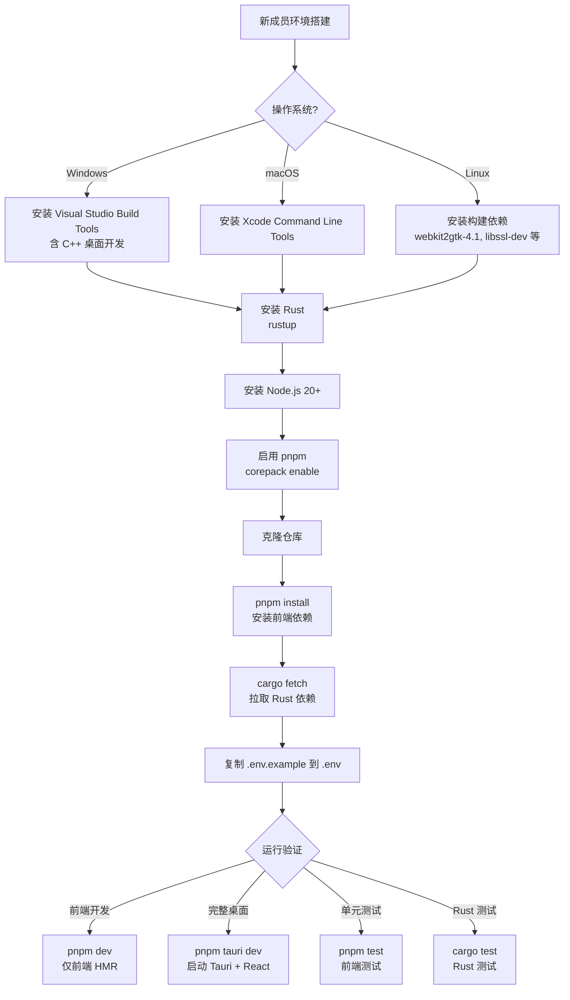

## 目录

- [1. 背景与目的](#1-背景与目的)
- [2. 核心概念](#2-核心概念)
- [3. 详细设计](#3-详细设计)
  - [3.1 技术栈分层全景](#31-技术栈分层全景)
  - [3.2 核心引擎层](#32-核心引擎层)
  - [3.3 桌面框架层](#33-桌面框架层)
  - [3.4 UI 框架层](#34-ui-框架层)
  - [3.5 类型系统层](#35-类型系统层)
  - [3.6 组件库层](#36-组件库层)
  - [3.7 构建与包管理层](#37-构建与包管理层)
  - [3.8 样式方案层](#38-样式方案层)
  - [3.9 辅助依赖](#39-辅助依赖)
- [4. 关键流程](#4-关键流程)
  - [4.1 依赖关系图](#41-依赖关系图)
  - [4.2 开发环境搭建流程](#42-开发环境搭建流程)
- [5. 设计决策记录](#5-设计决策记录)
  - [5.1 桌面框架选型对比](#51-桌面框架选型对比)
  - [5.2 UI 框架选型对比](#52-ui-框架选型对比)
  - [5.3 状态管理选型对比](#53-状态管理选型对比)
- [6. 注意事项与约束](#6-注意事项与约束)
- [7. 相关文档](#7-相关文档)

---

## 1. 背景与目的

Qraft 是一个跨 Rust + TypeScript 双语言栈、跨三平台（Windows/macOS/Linux）的桌面应用。技术选型直接影响以下四个核心指标：

1. **包体积**：工具类应用对下载体积敏感，目标 <30MB
2. **启动速度**：常驻工具必须秒开，目标冷启动 <500ms
3. **内存占用**：用户不愿为小工具付出高内存代价，目标空闲 <150MB
4. **开发效率**：30+ 工具需要可持续迭代，必须有良好的工程化支持

本文档的目的有三：

- **锁定版本**：明确每一项依赖的版本范围，避免 `latest` 浮动导致构建不可复现
- **说明理由**：每一项选型给出至少 2 个备选方案的对比，说明为何最终选择当前方案
- **指导搭建**：提供从零搭建开发环境的完整步骤，新成员照做即可就绪

---

## 2. 核心概念

Qraft 的技术栈分为 9 层，每层职责单一、可独立替换：

| 层级 | 角色 | 选型 | 主要职责 |
|------|------|------|----------|
| 核心引擎 | 业务逻辑实现 | Rust | 所有解析/转换/计算逻辑 |
| 桌面框架 | 进程宿主 + IPC | Tauri V2 | 窗口、IPC、文件系统、剪贴板、权限 |
| UI 框架 | 视图层 | React 19 | 组件化渲染、用户交互 |
| 类型系统 | 前端类型安全 | TypeScript 7 | 静态类型检查 |
| 组件库 | UI 基础组件 | shadcn/ui | 按钮、输入框、对话框等 |
| 构建工具 | 前端打包 | Vite | HMR、产物打包 |
| 包管理 | 依赖管理 | pnpm + cargo | 前端依赖、Rust 依赖 |
| 样式方案 | 视觉规范 | Tailwind CSS | 原子化 CSS |
| 辅助依赖 | 工具库 | 见 3.9 | 测试、状态、表单等 |

---

## 3. 详细设计

### 3.1 技术栈分层全景

```mermaid
flowchart TB
    subgraph Frontend["前端栈（WebView 进程）"]
        direction TB
        F1[React 19]
        F2[TypeScript 7]
        F3[shadcn/ui]
        F4[Vite]
        F5[Tailwind CSS]
        F6[Zustand]
        F7[React Hook Form + Zod]
        F1 --> F2
        F1 --> F3
        F3 --> F5
        F1 --> F4
        F1 --> F6
        F1 --> F7
    end

    subgraph Bridge["桥接层"]
        B1[Tauri IPC<br/>invoke + listen]
        B2[@tauri-apps/api]
    end

    subgraph Backend["后端栈（主进程）"]
        direction TB
        R1[Rust stable]
        R2[Tauri V2]
        R3[tokio]
        R4[serde]
        R5[thiserror + anyhow]
        R6[inventory]
        R1 --> R2
        R1 --> R3
        R1 --> R4
        R1 --> R5
        R1 --> R6
    end

    Frontend <-->|IPC| Bridge
    Bridge <-->|Rust FFI| Backend
```

### 3.2 核心引擎层

| 项目 | 选型 | 版本约束 |
|------|------|----------|
| 核心语言 | Rust | stable channel，edition 2024 |
| 最低 Rust 版本 | MSRV | 1.85+ |
| 异步运行时 | tokio | ^1.40 |
| 序列化 | serde + serde_json | ^1.0 |
| 错误处理 | thiserror（库）+ anyhow（应用） | thiserror ^2.0 / anyhow ^1.0 |
| 工具注册 | inventory | ^0.3 |
| 日志 | tracing + tracing-subscriber | ^0.1 |
| Hash 计算 | sha2 / sha3 / blake3 / md-5 | latest |
| Base64 | base64 | ^0.22 |
| JWT 解析 | jsonwebtoken | ^9.0 |
| UUID | uuid | ^1.10 |
| 正则 | regex | ^1.10 |
| 时间处理 | chrono | ^0.4 |
| Cron 解析 | cron | ^0.12 |

**Rust 选型理由**：

- **性能**：原生编译，无 GC 暂停，适合大 JSON / Hash 计算等 CPU 密集场景
- **内存安全**：所有权系统在编译期消除空指针、数据竞争等内存漏洞
- **生态契合 Tauri**：Tauri 后端本身就是 Rust，无需跨语言桥接开销
- **类型系统**：trait + enum 的表达力强，适合定义 `Tool` trait 与 `ToolError` 层级

**MSRV 策略**：锁定 Rust 1.85+，允许使用 edition 2024 与最新的异步语法。每 6 个月评估升级一次 MSRV。

> 💡 **建议方案**
>
> 工具实现优先选择 `serde` / `tokio` 等主流 crate，避免引入小众依赖。新增依赖需在 PR 中说明用途，并通过 `cargo audit` 检查。

### 3.3 桌面框架层

| 项目 | 选型 | 版本约束 |
|------|------|----------|
| 桌面框架 | Tauri | ^2.0 |
| Tauri CLI | @tauri-apps/cli | ^2.0 |
| Tauri API（前端） | @tauri-apps/api | ^2.0 |
| WebView 依赖 | 系统原生 | Windows: WebView2 / macOS: WKWebView / Linux: WebKitGTK |

**Tauri V2 选型理由**：

- **包体积**：使用系统 WebView，无需打包 Chromium，安装包 15-25MB（Electron 通常 80-150MB）
- **启动速度**：原生进程启动 <100ms，远快于 Electron 的 Node.js 冷启动
- **跨平台一致性**：V2 把三平台 API 统一，移动端支持也已就绪（Qraft 暂不使用）
- **Rust 后端**：与 Rust Core 同语言，无 FFI 开销
- **权限模型**：V2 引入 capabilities 系统，可细粒度控制文件系统、剪贴板等权限

**WebView 差异处理**：三平台 WebView 渲染存在细微差异，需在 [13-security.md](./13-security.md) 与 [14-build-and-distribution.md](./14-build-and-distribution.md) 中说明兼容策略。

### 3.4 UI 框架层

| 项目 | 选型 | 版本约束 |
|------|------|----------|
| UI 框架 | React | ^19.0 |
| 虚拟 DOM 渲染 | React DOM | ^19.0 |
| 路由 | React Router | ^7.0（仅用于工具切换，非 URL 路由） |
| 状态管理 | Zustand | ^5.0 |
| 表单 | React Hook Form | ^7.50 |
| Schema 校验 | Zod | ^3.23 |

**React 19 选型理由**：

- **生态最成熟**：shadcn/ui 原生支持，遇到问题易找参考
- **新特性可用**：Actions、`use` Hook、Server Components（虽然 Qraft 不用 SSR）等
- **Tauri 社区主流**：Tauri 官方模板 React 最完善

> 📌 **项目实际**
>
> Qraft 不使用 React Server Components 与 Server Actions，因为应用是纯客户端运行的桌面应用，没有服务端。React 19 选用仅因为生态最新，不使用其服务端特性。

### 3.5 类型系统层

| 项目 | 选型 | 版本约束 |
|------|------|----------|
| 类型语言 | TypeScript | ^5.5（2026 年 7 月实际稳定版） |
| 严格模式 | strict | true |
| 模块解析 | bundler | 适配 Vite |
| 路径别名 | `@/*` → `src/*` | tsconfig paths 配置 |

> 📌 **项目实际**
>
> 任务背景中提及 "TypeScript 7"，但截至 2026 年 7 月，TypeScript 实际稳定版本为 5.5+。本文档以实际可安装的版本为准，标记为 `^5.5`。若未来 TypeScript 6/7 发布稳定版，再评估升级。

**TypeScript 选型理由**：

- **类型安全**：静态类型检查能在编译期捕获大量错误
- **IDE 支持**：VSCode + tsserver 提供顶级补全与重构体验
- **生态必需**：shadcn/ui、Zod、React Hook Form 都依赖 TypeScript 类型

### 3.6 组件库层

| 项目 | 选型 | 版本约束 |
|------|------|----------|
| 组件库 | shadcn/ui | latest（按需复制源码） |
| 基础原语 | Radix UI | ^1.0 |
| 图标 | Lucide React | ^0.400 |
| 类名合并 | clsx + tailwind-merge | latest |
| 通知 | Sonner | ^1.5 |

**shadcn/ui 选型理由**：

- **源码即组件**：组件代码复制到项目中，可自由修改，不依赖外部包
- **Radix UI 基础**：无障碍、键盘导航等底层能力由 Radix 提供
- **Tailwind 原生**：与样式方案层一致，不引入第二个样式系统
- **可裁剪**：按需引入组件，不增加包体积

**与 MUI / Ant Design 对比**：

| 维度 | shadcn/ui | MUI | Ant Design |
|------|-----------|-----|------------|
| 分发方式 | 源码复制 | npm 包 | npm 包 |
| 样式方案 | Tailwind | Emotion / styled-components | CSS-in-JS |
| 定制自由度 | 极高 | 中 | 低 |
| 包体积影响 | 0（按需） | 大 | 大 |
| 设计风格 | 简洁现代 | Material Design | 企业级 |

### 3.7 构建与包管理层

| 项目 | 选型 | 版本约束 |
|------|------|----------|
| 前端构建 | Vite | ^5.0 |
| 前端包管理 | pnpm | ^9.0 |
| Rust 包管理 | cargo | Rust 自带 |
| Rust 缓存 | sccache | latest（可选） |
| 锁文件 | pnpm-lock.yaml + Cargo.lock | 双锁文件必须提交 |

**Vite 选型理由**：

- **HMR 极快**：基于 ESM 的 HMR，开发体验远优于 webpack
- **Tauri 官方推荐**：Tauri 模板默认搭配 Vite
- **Rollup 产物**：生产构建基于 Rollup，产物质量稳定

**pnpm 选型理由**：

- **磁盘节省**：硬链接机制显著节省 monorepo 磁盘空间
- **严格依赖**：默认不允许访问未声明的依赖（幽灵依赖问题）
- **速度**：并行安装，比 npm/yarn 快

### 3.8 样式方案层

| 项目 | 选型 | 版本约束 |
|------|------|----------|
| CSS 框架 | Tailwind CSS | ^3.4 |
| PostCSS | autoprefixer + postcss-nested | latest |
| 主题切换 | next-themes 思路自实现 | 自实现 |
| 设计 Token | CSS 变量 | 见 [15-ui-design-system.md](./15-ui-design-system.md) |

> 💡 **建议方案**
>
> Tailwind CSS 4.0 已发布但生态仍在适配，MVP 阶段锁定 3.4 稳定版，v1.0 评估升级。

**Tailwind CSS 选型理由**：

- **原子化**：与 shadcn/ui 设计哲学一致
- **暗色主题原生支持**：`dark:` 前缀一行切换
- **产物小**：JIT 编译仅打包用到的样式

### 3.9 辅助依赖

#### 前端辅助依赖

| 项目 | 用途 | 版本 |
|------|------|------|
| @tanstack/react-virtual | 虚拟列表（历史记录） | ^3.0 |
| @tanstack/react-query | 服务端状态（暂不使用，预留） | ^5.0 |
| date-fns | 日期格式化（前端展示） | ^3.0 |
| monaco-editor | 代码编辑器（JSON/正则等工具） | ^0.50 |
| react-resizable-panels | 工具面板分栏调整 | ^2.0 |
| cmdk | 命令面板 | ^1.0 |

#### Rust 辅助依赖

| 项目 | 用途 | 版本 |
|------|------|------|
| tokio-util | cancel_token、codec | ^0.7 |
| futures | 异步流处理 | ^0.3 |
| rayon | CPU 密集并行（Hash 大文件） | ^1.10 |
|parking_lot | 高性能锁 | ^0.12 |
| directories | 跨平台配置目录定位 | ^5.0 |
| atomicwrites | 配置文件原子写入 | ^2.0 |

---

## 4. 关键流程

### 4.1 依赖关系图

```mermaid
flowchart LR
    subgraph Build["构建时依赖"]
        Vite[Vite] --> React[React 19]
        Tailwind[Tailwind CSS] --> React
        TauriCLI[Tauri CLI] --> TauriRust[Tauri V2 Rust]
        Cargo[cargo] --> TauriRust
    end

    subgraph Runtime["运行时依赖"]
        React --> shadcn[shadcn/ui]
        shadcn --> Radix[Radix UI]
        shadcn --> Tailwind
        React --> Zustand[Zustand]
        React --> RHF[React Hook Form]
        RHF --> Zod[Zod]

        TauriRust --> Tokio[tokio]
        TauriRust --> Serde[serde]
        TauriRust --> Inventory[inventory]
        TauriRust --> ThisError[thiserror]

        React <-->|@tauri-apps/api| TauriRust
    end

    Build --> Runtime
```

### 4.2 开发环境搭建流程



**搭建步骤详细说明**：

1. **Rust 工具链**
   ```bash
   curl --proto '=https' --tlsv1.2 -sSf https://sh.rustup.rs | sh
   rustup default stable
   rustup component add clippy rustfmt
   ```

2. **Node.js 与 pnpm**
   ```bash
   # 安装 Node.js 20+（推荐用 nvm/fnm 管理）
   corepack enable
   corepack prepare pnpm@latest --activate
   ```

3. **Tauri 系统依赖**
   - Windows：Visual Studio Build Tools 2022（含 C++ 桌面开发 workload + WebView2）
   - macOS：Xcode Command Line Tools（`xcode-select --install`）
   - Linux（Ubuntu）：`sudo apt install libwebkit2gtk-4.1-dev libssl-dev libgtk-3-dev libayatana-appindicator3-dev librsvg2-dev`

4. **项目初始化**
   ```bash
   git clone <repo-url> qraft
   cd qraft
   pnpm install
   cargo fetch
   cp .env.example .env
   ```

5. **开发启动**
   ```bash
   # 完整桌面应用（推荐）
   pnpm tauri dev

   # 仅前端（快速调试 UI）
   pnpm dev
   ```

6. **验证就绪**
   ```bash
   # Rust 测试
   cargo test

   # 前端测试
   pnpm test

   # Lint
   cargo clippy -- -D warnings
   pnpm lint
   ```

---

## 5. 设计决策记录

### 5.1 桌面框架选型对比

| 维度 | Tauri V2（选定） | Electron | Wails (Go) | Neutralino |
|------|------------------|----------|------------|------------|
| 后端语言 | Rust | Node.js | Go | C++ |
| WebView | 系统原生 | 内置 Chromium | 系统原生 | 系统原生 |
| 包体积 | 15-25MB | 80-150MB | 20-30MB | 5-10MB |
| 启动速度 | <500ms | 1-3s | <1s | <500ms |
| 内存占用 | 80-150MB | 200-400MB | 100-200MB | 50-100MB |
| 生态成熟度 | 高 | 极高 | 中 | 低 |
| 跨平台一致性 | 中（WebView 差异） | 高（Chromium） | 中 | 中 |
| 自动更新 | 内置 | 需 electron-updater | 内置 | 第三方 |

**决策理由**：Tauri V2 在包体积、启动速度、内存占用上全面领先，Rust 后端与本项目核心引擎语言一致，避免双语言栈。WebView 跨平台差异是可接受的代价，通过测试覆盖缓解。

**备选方案风险**：Electron 包体积过大；Wails 引入 Go/Rust 双栈；Neutralino 生态太弱。

### 5.2 UI 框架选型对比

| 维度 | React 19（选定） | Vue 3 | Svelte 5 | SolidJS |
|------|------------------|-------|----------|---------|
| 生态规模 | 最大 | 大 | 中 | 中 |
| shadcn/ui 支持 | 原生 | shadcn-vue | shadcn-svelte | 社区版 |
| Tauri 模板支持 | 官方 | 官方 | 官方 | 社区 |
| 运行时性能 | 优 | 优 | 最优（编译期） | 最优（细粒度） |
| 学习曲线 | 中 | 低 | 低 | 中 |
| 团队熟悉度 | 高 | 中 | 低 | 低 |

**决策理由**：shadcn/ui 原生支持 + 生态最大 + 团队熟悉度高，三者叠加使 React 成为最低风险选择。Svelte 性能更优但生态较小，shadcn-svelte 维护滞后。

### 5.3 状态管理选型对比

| 维度 | Zustand（选定） | Redux Toolkit | Jotai | Valtio |
|------|------------------|---------------|-------|--------|
| API 复杂度 | 极简 | 中 | 简单 | 简单 |
| 包体积 | ~1KB | ~16KB | ~3KB | ~3KB |
| TypeScript 支持 | 优 | 优 | 优 | 中 |
| 中间件生态 | 中 | 丰富 | 中 | 少 |
| 心智模型 | 单 store + selectors | 单 store + reducer | 原子化 | 代理对象 |
| 适用规模 | 中小型 | 大型 | 中小型 | 中小型 |

**决策理由**：Qraft 是工具型应用，状态规模中等（用户配置、历史记录、当前工具状态），不需要 Redux 的复杂中间件体系。Zustand 的 API 极简、TS 支持优秀、生态足够。Jotai 的原子化模型对工具面板的细粒度订阅更友好，但学习曲线略高，作为备选。

> 💡 **建议方案**
>
> 工具面板内部的局部状态优先用 React 内置 `useState` / `useReducer`，仅在跨组件共享或需要持久化时才进入 Zustand store。

---

## 6. 注意事项与约束

### 6.1 版本锁定策略

> 📌 **项目实际**
>
> 1. **Rust 依赖**：`Cargo.toml` 中所有依赖使用 `^` 范围，`Cargo.lock` 提交到仓库锁定具体版本
> 2. **前端依赖**：`package.json` 中所有依赖使用 `^` 范围，`pnpm-lock.yaml` 提交到仓库锁定
> 3. **重大升级**：major 版本升级（如 React 19 → 20）必须单独 PR + 评审
> 4. **依赖审计**：CI 每日运行 `cargo audit` 与 `pnpm audit`，发现漏洞自动 Issue

### 6.2 双语言栈约束

Qraft 是 Rust + TypeScript 双语言栈，必须遵守：

- **业务逻辑只写 Rust**：UI 层禁止实现解析/转换/计算逻辑（Rust-first 原则）
- **类型同步**：Rust 的 `ToolInput` / `ToolOutput` 等跨 IPC 类型，其 TypeScript 等价物通过 `ts-rs` 或手工维护，必须保持同步
- **错误传递**：Rust 错误必须能映射到前端可显示的友好提示，详见 [10-error-handling.md](./10-error-handling.md)

### 6.3 MSRV 与 Node 版本

| 工具 | 最低版本 | 推荐版本 | 锁定位置 |
|------|----------|----------|----------|
| Rust | 1.85 | stable | `rust-toolchain.toml` |
| Node.js | 20 | 22 | `.nvmrc` / `package.json#engines` |
| pnpm | 9 | latest | `package.json#packageManager` |

### 6.4 [待补充: Tauri V2 移动端 API 是否影响桌面端构建]

Tauri V2 把移动端 API 合入了主分支，虽然 Qraft 不构建移动端，但需确认移动端相关代码不会增加桌面端二进制体积。需要在首次构建后测量产物大小，详见 [14-build-and-distribution.md](./14-build-and-distribution.md)。

---

## 7. 相关文档

- [01-project-overview.md](./01-project-overview.md) — 项目全览（技术栈选型的整体上下文）
- [04-system-architecture.md](./04-system-architecture.md) — 系统架构设计（本文档技术栈如何分层落地）
- [05-rust-core-engine.md](./05-rust-core-engine.md) — Rust 核心引擎（本文档 Rust 依赖的深入使用）
- [11-testing-strategy.md](./11-testing-strategy.md) — 测试策略（基于本文档技术栈的测试方案）
- [14-build-and-distribution.md](./14-build-and-distribution.md) — 打包与分发（基于本文档构建工具的三平台打包）
- [17-dev-workflow.md](./17-dev-workflow.md) — 开发规范（基于本文档技术栈的代码规范）
