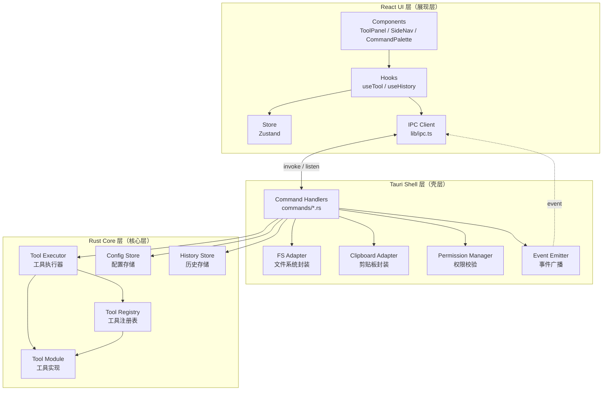
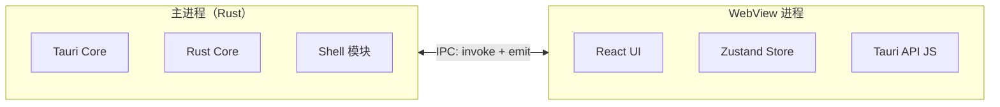
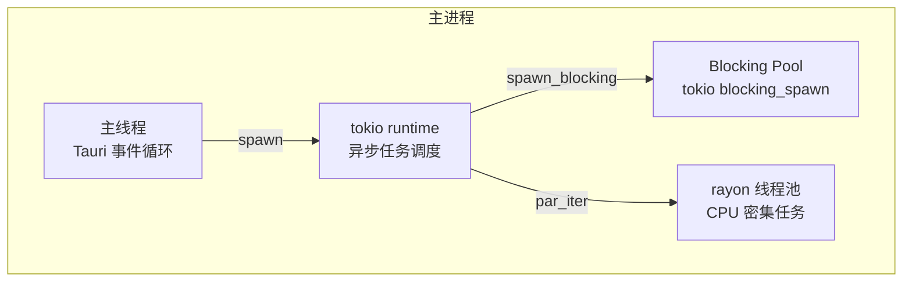
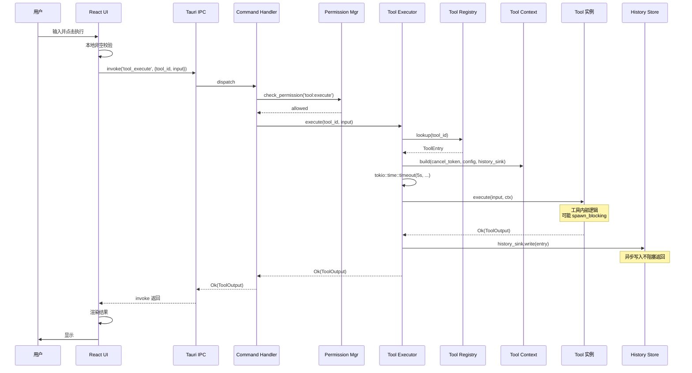
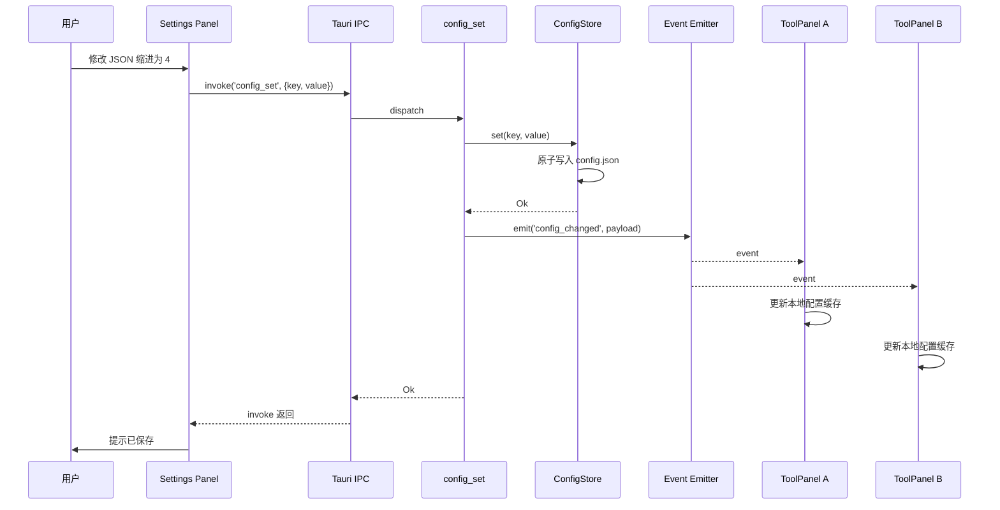
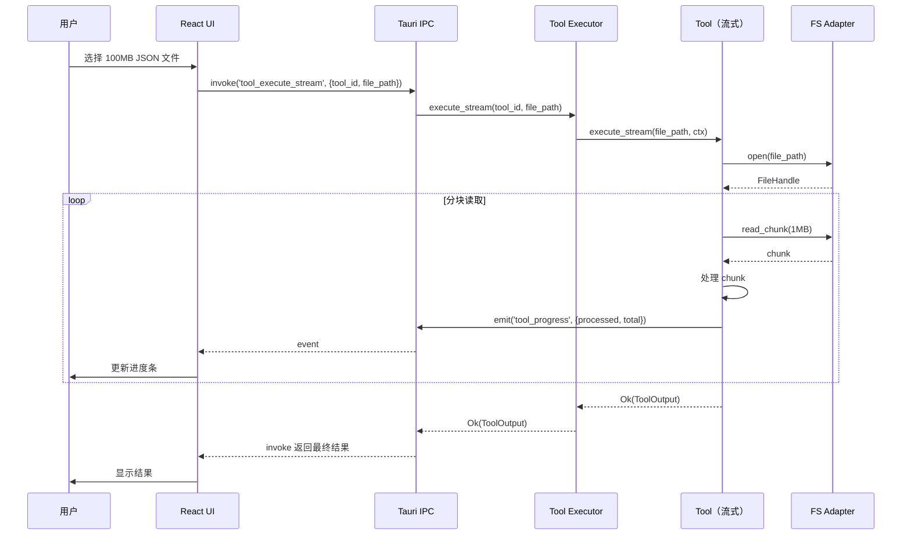

## 目录

- [1. 背景与目的](#1-背景与目的)
- [2. 核心概念](#2-核心概念)
- [3. 详细设计](#3-详细设计)
  - [3.1 三层分层架构](#31-三层分层架构)
  - [3.2 模块划分](#32-模块划分)
  - [3.3 进程模型](#33-进程模型)
  - [3.4 线程模型](#34-线程模型)
  - [3.5 通信机制](#35-通信机制)
- [4. 关键流程](#4-关键流程)
  - [4.1 工具调用完整时序](#41-工具调用完整时序)
  - [4.2 配置变更广播时序](#42-配置变更广播时序)
  - [4.3 大文件流式处理时序](#43-大文件流式处理时序)
- [5. 设计决策记录](#5-设计决策记录)
  - [5.1 为何采用严格三层而非两层](#51-为何采用严格三层而非两层)
  - [5.2 为何使用 tokio 而非 async-std](#52-为何使用-tokio-而非-async-std)
  - [5.3 IPC 模式：invoke 同步 vs event 异步](#53-ipc-模式invoke-同步-vs-event-异步)
- [6. 注意事项与约束](#6-注意事项与约束)
- [7. 相关文档](#7-相关文档)

---

## 1. 背景与目的

Qraft 的核心挑战在于：**如何让 Rust Core 的强类型、高性能能力被 React UI 安全、低延迟地调用，同时保证三平台行为一致**。这需要清晰定义：

- **层与层的边界**：哪些代码属于哪层，跨层调用的规则
- **进程与线程模型**：哪些逻辑在哪个进程/线程运行
- **通信机制**：层与层之间如何传数据、如何同步状态

本文档的目的：

1. **明确职责**：三层架构的每一层职责单一，避免"任何地方都能写业务逻辑"
2. **定义边界**：跨层调用必须走定义好的接口，禁止 UI 直访 Rust、禁止 Rust 反向调用 UI
3. **约定通信**：UI ↔ Shell ↔ Core 之间的所有数据流必须走 IPC，且 IPC 命令必须符合规范

阅读本文档前，建议先阅读 [02-glossary.md](./02-glossary.md) 与 [03-tech-stack.md](./03-tech-stack.md)。

---

## 2. 核心概念

Qraft 系统架构的核心概念：

| 概念 | 定义 |
|------|------|
| 三层架构 | Rust Core / Tauri Shell / React UI 的严格分层 |
| 依赖方向 | 单向向下：UI → Shell → Core，反向仅通过回调/事件 |
| 进程模型 | 一个主进程（Rust）+ 一个 WebView 进程（React） |
| 线程模型 | 主进程内：主线程 + tokio runtime + rayon 线程池 + 阻塞任务池 |
| IPC 通信 | 基于 Tauri `invoke()`（同步请求）与 `listen()`（异步事件） |
| 调用规则 | UI 不可直接调用 Rust 函数，必须通过 Shell 暴露的 Command |

---

## 3. 详细设计

### 3.1 三层分层架构



#### 各层职责

| 层 | 职责 | 禁止 |
|----|------|------|
| **React UI** | 渲染、用户交互、UI 状态管理、IPC 调用封装 | 实现任何业务逻辑、直接访问文件系统/剪贴板 |
| **Tauri Shell** | IPC 路由、权限校验、文件系统/剪贴板封装、事件广播、自动更新 | 实现工具业务逻辑、维护跨工具状态 |
| **Rust Core** | 工具实现、工具注册与发现、工具执行、配置/历史持久化 | 调用 Tauri API（保持可独立测试）、访问 UI |

> 📌 **项目实际**
>
> **Rust Core 必须可独立测试**：Core 模块不依赖 `tauri::AppHandle` 等类型，所有 Tauri 依赖必须封装在 Shell 层。Core 通过 trait（如 `HistorySink`）接收外部能力，Shell 注入具体实现。这样 Rust 单元测试可以 mock 这些 trait，无需启动 Tauri。

#### 依赖方向规则

1. **UI → Shell**：通过 `invoke()` 调用 Command，单向
2. **Shell → UI**：通过 `emit()` 发送 Event，单向
3. **Shell → Core**：Rust 函数直接调用，单向
4. **Core → Shell**：仅通过 trait 接口回调（如 `HistorySink::write`），Core 不持有 Shell 类型引用
5. **禁止**：UI ↔ Core 直接通信

### 3.2 模块划分

#### React UI 模块（`src/`）

| 模块 | 职责 | 关键文件 |
|------|------|----------|
| `components/` | 通用 UI 组件 | `ToolPanel.tsx`、`SideNav.tsx`、`CommandPalette.tsx` |
| `components/ui/` | shadcn/ui 组件源码 | `button.tsx`、`dialog.tsx` 等 |
| `tools/` | 工具 UI 组件（每工具一个） | `JsonFormatter.tsx`、`Base64Codec.tsx` |
| `store/` | Zustand store | `configStore.ts`、`historyStore.ts` |
| `hooks/` | 自定义 Hook | `useTool.ts`、`useClipboard.ts` |
| `lib/ipc.ts` | Tauri invoke 封装 | 统一错误处理、响应包络解包 |
| `types/` | TypeScript 类型定义 | 与 Rust 类型一一对应 |
| `styles/` | 全局样式 | `globals.css` |

#### Tauri Shell 模块（`src-tauri/src/commands/`）

| 模块 | 职责 |
|------|------|
| `commands/tool.rs` | `tool_execute` / `tool_list` / `tool_metadata` |
| `commands/config.rs` | `config_get` / `config_set` / `config_reset` |
| `commands/history.rs` | `history_add` / `history_list` / `history_clear` |
| `commands/clipboard.rs` | `clipboard_read` / `clipboard_write` |
| `commands/fs.rs` | `fs_read_file` / `fs_write_file`（受权限管控） |

#### Rust Core 模块（`src-tauri/src/core/`）

| 模块 | 职责 |
|------|------|
| `core/tool.rs` | `Tool` trait 定义 |
| `core/registry.rs` | `ToolRegistry` 全局注册表 |
| `core/executor.rs` | `ToolExecutor` 执行器（超时、panic 隔离） |
| `core/error.rs` | `ToolError` / `EngineError` 错误类型 |
| `core/context.rs` | `ToolContext`、`HistorySink` trait |
| `store/config.rs` | `ConfigStore` 配置读写 |
| `store/history.rs` | `HistoryStore` 历史读写 |
| `tools/*.rs` | 具体工具实现（每工具一文件） |

### 3.3 进程模型



**进程职责**：

| 进程 | 角色 | 内含 |
|------|------|------|
| 主进程 | Rust 编译产物 | Tauri 运行时、Rust Core、Shell 模块 |
| WebView 进程 | 系统原生 WebView | React 应用、Zustand store、@tauri-apps/api |

**进程间通信**：仅通过 Tauri IPC，无共享内存、无管道。

**WebView 进程崩溃**：Tauri 默认会重启 WebView；Qraft 在重启后通过 `tool_list` 重新拉取工具清单，并通过 `workspace_restore` 恢复上次会话。

**主进程崩溃**：应用退出，用户需手动重启。崩溃前 `tracing` 日志已写入 `~/.qraft/logs/`，可用于事后分析。

### 3.4 线程模型

主进程内部有四类线程：



| 线程 | 用途 | 数量 |
|------|------|------|
| 主线程 | Tauri 事件循环、窗口管理、IPC 接收 | 1 |
| tokio worker 线程 | 异步任务（工具调度、配置读写） | 默认 CPU 核数 |
| tokio blocking 线程 | 阻塞 IO（文件读写、Hash 大文件） | 默认 512 上限 |
| rayon 线程 | CPU 密集并行（Hash 并行计算） | 默认 CPU 核数 |

**线程分配规则**：

1. **IPC Command 入口**：在主线程接收，立即 `tokio::spawn` 到 worker 池
2. **工具执行**：默认在 tokio worker 线程异步执行
3. **大文件 Hash**：用 `spawn_blocking` 切到 blocking 池，避免阻塞 worker
4. **CPU 密集并行**：用 `rayon::par_iter` 并行处理（如多文件 Hash）

> 💡 **建议方案**
>
> 工具的 `execute` 方法签名是 `async fn`，但工具内部如果做了大量 CPU 计算（如 Hash），应使用 `tokio::task::spawn_blocking` 切到 blocking 线程，避免阻塞 tokio worker 池影响其他工具的响应性。

### 3.5 通信机制

#### IPC Command（同步请求-响应）

UI 通过 `@tauri-apps/api` 的 `invoke()` 调用 Rust Command，得到 Promise 返回。

```typescript
// 前端调用示例
import { invoke } from '@tauri-apps/api/core';

const result = await invoke<ToolOutput>('tool_execute', {
  toolId: 'json_formatter',
  input: { text: '{"a":1}', params: { indent: 2 } }
});
```

```rust
// Rust Command 实现
#[tauri::command]
async fn tool_execute(
    tool_id: String,
    input: ToolInput,
    state: tauri::State<AppState>,
) -> Result<ToolOutput, AppError> {
    let executor = state.executor.clone();
    executor.execute(&tool_id, input).await
        .map_err(AppError::from)
}
```

**统一响应包络**：所有 Command 返回值都通过 serde 序列化为统一结构，详见 [09-interface-design.md](./09-interface-design.md)。

#### IPC Event（异步推送）

Rust 主动推送事件给所有订阅的 WebView：

```rust
// Rust 推送
app_handle.emit("config_changed", &changed_config)?;
```

```typescript
// 前端订阅
import { listen } from '@tauri-apps/api/event';

const unlisten = await listen<ConfigChangedEvent>('config_changed', (event) => {
  useConfigStore.getState().update(event.payload);
});
```

**事件命名规范**：`<domain>_<action>`，如 `config_changed`、`history_added`、`tool_progress`。

---

## 4. 关键流程

### 4.1 工具调用完整时序

下图展示一次完整的工具调用，包含权限校验、超时控制、历史记录、panic 隔离：



**异常路径**：

- **工具超时**：`tokio::time::timeout` 触发，Executor 返回 `ToolError::Timeout`，UI 显示"执行超时"
- **工具 panic**：`catch_unwind` 捕获，转换为 `ToolError::Internal`，主进程不崩溃
- **权限拒绝**：Permission Manager 返回 `AppError::Forbidden`，UI 提示"无权限"

### 4.2 配置变更广播时序

当用户修改配置（如 JSON 缩进数），所有打开的工具面板需要感知：



### 4.3 大文件流式处理时序

对于 >10MB 的输入（如大 JSON 格式化、大文件 Hash），采用流式处理避免内存爆炸：



> 📌 **项目实际**
>
> Streaming 在 MVP 阶段仅对 JSON 格式化与 Hash 计算两个工具启用。其他工具在输入 >10MB 时直接返回 `ToolError::InputTooLarge`，提示用户使用专用工具或拆分输入。详见 [12-performance.md](./12-performance.md)。

---

## 5. 设计决策记录

### 5.1 为何采用严格三层而非两层

| 方案 | 层级 | 优点 | 缺点 |
|------|------|------|------|
| **严格三层**（选定） | UI / Shell / Core | Core 可独立测试、职责清晰 | 跨层调用路径稍长 |
| 两层（UI + Rust） | UI / Rust（Shell 与 Core 合并） | 调用路径短 | Rust 业务逻辑耦合 Tauri，难测试 |

**决策理由**：Qraft 的 Rust Core 包含 30+ 工具，必须可独立单元测试。如果 Core 依赖 `tauri::AppHandle`，单元测试就需要 mock 整个 Tauri 上下文，成本极高。三层架构通过 trait 接口（如 `HistorySink`）让 Core 不依赖 Tauri 类型，单元测试零 mock 成本。

### 5.2 为何使用 tokio 而非 async-std

| 方案 | 生态 | 性能 | Tauri 集成 | 社区活跃 |
|------|------|------|------------|----------|
| **tokio**（选定） | 极大 | 优 | Tauri 默认 | 极活跃 |
| async-std | 中 | 优 | 需手动适配 | 趋于停滞 |
| smol | 小 | 优 | 需手动适配 | 小众 |

**决策理由**：Tauri V2 内部使用 tokio，与其保持一致避免双 runtime 共存问题。tokio 的 `spawn_blocking`、`timeout`、`CancellationToken` 等工具完整覆盖 Qraft 需求。

### 5.3 IPC 模式：invoke 同步 vs event 异步

| 场景 | 模式 | 原因 |
|------|------|------|
| 工具执行（小输入） | invoke 同步 | 简单直观，结果一次性返回 |
| 工具执行（大输入/流式） | invoke + event 进度 | 需要进度反馈，最终结果用 invoke 返回 |
| 配置变更广播 | event 异步 | 一对多广播，无需等待响应 |
| 历史记录写入 | invoke 同步 | UI 需要确认写入成功 |
| 长任务取消 | event 异步 | 单向通知，无需响应 |

**决策原则**：

- **请求-响应**用 invoke（如 `tool_execute`、`config_get`）
- **单向通知 / 一对多广播**用 event（如 `config_changed`、`tool_progress`）
- **长任务**用 invoke 启动 + event 报进度 + invoke 取消

---

## 6. 注意事项与约束

### 6.1 跨层数据类型同步

> 📌 **项目实际**
>
> 跨 IPC 边界的数据类型（如 `ToolInput`、`ToolOutput`、`ToolMetadata`）在 Rust 与 TypeScript 中各有一份定义，必须保持同步。同步策略：
>
> 1. **优先用 `ts-rs` crate** 自动从 Rust 类型生成 TypeScript 类型
> 2. **无法自动生成的**（如复杂 enum）手工维护，并在 PR Review 中检查
> 3. **CI 校验**：构建时运行 `cargo test --features export-ts`，对比生成结果与 `src/types/` 内容，不一致则失败

### 6.2 主线程阻塞约束

**禁止**在主线程执行任何可能阻塞的操作：

- 文件 IO（必须 `spawn_blocking`）
- 长时间 CPU 计算
- 网络请求（虽然 Qraft 零网络，但即使有也禁止）
- sleep / 等待锁

违反此约束会导致 UI 卡顿，因为 Tauri 的事件循环在主线程。

### 6.3 工具执行隔离

每个工具的 `execute` 调用是相互独立的：

- 不共享可变状态（除 ConfigStore 只读访问）
- 一个工具 panic 不影响其他工具（通过 `catch_unwind`）
- 一个工具超时不影响其他工具（通过 `tokio::time::timeout`）
- 工具之间通过 `ToolContext.history_sink` 间接通信，不直接调用

### 6.4 [待补充: 多窗口架构是否需要]

当前架构假设单窗口。若 v2.0 引入多窗口（如工具独立窗口），需要：

- 每个窗口独立的 WebView 进程还是共享？
- 事件广播范围：全局还是窗口级？
- 状态隔离：每个窗口独立 store 还是共享？

详见 [18-known-issues.md](./18-known-issues.md)。

---

## 7. 相关文档

- [02-glossary.md](./02-glossary.md) — 术语表（本文档中三层、IPC、Command 等术语的定义）
- [03-tech-stack.md](./03-tech-stack.md) — 技术栈全景（本文档涉及的所有技术）
- [05-rust-core-engine.md](./05-rust-core-engine.md) — Rust 核心引擎（本文档 Core 层的深入设计）
- [09-interface-design.md](./09-interface-design.md) — 接口设计（本文档 IPC 通信的完整 Command 清单）
- [10-error-handling.md](./10-error-handling.md) — 错误处理（本文档异常路径的详细设计）
- [12-performance.md](./12-performance.md) — 性能优化（本文档线程模型与流式处理的性能目标）
- [13-security.md](./13-security.md) — 安全机制（本文档权限校验与沙箱的详细设计）
