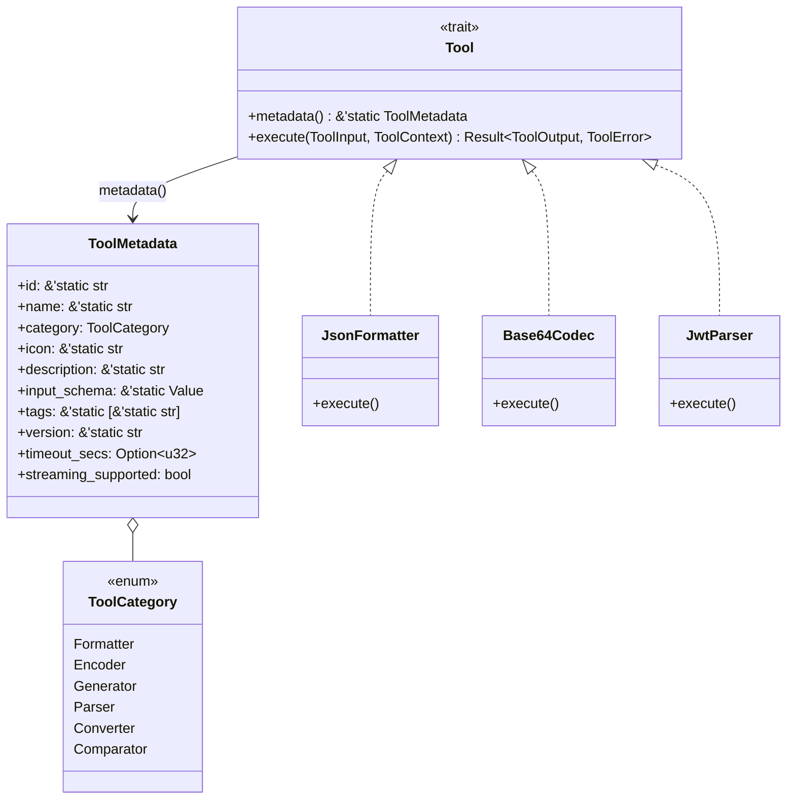
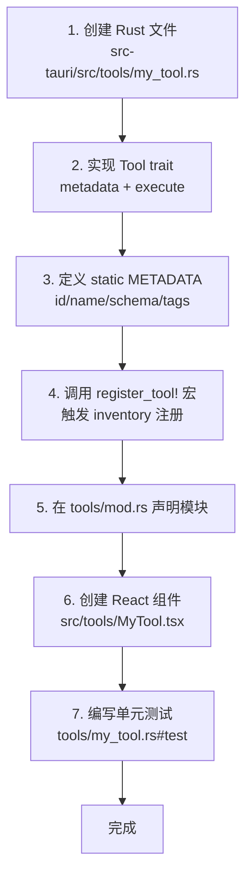
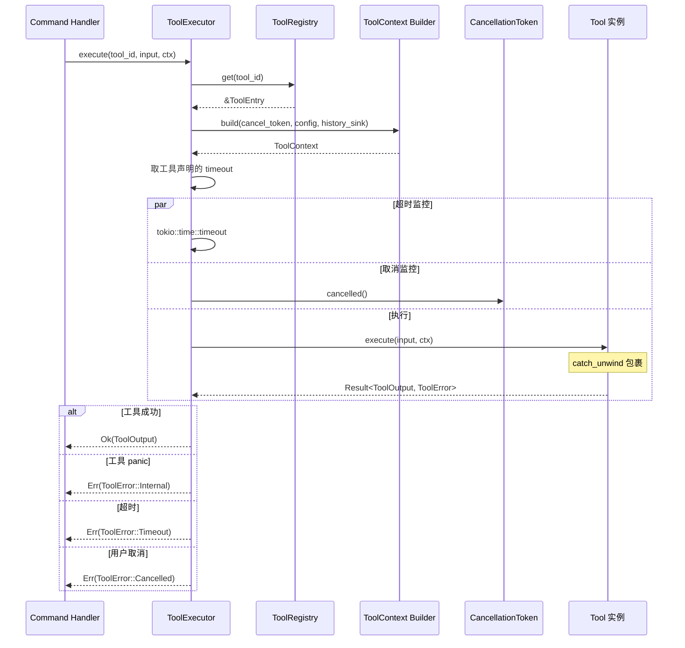

## 目录

- [1. 背景与目的](#1-背景与目的)
- [2. 核心概念](#2-核心概念)
- [3. 详细设计](#3-详细设计)
  - [3.1 Tool Trait 体系](#31-tool-trait-体系)
  - [3.2 输入输出抽象](#32-输入输出抽象)
  - [3.3 错误类型层级](#33-错误类型层级)
  - [3.4 工具注册与发现](#34-工具注册与发现)
  - [3.5 Tool Executor 执行器](#35-tool-executor-执行器)
  - [3.6 性能约束](#36-性能约束)
  - [3.7 unsafe 边界规则](#37-unsafe-边界规则)
- [4. 关键流程](#4-关键流程)
  - [4.1 新增工具完整流程](#41-新增工具完整流程)
  - [4.2 工具执行内部时序](#42-工具执行内部时序)
- [5. 设计决策记录](#5-设计决策记录)
  - [5.1 编译期注册 vs 运行时注册](#51-编译期注册-vs-运行时注册)
  - [5.2 async trait vs 同步 trait](#52-async-trait-_vs-同步-trait)
  - [5.3 inventory vs linkme](#53-inventory-vs-linkme)
- [6. 注意事项与约束](#6-注意事项与约束)
- [7. 相关文档](#7-相关文档)

---

## 1. 背景与目的

Rust Core 是 Qraft 的心脏——所有 30+ 工具的实现、注册、调度、执行都在这里完成。本文档定义 Core 层的核心抽象与扩展机制，目标是：

1. **统一抽象**：所有工具实现同一 `Tool` trait，便于注册、调度、测试
2. **低门槛扩展**：新增一个工具不需要修改 Core 引擎代码，只需实现 trait 并提交注册
3. **强隔离**：单工具的 bug（panic、超时、内存泄漏）不影响其他工具与主进程
4. **可测试**：每个工具是纯函数式 `ToolInput → ToolOutput`，无需启动 Tauri 即可单元测试

阅读本文档前，建议先阅读 [04-system-architecture.md](./04-system-architecture.md) 理解 Core 在整体架构中的位置。

---

## 2. 核心概念

| 概念 | 定义 |
|------|------|
| Tool trait | 所有工具必须实现的接口，定义 `metadata` 与 `execute` |
| ToolInput / ToolOutput | 工具的输入输出强类型封装 |
| ToolError | 工具执行错误的统一类型 |
| ToolContext | 执行时注入的运行时环境（配置、历史、取消令牌） |
| ToolRegistry | 全局工具注册表，编译期通过 inventory 自动收集 |
| ToolExecutor | 调用工具的运行时，负责超时、panic 隔离、上下文注入 |
| HistorySink | 历史记录写入的 trait 接口，由 Shell 注入实现 |

---

## 3. 详细设计

### 3.1 Tool Trait 体系

`Tool` trait 是 Qraft 中所有工具的核心抽象。一个工具是一个实现了 `Tool` 的 Rust 类型。

```rust
// src-tauri/src/core/tool.rs

use async_trait::async_trait;
use serde::{Deserialize, Serialize};

use crate::core::{context::ToolContext, error::ToolError, input::ToolInput, output::ToolOutput};

/// 所有工具必须实现的核心 trait
///
/// 实现要点：
/// 1. metadata() 返回静态描述，在编译期通过 inventory 注册
/// 2. execute() 是纯函数式：相同输入 + 相同 context 配置 → 相同输出
/// 3. 禁止在 execute 中调用 Tauri API，所有外部能力通过 ToolContext 注入
#[async_trait]
pub trait Tool: Send + Sync {
    /// 工具的静态元数据（id、名称、分类、参数 schema 等）
    fn metadata(&self) -> &'static ToolMetadata;

    /// 执行工具
    ///
    /// # 参数
    /// - input: 用户输入与工具参数
    /// - ctx: 运行时上下文（配置、历史、取消令牌）
    ///
    /// # 返回
    /// - Ok(ToolOutput): 执行成功
    /// - Err(ToolError): 执行失败（含超时、panic 转换的错误）
    async fn execute(&self, input: ToolInput, ctx: &ToolContext) -> Result<ToolOutput, ToolError>;
}
```

#### Tool Metadata 定义

```rust
// src-tauri/src/core/tool.rs

/// 工具的静态元数据
///
/// 该结构在编译期常量化，通过 inventory 注册到全局 ToolRegistry。
/// 字段不可变，工具实例化后 metadata() 返回的是 &'static 引用。
#[derive(Debug, Clone, Serialize)]
pub struct ToolMetadata {
    /// 工具唯一标识，snake_case，如 "json_formatter"
    pub id: &'static str,

    /// 工具显示名称（英文），如 "JSON Formatter"
    pub name: &'static str,

    /// 工具分类，见 ToolCategory
    pub category: ToolCategory,

    /// Lucide 图标名（前端按名渲染），如 "braces"
    pub icon: &'static str,

    /// 工具描述（一句话），如 "Format and validate JSON"
    pub description: &'static str,

    /// 输入参数 schema（JSON Schema 格式），用于前端动态渲染表单
    pub input_schema: &'static serde_json::Value,

    /// 输出 schema（可选，用于类型校验）
    pub output_schema: Option<&'static serde_json::Value>,

    /// 标签，用于搜索与过滤
    pub tags: &'static [&'static str],

    /// 工具版本，与工具实现绑定
    pub version: &'static str,

    /// 执行超时（秒），None 表示使用默认 5s
    pub timeout_secs: Option<u32>,

    /// 是否支持流式处理（大输入）
    pub streaming_supported: bool,
}

/// 工具分类
#[derive(Debug, Clone, Serialize, Deserialize)]
#[serde(rename_all = "snake_case")]
pub enum ToolCategory {
    Formatter,
    Encoder,
    Generator,
    Parser,
    Converter,
    Comparator,
}
```

#### Tool Trait UML 类图



### 3.2 输入输出抽象

#### ToolInput

```rust
// src-tauri/src/core/input.rs

use std::collections::HashMap;
use serde::{Deserialize, Serialize};
use serde_json::Value;

/// 工具执行的输入
///
/// 设计原则：
/// - text 是主输入（用户粘贴/输入的文本）
/// - params 是工具特定参数（如 Base64 的 url_safe 开关）
/// - file_path 用于文件类工具（如 Hash 计算），与 text 二选一
#[derive(Debug, Clone, Serialize, Deserialize)]
pub struct ToolInput {
    /// 主输入文本（可选，部分工具用 file_path 替代）
    #[serde(default)]
    pub text: Option<String>,

    /// 文件路径（可选，与 text 二选一）
    #[serde(default)]
    pub file_path: Option<String>,

    /// 工具特定参数，schema 由 ToolMetadata.input_schema 定义
    #[serde(default)]
    pub params: HashMap<String, Value>,
}

impl ToolInput {
    pub fn text(&self) -> Result<&str, ToolError> {
        self.text.as_deref().ok_or(ToolError::InvalidInput("missing 'text' field".into()))
    }

    pub fn file_path(&self) -> Result<&str, ToolError> {
        self.file_path.as_deref().ok_or(ToolError::InvalidInput("missing 'file_path' field".into()))
    }

    pub fn param<T: DeserializeOwned>(&self, key: &str) -> Result<T, ToolError> {
        let v = self.params.get(key)
            .ok_or_else(|| ToolError::InvalidInput(format!("missing param '{}'", key)))?;
        serde_json::from_value(v.clone())
            .map_err(|e| ToolError::InvalidInput(format!("invalid param '{}': {}", key, e)))
    }
}
```

#### ToolOutput

```rust
// src-tauri/src/core/output.rs

use serde::{Deserialize, Serialize};
use serde_json::Value;

/// 工具执行的输出
#[derive(Debug, Clone, Serialize, Deserialize)]
pub struct ToolOutput {
    /// 主输出文本
    pub text: String,

    /// 附加输出（如多个结果、二进制数据 base64）
    #[serde(default, skip_serializing_if = "Option::is_none")]
    pub extra: Option<Value>,

    /// 元数据（处理耗时、字节数等）
    #[serde(default, skip_serializing_if = "Option::is_none")]
    pub meta: Option<OutputMeta>,

    /// 警告信息（非致命问题）
    #[serde(default, skip_serializing_if = "Vec::is_empty")]
    pub alerts: Vec<Alert>,
}

#[derive(Debug, Clone, Serialize, Deserialize)]
pub struct OutputMeta {
    pub duration_ms: u64,
    pub input_bytes: usize,
    pub output_bytes: usize,
}

#[derive(Debug, Clone, Serialize, Deserialize)]
pub struct Alert {
    pub level: AlertLevel,
    pub message: String,
}

#[derive(Debug, Clone, Serialize, Deserialize)]
#[serde(rename_all = "snake_case")]
pub enum AlertLevel {
    Info,
    Warning,
    Error,
}
```

### 3.3 错误类型层级

```rust
// src-tauri/src/core/error.rs

use thiserror::Error;

/// 工具执行错误
///
/// 所有工具的 execute 方法只返回 ToolError，不返回 anyhow::Error。
/// 这样前端可以根据错误码做精准的 UI 反馈。
#[derive(Debug, Error, Serialize)]
#[serde(tag = "kind", content = "detail")]
pub enum ToolError {
    #[error("invalid input: {0}")]
    InvalidInput(String),

    #[error("parse failed: {0}")]
    ParseFailed(String),

    #[error("timeout after {0:?}")]
    Timeout(std::time::Duration),

    #[error("cancelled by user")]
    Cancelled,

    #[error("input too large: {size} bytes, max {max} bytes")]
    InputTooLarge { size: usize, max: usize },

    #[error("internal error: {0}")]
    Internal(String),
}

impl ToolError {
    /// 错误码，用于前端国际化与精准提示
    pub fn code(&self) -> &'static str {
        match self {
            ToolError::InvalidInput(_) => "ERR_INVALID_INPUT",
            ToolError::ParseFailed(_) => "ERR_PARSE_FAILED",
            ToolError::Timeout(_) => "ERR_TIMEOUT",
            ToolError::Cancelled => "ERR_CANCELLED",
            ToolError::InputTooLarge { .. } => "ERR_INPUT_TOO_LARGE",
            ToolError::Internal(_) => "ERR_INTERNAL",
        }
    }
}
```

错误类型层级关系详见 [10-error-handling.md](./10-error-handling.md)。

### 3.4 工具注册与发现

#### 注册机制：inventory crate

Qraft 使用 `inventory` crate 在编译期自动收集所有工具实例，无需手动维护注册列表。

```rust
// src-tauri/src/core/registry.rs

use inventory::{iter, submit};
use std::collections::HashMap;
use std::sync::OnceLock;

use crate::core::tool::{Tool, ToolMetadata};

/// 工具注册条目
///
/// inventory 收集的单元，包含工具实例与元数据
pub struct ToolEntry {
    pub tool: Box<dyn Tool>,
    pub metadata: &'static ToolMetadata,
}

inventory::collect!(ToolEntry);

/// 全局工具注册表
pub struct ToolRegistry {
    by_id: HashMap<&'static str, &'static ToolEntry>,
}

impl ToolRegistry {
    /// 初始化全局注册表（应用启动时调用一次）
    pub fn global() -> &'static ToolRegistry {
        static REGISTRY: OnceLock<ToolRegistry> = OnceLock::new();
        REGISTRY.get_or_init(|| {
            let mut by_id = HashMap::new();
            for entry in iter::<ToolEntry> {
                if by_id.insert(entry.metadata.id, entry).is_some() {
                    panic!("duplicate tool id: {}", entry.metadata.id);
                }
            }
            ToolRegistry { by_id }
        })
    }

    /// 按 id 查找工具
    pub fn get(&self, id: &str) -> Option<&'static ToolEntry> {
        self.by_id.get(id).copied()
    }

    /// 列出所有工具元数据（前端 tool_list 命令使用）
    pub fn list(&self) -> Vec<&'static ToolMetadata> {
        self.by_id.values().map(|e| e.metadata).collect()
    }
}
```

#### 工具自注册宏

为了避免每个工具都写 `inventory::submit!` 样板代码，定义辅助宏：

```rust
// src-tauri/src/core/registry.rs

#[macro_export]
macro_rules! register_tool {
    ($tool_ty:ty, $metadata:expr) => {
        inventory::submit! {
            $crate::core::registry::ToolEntry {
                tool: Box::new(<$tool_ty>::new()),
                metadata: $metadata,
            }
        }
    };
}
```

工具实现示例：

```rust
// src-tauri/src/tools/json_formatter.rs

use async_trait::async_trait;
use crate::core::tool::{Tool, ToolMetadata, ToolCategory};
use crate::core::input::ToolInput;
use crate::core::output::ToolOutput;
use crate::core::error::ToolError;
use crate::core::context::ToolContext;
use crate::register_tool;

pub struct JsonFormatter;

impl JsonFormatter {
    pub fn new() -> Self { Self }
}

#[async_trait]
impl Tool for JsonFormatter {
    fn metadata(&self) -> &'static ToolMetadata {
        &METADATA
    }

    async fn execute(&self, input: ToolInput, _ctx: &ToolContext) -> Result<ToolOutput, ToolError> {
        let text = input.text()?;
        let indent: u32 = input.param("indent").unwrap_or(2);

        let value: serde_json::Value = serde_json::from_str(text)
            .map_err(|e| ToolError::ParseFailed(e.to_string()))?;

        let formatter = serde_json::ser::PrettyFormatter::with_indent(
            " ".repeat(indent as usize).as_bytes()
        );
        let mut buf = Vec::new();
        let mut ser = serde_json::Serializer::with_formatter(&mut buf, formatter);
        serde::Serialize::serialize(&value, &mut ser)
            .map_err(|e| ToolError::Internal(e.to_string()))?;

        Ok(ToolOutput {
            text: String::from_utf8(buf).map_err(|e| ToolError::Internal(e.to_string()))?,
            extra: None,
            meta: None,
            alerts: Vec::new(),
        })
    }
}

static METADATA: ToolMetadata = ToolMetadata {
    id: "json_formatter",
    name: "JSON Formatter",
    category: ToolCategory::Formatter,
    icon: "braces",
    description: "Format, validate and minify JSON",
    input_schema: &JSON_SCHEMA,
    output_schema: None,
    tags: &["json", "format", "validate"],
    version: "1.0.0",
    timeout_secs: Some(10),
    streaming_supported: true,
};

static JSON_SCHEMA: serde_json::Value = serde_json::json!({
    "type": "object",
    "properties": {
        "text": { "type": "string", "description": "JSON text to format" },
        "params": {
            "type": "object",
            "properties": {
                "indent": { "type": "integer", "default": 2, "minimum": 0, "maximum": 8 }
            }
        }
    },
    "required": ["text"]
});

register_tool!(JsonFormatter, &METADATA);
```

#### 工具聚合模块

工具模块需要在 `tools/mod.rs` 中声明，触发编译与注册：

```rust
// src-tauri/src/tools/mod.rs

pub mod json_formatter;
pub mod base64_codec;
pub mod jwt_parser;
// ... 其他工具

// 仅声明模块即可，inventory 会在 main.rs 引入时自动收集
```

```rust
// src-tauri/src/main.rs

// 引入 tools 模块，触发 inventory 注册
mod tools;

fn main() {
    // 必须显式引用 tools 模块，否则编译器可能 dead_code 优化掉
    let _ = tools::json_formatter::METADATA;

    tauri::Builder::default()
        .setup(|app| {
            // 验证注册表
            let registry = ToolRegistry::global();
            tracing::info!("registered {} tools", registry.list().len());
            Ok(())
        })
        .run(tauri::generate_context!())
        .expect("error while running tauri application");
}
```

### 3.5 Tool Executor 执行器

```rust
// src-tauri/src/core/executor.rs

use std::time::Duration;
use tokio::time::timeout;
use tokio_util::sync::CancellationToken;

use crate::core::context::ToolContext;
use crate::core::error::ToolError;
use crate::core::input::ToolInput;
use crate::core::output::ToolOutput;
use crate::core::registry::ToolRegistry;
use crate::core::tool::Tool;

pub struct ToolExecutor {
    registry: &'static ToolRegistry,
    default_timeout: Duration,
}

impl ToolExecutor {
    pub fn new(registry: &'static ToolRegistry) -> Self {
        Self {
            registry,
            default_timeout: Duration::from_secs(5),
        }
    }

    pub async fn execute(&self, tool_id: &str, input: ToolInput, ctx: ToolContext) -> Result<ToolOutput, ToolError> {
        let entry = self.registry.get(tool_id)
            .ok_or_else(|| ToolError::Internal(format!("tool not found: {}", tool_id)))?;

        let tool = entry.tool.as_ref();
        let meta = tool.metadata();
        let timeout_dur = meta.timeout_secs
            .map(Duration::from_secs)
            .unwrap_or(self.default_timeout);

        // panic 隔离：用 catch_unwind 包裹
        let result = self.execute_with_isolation(tool, input, ctx, timeout_dur).await;

        result
    }

    async fn execute_with_isolation(
        &self,
        tool: &dyn Tool,
        input: ToolInput,
        ctx: ToolContext,
        timeout_dur: Duration,
    ) -> Result<ToolOutput, ToolError> {
        let cancel = ctx.cancel_token.clone();

        // 同时处理超时与取消
        let exec_fut = async {
            // catch_unwind 需要 Send 包装，因为 async block 不能直接 catch_unwind
            // 这里用 AssertUnwindSafe + futures::FutureExt
            use std::panic::AssertUnwindSafe;
            use futures::FutureExt;

            let fut = tool.execute(input, &ctx);
            AssertUnwindSafe(fut).catch_unwind().await
                .map_err(|p| {
                    let msg = if let Some(s) = p.downcast_ref::<&str>() { s.to_string() }
                              else if let Some(s) = p.downcast_ref::<String>() { s.clone() }
                              else { "unknown panic".to_string() };
                    ToolError::Internal(format!("tool panicked: {}", msg))
                })?
        };

        tokio::select! {
            result = timeout(timeout_dur, exec_fut) => {
                match result {
                    Ok(r) => r,
                    Err(_) => Err(ToolError::Timeout(timeout_dur)),
                }
            }
            _ = cancel.cancelled() => {
                Err(ToolError::Cancelled)
            }
        }
    }
}
```

### 3.6 性能约束

每个工具的执行受到以下约束：

| 约束 | 默认值 | 覆盖方式 |
|------|--------|----------|
| 执行超时 | 5 秒 | `ToolMetadata.timeout_secs` |
| 输入大小上限 | 10 MB | 工具自行检查并返回 `InputTooLarge` |
| 内存占用上限 | 256 MB | [待补充: 需要内存配额机制] |
| 并发执行数 | 不限 | Executor 不限流，由 tokio 调度 |

工具实现应遵守：

- CPU 密集任务用 `spawn_blocking` 切到 blocking 池
- 大输入用流式处理（若 `streaming_supported: true`）
- 避免在 execute 中分配大缓冲区，优先用迭代器

### 3.7 unsafe 边界规则

> 📌 **项目实际**
>
> Qraft 的 unsafe 使用原则：
>
> 1. **原则上禁止**：业务代码（工具实现、Shell、UI 适配）禁止使用 `unsafe`
> 2. **例外允许**：仅以下场景允许 unsafe，且必须配 `// SAFETY:` 注释说明为什么是安全的
>    - FFI 调用系统 API（如剪贴板的 Windows API）
>    - 性能关键路径的微优化（需 benchmark 证明收益）
>    - 第三方 crate 的 unsafe 包装（尽量用上层 safe wrapper）
> 3. **CI 检查**：`cargo clippy` 启用 `unsafe_any` lint，新增 unsafe 需 PR Review 评审
> 4. **审计**：每次发布前 grep `unsafe` 列表，确认所有 unsafe 都有 SAFETY 注释

```rust
// 允许的 unsafe 示例
unsafe fn read_clipboard_windows() -> Result<String, ToolError> {
    // SAFETY: Windows clipboard API 在 OpenClipboard 后 CloseClipboard 必须调用，
    // 我们用 RAII guard 保证即使中间 panic 也会关闭。
    let _guard = ClipboardGuard::new()?;
    // ... FFI 调用
}
```

---

## 4. 关键流程

### 4.1 新增工具完整流程

新增一个工具的 7 步流程：



#### 详细步骤

**步骤 1：创建 Rust 文件**

文件路径：`src-tauri/src/tools/my_tool.rs`，文件名使用 snake_case。

**步骤 2：实现 Tool trait**

```rust
use async_trait::async_trait;
use crate::core::tool::{Tool, ToolMetadata, ToolCategory};
use crate::core::input::ToolInput;
use crate::core::output::ToolOutput;
use crate::core::error::ToolError;
use crate::core::context::ToolContext;

pub struct MyTool;

impl MyTool {
    pub fn new() -> Self { Self }
}

#[async_trait]
impl Tool for MyTool {
    fn metadata(&self) -> &'static ToolMetadata { &METADATA }

    async fn execute(&self, input: ToolInput, ctx: &ToolContext) -> Result<ToolOutput, ToolError> {
        // 业务逻辑
        todo!()
    }
}
```

**步骤 3：定义 static METADATA**

`metadata.id` 必须与文件名一致（snake_case），`input_schema` 是 JSON Schema。

**步骤 4：调用 register_tool! 宏**

在文件末尾添加：`register_tool!(MyTool, &METADATA);`

**步骤 5：在 tools/mod.rs 声明模块**

```rust
pub mod my_tool;
```

**步骤 6：创建 React 组件**

文件路径：`src/tools/MyTool.tsx`，组件名使用 PascalCase，与 Rust 文件名对应。

**步骤 7：编写单元测试**

在 Rust 文件底部添加 `#[cfg(test)] mod tests` 模块，至少覆盖：

- 正常输入
- 边界输入（空、超大）
- 错误输入（返回正确的 ToolError 变体）

### 4.2 工具执行内部时序



---

## 5. 设计决策记录

### 5.1 编译期注册 vs 运行时注册

| 方案 | 机制 | 优点 | 缺点 |
|------|------|------|------|
| **编译期注册**（选定） | inventory crate | 零运行时开销、新增工具无需修改注册中心 | 工具必须静态编译进二进制 |
| 运行时注册 | 启动时手动 register() | 灵活、可动态加载 | 需要维护注册列表、启动稍慢 |
| 动态库加载 | dlopen 加载 .so/.dll | 真正的插件机制 | 实现复杂、跨平台差异大 |

**决策理由**：MVP 阶段所有工具静态编译，编译期注册零开销且无需维护注册列表。v2.0 评估动态库加载机制（详见 [19-roadmap.md](./19-roadmap.md)）。

### 5.2 async trait vs 同步 trait

| 方案 | API | 优点 | 缺点 |
|------|-----|------|------|
| **async trait**（选定） | `async fn execute()` | 异步 IO 友好、可并发 | 略复杂、有 boxed future 开销 |
| 同步 trait | `fn execute()` | 简单、零开销 | 阻塞线程、需手动 spawn_blocking |

**决策理由**：工具可能涉及文件 IO（Hash 大文件）、网络（虽然 Qraft 零网络）、长任务取消，async 让这些场景实现更自然。boxed future 的开销对工具调用场景可忽略。

### 5.3 inventory vs linkme

| 方案 | 机制 | 兼容性 | 维护活跃度 |
|------|------|--------|------------|
| **inventory**（选定） | linker 钩子 + ctor | 全平台 | 活跃 |
| linkme | linker 钩子（无 ctor） | 全平台 | 活跃 |
| ctor | ctor 函数 | 全平台 | 活跃 |

**决策理由**：inventory 与 linkme 功能等价，inventory 文档更完善、社区使用更广。两者都基于 linker 钩子，运行时零开销。

---

## 6. 注意事项与约束

### 6.1 工具实现规范

> 📌 **项目实际**
>
> 每个工具实现必须遵守：
>
> 1. **纯函数式**：相同输入 + 相同 context 配置 → 相同输出，无副作用
> 2. **无 Tauri 依赖**：禁止 `use tauri::...`，所有外部能力通过 ToolContext 注入
> 3. **Send + Sync**：工具实例必须可跨线程共享（用 `Box<dyn Tool>` 注册）
> 4. **无全局可变状态**：禁止 `static mut`，需要状态时通过 ToolContext 传递
> 5. **测试覆盖**：每个工具至少 5 个单元测试，覆盖正常/边界/错误场景

### 6.2 metadata 静态化约束

`ToolMetadata` 的所有字段必须是 `&'static`，因为：

- 注册表存储 `&'static ToolEntry`，避免生命周期管理
- inventory 收集要求静态构造

这意味着 metadata 不能在运行时构造，所有字段必须是字面量或 `const`。`input_schema` 用 `serde_json::json!` 宏构造静态 `Value`。

### 6.3 工具 id 唯一性

CI 中通过测试保证：

```rust
#[test]
fn test_tool_id_unique() {
    let registry = ToolRegistry::global();
    let mut ids: Vec<_> = registry.list().iter().map(|m| m.id).collect();
    ids.sort();
    let original_len = ids.len();
    ids.dedup();
    assert_eq!(ids.len(), original_len, "duplicate tool ids detected");
}
```

### 6.4 [待补充: 内存配额机制]

当前 Executor 仅控制超时，未限制单工具内存占用。理想情况下应通过 `jemalloc` 或 `mimalloc` 的统计 API 监控内存，超限触发 `ToolError::OutOfMemory`。具体方案待研究。

---

## 7. 相关文档

- [02-glossary.md](./02-glossary.md) — 术语表（Tool / Tool Registry / Tool Executor 等定义）
- [04-system-architecture.md](./04-system-architecture.md) — 系统架构（Core 层在整体架构中的位置）
- [06-tool-plugin-system.md](./06-tool-plugin-system.md) — 工具插件体系（本文档 Tool trait 的高阶使用）
- [07-tool-catalog.md](./07-tool-catalog.md) — 工具目录（所有计划工具的清单）
- [09-interface-design.md](./09-interface-design.md) — 接口设计（tool_execute Command 的完整规范）
- [10-error-handling.md](./10-error-handling.md) — 错误处理（ToolError 的完整层级与处理策略）
- [11-testing-strategy.md](./11-testing-strategy.md) — 测试策略（Rust 单元测试方案）
- [17-dev-workflow.md](./17-dev-workflow.md) — 开发规范（新增工具 Checklist）
