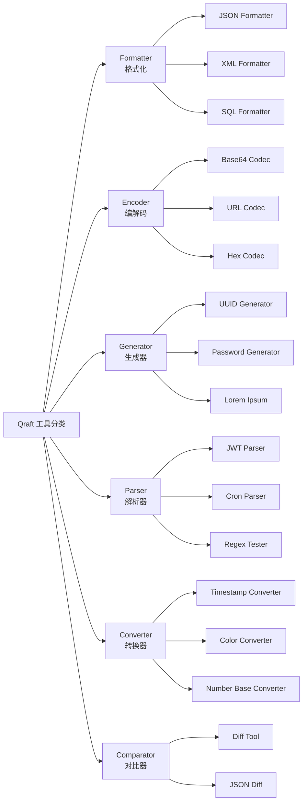
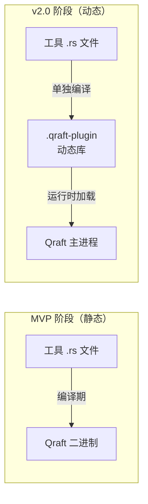
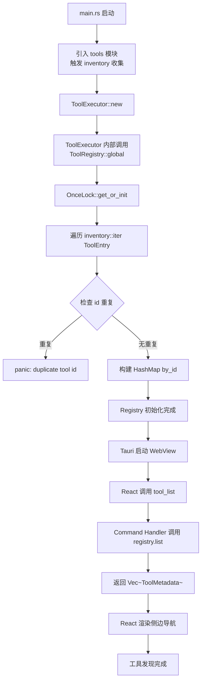

## 目录

- [1. 背景与目的](#1-背景与目的)
- [2. 核心概念](#2-核心概念)
- [3. 详细设计](#3-详细设计)
  - [3.1 工具注册机制](#31-工具注册机制)
  - [3.2 元数据描述规范](#32-元数据描述规范)
  - [3.3 分类体系](#33-分类体系)
  - [3.4 生命周期管理](#34-生命周期管理)
  - [3.5 工具间依赖](#35-工具间依赖)
  - [3.6 热加载策略](#36-热加载策略)
- [4. 关键流程](#4-关键流程)
  - [4.1 工具生命周期状态机](#41-工具生命周期状态机)
  - [4.2 工具发现与加载流程](#42-工具发现与加载流程)
- [5. 设计决策记录](#5-设计决策记录)
  - [5.1 静态注册 vs 动态加载](#51-静态注册-vs-动态加载)
  - [5.2 分类体系设计](#52-分类体系设计)
  - [5.3 工具间依赖表达](#53-工具间依赖表达)
- [6. 注意事项与约束](#6-注意事项与约束)
- [7. 相关文档](#7-相关文档)

---

## 1. 背景与目的

Qraft 计划内置 30+ 开发工具，未来还要支持社区贡献工具包。如果每个工具的注册、发现、调用方式都不统一，会引发三类问题：

1. **新增工具成本高**：每加一个工具都要改 Core 引擎代码
2. **工具间行为不一致**：错误处理、超时、取消等行为靠各自自觉
3. **无法扩展**：v2.0 想引入动态插件时会发现架构不支持

本文档定义 Qraft 的工具插件体系，目标是：

1. **统一注册**：所有工具通过同一套机制注册，新增工具零修改 Core
2. **统一发现**：UI 通过 `tool_list` 命令一次性获取所有工具元数据
3. **统一生命周期**：注册 → 发现 → 实例化 → 执行 → 销毁，每步行为明确
4. **未来可扩展**：MVP 静态注册，v2.0 可演进到动态加载

阅读本文档前，请先阅读 [05-rust-core-engine.md](./05-rust-core-engine.md) 理解 `Tool` trait 与 `ToolRegistry` 的实现。

---

## 2. 核心概念

| 概念 | 定义 |
|------|------|
| Tool Registration | 工具在编译期通过 `inventory` 提交到全局注册表的过程 |
| Tool Discovery | UI 启动时通过 `tool_list` 命令拉取所有已注册工具的元数据 |
| Tool Lifecycle | 工具从注册到销毁的完整生命周期 |
| Tool Category | 工具的分类标签（Formatter / Encoder / Generator / Parser / Converter / Comparator） |
| Tool Dependency | 工具间的依赖关系（如 JWT 解析依赖 Base64 解码） |
| Tool Hot Reload | 工具在不重启应用的情况下加载/卸载（v2.0 特性） |

---

## 3. 详细设计

### 3.1 工具注册机制

Qraft 的工具注册采用**编译期静态注册**，基于 `inventory` crate 实现。详细机制见 [05-rust-core-engine.md](./05-rust-core-engine.md#34-工具注册与发现)。

注册流程的关键点：

1. **每个工具是一个 Rust 类型**，实现 `Tool` trait
2. **工具元数据是 `&'static`**，编译期常量化
3. **`register_tool!` 宏**自动提交到 `inventory`
4. **`ToolRegistry::global()`** 启动时一次性收集所有注册项
5. **重复 id 检测**：启动时如果发现重复 id，直接 panic（fail-fast）

### 3.2 元数据描述规范

`ToolMetadata` 是工具的"身份证"，UI 根据它动态渲染工具面板。完整字段定义见 [05-rust-core-engine.md](./05-rust-core-engine.md#tool-metadata-定义)。

#### 字段规范

| 字段 | 类型 | 必填 | 说明 | 示例 |
|------|------|------|------|------|
| `id` | `&'static str` | 是 | snake_case，全局唯一 | `json_formatter` |
| `name` | `&'static str` | 是 | 英文显示名 | `JSON Formatter` |
| `category` | `ToolCategory` | 是 | 六大分类之一 | `Formatter` |
| `icon` | `&'static str` | 是 | Lucide 图标名 | `braces` |
| `description` | `&'static str` | 是 | 一句话描述 | `Format and validate JSON` |
| `input_schema` | `&'static Value` | 是 | JSON Schema 描述输入 | 见下文 |
| `output_schema` | `Option<&'static Value>` | 否 | JSON Schema 描述输出 | `None` |
| `tags` | `&'static [&'static str]` | 是 | 搜索标签 | `["json", "format"]` |
| `version` | `&'static str` | 是 | 工具版本（SemVer） | `1.0.0` |
| `timeout_secs` | `Option<u32>` | 否 | 执行超时秒数 | `Some(10)` |
| `streaming_supported` | `bool` | 是 | 是否支持流式处理 | `true` |

#### input_schema 规范

`input_schema` 是 JSON Schema 格式，UI 根据它动态生成表单：

```json
{
  "type": "object",
  "properties": {
    "text": {
      "type": "string",
      "description": "JSON text to format",
      "format": "textarea",
      "default": ""
    },
    "params": {
      "type": "object",
      "properties": {
        "indent": {
          "type": "integer",
          "default": 2,
          "minimum": 0,
          "maximum": 8,
          "description": "Indentation spaces"
        },
        "sort_keys": {
          "type": "boolean",
          "default": false,
          "description": "Sort object keys alphabetically"
        }
      },
      "additionalProperties": false
    }
  },
  "required": ["text"]
}
```

UI 渲染规则：

- `type: string` + `format: textarea` → 多行输入框
- `type: string` + `format: text` → 单行输入框
- `type: integer` + `minimum/maximum` → 数字输入框 with 滑块
- `type: boolean` → 开关
- `type: string` + `enum` → 下拉选择
- `required` 字段标记必填

### 3.3 分类体系

Qraft 定义六大工具分类，每个工具必须归属其中之一：



#### 分类定义

| 分类 | 中文名 | 职责 | 典型工具 |
|------|--------|------|----------|
| Formatter | 格式化 | 将输入文本按语法规则重新排版 | JSON / XML / SQL / HTML Formatter |
| Encoder | 编解码 | 在两种数据表示间转换（无信息损失） | Base64 / URL / Hex Codec |
| Generator | 生成器 | 根据参数生成新数据 | UUID / Password / Lorem Ipsum |
| Parser | 解析器 | 解析结构化数据并展示其组成 | JWT / Cron / Regex / Certificate |
| Converter | 转换器 | 在两种语义等价表示间转换 | Timestamp / Color / Number Base |
| Comparator | 对比器 | 比较两份输入的差异 | Diff / JSON Diff |

#### 分类选择原则

- **有损 vs 无损**：Formatter 重新排版但不改变语义；Encoder 完全无损可逆
- **输入 vs 生成**：Parser 输入是结构化数据；Generator 输入只是参数
- **一对一 vs 一对二**：Converter 单输入转单输出；Comparator 双输入产差异

> 💡 **建议方案**
>
> 若工具难以归类，优先按"主要行为"归类，并通过 tags 补充描述。如 JWT Parser 既解析又展示 Base64 内容，但主要行为是"解析"，归 Parser。

### 3.4 生命周期管理

工具的生命周期分为五个阶段：

```mermaid
stateDiagram-v2
    [*] --> Registered: 编译期 inventory::submit
    Registered --> Discovered: 应用启动<br/>ToolRegistry::global()
    Discovered --> Instantiated: 首次调用<br/>工具实例已 Box 在 ToolEntry
    Instantiated --> Executing: tool_execute 调用
    Executing --> Instantiated: 执行完成
    Executing --> Cancelled: 用户取消
    Cancelled --> Instantiated: 清理状态
    Instantiated --> [*]: 应用退出
```

#### 各阶段说明

| 阶段 | 触发时机 | 内部状态 |
|------|----------|----------|
| Registered | 编译期 | `ToolEntry` 通过 `inventory::submit!` 提交到全局链表 |
| Discovered | 应用启动 | `ToolRegistry::global()` 一次性收集所有 `ToolEntry` 到 `HashMap` |
| Instantiated | 注册时即实例化 | `ToolEntry.tool: Box<dyn Tool>` 已构造，常驻内存 |
| Executing | `tool_execute` 调用 | 工具的 `execute` 方法被 Executor 调用 |
| Cancelled | 用户点击取消 | `cancel_token.cancel()`，工具应感知并返回 `ToolError::Cancelled` |
| 销毁 | 应用退出 | 进程退出，所有工具自动销毁 |

> 📌 **项目实际**
>
> MVP 阶段工具实例是**饿汉式**：注册时即构造，常驻内存。因为工具实例本身是无状态的（仅 `&self`），内存占用可忽略。v2.0 若工具数量超过 100，可考虑懒加载。

#### 无状态约束

工具实例必须是**无状态**的：

- `Tool` trait 的 `execute` 接收 `&self`，不允许 `&mut self`
- 工具不能有可变字段（除非用 `Mutex` 保护，且不跨调用持久化）
- 跨调用需要的状态必须通过 `ToolContext` 传递

这一约束保证：

1. 工具线程安全（`Send + Sync`）
2. 多次调用相互独立
3. 单元测试无需 mock 上下文

### 3.5 工具间依赖

某些工具的功能依赖其他工具的能力，例如：

- JWT Parser 依赖 Base64 解码（解析 JWT 三段式 header.payload.signature）
- JSON Diff 依赖 JSON Formatter（先格式化再 diff）

#### 依赖表达方式

Qraft 不引入运行时依赖注入，工具间依赖通过**直接调用工具函数**实现：

```rust
// src-tauri/src/tools/jwt_parser.rs

use crate::tools::base64_codec::Base64Codec;

async fn parse_segment(segment: &str) -> Result<serde_json::Value, ToolError> {
    // 直接调用 Base64 解码逻辑（不是 Tool::execute，而是内部函数）
    let decoded = Base64Codec::decode(segment)
        .map_err(|e| ToolError::ParseFailed(format!("base64 decode failed: {}", e)))?;
    serde_json::from_slice(&decoded)
        .map_err(|e| ToolError::ParseFailed(format!("json parse failed: {}", e)))
}
```

#### 依赖规则

| 规则 | 说明 |
|------|------|
| 工具 A 依赖工具 B | A 直接调用 B 的内部函数（非 `Tool::execute`） |
| B 的内部函数必须是 `pub` | 暴露给其他工具调用 |
| 禁止循环依赖 | A → B → A 不允许 |
| 禁止运行时依赖注入 | 不通过 Registry 查找，编译期就知道依赖 |

#### 依赖图维护

CI 中通过测试检测循环依赖：

```rust
#[test]
fn test_no_circular_dependency() {
    // 通过分析 mod 树与 use 语句构建依赖图
    // 检测是否存在环
    // [待补充: 需要实现依赖分析脚本]
}
```

### 3.6 热加载策略

> 📌 **项目实际**
>
> **MVP 阶段不支持热加载**：所有工具静态编译进二进制，新增工具必须重新编译发布。
>
> **v2.0 规划**：探索基于 `libloading` 的动态库加载机制，详见 [19-roadmap.md](./19-roadmap.md)。

#### v2.0 动态加载设计草案



#### 动态加载的技术挑战

| 挑战 | 难点 | 拟议方案 |
|------|------|----------|
| ABI 兼容 | Rust 无稳定 ABI | 限制插件用 C ABI + 自定义协议 |
| 安全性 | 任意代码执行风险 | 插件签名验证、沙箱进程 |
| 版本兼容 | 主程序升级后插件失效 | SemVer 兼容性检查 + SDK 版本协商 |
| 跨平台 | .dll/.so/.dylib 差异 | `libloading` 抽象 + 三平台 CI 构建 |
| 工具发现 | 动态注册到 Registry | 扩展 Registry 支持运行时注册 |

#### 插件包格式（v2.0 草案）

```
my-plugin.qraft-plugin (实际是 zip)
├── manifest.toml          # 插件清单（id/version/author/permissions）
├── lib/
│   ├── windows/my_plugin.dll
│   ├── macos/my_plugin.dylib
│   └── linux/my_plugin.so
├── ui/                    # 插件 UI 资源（可选）
│   └── MyToolPanel.tsx
└── README.md
```

---

## 4. 关键流程

### 4.1 工具生命周期状态机

```mermaid
stateDiagram-v2
    [*] --> Compiled: cargo build
    Compiled --> Registered: inventory::submit!
    Registered --> Discovered: ToolRegistry::global()
    Discovered --> Listed: tool_list 命令
    Listed --> Invoked: tool_execute 命令
    Invoked --> Executing: Executor.execute
    Executing --> Listed: 成功返回
    Executing --> Listed: 错误返回
    Executing --> Listed: 超时
    Executing --> Listed: 用户取消
    Executing --> Listed: panic 隔离
    Listed --> Invoked: 重复调用
    Listed --> [*]: 应用退出
```

### 4.2 工具发现与加载流程

应用启动时，工具发现流程：



---

## 5. 设计决策记录

### 5.1 静态注册 vs 动态加载

| 方案 | MVP 适用 | v2.0 适用 | 实现复杂度 | 用户体验 |
|------|----------|-----------|------------|----------|
| **静态注册**（MVP 选定） | 优 | 差 | 低 | 需重新下载 |
| **动态加载**（v2.0 选定） | 差 | 优 | 高 | 装插件即用 |
| 混合（静态内置 + 动态扩展） | 中 | 优 | 中 | 兼顾 |

**决策理由**：

- MVP 阶段工具数量少（10-30），静态编译足够
- 动态加载需要解决 ABI、安全、跨平台三大难题，MVP 不值得投入
- v2.0 引入动态加载时，静态注册机制保留（内置工具仍静态编译）

### 5.2 分类体系设计

| 方案 | 分类数 | 优点 | 缺点 |
|------|--------|------|------|
| **六大分类**（选定） | 6 | 平衡，每类 5-8 工具 | 部分工具归类模糊 |
| 四大分类 | 4 | 简单 | 每类工具过多，难导航 |
| 十大分类 | 10 | 精细 | 工具分布不均，部分类只有 1-2 工具 |
| Tag-only（无分类） | 0 | 灵活 | 缺乏视觉层次，难浏览 |

**决策理由**：六大分类让每类有 5-8 个工具，侧边导航既不臃肿也不空旷。配合 tags 提供多维度过滤。

### 5.3 工具间依赖表达

| 方案 | 机制 | 优点 | 缺点 |
|------|------|------|------|
| **直接调用内部函数**（选定） | A 调 B 的 pub fn | 编译期检查、零开销 | 紧耦合 |
| 通过 Registry 查找 | A 调 `registry.get("b").execute()` | 松耦合 | 运行时才发现依赖缺失 |
| 依赖注入容器 | 启动时注入依赖 | 灵活 | 过度设计 |

**决策理由**：工具间依赖是编译期已知的，直接调用让编译器帮助检查依赖完整性。Registry 查找适合动态加载场景（v2.0）。

---

## 6. 注意事项与约束

### 6.1 工具开发规范

> 📌 **项目实际**
>
> 新增工具必须遵守：
>
> 1. **文件命名**：Rust 文件 snake_case，React 组件 PascalCase
> 2. **id 唯一**：与 Rust 文件名一致，全局唯一
> 3. **分类正确**：从六大分类中选择最贴切的
> 4. **元数据完整**：所有必填字段必须填写
> 5. **input_schema 准确**：UI 根据 schema 渲染表单，schema 错误会导致 UI 异常
> 6. **无状态**：工具实例不可有可变字段
> 7. **无 Tauri 依赖**：仅依赖 Core 模块
> 8. **测试覆盖**：至少 5 个单元测试

### 6.2 元数据国际化

MVP 阶段 `name` 与 `description` 仅提供英文，v1.0 评估引入 i18n：

```rust
// v1.0 草案
pub struct ToolMetadata {
    pub id: &'static str,
    pub name_i18n_key: &'static str,  // "tool.json_formatter.name"
    pub description_i18n_key: &'static str,
    // ...
}
```

### 6.3 工具版本管理

工具版本（`ToolMetadata.version`）遵循 SemVer：

- **PATCH**：bug 修复，行为不变
- **MINOR**：新增参数或输出字段，向后兼容
- **MAJOR**：参数或输出格式变更，破坏性

工具版本与 Qraft 主版本独立演进。CI 检测工具版本变更并更新 CHANGELOG。

### 6.4 [待补充: 工具卸载与禁用机制]

当前架构假设所有注册的工具始终可用。若需要"禁用某个工具"（用户偏好或性能考虑），需要：

- 在 ConfigStore 增加 `disabled_tools: Vec<tool_id>`
- `tool_list` 命令过滤已禁用工具
- 已禁用工具的 `tool_execute` 直接返回 `ToolError::Disabled`

具体实现优先级低，待用户反馈后处理。

---

## 7. 相关文档

- [02-glossary.md](./02-glossary.md) — 术语表（Tool / Plugin / Tool Category 等定义）
- [05-rust-core-engine.md](./05-rust-core-engine.md) — Rust 核心引擎（Tool trait 与 Registry 的实现）
- [07-tool-catalog.md](./07-tool-catalog.md) — 工具目录（所有计划工具的完整清单）
- [08-data-model.md](./08-data-model.md) — 数据模型（ToolMetadata 的数据结构）
- [09-interface-design.md](./09-interface-design.md) — 接口设计（tool_list / tool_execute 命令）
- [15-ui-design-system.md](./15-ui-design-system.md) — UI 设计体系（根据 input_schema 渲染表单）
- [17-dev-workflow.md](./17-dev-workflow.md) — 开发规范（新增工具 Checklist）
- [19-roadmap.md](./19-roadmap.md) — 路线图（v2.0 动态加载规划）
