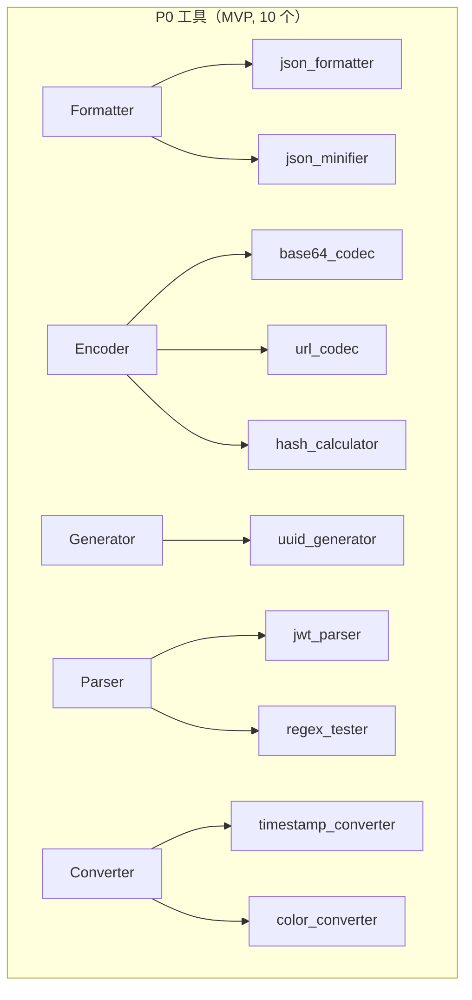
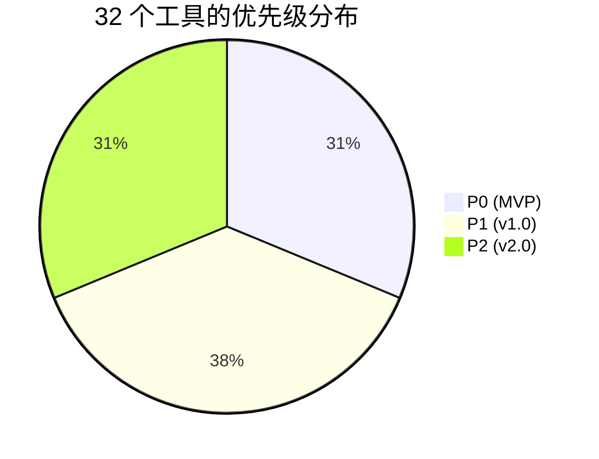

## 目录

- [1. 背景与目的](#1-背景与目的)
- [2. 核心概念](#2-核心概念)
- [3. 详细设计](#3-详细设计)
  - [3.1 工具清单总表](#31-工具清单总表)
  - [3.2 优先级划分](#32-优先级划分)
  - [3.3 MVP 范围](#33-mvp-范围)
  - [3.4 工具规格详解](#34-工具规格详解)
- [4. 关键流程](#4-关键流程)
  - [4.1 工具分类矩阵](#41-工具分类矩阵)
  - [4.2 优先级分布图](#42-优先级分布图)
- [5. 设计决策记录](#5-设计决策记录)
  - [5.1 P0 工具的选择标准](#51-p0-工具的选择标准)
  - [5.2 工具粒度划分](#52-工具粒度划分)
- [6. 注意事项与约束](#6-注意事项与约束)
- [7. 相关文档](#7-相关文档)

---

## 1. 背景与目的

Qraft 计划内置 30+ 开发工具，但一次性全部实现不现实。本文档的目标是：

1. **列清单**：明确所有计划工具的 ID、名称、分类、输入输出
2. **定优先级**：将工具划分为 P0（MVP）/ P1（v1.0）/ P2（v2.0）三档
3. **划范围**：MVP 阶段只交付 P0 工具，确保快速验证核心架构
4. **留扩展**：P1/P2 工具预留接口，后续按规划迭代

本文档是工具开发任务的来源，每个工具的详细规格将作为单独的开发任务跟踪。

---

## 2. 核心概念

| 概念 | 定义 |
|------|------|
| P0 | MVP 必须交付的工具，验证核心架构 |
| P1 | v1.0 交付的工具，覆盖大部分日常需求 |
| P2 | v2.0 交付的工具，扩展性与高级功能 |
| Tool Spec | 工具规格（id、input、output、params） |
| MVP | 最小可行版本，10 个 P0 工具 + 核心架构 |

---

## 3. 详细设计

### 3.1 工具清单总表

#### P0 工具（MVP，10 个）

| ID | 名称 | 分类 | 输入 | 输出 | 备注 |
|----|------|------|------|------|------|
| `json_formatter` | JSON Formatter | Formatter | JSON 文本 + indent | 格式化 JSON | 支持流式 |
| `json_minifier` | JSON Minifier | Formatter | JSON 文本 | 压缩 JSON | |
| `base64_codec` | Base64 Codec | Encoder | 文本 + action(encode/decode) + url_safe | 编解码文本 | |
| `url_codec` | URL Encoder/Decoder | Encoder | 文本 + action | 编解码文本 | |
| `jwt_parser` | JWT Parser | Parser | JWT 字符串 | header/payload/signature | 含 Base64 解码 |
| `uuid_generator` | UUID Generator | Generator | version(v4/v7) + count + uppercase | UUID 列表 | |
| `hash_calculator` | Hash Calculator | Encoder | text/file_path + algorithm(md5/sha1/sha256/sha512/blake3) | hash hex | 支持流式 |
| `timestamp_converter` | Timestamp Converter | Converter | Unix 时间戳或日期字符串 + timezone | 双向转换结果 | |
| `color_converter` | Color Converter | Converter | 颜色值 + from_format(hex/rgb/hsl) | 三格式输出 | |
| `regex_tester` | Regex Tester | Parser | pattern + flags + test_text | 匹配结果列表 | |

#### P1 工具（v1.0，12 个）

| ID | 名称 | 分类 | 输入 | 输出 | 备注 |
|----|------|------|------|------|------|
| `hmac_generator` | HMAC Generator | Encoder | message + key + algorithm | HMAC hex | |
| `diff_tool` | Diff Tool | Comparator | text_a + text_b + diff_type(unified/side-by-side) | diff 文本 | |
| `json_diff` | JSON Diff | Comparator | json_a + json_b | 差异结构 | |
| `cron_parser` | Cron Parser | Parser | cron 表达式 | 下次执行时间列表 | |
| `hash_text` | Hash Text | Encoder | text + algorithm | hash hex | 简化版 Hash，仅文本 |
| `hex_codec` | Hex Codec | Encoder | text + action | 编解码文本 | |
| `html_encoder` | HTML Entity Encoder | Encoder | text + action | 编解码文本 | |
| `number_base_converter` | Number Base Converter | Converter | number + from_base + to_base | 转换结果 | 支持 2/8/10/16/36 |
| `lorem_ipsum_generator` | Lorem Ipsum Generator | Generator | count + unit(paragraphs/sentences/words) | Lorem Ipsum 文本 | |
| `password_generator` | Password Generator | Generator | length + charset options | 密码 | |
| `case_converter` | Case Converter | Converter | text + target_case(camel/snake/kebab/pascal/constant) | 转换后文本 | |
| `xml_formatter` | XML Formatter | Formatter | XML 文本 + indent | 格式化 XML | |

#### P2 工具（v2.0，10+ 个）

| ID | 名称 | 分类 | 输入 | 输出 | 备注 |
|----|------|------|------|------|------|
| `qr_code_generator` | QR Code Generator | Generator | text + size + error_correction | PNG base64 | |
| `sql_formatter` | SQL Formatter | Formatter | SQL 文本 + dialect | 格式化 SQL | |
| `markdown_preview` | Markdown Preview | Converter | Markdown 文本 | HTML 预览 | |
| `certificate_parser` | Certificate Parser | Parser | PEM/DER 证书 | 证书字段 | |
| `public_key_parser` | Public Key Parser | Parser | PEM 公钥 | 公钥字段 | |
| `nanoid_generator` | NanoID Generator | Generator | length + alphabet | NanoID | |
| `byte_converter` | Byte Converter | Converter | bytes + from_unit + to_unit | 转换结果 | KB/MB/GB |
| `text_diff_inspector` | Text Diff Inspector | Comparator | text_a + text_b | 字符级 diff | |
| `image_metadata` | Image Metadata | Parser | image file | EXIF/尺寸/格式 | |
| `json_path_tester` | JSONPath Tester | Parser | json + path expression | 匹配结果 |
| `yaml_formatter` | YAML Formatter | Formatter | YAML 文本 | 格式化 YAML |
| `toml_formatter` | TOML Formatter | Formatter | TOML 文本 | 格式化 TOML |

### 3.2 优先级划分

#### P0 选择标准

P0 工具需同时满足：

1. **高频**：开发者几乎每天都会用
2. **覆盖架构**：能验证关键架构特性（流式、文件、依赖、双向转换）
3. **简单**：实现复杂度低，MVP 阶段可快速交付

10 个 P0 工具覆盖了所有六大分类与所有架构特性：

| 工具 | 验证的架构特性 |
|------|----------------|
| `json_formatter` | 流式处理、大输入 |
| `json_minifier` | 反向操作（格式化的逆） |
| `base64_codec` | 双向编解码、参数化 action |
| `url_codec` | 双向编解码 |
| `jwt_parser` | 工具间依赖（Base64） |
| `uuid_generator` | 批量生成、参数化 |
| `hash_calculator` | 文件输入、流式、多算法 |
| `timestamp_converter` | 双向转换、时区 |
| `color_converter` | 多格式互转 |
| `regex_tester` | 多匹配结果、flags 参数 |

### 3.3 MVP 范围

MVP（v0.1）交付内容：

- **10 个 P0 工具**：上表所列
- **核心架构**：三层架构、Tool trait、Registry、Executor
- **基础 UI**：侧边导航、命令面板、工具面板、设置面板
- **持久化**：配置存储、历史记录
- **三平台打包**：Windows / macOS / Linux 安装包
- **自动更新**：Tauri Updater 集成

MVP **不包含**：

- 收藏夹分组
- Workspace 命名保存
- 工具 Preset
- 流式进度 UI（仅后端支持，UI 简化）
- 国际化（仅英文）
- 主题切换（仅暗色）

### 3.4 工具规格详解

下面给出 P0 工具的详细规格，P1/P2 工具规格在对应版本开发时补充。

#### json_formatter

```json
{
  "id": "json_formatter",
  "name": "JSON Formatter",
  "category": "formatter",
  "input_schema": {
    "type": "object",
    "properties": {
      "text": { "type": "string", "format": "textarea" },
      "params": {
        "type": "object",
        "properties": {
          "indent": { "type": "integer", "default": 2, "minimum": 0, "maximum": 8 },
          "sort_keys": { "type": "boolean", "default": false }
        }
      }
    },
    "required": ["text"]
  },
  "output": {
    "text": "formatted JSON string",
    "meta": { "input_bytes": 1024, "output_bytes": 2048, "duration_ms": 5 }
  },
  "errors": ["ERR_INVALID_INPUT", "ERR_PARSE_FAILED", "ERR_INPUT_TOO_LARGE"],
  "streaming": true,
  "timeout_secs": 10
}
```

#### base64_codec

```json
{
  "id": "base64_codec",
  "name": "Base64 Codec",
  "category": "encoder",
  "input_schema": {
    "type": "object",
    "properties": {
      "text": { "type": "string", "format": "textarea" },
      "params": {
        "type": "object",
        "properties": {
          "action": { "type": "string", "enum": ["encode", "decode"], "default": "encode" },
          "url_safe": { "type": "boolean", "default": false }
        },
        "required": ["action"]
      }
    },
    "required": ["text", "params"]
  },
  "errors": ["ERR_INVALID_INPUT", "ERR_PARSE_FAILED"]
}
```

#### jwt_parser

```json
{
  "id": "jwt_parser",
  "name": "JWT Parser",
  "category": "parser",
  "input_schema": {
    "type": "object",
    "properties": {
      "text": { "type": "string", "format": "textarea", "description": "JWT token" }
    },
    "required": ["text"]
  },
  "output": {
    "text": "formatted JSON of header + payload",
    "extra": {
      "header": { "alg": "HS256", "typ": "JWT" },
      "payload": { "sub": "1234567890", "name": "John Doe", "iat": 1516239022 },
      "signature": "...",
      "expires_at": "2018-01-18T18:17:38Z"
    }
  },
  "errors": ["ERR_INVALID_INPUT", "ERR_PARSE_FAILED"],
  "dependencies": ["base64_codec"]
}
```

#### uuid_generator

```json
{
  "id": "uuid_generator",
  "name": "UUID Generator",
  "category": "generator",
  "input_schema": {
    "type": "object",
    "properties": {
      "params": {
        "type": "object",
        "properties": {
          "version": { "type": "string", "enum": ["v4", "v7"], "default": "v4" },
          "count": { "type": "integer", "default": 1, "minimum": 1, "maximum": 1000 },
          "uppercase": { "type": "boolean", "default": false },
          "hyphens": { "type": "boolean", "default": true }
        }
      }
    }
  },
  "output": {
    "text": "one UUID per line"
  }
}
```

#### hash_calculator

```json
{
  "id": "hash_calculator",
  "name": "Hash Calculator",
  "category": "encoder",
  "input_schema": {
    "type": "object",
    "properties": {
      "text": { "type": "string", "format": "textarea" },
      "file_path": { "type": "string", "format": "file" },
      "params": {
        "type": "object",
        "properties": {
          "algorithm": {
            "type": "string",
            "enum": ["md5", "sha1", "sha256", "sha512", "blake3"],
            "default": "sha256"
          }
        },
        "required": ["algorithm"]
      }
    },
    "oneOf": [
      { "required": ["text"] },
      { "required": ["file_path"] }
    ]
  },
  "output": {
    "text": "hash hex string"
  },
  "streaming": true,
  "timeout_secs": 60
}
```

#### timestamp_converter

```json
{
  "id": "timestamp_converter",
  "name": "Timestamp Converter",
  "category": "converter",
  "input_schema": {
    "type": "object",
    "properties": {
      "text": { "type": "string", "description": "Unix timestamp or date string" },
      "params": {
        "type": "object",
        "properties": {
          "timezone": { "type": "string", "default": "UTC", "description": "IANA timezone" },
          "format": { "type": "string", "default": "ISO 8601" }
        }
      }
    },
    "required": ["text"]
  },
  "output": {
    "text": "converted time in multiple formats",
    "extra": {
      "unix_seconds": 1690272000,
      "unix_millis": 1690272000000,
      "iso8601": "2023-07-25T08:00:00Z",
      "local": "2023-07-25 16:00:00 +08:00",
      "relative": "2 days ago"
    }
  }
}
```

#### color_converter

```json
{
  "id": "color_converter",
  "name": "Color Converter",
  "category": "converter",
  "input_schema": {
    "type": "object",
    "properties": {
      "text": { "type": "string", "description": "color value" },
      "params": {
        "type": "object",
        "properties": {
          "from_format": {
            "type": "string",
            "enum": ["hex", "rgb", "hsl"],
            "default": "hex"
          }
        }
      }
    },
    "required": ["text"]
  },
  "output": {
    "text": "all formats",
    "extra": {
      "hex": "#ff5733",
      "rgb": "rgb(255, 87, 51)",
      "hsl": "hsl(11, 100%, 60%)"
    }
  }
}
```

#### regex_tester

```json
{
  "id": "regex_tester",
  "name": "Regex Tester",
  "category": "parser",
  "input_schema": {
    "type": "object",
    "properties": {
      "text": { "type": "string", "format": "textarea", "description": "test text" },
      "params": {
        "type": "object",
        "properties": {
          "pattern": { "type": "string", "description": "regex pattern" },
          "flags": { "type": "string", "default": "", "description": "gim flags" }
        },
        "required": ["pattern"]
      }
    },
    "required": ["text", "params"]
  },
  "output": {
    "text": "match summary",
    "extra": {
      "matches": [
        { "match": "foo", "index": 0, "groups": [] },
        { "match": "bar", "index": 5, "groups": ["bar"] }
      ],
      "match_count": 2
    }
  }
}
```

#### url_codec

```json
{
  "id": "url_codec",
  "name": "URL Encoder/Decoder",
  "category": "encoder",
  "input_schema": {
    "type": "object",
    "properties": {
      "text": { "type": "string", "format": "textarea" },
      "params": {
        "type": "object",
        "properties": {
          "action": { "type": "string", "enum": ["encode", "decode"], "default": "encode" },
          "component": { "type": "boolean", "default": false, "description": "use encodeURIComponent vs encodeURI" }
        },
        "required": ["action"]
      }
    },
    "required": ["text", "params"]
  }
}
```

#### json_minifier

```json
{
  "id": "json_minifier",
  "name": "JSON Minifier",
  "category": "formatter",
  "input_schema": {
    "type": "object",
    "properties": {
      "text": { "type": "string", "format": "textarea" }
    },
    "required": ["text"]
  },
  "output": {
    "text": "minified JSON"
  }
}
```

---

## 4. 关键流程

### 4.1 工具分类矩阵



### 4.2 优先级分布图



按分类分布：

| 分类 | P0 | P1 | P2 | 合计 |
|------|----|----|----|----|
| Formatter | 2 | 2 | 3 | 7 |
| Encoder | 3 | 4 | 0 | 7 |
| Generator | 1 | 3 | 2 | 6 |
| Parser | 2 | 1 | 4 | 7 |
| Converter | 2 | 2 | 2 | 6 |
| Comparator | 0 | 2 | 1 | 3 |
| **合计** | **10** | **12** | **10** | **32** |

> 📌 **项目实际**
>
> Comparator 在 MVP 阶段为 0，因为 Diff 工具实现复杂度高（算法选择、UI 渲染），推迟到 v1.0。MVP 用户若需 diff 可暂时用外部工具。

---

## 5. 设计决策记录

### 5.1 P0 工具的选择标准

| 方案 | 选择标准 | 优点 | 缺点 |
|------|----------|------|------|
| **架构覆盖优先**（选定） | 优先覆盖流式、文件、依赖等架构特性 | MVP 即验证核心架构 | 工具可能非最高频 |
| 频率优先 | 选最常用工具 | 用户价值最大 | 可能遗漏架构验证 |
| 简单优先 | 选最易实现的 | 快速交付 | 架构特性可能未验证 |

**决策理由**：MVP 的核心目标是验证架构而非追求用户量。架构特性未验证会导致 v1.0 重构。所以选择"架构覆盖优先"，同时确保 P0 工具也都是高频工具（如 JSON 格式化、Base64）。

### 5.2 工具粒度划分

| 工具 | 粒度决策 | 备选方案 |
|------|----------|----------|
| `json_formatter` vs `json_minifier` | 拆为两个 | 合并为 `json_codec` 含 format/minify 参数 |
| `base64_codec` | encode/decode 合一 | 拆为 `base64_encode` + `base64_decode` |
| `hash_calculator` | 多算法合一 | 拆为 `md5` / `sha256` 等多个 |

**决策理由**：

- **同语义双向操作合并**（如 encode/decode）：减少工具数量，UI 用参数切换
- **不同语义操作拆分**（如 format/minify）：用户意图明确，UI 不需要选择
- **同语义多算法合并**（如 hash 的 md5/sha256）：UI 用下拉选择，避免工具爆炸

> 💡 **建议方案**
>
> 判断粒度的原则："用户在使用时是否会犹豫选哪个？" 如果是，拆分；如果不会，合并。

---

## 6. 注意事项与约束

### 6.1 工具规格稳定性

> 📌 **项目实际**
>
> 工具的 `id` 一旦发布就不可变更（影响历史记录、配置、用户习惯）。其他字段（如 input_schema）可在 major 版本内演进，但需：
>
> 1. 向后兼容（新增字段 optional，不删除字段）
> 2. 升级 `ToolMetadata.version` 的 minor
> 3. 在 CHANGELOG 标注变更

### 6.2 工具数量上限

Qraft 计划在 v2.0 达到 32 个工具。若超过 50 个，需要：

- 引入工具分组（按使用频率/分类二级导航）
- 命令面板支持模糊搜索增强
- 评估 UI 性能（虚拟列表）

### 6.3 [待补充: 工具使用统计]

MVP 阶段不做工具使用统计（隐私优先）。v1.0 评估引入"本地统计"（数据不出本机），用于：

- 工具排序按使用频率
- 推荐相关工具
- 识别低频工具考虑下线

### 6.4 [待补充: 工具 i18n 名称]

P0/P1 工具 `name` 与 `description` 仅英文。若 v1.0 引入 i18n，所有工具需补充中文名称。

---

## 7. 相关文档

- [02-glossary.md](./02-glossary.md) — 术语表（Tool Category / P0/P1/P2 等定义）
- [05-rust-core-engine.md](./05-rust-core-engine.md) — Rust 核心引擎（Tool trait 与 metadata 结构）
- [06-tool-plugin-system.md](./06-tool-plugin-system.md) — 工具插件体系（注册机制与分类）
- [08-data-model.md](./08-data-model.md) — 数据模型（ToolInput / ToolOutput 数据结构）
- [09-interface-design.md](./09-interface-design.md) — 接口设计（tool_execute 命令规格）
- [15-ui-design-system.md](./15-ui-design-system.md) — UI 设计体系（根据 input_schema 渲染表单）
- [19-roadmap.md](./19-roadmap.md) — 路线图（P1/P2 工具的时间线）
