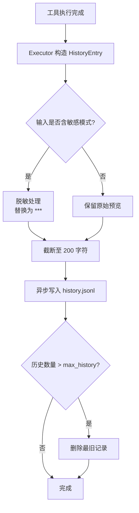
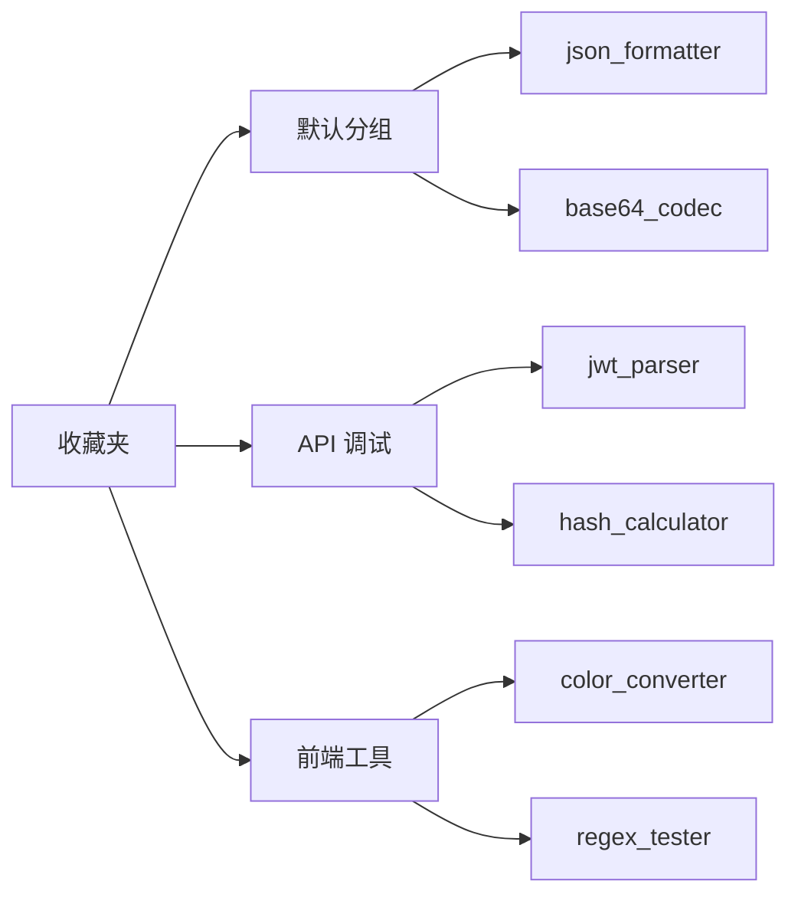
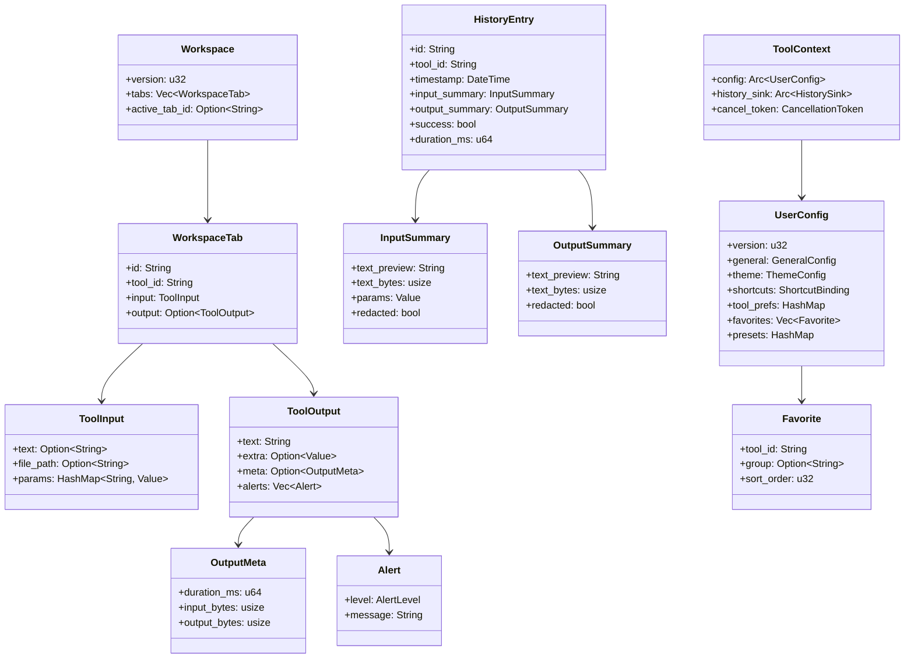
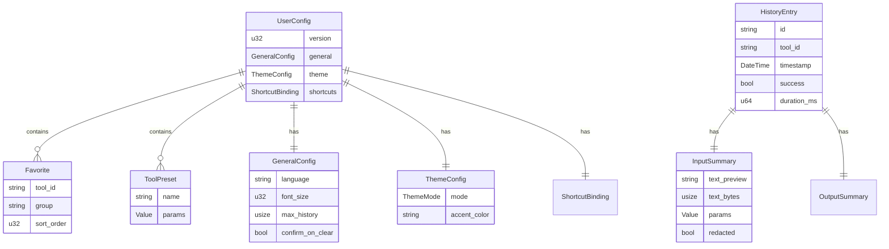

## 目录

- [1. 背景与目的](#1-背景与目的)
- [2. 核心概念](#2-核心概念)
- [3. 详细设计](#3-详细设计)
  - [3.1 工具输入输出数据流模型](#31-工具输入输出数据流模型)
  - [3.2 用户配置存储结构](#32-用户配置存储结构)
  - [3.3 历史记录模型](#33-历史记录模型)
  - [3.4 收藏夹模型](#34-收藏夹模型)
  - [3.5 Workspace 与 Session 模型](#35-workspace-与-session-模型)
- [4. 关键流程](#4-关键流程)
  - [4.1 核心数据模型类图](#41-核心数据模型类图)
  - [4.2 配置存储 ER 图](#42-配置存储-er-图)
- [5. 设计决策记录](#5-设计决策记录)
  - [5.1 序列化格式选择](#51-序列化格式选择)
  - [5.2 历史记录脱敏策略](#52-历史记录脱敏策略)
  - [5.3 大输入存储策略](#53-大输入存储策略)
- [6. 注意事项与约束](#6-注意事项与约束)
- [7. 相关文档](#7-相关文档)

---

## 1. 背景与目的

Qraft 在运行时涉及大量数据结构：工具的输入输出、用户的配置、历史记录、收藏夹、Workspace 状态。这些数据结构的设计直接影响：

1. **类型安全**：跨 Rust ↔ TypeScript 传递的数据必须有强类型保证
2. **持久化**：用户配置与历史需要序列化到磁盘
3. **性能**：大输入（10MB JSON）不能直接放入历史记录
4. **演进**：数据结构会随版本演进，需要兼容策略

本文档的目标：

1. **定义所有跨层数据结构**：Rust 与 TypeScript 共享的类型
2. **明确持久化格式**：哪些数据存磁盘、用什么格式
3. **约定演化策略**：版本迁移、向后兼容
4. **脱敏策略**：历史记录中敏感数据的处理

阅读本文档前，建议先阅读 [02-glossary.md](./02-glossary.md) 与 [05-rust-core-engine.md](./05-rust-core-engine.md)。

---

## 2. 核心概念

| 概念 | 定义 |
|------|------|
| ToolInput / ToolOutput | 工具的输入输出强类型封装 |
| ToolContext | 工具执行时注入的运行时环境 |
| UserConfig | 用户级偏好配置 |
| ToolPreset | 工具参数预设 |
| ShortcutBinding | 全局快捷键绑定 |
| HistoryEntry | 单条历史记录 |
| Favorite | 收藏的工具 |
| Workspace | 工作区状态快照 |
| Session | 会话级临时状态 |

---

## 3. 详细设计

### 3.1 工具输入输出数据流模型

#### ToolInput

```rust
// src-tauri/src/core/input.rs

use std::collections::HashMap;
use serde::{Deserialize, Serialize};
use serde_json::Value;

#[derive(Debug, Clone, Serialize, Deserialize)]
pub struct ToolInput {
    #[serde(default, skip_serializing_if = "Option::is_none")]
    pub text: Option<String>,

    #[serde(default, skip_serializing_if = "Option::is_none")]
    pub file_path: Option<String>,

    #[serde(default, skip_serializing_if = "HashMap::is_empty")]
    pub params: HashMap<String, Value>,
}
```

对应 TypeScript 类型：

```typescript
// src/types/tool.ts

export interface ToolInput {
  text?: string;
  filePath?: string;
  params?: Record<string, unknown>;
}
```

#### ToolOutput

```rust
// src-tauri/src/core/output.rs

#[derive(Debug, Clone, Serialize, Deserialize)]
pub struct ToolOutput {
    pub text: String,

    #[serde(default, skip_serializing_if = "Option::is_none")]
    pub extra: Option<Value>,

    #[serde(default, skip_serializing_if = "Option::is_none")]
    pub meta: Option<OutputMeta>,

    #[serde(default, skip_serializing_if = "Vec::is_empty")]
    pub alerts: Vec<Alert>,
}

#[derive(Debug, Clone, Serialize, Deserialize)]
pub struct OutputMeta {
    pub duration_ms: u64,
    pub input_bytes: usize,
    pub output_bytes: usize,
}

#[derive(Debug, Clone, Serialize, Deserialize)]
pub struct Alert {
    pub level: AlertLevel,
    pub message: String,
}

#[derive(Debug, Clone, Serialize, Deserialize)]
#[serde(rename_all = "snake_case")]
pub enum AlertLevel {
    Info,
    Warning,
    Error,
}
```

TypeScript 等价：

```typescript
export interface ToolOutput {
  text: string;
  extra?: unknown;
  meta?: OutputMeta;
  alerts?: Alert[];
}

export interface OutputMeta {
  durationMs: number;
  inputBytes: number;
  outputBytes: number;
}

export interface Alert {
  level: 'info' | 'warning' | 'error';
  message: string;
}
```

#### ToolContext

```rust
// src-tauri/src/core/context.rs

use std::sync::Arc;
use tokio_util::sync::CancellationToken;
use crate::store::config::UserConfig;
use crate::store::history::HistorySink;

pub struct ToolContext {
    pub config: Arc<UserConfig>,
    pub history_sink: Arc<dyn HistorySink>,
    pub cancel_token: CancellationToken,
}

impl ToolContext {
    pub fn is_cancelled(&self) -> bool {
        self.cancel_token.is_cancelled()
    }
}

/// 历史记录写入接口
///
/// 由 Shell 层注入具体实现，Core 不依赖具体存储
pub trait HistorySink: Send + Sync {
    fn write(&self, entry: HistoryEntry);
}
```

### 3.2 用户配置存储结构

#### UserConfig

```rust
// src-tauri/src/store/config.rs

use std::collections::HashMap;
use serde::{Deserialize, Serialize};

#[derive(Debug, Clone, Serialize, Deserialize)]
pub struct UserConfig {
    /// 配置文件版本，用于迁移
    pub version: u32,

    /// 通用设置
    pub general: GeneralConfig,

    /// 主题设置
    pub theme: ThemeConfig,

    /// 快捷键绑定
    pub shortcuts: ShortcutBinding,

    /// 工具特定偏好
    pub tool_prefs: HashMap<String, ToolPref>,

    /// 收藏夹
    pub favorites: Vec<Favorite>,

    /// 工具预设
    pub presets: HashMap<String, Vec<ToolPreset>>,
}

#[derive(Debug, Clone, Serialize, Deserialize)]
pub struct GeneralConfig {
    pub language: String,         // "en"
    pub font_size: u32,           // 14
    pub max_history: usize,       // 100
    pub confirm_on_clear: bool,   // true
}

#[derive(Debug, Clone, Serialize, Deserialize)]
#[serde(rename_all = "snake_case")]
pub struct ThemeConfig {
    pub mode: ThemeMode,
    pub accent_color: String,     // "#3b82f6"
}

#[derive(Debug, Clone, Serialize, Deserialize)]
#[serde(rename_all = "snake_case")]
pub enum ThemeMode {
    Light,
    Dark,
    System,
}

#[derive(Debug, Clone, Serialize, Deserialize)]
pub struct ShortcutBinding {
    pub open_command_palette: String,    // "Ctrl+K"
    pub toggle_sidebar: String,          // "Ctrl+B"
    pub execute_tool: String,            // "Ctrl+Enter"
    pub clear_input: String,             // "Ctrl+L"
    pub copy_output: String,             // "Ctrl+Shift+C"
}

#[derive(Debug, Clone, Serialize, Deserialize)]
pub struct ToolPref {
    // 工具特定偏好，自由结构
    #[serde(flatten)]
    pub values: HashMap<String, serde_json::Value>,
}
```

#### 存储位置

| 平台 | 路径 |
|------|------|
| Windows | `%APPDATA%\qraft\config.json` |
| macOS | `~/Library/Application Support/qraft/config.json` |
| Linux | `~/.config/qraft/config.json` |

#### 原子写入

配置写入使用 `atomicwrites` crate，避免崩溃导致文件损坏：

```rust
use atomicwrites::{AtomicFile, OverwriteBehavior};

pub fn save_config(config: &UserConfig) -> Result<(), ConfigError> {
    let path = config_path()?;
    let af = AtomicFile::new(&path, OverwriteBehavior::AllowOverwrite);
    af.write(|f| {
        let json = serde_json::to_string_pretty(config)?;
        f.write_all(json.as_bytes())
    }).map_err(ConfigError::from)
}
```

### 3.3 历史记录模型

#### HistoryEntry

```rust
// src-tauri/src/store/history.rs

use serde::{Deserialize, Serialize};
use chrono::{DateTime, Utc};

#[derive(Debug, Clone, Serialize, Deserialize)]
pub struct HistoryEntry {
    /// 唯一 ID（UUID v4）
    pub id: String,

    /// 工具 ID
    pub tool_id: String,

    /// 执行时间
    pub timestamp: DateTime<Utc>,

    /// 输入摘要（脱敏 + 截断）
    pub input_summary: InputSummary,

    /// 输出摘要（脱敏 + 截断）
    pub output_summary: OutputSummary,

    /// 执行是否成功
    pub success: bool,

    /// 错误信息（失败时）
    #[serde(default, skip_serializing_if = "Option::is_none")]
    pub error: Option<String>,

    /// 执行耗时（毫秒）
    pub duration_ms: u64,
}

#[derive(Debug, Clone, Serialize, Deserialize)]
pub struct InputSummary {
    /// 输入文本前 200 字符（脱敏后）
    pub text_preview: String,

    /// 输入字节数
    pub text_bytes: usize,

    /// 参数快照（完整）
    pub params: serde_json::Value,

    /// 是否被脱敏
    pub redacted: bool,
}

#[derive(Debug, Clone, Serialize, Deserialize)]
pub struct OutputSummary {
    /// 输出文本前 200 字符
    pub text_preview: String,

    /// 输出字节数
    pub text_bytes: usize,

    /// 是否被脱敏
    pub redacted: bool,
}
```

#### 历史存储格式

历史记录存储为 JSONL 文件（每行一条记录），便于追加与截断：

```
~/.qraft/history.jsonl

{"id":"...","tool_id":"json_formatter","timestamp":"2026-07-25T08:00:00Z",...}
{"id":"...","tool_id":"base64_codec","timestamp":"2026-07-25T08:01:00Z",...}
...
```

#### 历史记录写入流程



### 3.4 收藏夹模型

#### Favorite

```rust
// src-tauri/src/store/config.rs

#[derive(Debug, Clone, Serialize, Deserialize)]
pub struct Favorite {
    pub tool_id: String,
    pub group: Option<String>,  // 分组名，None 表示默认分组
    pub sort_order: u32,
}
```

收藏夹存储在 UserConfig 中，与配置一起持久化。

#### 收藏夹分组结构



### 3.5 Workspace 与 Session 模型

#### Workspace

```rust
// src-tauri/src/store/workspace.rs

use serde::{Deserialize, Serialize};

#[derive(Debug, Clone, Serialize, Deserialize)]
pub struct Workspace {
    pub version: u32,
    pub tabs: Vec<WorkspaceTab>,
    pub active_tab_id: Option<String>,
}

#[derive(Debug, Clone, Serialize, Deserialize)]
pub struct WorkspaceTab {
    pub id: String,
    pub tool_id: String,
    pub input: ToolInput,
    pub preset_id: Option<String>,
    pub output: Option<ToolOutput>,  // 上次执行结果
}
```

#### 存储位置

```
~/.qraft/workspace.json
```

应用启动时自动加载上次 Workspace，关闭时自动保存。

#### Session

Session 级状态不持久化，存在 React 内存中：

```typescript
// src/store/sessionStore.ts

interface SessionState {
  commandPaletteHistory: string[];   // 命令面板搜索历史
  expandedCategories: string[];      // 侧边栏展开的分类
  lastUsedToolId: string | null;     // 最近使用的工具
  activeModals: string[];            // 当前打开的模态框
}
```

---

## 4. 关键流程

### 4.1 核心数据模型类图



### 4.2 配置存储 ER 图



---

## 5. 设计决策记录

### 5.1 序列化格式选择

| 方案 | 体积 | 速度 | 可读性 | 演化 |
|------|------|------|--------|------|
| **JSON**（选定） | 中 | 中 | 优 | 灵活 |
| MessagePack | 小 | 优 | 差 | 中 |
| TOML | 中 | 中 | 优 | 中 |
| Bincode | 极小 | 极优 | 差 | 差 |

**决策理由**：

- 配置文件用 JSON：用户可读可改，演化灵活
- 历史记录用 JSONL：追加友好，可流式解析
- IPC 传输用 JSON：Tauri 默认支持，调试友好

> 💡 **建议方案**
>
> 若未来性能瓶颈在序列化，可评估 MessagePack 用于 IPC 传输，但配置文件保持 JSON 以保证可读性。

### 5.2 历史记录脱敏策略

| 输入类型 | 脱敏方式 |
|----------|----------|
| JWT token | 整体替换为 `[REDACTED_JWT]` |
| 含 `password` / `secret` / `token` / `key` 字段的 JSON | 字段值替换为 `***` |
| 长度 > 200 字符 | 截断 + `... [truncated]` |
| 文件路径 | 保留完整路径 |
| 普通文本 | 保留前 200 字符 |

脱敏实现位置：Executor 在写入历史前调用 `redact()` 函数。

```rust
fn redact_input(tool_id: &str, input: &ToolInput) -> InputSummary {
    let text = input.text.as_deref().unwrap_or("");
    let redacted = is_sensitive(tool_id, text);

    let text_preview = if redacted {
        "[REDACTED]".to_string()
    } else if text.len() > 200 {
        format!("{}... [truncated]", &text[..200])
    } else {
        text.to_string()
    };

    InputSummary {
        text_preview,
        text_bytes: text.len(),
        params: serde_json::to_value(&input.params).unwrap_or_default(),
        redacted,
    }
}
```

### 5.3 大输入存储策略

| 输入大小 | 存储策略 |
|----------|----------|
| < 1 KB | 完整存入历史 |
| 1 KB - 10 KB | 截断至 200 字符预览 |
| > 10 KB | 仅存预览 + 字节数 |
| 文件输入 | 仅存路径，不存内容 |

**决策理由**：历史记录用于用户回溯操作，不需要完整还原输入。截断到 200 字符预览既能识别记录，又控制了存储体积。

---

## 6. 注意事项与约束

### 6.1 类型同步约束

> 📌 **项目实际**
>
> 跨 IPC 边界的类型（ToolInput / ToolOutput / UserConfig / HistoryEntry 等）在 Rust 与 TypeScript 中各有一份定义。同步策略：
>
> 1. **`ts-rs` crate**：从 Rust 类型自动生成 TypeScript 类型
> 2. **CI 校验**：构建时运行 `cargo test --features export-ts`，对比生成结果与 `src/types/` 内容
> 3. **手工对齐**：无法自动生成的（如复杂 enum）手工维护

### 6.2 配置版本迁移

UserConfig 含 `version` 字段，每次结构变更递增。启动时检查版本并执行迁移：

```rust
fn migrate_config(mut config: UserConfig) -> UserConfig {
    while config.version < CURRENT_CONFIG_VERSION {
        config = match config.version {
            1 => migrate_v1_to_v2(config),
            2 => migrate_v2_to_v3(config),
            _ => panic!("unknown config version: {}", config.version),
        };
    }
    config
}
```

迁移前自动备份 `config.json.bak`。

### 6.3 历史记录并发写入

历史记录可能被多个工具并发写入（用户快速连续执行多个工具）。`HistoryStore` 内部用 `parking_lot::Mutex` 保护文件追加操作。

### 6.4 [待补充: 配置加密]

当前配置明文存储。若用户在配置中存有敏感信息（如自定义工具的 API Key，虽然 Qraft 内置工具不会），需要评估加密方案：

- 方案 A：用 OS keychain（macOS Keychain / Windows Credential Manager / Linux Secret Service）
- 方案 B：用户主密码加密配置文件

MVP 不实现，待 v1.0 评估。

### 6.5 [待补充: Workspace 大输入截断]

Workspace 存储工具 Tab 的完整 input/output。若用户在 Tab 中粘贴了 5MB JSON，Workspace 文件会膨胀。需要：

- 大输入截断存储
- 启动恢复时提示用户"输入过大未恢复"

具体阈值待 [12-performance.md](./12-performance.md) 确定后细化。

---

## 7. 相关文档

- [02-glossary.md](./02-glossary.md) — 术语表（ToolInput / UserConfig / History 等定义）
- [05-rust-core-engine.md](./05-rust-core-engine.md) — Rust 核心引擎（ToolInput / ToolOutput 的 trait 定义）
- [09-interface-design.md](./09-interface-design.md) — 接口设计（跨 IPC 传递的数据结构）
- [10-error-handling.md](./10-error-handling.md) — 错误处理（ToolError 数据结构）
- [12-performance.md](./12-performance.md) — 性能优化（大输入处理）
- [13-security.md](./13-security.md) — 安全机制（脱敏策略）
- [16-state-management.md](./16-state-management.md) — 状态管理（前端如何使用这些数据结构）
