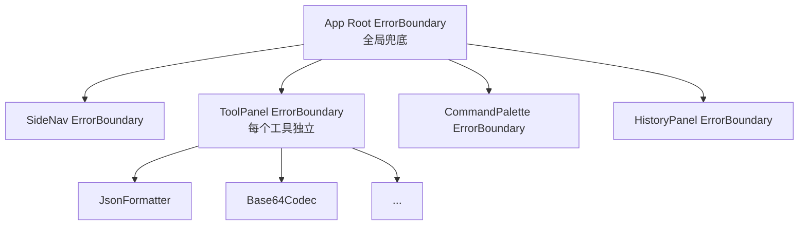
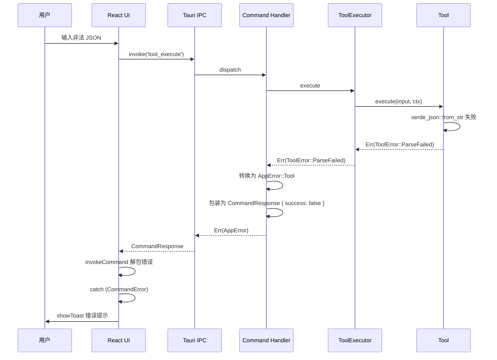
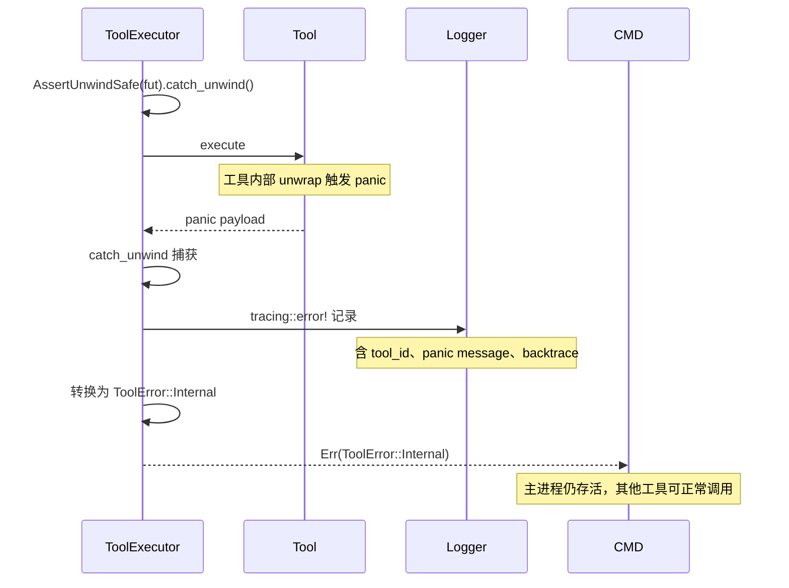

## 目录

- [1. 背景与目的](#1-背景与目的)
- [2. 核心概念](#2-核心概念)
- [3. 详细设计](#3-详细设计)
  - [3.1 Rust 错误类型层级](#31-rust-错误类型层级)
  - [3.2 thiserror 与 anyhow 使用规范](#32-thiserror-与-anyhow-使用规范)
  - [3.3 前端 Error Boundary](#33-前端-error-boundary)
  - [3.4 工具执行超时](#34-工具执行超时)
  - [3.5 大文件降级](#35-大文件降级)
  - [3.6 panic 隔离与恢复](#36-panic-隔离与恢复)
- [4. 关键流程](#4-关键流程)
  - [4.1 错误传播时序](#41-错误传播时序)
  - [4.2 panic 隔离流程](#42-panic-隔离流程)
- [5. 设计决策记录](#5-设计决策记录)
  - [5.1 thiserror vs anyhow](#51-thiserror-vs-anyhow)
  - [5.2 错误码 vs 异常](#52-错误码-vs-异常)
- [6. 注意事项与约束](#6-注意事项与约束)
- [7. 相关文档](#7-相关文档)

---

## 1. 背景与目的

Qraft 是 34 个（规划）工具的集合，每个工具都可能因输入错误、解析失败、超时、内部 bug 而失败。如果错误处理不统一，会导致：

1. **用户体验差**：错误信息不可读、无法定位问题
2. **稳定性差**：单工具 panic 导致整个应用崩溃
3. **调试困难**：错误堆栈丢失、上下文不清

本文档定义跨 Rust / Tauri / React 三层的一致错误处理策略，目标是：

1. **错误可读**：用户看到友好提示，开发者看到完整堆栈
2. **错误可分类**：前端根据错误码做精准 UI 反馈
3. **故障隔离**：单工具错误不影响其他工具与主进程
4. **可恢复**：超时、取消、大输入等场景有降级路径

---

## 2. 核心概念

| 概念 | 定义 |
|------|------|
| ToolError | 工具执行错误，面向用户与前端 |
| EngineError | 引擎层错误（注册、调度） |
| AppError | 应用层错误，跨 Command 边界 |
| Error Boundary | React 错误边界，捕获组件渲染错误 |
| Panic Isolation | 用 catch_unwind 捕获工具 panic |
| Graceful Degradation | 大输入等场景的降级处理 |

---

## 3. 详细设计

### 3.1 Rust 错误类型层级

```mermaid
classDiagram
    class ToolError {
        <<enum>>
        +InvalidInput(String)
        +ParseFailed(String)
        +Timeout(Duration)
        +Cancelled
        +InputTooLarge{size, max}
        +Internal(String)
        +code() &'static str
    }

    class EngineError {
        <<enum>>
        +ToolNotFound(String)
        +RegistryError(String)
        +ExecutorError(String)
        +From~ToolError~
    }

    class AppError {
        <<enum>>
        +Tool(ToolError)
        +Engine(EngineError)
        +Config(ConfigError)
        +History(HistoryError)
        +Fs(FsError)
        +Clipboard(ClipboardError)
        +Permission(String)
        +Unknown(String)
    }

    class ConfigError {
        <<enum>>
        +NotFound
        +InvalidFormat
        +MigrationFailed
        +IoError
    }

    class HistoryError {
        <<enum>>
        +NotFound
        +IoError
        +Corrupted
    }

    class FsError {
        <<enum>>
        +NotFound
        +TooLarge
        +PermissionDenied
        +IoError
    }

    class ClipboardError {
        <<enum>>
        +Unavailable
        +IoError
    }

    AppError --> ToolError
    AppError --> EngineError
    AppError --> ConfigError
    AppError --> HistoryError
    AppError --> FsError
    AppError --> ClipboardError
    EngineError --> ToolError
```

#### ToolError（工具层错误）

```rust
// src-tauri/src/core/error.rs

use thiserror::Error;
use serde::Serialize;

// 错误包络 serde tag 设计：
// - 顶层 AppError 用 `tag = "domain"`，标识错误所属业务域（tool/engine/config/...）
// - 嵌套的 ToolError 用 `tag = "kind"`，标识工具层具体错误种类
// 前端先解析 domain 定位错误层，再按层解析 kind/detail，避免字段名冲突。
#[derive(Debug, Error, Serialize)]
#[serde(tag = "kind", content = "detail")]
pub enum ToolError {
    #[error("invalid input: {0}")]
    InvalidInput(String),

    #[error("parse failed: {0}")]
    ParseFailed(String),

    #[error("timeout after {0:?}")]
    Timeout(std::time::Duration),

    #[error("cancelled by user")]
    Cancelled,

    #[error("input too large: {size} bytes, max {max} bytes")]
    InputTooLarge { size: usize, max: usize },

    #[error("internal error: {0}")]
    Internal(String),
}

impl ToolError {
    pub fn code(&self) -> &'static str {
        match self {
            ToolError::InvalidInput(_) => "ERR_INVALID_INPUT",
            ToolError::ParseFailed(_) => "ERR_PARSE_FAILED",
            ToolError::Timeout(_) => "ERR_TIMEOUT",
            ToolError::Cancelled => "ERR_CANCELLED",
            ToolError::InputTooLarge { .. } => "ERR_INPUT_TOO_LARGE",
            ToolError::Internal(_) => "ERR_INTERNAL",
        }
    }

    pub fn is_retryable(&self) -> bool {
        matches!(self, ToolError::Timeout(_) | ToolError::Internal(_))
    }
}
```

#### EngineError（引擎层错误）

```rust
// src-tauri/src/core/engine_error.rs

#[derive(Debug, Error)]
pub enum EngineError {
    #[error("tool not found: {0}")]
    ToolNotFound(String),

    #[error("registry error: {0}")]
    RegistryError(String),

    #[error("executor error: {0}")]
    ExecutorError(String),

    #[error(transparent)]
    Tool(#[from] ToolError),
}
```

#### AppError（应用层错误）

```rust
// src-tauri/src/commands/error.rs

use crate::core::{ToolError, EngineError};
use crate::store::{ConfigError, HistoryError};
use crate::shell::{FsError, ClipboardError};

#[derive(Debug, thiserror::Error, Serialize)]
#[serde(tag = "domain", content = "detail")]
pub enum AppError {
    #[error(transparent)]
    #[serde(serialize_with = "serialize_tool_error")]
    Tool(ToolError),

    #[error(transparent)]
    Engine(#[from] EngineError),

    #[error(transparent)]
    Config(#[from] ConfigError),

    #[error(transparent)]
    History(#[from] HistoryError),

    #[error(transparent)]
    Fs(#[from] FsError),

    #[error(transparent)]
    Clipboard(#[from] ClipboardError),

    #[error("permission denied: {0}")]
    Permission(String),

    #[error("unknown error: {0}")]
    Unknown(String),
}

impl AppError {
    pub fn code(&self) -> &'static str {
        match self {
            AppError::Tool(e) => e.code(),
            AppError::Engine(EngineError::ToolNotFound(_)) => "ERR_TOOL_NOT_FOUND",
            AppError::Engine(_) => "ERR_INTERNAL",
            AppError::Config(ConfigError::NotFound) => "ERR_CONFIG_NOT_FOUND",
            AppError::Config(ConfigError::InvalidFormat) => "ERR_CONFIG_INVALID",
            AppError::Config(ConfigError::MigrationFailed) => "ERR_CONFIG_MIGRATION_FAILED",
            AppError::Config(_) => "ERR_CONFIG_IO",
            AppError::History(HistoryError::NotFound) => "ERR_HISTORY_EMPTY",
            AppError::History(_) => "ERR_HISTORY_IO",
            AppError::Fs(FsError::NotFound) => "ERR_FILE_NOT_FOUND",
            AppError::Fs(FsError::TooLarge) => "ERR_FILE_TOO_LARGE",
            AppError::Fs(_) => "ERR_FILE_IO",
            AppError::Clipboard(_) => "ERR_CLIPBOARD_UNAVAILABLE",
            AppError::Permission(_) => "ERR_PERMISSION_DENIED",
            AppError::Unknown(_) => "ERR_INTERNAL",
        }
    }
}
```

### 3.2 thiserror 与 anyhow 使用规范

> 📌 **项目实际**
>
> Qraft 错误处理库使用规范：
>
> - **`thiserror`**：用于所有面向跨层边界的错误类型（ToolError / EngineError / AppError / ConfigError / HistoryError）
> - **`anyhow`**：仅用于应用入口（main.rs）与不向外暴露的内部辅助函数
> - **禁止**：禁止用 `String` 作为错误类型，禁止 `unwrap()` / `expect()` 在生产代码中（除非有 SAFETY 注释）

#### thiserror 使用示例

```rust
// 正确：用 thiserror 定义错误类型
#[derive(Debug, thiserror::Error)]
pub enum ConfigError {
    #[error("config file not found at {path}")]
    NotFound { path: PathBuf },

    #[error("invalid config format: {0}")]
    InvalidFormat(#[from] serde_json::Error),

    #[error("migration failed from v{from} to v{to}")]
    MigrationFailed { from: u32, to: u32 },

    #[error("io error: {0}")]
    IoError(#[from] std::io::Error),
}
```

```rust
// src-tauri/src/shell/fs_error.rs
#[derive(Debug, thiserror::Error)]
pub enum FsError {
    #[error("file not found: {path}")]
    NotFound { path: String },

    #[error("file too large: {size} bytes, max {max} bytes")]
    TooLarge { size: usize, max: usize },

    #[error("permission denied: {path}")]
    PermissionDenied { path: String },

    #[error("io error: {0}")]
    IoError(#[from] std::io::Error),
}

// src-tauri/src/shell/clipboard_error.rs
#[derive(Debug, thiserror::Error)]
pub enum ClipboardError {
    #[error("clipboard unavailable")]
    Unavailable,

    #[error("io error: {0}")]
    IoError(#[from] std::io::Error),
}
```

#### anyhow 使用示例

```rust
// 正确：main.rs 用 anyhow 收敛所有错误
fn main() -> anyhow::Result<()> {
    let app = tauri::Builder::default()
        .setup(|app| {
            // setup 逻辑
            Ok(())
        })
        .build(tauri::generate_context!())?;

    app.run(|_, _| {});
    Ok(())
}
```

#### 错误转换

```rust
// 用 #[from] 自动实现 From
#[derive(Debug, thiserror::Error)]
pub enum AppError {
    #[error(transparent)]
    Tool(#[from] ToolError),

    #[error(transparent)]
    Config(#[from] ConfigError),
}

// 在函数中用 ? 自动转换
fn execute_tool(input: ToolInput) -> Result<ToolOutput, AppError> {
    let tool = registry.get(&input.tool_id)
        .ok_or(EngineError::ToolNotFound(input.tool_id))?;
    let output = tool.execute(input).await?;  // ToolError 自动转换为 AppError
    Ok(output)
}
```

### 3.3 前端 Error Boundary

React Error Boundary 捕获组件渲染中的错误，避免整个应用白屏。

```typescript
// src/components/ErrorBoundary.tsx

import { Component, ErrorInfo, ReactNode } from 'react';

interface Props {
  children: ReactNode;
  fallback?: (error: Error, reset: () => void) => ReactNode;
}

interface State {
  error: Error | null;
}

export class ErrorBoundary extends Component<Props, State> {
  state: State = { error: null };

  static getDerivedStateFromError(error: Error): State {
    return { error };
  }

  componentDidCatch(error: Error, errorInfo: ErrorInfo) {
    console.error('ErrorBoundary caught:', error, errorInfo);
    // 上报错误到 Rust 侧日志
    invoke('log_error', {
      message: error.message,
      stack: error.stack,
      componentStack: errorInfo.componentStack,
    }).catch(() => {});
  }

  reset = () => this.setState({ error: null });

  render() {
    if (this.state.error) {
      return this.props.fallback?.(this.state.error, this.reset) ?? (
        <DefaultErrorFallback error={this.state.error} reset={this.reset} />
      );
    }
    return this.props.children;
  }
}

function DefaultErrorFallback({ error, reset }: { error: Error; reset: () => void }) {
  return (
    <div className="p-4 rounded border border-red-500 bg-red-50 dark:bg-red-950">
      <h3 className="font-semibold text-red-700 dark:text-red-300">工具渲染失败</h3>
      <p className="text-sm text-red-600 dark:text-red-400 mt-2">{error.message}</p>
      <button onClick={reset} className="mt-3 px-3 py-1 rounded bg-red-600 text-white">
        重试
      </button>
    </div>
  );
}
```

#### Error Boundary 部署策略



每个工具面板被独立 ErrorBoundary 包裹，单工具渲染崩溃不影响其他工具。

### 3.4 工具执行超时

#### 默认超时

5 秒，工具可在 `ToolMetadata.timeout_secs` 中声明覆盖：

| 工具类型 | 推荐超时 |
|----------|----------|
| 文本编解码（Base64/URL） | 默认 5s |
| JSON 格式化（小输入） | 默认 5s |
| JSON 格式化（大输入） | 10s |
| Hash 计算（文本） | 默认 5s |
| Hash 计算（文件） | 60s |
| 流式工具 | 不限（由取消令牌控制） |

#### 超时实现

```rust
// src-tauri/src/core/executor.rs

use tokio::time::timeout;
use std::time::Duration;

async fn execute_with_timeout(
    &self,
    tool: &dyn Tool,
    input: ToolInput,
    ctx: ToolContext,
) -> Result<ToolOutput, ToolError> {
    let timeout_dur = tool.metadata()
        .timeout_secs
        .map(Duration::from_secs)
        .unwrap_or(self.default_timeout);

    match timeout(timeout_dur, tool.execute(input, &ctx)).await {
        Ok(result) => result,
        Err(_) => Err(ToolError::Timeout(timeout_dur)),
    }
}
```

#### 前端超时提示

```typescript
try {
  const result = await invokeCommand<ToolOutput>('tool_execute', args);
  // 处理结果
} catch (e) {
  if (e instanceof CommandError) {
    switch (e.code) {
      case 'ERR_TIMEOUT':
        showToast('warning', '执行超时，请尝试缩小输入或使用流式工具');
        break;
      case 'ERR_CANCELLED':
        // 静默处理
        break;
      case 'ERR_INPUT_TOO_LARGE':
        showToast('error', '输入过大，请使用文件输入或拆分');
        break;
      default:
        showToast('error', `[${e.code}] ${e.message}`);
    }
  }
}
```

### 3.5 大文件降级

#### 降级策略

| 输入大小 | 策略 |
|----------|------|
| < 10 MB | 正常同步执行 |
| 10 MB - 100 MB | 拒绝同步执行，提示使用流式版本 |
| > 100 MB | 拒绝执行，提示拆分输入 |
| 文件输入 | 走流式路径，大小不限制（受超时控制） |

#### 工具内大输入检测

```rust
async fn execute(&self, input: ToolInput, _ctx: &ToolContext) -> Result<ToolOutput, ToolError> {
    const MAX_TEXT_SIZE: usize = 10 * 1024 * 1024;  // 10 MB

    let text = input.text()?;
    if text.len() > MAX_TEXT_SIZE {
        return Err(ToolError::InputTooLarge {
            size: text.len(),
            max: MAX_TEXT_SIZE,
        });
    }

    // 正常处理
    Ok(...)
}
```

#### 流式工具降级

```rust
// 工具同时实现 Tool 与 StreamingTool
#[async_trait]
impl Tool for JsonFormatter {
    async fn execute(&self, input: ToolInput, ctx: &ToolContext) -> Result<ToolOutput, ToolError> {
        // 小输入：同步处理
        let text = input.text()?;
        if text.len() > 10 * 1024 * 1024 {
            return Err(ToolError::InputTooLarge {
                size: text.len(),
                max: 10 * 1024 * 1024,
            });
        }
        // ... 同步格式化
    }
}

#[async_trait]
impl StreamingTool for JsonFormatter {
    async fn execute_stream(
        &self,
        file_path: &str,
        ctx: &ToolContext,
        progress: Arc<dyn ProgressReporter>,
    ) -> Result<ToolOutput, ToolError> {
        // 大输入：流式处理
        let file = tokio::fs::File::open(file_path).await
            .map_err(|e| ToolError::Internal(e.to_string()))?;
        // ... 分块读取与格式化
    }
}
```

### 3.6 panic 隔离与恢复

#### catch_unwind 包裹

```rust
// src-tauri/src/core/executor.rs

use std::panic::AssertUnwindSafe;
use futures::FutureExt;

async fn execute_with_isolation(
    &self,
    tool: &dyn Tool,
    input: ToolInput,
    ctx: ToolContext,
) -> Result<ToolOutput, ToolError> {
    let fut = tool.execute(input, &ctx);

    // AssertUnwindSafe 让 Future 可被 catch_unwind
    let result = AssertUnwindSafe(fut).catch_unwind().await;

    match result {
        Ok(ok) => ok,
        Err(panic_payload) => {
            let msg = extract_panic_message(panic_payload);
            tracing::error!(tool_id = tool.metadata().id, panic = %msg, "tool panicked");
            Err(ToolError::Internal(format!("tool panicked: {}", msg)))
        }
    }
}

fn extract_panic_message(p: Box<dyn std::any::Any + Send>) -> String {
    if let Some(s) = p.downcast_ref::<&str>() {
        s.to_string()
    } else if let Some(s) = p.downcast_ref::<String>() {
        s.clone()
    } else {
        "unknown panic".to_string()
    }
}
```

#### panic 后的恢复

```mermaid
flowchart TD
    A[工具执行] --> B{是否 panic?}
    B -->|否| C[正常返回]
    B -->|是| D[catch_unwind 捕获]
    D --> E[记录日志<br/>tracing::error]
    E --> F[转换为 ToolError::Internal]
    F --> G[返回错误给前端]
    G --> H[前端显示错误提示]
    H --> I[应用继续运行]
```



#### panic 不应破坏状态

工具实现需保证：

1. **无全局可变状态**：panic 不影响其他工具
2. **Mutex 释放**：用 `parking_lot::Mutex`，panic 自动释放锁
3. **文件句柄释放**：用 RAII，panic 自动关闭

> 💡 **建议方案**
>
> 在 CI 中启用 `panic = "unwind"`（默认）而非 `panic = "abort"`，否则 catch_unwind 无效。Release 构建也用 unwind，确保隔离能力。

---

## 4. 关键流程

### 4.1 错误传播时序



### 4.2 panic 隔离流程



---

## 5. 设计决策记录

### 5.1 thiserror vs anyhow

| 方案 | 适用场景 | 优点 | 缺点 |
|------|----------|------|------|
| **thiserror**（选定，跨层错误） | 库 API、跨层边界 | 类型明确、可枚举、可序列化 | 样板代码多 |
| **anyhow**（选定，应用入口） | main.rs、内部辅助 | 简洁、自动 backtrace | 类型不明确 |
| eyre | 应用层 | anyhow 增强版 | 生态小 |
| 自定义 error trait | 全自定义 | 灵活 | 重复造轮子 |

**决策理由**：

- 跨层错误需要被前端识别，必须可枚举与序列化 → thiserror
- main.rs 的错误只需打印退出，无需精细处理 → anyhow
- 两者搭配覆盖全部场景

### 5.2 错误码 vs 异常

| 方案 | 优点 | 缺点 |
|------|------|------|
| **错误码**（选定） | 跨语言友好、可序列化、前端可 switch | 需维护错误码表 |
| 异常（throw） | 自然 | Rust 无异常，跨 IPC 难传递 |

**决策理由**：Rust 无异常机制，且 IPC 边界无法传递异常对象。错误码 + 消息字符串是跨语言最通用方案。

---

## 6. 注意事项与约束

### 6.1 错误信息国际化

MVP 阶段错误 `message` 仅英文。v1.0 评估引入 i18n：

```rust
// 草案：错误码 + i18n key
pub struct CommandError {
    pub code: String,         // "ERR_PARSE_FAILED"
    pub message_key: String,  // "error.parse_failed"
    pub message_args: HashMap<String, String>,  // { "detail": "..." }
}
```

### 6.2 敏感信息泄漏

> 📌 **项目实际**
>
> 错误信息中禁止包含敏感数据：
>
> 1. **文件路径**：错误信息中的路径需脱敏（如 `/home/user/secret.key` → `~/secret.key`）
> 2. **输入内容**：错误信息不得回显用户输入原文（如 JSON 解析错误只说位置，不回显内容）
> 3. **API Key**：若工具涉及（虽然 Qraft 内置工具不涉及），错误信息中必须 `***` 替换

### 6.3 panic 与 abort

> 📌 **项目实际**
>
> `panic` 策略必须在 `Cargo.toml` 的 `[profile.dev]` 与 `[profile.release]` 中显式声明，**仅写顶层 `[profile]` 不生效**：
>
> ```toml
> # Cargo.toml
> [profile.dev]
> panic = "unwind"      # dev 构建：catch_unwind 有效
>
> [profile.release]
> panic = "unwind"    # release 构建也必须 unwind，否则 production 隔离能力失效
> # 切勿设置 panic = "abort"（会令 catch_unwind 完全失效）
> ```

- **dev 构建**：`[profile.dev]` 设 `panic = "unwind"`，`catch_unwind` 有效
- **release 构建**：`[profile.release]` 设 `panic = "unwind"`，确保生产环境的隔离能力
- **禁用** 任何 profile 设 `panic = "abort"`，否则 `catch_unwind` 无效

### 6.4 日志与上报

所有错误通过 `tracing` 记录：

| 错误级别 | 场景 |
|----------|------|
| `error` | ToolError::Internal、panic、AppError::Unknown |
| `warn` | ToolError::Timeout、Permission denied |
| `info` | ToolError::Cancelled（用户主动） |
| `debug` | ToolError::InvalidInput、ParseFailed（用户输入问题） |

日志写入 `~/.qraft/logs/qraft.log`，按天滚动，保留 7 天。

### 6.5 错误上报机制（待补充）

当前错误仅在本地日志。若用户愿意，可考虑：

- 应用内"复制错误报告"按钮，生成包含日志的文本
- 用户主动提交到 GitHub Issue

不引入自动上报，遵守零网络原则。

---

## 7. 相关文档

- [02-glossary.md](./02-glossary.md) — 术语表（ToolError / Panic Isolation 等定义）
- [05-rust-core-engine.md](./05-rust-core-engine.md) — Rust 核心引擎（ToolError 的 trait 定义）
- [09-interface-design.md](./09-interface-design.md) — 接口设计（错误码完整列表）
- [11-testing-strategy.md](./11-testing-strategy.md) — 测试策略（错误路径的测试覆盖）
- [12-performance.md](./12-performance.md) — 性能优化（超时与大输入降级）
- [13-security.md](./13-security.md) — 安全机制（敏感信息脱敏）
