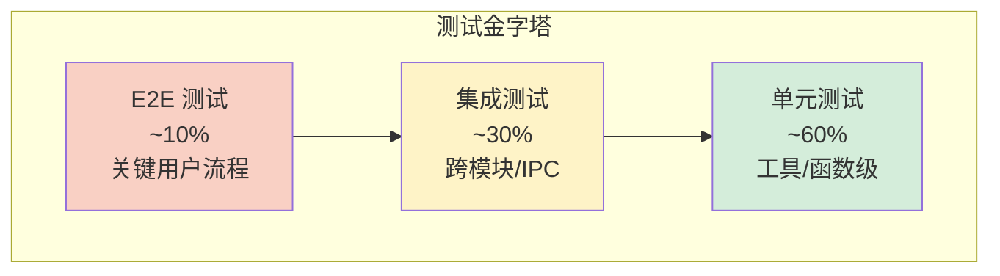
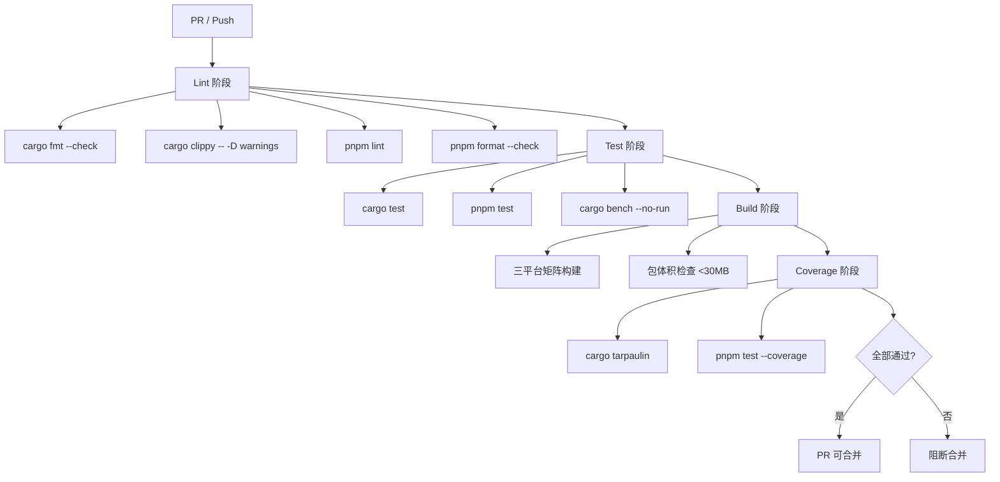
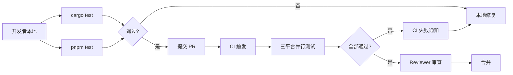

## 目录

- [1. 背景与目的](#1-背景与目的)
- [2. 核心概念](#2-核心概念)
- [3. 详细设计](#3-详细设计)
  - [3.1 测试金字塔](#31-测试金字塔)
  - [3.2 Rust 单元测试](#32-rust-单元测试)
  - [3.3 Rust 集成测试](#33-rust-集成测试)
  - [3.4 Rust 属性测试](#34-rust-属性测试)
  - [3.5 Rust 基准测试](#35-rust-基准测试)
  - [3.6 React 组件测试](#36-react-组件测试)
  - [3.7 Tauri E2E 测试](#37-tauri-e2e-测试)
  - [3.8 测试数据管理](#38-测试数据管理)
- [4. 关键流程](#4-关键流程)
  - [4.1 CI 流水线](#41-ci-流水线)
  - [4.2 测试触发流程](#42-测试触发流程)
- [5. 设计决策记录](#5-设计决策记录)
  - [5.1 测试框架选型](#51-测试框架选型)
  - [5.2 覆盖率目标](#52-覆盖率目标)
- [6. 注意事项与约束](#6-注意事项与约束)
- [7. 相关文档](#7-相关文档)

---

## 1. 背景与目的

Qraft 包含 30+ 工具，每个工具都有自己的输入边界与错误场景。如果没有系统化的测试策略，会导致：

1. **回归频繁**：改一个工具影响另一个工具
2. **重构困难**：不敢动核心代码
3. **跨平台 bug**：Windows 通过但 macOS 失败
4. **性能退化**：优化后被无意破坏

本文档定义 Qraft 的完整测试体系，目标是：

1. **分层覆盖**：单元 / 集成 / E2E 三层各有职责
2. **自动化**：所有测试在 CI 自动运行
3. **可衡量**：覆盖率与性能指标量化
4. **跨平台**：三平台均跑测试

---

## 2. 核心概念

| 概念 | 定义 |
|------|------|
| 单元测试 | 测试单个函数或模块，零外部依赖 |
| 集成测试 | 测试模块组合，可能涉及文件/网络 |
| 属性测试 | 用 proptest 生成大量随机输入验证不变量 |
| 基准测试 | 用 criterion 测量性能指标 |
| E2E 测试 | 通过 Tauri Driver 模拟用户操作 |
| Fixtures | 测试输入数据，按工具分类组织 |
| 覆盖率 | 代码被测试执行的比例 |

---

## 3. 详细设计

### 3.1 测试金字塔



| 层级 | 占比 | 数量目标 | 执行时间 |
|------|------|----------|----------|
| 单元测试 | 60% | 500+ | <30s |
| 集成测试 | 30% | 100+ | <2min |
| E2E 测试 | 10% | 30+ | <10min |

### 3.2 Rust 单元测试

#### 测试组织

每个 Rust 源文件底部内联单元测试：

```rust
// src-tauri/src/tools/json_formatter.rs

#[cfg(test)]
mod tests {
    use super::*;
    use crate::core::input::ToolInput;
    use crate::core::context::ToolContext;

    fn make_input(text: &str) -> ToolInput {
        ToolInput {
            text: Some(text.to_string()),
            file_path: None,
            params: HashMap::new(),
        }
    }

    #[tokio::test]
    async fn test_format_simple_json() {
        let tool = JsonFormatter::new();
        let ctx = mock_context();
        let input = make_input(r#"{"a":1}"#);

        let output = tool.execute(input, &ctx).await.unwrap();

        assert_eq!(output.text, "{\n  \"a\": 1\n}");
    }

    #[tokio::test]
    async fn test_format_invalid_json_returns_error() {
        let tool = JsonFormatter::new();
        let ctx = mock_context();
        let input = make_input(r#"{invalid}"#);

        let result = tool.execute(input, &ctx).await;

        assert!(matches!(result, Err(ToolError::ParseFailed(_))));
    }

    #[tokio::test]
    async fn test_format_with_custom_indent() {
        let tool = JsonFormatter::new();
        let ctx = mock_context();
        let mut input = make_input(r#"{"a":1}"#);
        input.params.insert("indent".to_string(), json!(4));

        let output = tool.execute(input, &ctx).await.unwrap();

        assert_eq!(output.text, "{\n    \"a\": 1\n}");
    }

    #[tokio::test]
    async fn test_format_empty_object() {
        let tool = JsonFormatter::new();
        let ctx = mock_context();
        let input = make_input("{}");

        let output = tool.execute(input, &ctx).await.unwrap();

        assert_eq!(output.text, "{}");
    }

    #[tokio::test]
    async fn test_format_input_too_large() {
        let tool = JsonFormatter::new();
        let ctx = mock_context();
        let large = "x".repeat(11 * 1024 * 1024);  // 11MB
        let input = make_input(&large);

        let result = tool.execute(input, &ctx).await;

        assert!(matches!(result, Err(ToolError::InputTooLarge { .. })));
    }
}
```

#### Mock ToolContext

```rust
// src-tauri/src/core/test_utils.rs

use std::sync::Arc;
use tokio_util::sync::CancellationToken;
use crate::core::context::{ToolContext, HistorySink};
use crate::store::config::UserConfig;
use crate::store::history::HistoryEntry;

pub fn mock_context() -> ToolContext {
    ToolContext {
        config: Arc::new(UserConfig::default()),
        history_sink: Arc::new(MockHistorySink),
        cancel_token: CancellationToken::new(),
    }
}

struct MockHistorySink;

impl HistorySink for MockHistorySink {
    fn write(&self, _entry: HistoryEntry) {
        // 测试中忽略历史写入
    }
}
```

### 3.3 Rust 集成测试

集成测试放在 `src-tauri/tests/` 目录：

```rust
// src-tauri/tests/tool_registry.rs

use qraft::core::registry::ToolRegistry;

#[test]
fn test_all_p0_tools_registered() {
    let registry = ToolRegistry::global();
    let ids: Vec<_> = registry.list().iter().map(|m| m.id).collect();

    let p0_tools = [
        "json_formatter", "json_minifier", "base64_codec", "url_codec",
        "jwt_parser", "uuid_generator", "hash_calculator",
        "timestamp_converter", "color_converter", "regex_tester",
    ];

    for tool_id in &p0_tools {
        assert!(ids.iter().any(|id| id == tool_id), "missing P0 tool: {}", tool_id);
    }
}

#[test]
fn test_tool_id_unique() {
    let registry = ToolRegistry::global();
    let mut ids: Vec<_> = registry.list().iter().map(|m| m.id).collect();
    ids.sort();
    let original = ids.len();
    ids.dedup();
    assert_eq!(ids.len(), original, "duplicate tool ids");
}

#[test]
fn test_tool_metadata_complete() {
    let registry = ToolRegistry::global();
    for meta in registry.list() {
        assert!(!meta.id.is_empty(), "tool id empty");
        assert!(!meta.name.is_empty(), "tool name empty");
        assert!(!meta.description.is_empty(), "tool description empty");
        assert!(!meta.tags.is_empty(), "tool tags empty: {}", meta.id);
        assert!(!meta.version.is_empty(), "tool version empty: {}", meta.id);
    }
}
```

#### 跨工具依赖测试

```rust
// src-tauri/tests/tool_dependencies.rs

use qraft::tools::jwt_parser::JwtParser;
use qraft::tools::base64_codec::Base64Codec;

#[tokio::test]
async fn test_jwt_parser_uses_base64() {
    // 验证 JWT Parser 内部调用了 Base64 解码
    let jwt = "eyJhbGciOiJIUzI1NiJ9.eyJzdWIiOiIxMjMifQ.signature";
    let parser = JwtParser::new();
    let ctx = qraft::core::test_utils::mock_context();
    let input = ToolInput {
        text: Some(jwt.to_string()),
        ..
    };

    let output = parser.execute(input, &ctx).await.unwrap();
    let extra: serde_json::Value = serde_json::from_str(&output.extra.unwrap().to_string()).unwrap();

    assert_eq!(extra["header"]["alg"], "HS256");
    assert_eq!(extra["payload"]["sub"], "123");
}
```

### 3.4 Rust 属性测试

用 `proptest` 对解析类工具做模糊测试：

```rust
// src-tauri/src/tools/json_formatter.rs

#[cfg(test)]
mod proptests {
    use super::*;
    use proptest::prelude::*;

    proptest! {
        /// 任何合法 JSON 序列化后再解析，应得到等价值
        #[test]
        fn test_json_roundtrip(input in any::<serde_json::Value>()) {
            let serialized = serde_json::to_string(&input).unwrap();
            let parsed: serde_json::Value = serde_json::from_str(&serialized).unwrap();
            prop_assert_eq!(input, parsed);
        }

        /// 格式化后的 JSON 应可被重新解析
        #[test]
        fn test_format_preserves_semantics(input in any::<serde_json::Value>()) {
            let serialized = serde_json::to_string(&input).unwrap();
            let tool = JsonFormatter::new();
            let ctx = crate::core::test_utils::mock_context();
            let input_struct = ToolInput {
                text: Some(serialized),
                ..Default::default()
            };
            let output = tokio::runtime::Runtime::new().unwrap()
                .block_on(tool.execute(input_struct, &ctx)).unwrap();

            let reformatted: serde_json::Value = serde_json::from_str(&output.text).unwrap();
            prop_assert_eq!(input, reformatted);
        }
    }
}
```

### 3.5 Rust 基准测试

用 `criterion` 测量关键工具性能：

```rust
// src-tauri/benches/json_formatter.rs

use criterion::{black_box, criterion_group, criterion_main, Criterion};
use qraft::tools::json_formatter::JsonFormatter;
use qraft::core::tool::Tool;
use qraft::core::input::ToolInput;
use qraft::core::context::ToolContext;

fn bench_format_small_json(c: &mut Criterion) {
    let tool = JsonFormatter::new();
    let ctx = mock_context();
    let input = ToolInput {
        text: Some(r#"{"a":1,"b":[1,2,3]}"#.to_string()),
        ..Default::default()
    };

    c.bench_function("format_small_json", |b| {
        b.iter(|| {
            tokio::runtime::Runtime::new().unwrap().block_on(
                tool.execute(black_box(input.clone()), black_box(&ctx))
            )
        })
    });
}

fn bench_format_large_json(c: &mut Criterion) {
    let tool = JsonFormatter::new();
    let ctx = mock_context();
    let large = generate_large_json(1_000_000);  // 1MB
    let input = ToolInput {
        text: Some(large),
        ..Default::default()
    };

    c.bench_function("format_1mb_json", |b| {
        b.iter(|| {
            tokio::runtime::Runtime::new().unwrap().block_on(
                tool.execute(black_box(input.clone()), black_box(&ctx))
            )
        })
    });
}

criterion_group!(benches, bench_format_small_json, bench_format_large_json);
criterion_main!(benches);
```

CI 中对比基准结果，性能退化 >10% 时告警。

### 3.6 React 组件测试

用 `Vitest` + `@testing-library/react`：

```typescript
// src/tools/JsonFormatter.test.tsx

import { describe, it, expect, vi } from 'vitest';
import { render, screen, fireEvent, waitFor } from '@testing-library/react';
import { JsonFormatter } from './JsonFormatter';

vi.mock('@/lib/ipc', () => ({
  invokeCommand: vi.fn(),
}));

describe('JsonFormatter', () => {
  it('renders input and output panels', () => {
    render(<JsonFormatter />);
    expect(screen.getByPlaceholderText(/paste json/i)).toBeInTheDocument();
    expect(screen.getByText(/output/i)).toBeInTheDocument();
  });

  it('calls tool_execute on format button click', async () => {
    const { invokeCommand } = await import('@/lib/ipc');
    (invokeCommand as any).mockResolvedValue({
      text: '{\n  "a": 1\n}',
    });

    render(<JsonFormatter />);
    fireEvent.change(screen.getByPlaceholderText(/paste json/i), {
      target: { value: '{"a":1}' },
    });
    fireEvent.click(screen.getByText(/format/i));

    await waitFor(() => {
      expect(invokeCommand).toHaveBeenCalledWith('tool_execute', {
        toolId: 'json_formatter',
        input: { text: '{"a":1}', params: { indent: 2 } },
      });
    });
  });

  it('displays error toast on parse failure', async () => {
    const { invokeCommand, CommandError } = await import('@/lib/ipc');
    (invokeCommand as any).mockRejectedValue(
      new CommandError('ERR_PARSE_FAILED', 'unexpected token')
    );

    render(<JsonFormatter />);
    fireEvent.change(screen.getByPlaceholderText(/paste json/i), {
      target: { value: 'invalid' },
    });
    fireEvent.click(screen.getByText(/format/i));

    await waitFor(() => {
      expect(screen.getByText(/unexpected token/i)).toBeInTheDocument();
    });
  });
});
```

### 3.7 Tauri E2E 测试

用 `tauri-driver` + `WebDriverIO`：

```typescript
// e2e/json_formatter.spec.ts

import { remote } from 'webdriverio';
import { capabilities } from './capabilities';

describe('JSON Formatter E2E', () => {
  let driver: WebdriverIO.Browser;

  beforeAll(async () => {
    driver = await remote(capabilities);
  });

  afterAll(async () => {
    await driver?.deleteSession();
  });

  it('formats valid JSON', async () => {
    // 启动应用
    await driver.$('=JSON Formatter').click();

    // 输入 JSON
    const textarea = await driver.$('textarea[data-testid="input"]');
    await textarea.setValue('{"a":1}');

    // 点击格式化
    await driver.$('button=Format').click();

    // 验证输出
    const output = await driver.$('[data-testid="output"]');
    await output.waitUntil(async () => {
      const text = await output.getText();
      return text.includes('"a": 1');
    });
  });

  it('shows error on invalid JSON', async () => {
    await driver.$('=JSON Formatter').click();
    const textarea = await driver.$('textarea[data-testid="input"]');
    await textarea.setValue('{invalid}');

    await driver.$('button=Format').click();

    const toast = await driver.$('[data-testid="toast-error"]');
    await toast.waitForDisplayed();
    expect(await toast.getText()).toMatch(/parse failed/i);
  });
});
```

### 3.8 测试数据管理

#### Fixtures 目录结构

```
src-tauri/tests/fixtures/
├── json/
│   ├── simple.json
│   ├── nested.json
│   ├── large_1mb.json
│   ├── invalid.json
│   └── unicode.json
├── jwt/
│   ├── valid_hs256.txt
│   ├── expired.txt
│   └── invalid_signature.txt
├── base64/
│   ├── encoded.txt
│   └── binary.dat
└── hash/
    ├── small.txt
    └── expected_hashes.json
```

#### Fixture 加载辅助

```rust
// src-tauri/tests/common/mod.rs

use std::path::PathBuf;

pub fn fixture_path(category: &str, name: &str) -> PathBuf {
    PathBuf::from(env!("CARGO_MANIFEST_DIR"))
        .join("tests/fixtures")
        .join(category)
        .join(name)
}

pub fn load_fixture(category: &str, name: &str) -> String {
    std::fs::read_to_string(fixture_path(category, name))
        .unwrap_or_else(|e| panic!("failed to load fixture {}/{}: {}", category, name, e))
}
```

---

## 4. 关键流程

### 4.1 CI 流水线



### 4.2 测试触发流程



---

## 5. 设计决策记录

### 5.1 测试框架选型

| 层级 | 选定方案 | 备选 | 理由 |
|------|----------|------|------|
| Rust 单元 | 内置 `#[test]` | … | 无需额外依赖 |
| Rust 属性 | `proptest` | `quickcheck` | proptest API 更现代 |
| Rust 基准 | `criterion` | `iai` | criterion 生态成熟 |
| React 单元 | `Vitest` | `Jest` | Vite 原生集成 |
| React 组件 | `@testing-library/react` | `Enzyme` | 用户视角测试 |
| E2E | `WebDriverIO + tauri-driver` | `Playwright` | Tauri 官方推荐 |
| 覆盖率 | `tarpaulin` + `c8` | `llvm-cov` | tarpaulin 易用 |

### 5.2 覆盖率目标

| 模块 | 目标 | 强制级别 |
|------|------|----------|
| Rust Core | ≥85% | 阻断 |
| Rust Tools | ≥80% | 阻断 |
| Rust Shell | ≥70% | 警告 |
| React 组件 | ≥75% | 阻断 |
| React hooks | ≥85% | 阻断 |
| E2E 关键流程 | 100% P0 工具覆盖 | 阻断 |

> 📌 **项目实际**
>
> 覆盖率不是唯一指标。重要场景的"测试质量"比"覆盖率数字"更重要。PR Review 中会检查是否覆盖了：
>
> - 正常路径
> - 边界输入（空、零、最大）
> - 错误输入（非法格式、超限）
> - 并发场景（如适用）

---

## 6. 注意事项与约束

### 6.1 测试执行约束

> 📌 **项目实际**
>
> 1. **测试必须独立**：每个测试用例不依赖其他测试的副作用
> 2. **测试必须幂等**：重复执行结果一致
> 3. **测试不依赖外部网络**：所有测试本地可跑
> 4. **测试不依赖特定用户目录**：用临时目录或 mock

### 6.2 CI 资源约束

- 三平台并行构建，单平台超时 30 分钟
- E2E 测试仅在 Linux（Xvfb）跑，避免三平台重复
- 基准测试每周跑一次，不在每次 PR 跑

### 6.3 测试数据安全

- Fixtures 中不含真实敏感数据（如生产 JWT、API Key）
- 用专门生成的测试 JWT（公开的测试密钥）
- 文件 fixtures 用合成数据

### 6.4 Tauri E2E 跨平台支持（待补充）

当前 E2E 仅在 Linux（Xvfb）跑。Windows/macOS 的 E2E 需要：

- Windows：直接跑（已有 GUI）
- macOS：直接跑（已有 GUI）
- Linux：Xvfb 虚拟显示

具体 CI 矩阵配置待 [14-build-and-distribution.md](./14-build-and-distribution.md) 细化。

---

## 7. 相关文档

- [03-tech-stack.md](./03-tech-stack.md) — 技术栈（测试相关依赖版本）
- [05-rust-core-engine.md](./05-rust-core-engine.md) — Rust 核心引擎（被测试的核心代码）
- [10-error-handling.md](./10-error-handling.md) — 错误处理（错误路径测试覆盖）
- [12-performance.md](./12-performance.md) — 性能优化（基准测试指标）
- [14-build-and-distribution.md](./14-build-and-distribution.md) — 打包分发（CI 流水线）
- [17-dev-workflow.md](./17-dev-workflow.md) — 开发规范（测试代码规范）
