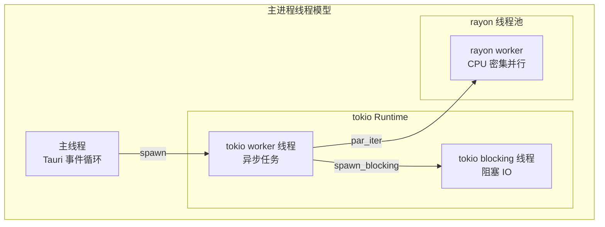
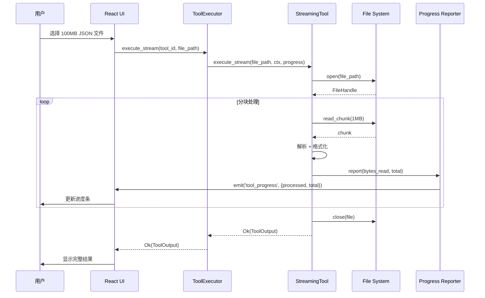
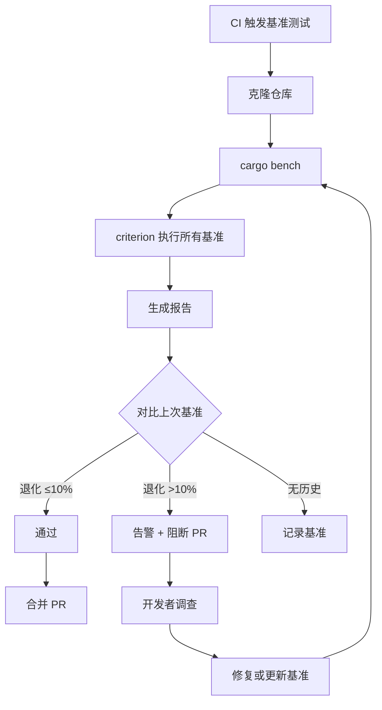

## 目录

- [1. 背景与目的](#1-背景与目的)
- [2. 核心概念](#2-核心概念)
- [3. 详细设计](#3-详细设计)
  - [3.1 性能指标与目标](#31-性能指标与目标)
  - [3.2 Rust 多线程策略](#32-rust-多线程策略)
  - [3.3 大 JSON 流式解析](#33-大-json-流式解析)
  - [3.4 内存限制与保护](#34-内存限制与保护)
  - [3.5 React 渲染优化](#35-react-渲染优化)
  - [3.6 虚拟列表](#36-虚拟列表)
  - [3.7 IPC 性能优化](#37-ipc-性能优化)
- [4. 关键流程](#4-关键流程)
  - [4.1 流式处理流程](#41-流式处理流程)
  - [4.2 性能基准测试流程](#42-性能基准测试流程)
- [5. 设计决策记录](#5-设计决策记录)
  - [5.1 流式 vs 一次性处理](#51-流式-vs-一次性处理)
  - [5.2 内存分配器选择](#52-内存分配器选择)
- [6. 注意事项与约束](#6-注意事项与约束)
- [7. 相关文档](#7-相关文档)

---

## 1. 背景与目的

Qraft 是常驻工具类应用，用户对性能极其敏感：

1. **启动要快**：用户期望秒开，超过 1 秒就觉得慢
2. **执行要快**：JSON 格式化、Hash 计算等操作要即时反馈
3. **内存要省**：常驻工具不应占用过多内存
4. **大输入要可用**：10MB+ 的 JSON / 大文件 Hash 不能卡死

本文档定义 Qraft 的性能目标与优化手段，目标是：

1. **量化指标**：每项性能目标有可测量的数值
2. **持续监控**：CI 中跑基准测试，性能退化自动告警
3. **分层优化**：Rust 层、IPC 层、React 层各有优化策略
4. **降级路径**：大输入等极端场景有可用的降级方案

---

## 2. 核心概念

| 概念 | 定义 |
|------|------|
| Cold Start | 应用从启动到首屏可交互的时间 |
| Warm Start | 已启动状态下打开新工具 Tab 的时间 |
| Streaming | 分块处理大输入，避免一次性加载到内存 |
| Virtual List | 仅渲染可见区域的列表项 |
| Blocking Pool | tokio 的阻塞任务线程池 |
| Rayon Pool | 用于 CPU 密集并行的线程池 |
| Criterion | Rust 基准测试框架 |

---

## 3. 详细设计

### 3.1 性能指标与目标

#### 启动性能

| 指标 | 目标 | 上限 | 测量方式 |
|------|------|------|----------|
| 进程启动 | <100ms | 200ms | Tauri 主进程启动到 setup 回调 |
| Core 初始化 | <50ms | 100ms | ToolRegistry 初始化完成 |
| 配置加载 | <30ms | 50ms | ConfigStore 加载完成 |
| WebView 首屏 | <300ms | 500ms | React 首屏渲染完成 |
| **总冷启动** | **<500ms** | **800ms** | 用户点击图标到可交互 |

#### 执行性能

| 场景 | 目标 | 上限 |
|------|------|------|
| 小输入工具执行（<1KB） | <50ms | 100ms |
| 中输入工具执行（100KB） | <200ms | 500ms |
| 大输入工具执行（10MB JSON） | <500ms | 1s |
| 流式工具（100MB 文件） | <5s | 10s |
| Hash 1GB 文件 | <30s | 60s |

#### 内存性能

| 指标 | 目标 | 上限 |
|------|------|------|
| 空闲内存占用 | <150MB | 200MB |
| 单工具执行内存增量 | <50MB | 100MB |
| 历史记录内存占用 | <20MB | 50MB |

#### 包体积

| 平台 | 目标 | 上限 |
|------|------|------|
| Windows .exe | <25MB | 30MB |
| macOS .dmg | <25MB | 30MB |
| Linux AppImage | <25MB | 30MB |

### 3.2 Rust 多线程策略

#### 线程池架构



#### 任务分配规则

| 任务类型 | 分配到 | 示例 |
|----------|--------|------|
| IPC 接收 | 主线程 | `#[tauri::command]` 入口 |
| 异步工具执行 | tokio worker | `tool.execute().await` |
| 阻塞 IO | tokio blocking | `tokio::fs::read` |
| CPU 密集并行 | rayon | 多文件 Hash 并行计算 |
| 长时间 CPU | spawn_blocking + rayon | 大文件 Hash |

#### tokio 配置

```rust
// src-tauri/src/main.rs

fn main() {
    let runtime = tokio::runtime::Builder::new_multi_thread()
        .worker_threads(num_cpus::get())          // 默认 CPU 核数
        .max_blocking_threads(512)                // 阻塞线程上限
        .thread_name("qraft-worker")
        .enable_all()
        .build()
        .unwrap();

    runtime.block_on(async {
        tauri::Builder::default()
            .setup(|app| {
                // 初始化
                Ok(())
            })
            .run(tauri::generate_context!())
            .expect("error while running tauri application");
    });
}
```

#### rayon 配置

```rust
// src-tauri/src/main.rs

use rayon::ThreadPoolBuilder;

fn init_rayon() {
    ThreadPoolBuilder::new()
        .num_threads(num_cpus::get())
        .thread_name(|i| format!("rayon-{}", i))
        .build_global()
        .expect("failed to init rayon");
}
```

### 3.3 大 JSON 流式解析

#### 流式 vs 一次性

| 输入大小 | 策略 | 实现 |
|----------|------|------|
| < 1 MB | 一次性解析 | `serde_json::from_str` |
| 1-10 MB | 一次性解析（监控内存） | `serde_json::from_str` |
| > 10 MB | 流式解析 | `serde_json::Deserializer::from_reader` |

#### 流式 JSON 格式化

```rust
// src-tauri/src/tools/json_formatter.rs

use tokio::io::{AsyncBufReadExt, AsyncWriteExt, BufReader};
use tokio::fs::File;

async fn format_streaming(
    file_path: &str,
    indent: u32,
    progress: Arc<dyn ProgressReporter>,
) -> Result<ToolOutput, ToolError> {
    let file = File::open(file_path).await
        .map_err(|e| ToolError::Internal(e.to_string()))?;
    let metadata = file.metadata().await
        .map_err(|e| ToolError::Internal(e.to_string()))?;
    let total = metadata.len();

    let reader = BufReader::new(file);
    let mut output = Vec::with_capacity(total as usize / 2);
    let mut bytes_read = 0u64;

    // 流式 JSON 解析：按 token 流式处理
    let mut stream = serde_json::Deserializer::from_reader(reader)
        .into_iter::<serde_json::Value>();

    let formatter = serde_json::ser::PrettyFormatter::with_indent(
        " ".repeat(indent as usize).as_bytes()
    );
    let mut ser = serde_json::Serializer::with_formatter(&mut output, formatter);

    while let Some(item) = stream.next() {
        let value: serde_json::Value = item
            .map_err(|e| ToolError::ParseFailed(e.to_string()))?;
        serde::Serialize::serialize(&value, &mut ser)
            .map_err(|e| ToolError::Internal(e.to_string()))?;

        bytes_read = stream.byte_offset() as u64;
        progress.report(bytes_read, total);
    }

    Ok(ToolOutput {
        text: String::from_utf8(output)
            .map_err(|e| ToolError::Internal(e.to_string()))?,
        meta: Some(OutputMeta {
            duration_ms: 0,  // 由 Executor 填充
            input_bytes: total as usize,
            output_bytes: 0,  // 由 Executor 填充
        }),
        alerts: vec![],
        extra: None,
    })
}
```

### 3.4 内存限制与保护

#### 单工具内存上限

> 📌 **项目实际**
>
> 每个工具执行理论上不超过 256MB 内存。当前没有强制限制机制（无内存配额），通过以下手段软控制：
>
> 1. **大输入检测**：工具自行检查 `text.len() > 10MB` 返回 `InputTooLarge`
> 2. **流式处理优先**：>10MB 输入走流式路径
> 3. **避免一次性缓冲**：用迭代器/流而非 `Vec<u8>`
> 4. **代码审查**：PR Review 检查大缓冲分配

#### 全局内存监控

```rust
// src-tauri/src/core/memory_monitor.rs

use sysinfo::{System, Pid};

pub struct MemoryMonitor {
    sys: System,
    pid: Pid,
    threshold_mb: u64,
}

impl MemoryMonitor {
    pub fn new(threshold_mb: u64) -> Self {
        let mut sys = System::new();
        sys.refresh_all();
        Self {
            sys,
            pid: Pid::from(std::process::id() as usize),
            threshold_mb,
        }
    }

    pub fn current_mb(&mut self) -> u64 {
        self.sys.refresh_process(self.pid);
        self.sys.process(self.pid)
            .map(|p| p.memory() / 1024 / 1024)
            .unwrap_or(0)
    }

    pub fn is_over_threshold(&mut self) -> bool {
        self.current_mb() > self.threshold_mb
    }
}
```

#### 内存分配器

> 💡 **建议方案**
>
> 替换默认 glibc malloc 为 `mimalloc` 或 `jemalloc`，提升多线程分配性能：
>
> ```rust
> // src-tauri/src/main.rs
> use mimalloc::MiMalloc;
>
> #[global_allocator]
> static GLOBAL: MiMalloc = MiMalloc;
> ```
>
> 需在 CI 中验证三平台兼容性。

### 3.5 React 渲染优化

#### 关键优化手段

| 手段 | 应用场景 | 实现 |
|------|----------|------|
| `React.memo` | 工具面板组件 | 避免父组件更新时重渲染 |
| `useMemo` | 计算派生数据 | 缓存昂贵计算 |
| `useCallback` | 事件处理函数 | 避免子组件不必要重渲染 |
| `useDeferredValue` | 输入框防抖 | 大列表过滤场景 |
| `useTransition` | 切换工具 | 非紧急更新降级 |
| 虚拟列表 | 历史记录、收藏夹 | 仅渲染可见项 |

#### React.memo 示例

```typescript
// src/tools/JsonFormatter.tsx

import { memo, useState, useCallback } from 'react';

interface Props {
  config: ToolConfig;
  onExecute: (input: ToolInput) => Promise<ToolOutput>;
}

export const JsonFormatter = memo(function JsonFormatter({ config, onExecute }: Props) {
  const [input, setInput] = useState('');
  const [output, setOutput] = useState('');
  const [loading, setLoading] = useState(false);

  const handleFormat = useCallback(async () => {
    setLoading(true);
    try {
      const result = await onExecute({
        text: input,
        params: { indent: config.indent },
      });
      setOutput(result.text);
    } finally {
      setLoading(false);
    }
  }, [input, config.indent, onExecute]);

  return (
    <div className="grid grid-cols-2 gap-4 h-full">
      <textarea
        value={input}
        onChange={(e) => setInput(e.target.value)}
        placeholder="Paste JSON here"
      />
      <pre>{output}</pre>
    </div>
  );
});
```

#### Zustand selector 优化

```typescript
// src/store/configStore.ts

import { create } from 'zustand';

interface ConfigState {
  theme: ThemeConfig;
  general: GeneralConfig;
  toolPrefs: Record<string, unknown>;
  // ...
}

// 精细 selector，避免组件订阅整个 store
export const useThemeMode = () => useConfigStore((s) => s.theme.mode);
export const useFontSize = () => useConfigStore((s) => s.general.fontSize);
export const useToolPref = (toolId: string) =>
  useConfigStore((s) => s.toolPrefs[toolId]);
```

### 3.6 虚拟列表

历史记录可能积累上千条，必须用虚拟列表：

```typescript
// src/components/HistoryPanel.tsx

import { useVirtualizer } from '@tanstack/react-virtual';
import { useRef } from 'react';

export function HistoryPanel({ entries }: { entries: HistoryEntry[] }) {
  const parentRef = useRef<HTMLDivElement>(null);

  const virtualizer = useVirtualizer({
    count: entries.length,
    getScrollElement: () => parentRef.current,
    estimateSize: () => 60,  // 每项 60px
    overscan: 5,
  });

  return (
    <div ref={parentRef} className="h-full overflow-auto">
      <div
        style={{
          height: virtualizer.getTotalSize(),
          position: 'relative',
        }}
      >
        {virtualizer.getVirtualItems().map((item) => (
          <div
            key={item.key}
            style={{
              position: 'absolute',
              top: 0,
              left: 0,
              width: '100%',
              transform: `translateY(${item.start}px)`,
            }}
          >
            <HistoryItem entry={entries[item.index]} />
          </div>
        ))}
      </div>
    </div>
  );
}
```

### 3.7 IPC 性能优化

#### 减少 IPC 调用次数

| 场景 | 优化 |
|------|------|
| 应用启动 | 一次 `tool_list` 拉全部，不多次拉单个 |
| 配置加载 | 一次 `config_get`（无 key）拉全部，前端缓存 |
| 历史记录 | 分页加载，每次 50 条 |

#### 大数据传递优化

| 数据大小 | 优化 |
|----------|------|
| < 100 KB | 直接通过 invoke 参数传递 |
| 100 KB - 10 MB | 考虑用 event 流式推送 |
| > 10 MB | 用文件中转：Rust 写文件，前端读文件 |

#### 序列化优化

```rust
// 避免在热路径中重复序列化
use serde::Serialize;

#[derive(Serialize)]
pub struct ToolOutput {
    #[serde(skip_serializing_if = "Option::is_none")]
    pub extra: Option<Value>,  // None 时不序列化

    #[serde(skip_serializing_if = "Vec::is_empty")]
    pub alerts: Vec<Alert>,  // 空时不序列化
}
```

---

## 4. 关键流程

### 4.1 流式处理流程



### 4.2 性能基准测试流程



---

## 5. 设计决策记录

### 5.1 流式 vs 一次性处理

| 方案 | 优点 | 缺点 | 适用场景 |
|------|------|------|----------|
| **流式**（选定，>10MB） | 内存友好 | 实现复杂 | 大文件 |
| 一次性（选定，<10MB） | 实现简单 | 内存峰值高 | 小输入 |
| 全流式 | 一致 | 小输入有开销 | 所有场景 |

**决策理由**：小输入用一次性更简单高效；大输入必须流式避免内存爆炸。阈值 10MB 是经验值。

### 5.2 内存分配器选择

| 分配器 | 性能 | 跨平台 | Rust 支持 |
|--------|------|--------|-----------|
| 系统 malloc | 基准 | 优 | 默认 |
| `jemalloc` | 优（多线程） | Linux/macOS 好，Windows 一般 | `jemallocator` |
| `mimalloc` | 优（多线程） | 三平台好 | `mimalloc` |
| `tcmalloc` | 优 | Linux 好 | `tcmalloc` |

**决策理由**：`mimalloc` 三平台支持最好，性能接近 jemalloc。MVP 用系统默认分配器，v1.0 评估引入 mimalloc。

---

## 6. 注意事项与约束

### 6.1 性能预算

> 📌 **项目实际**
>
> 每个 PR 必须遵守性能预算：
>
> 1. **不增加冷启动**：PR 不能让冷启动时间增加 >20ms
> 2. **不增加包体积**：PR 不能让安装包增加 >500KB
> 3. **不降低基准**：PR 不能让基准测试退化 >10%
>
> CI 自动检查，违反则阻断合并。

### 6.2 大输入约束

| 工具 | 文本输入上限 | 文件输入上限 |
|------|--------------|--------------|
| json_formatter | 10MB（超过走流式） | 100MB |
| json_minifier | 10MB | 100MB |
| hash_calculator | 10MB | 1GB |
| base64_codec | 10MB | N/A |
| 其他工具 | 1MB | N/A |

### 6.3 性能监控

- **本地开发**：`cargo bench` 实时查看
- **CI**：每次 PR 跑基准，对比历史
- **生产**：应用内"性能面板"（dev 模式可见），显示启动耗时、工具执行耗时

### 6.4 内存配额强制机制（待补充）

当前内存限制靠工具自觉。理想的强制机制：

- 用 `jemalloc` 的 `background_thread` 监控
- 超过配额时通过 `tokio::sync::oneshot` 通知 Executor 取消
- 工具检查 `cancel_token` 主动退出

具体方案待研究。

### 6.5 WebView 跨平台性能差异（待补充）

三平台 WebView 性能差异：

- Windows WebView2（Chromium）：性能最优
- macOS WKWebView（WebKit）：性能优
- Linux WebKitGTK：性能最差

需要在 Linux 上单独测试性能，可能需要针对 Linux 降低某些指标（如虚拟列表 overscan）。

---

## 7. 相关文档

- [02-glossary.md](./02-glossary.md) — 术语表（Cold Start / Streaming 等定义）
- [04-system-architecture.md](./04-system-architecture.md) — 系统架构（线程模型与 IPC）
- [05-rust-core-engine.md](./05-rust-core-engine.md) — Rust 核心引擎（Tool 执行与超时）
- [09-interface-design.md](./09-interface-design.md) — 接口设计（IPC 性能优化）
- [11-testing-strategy.md](./11-testing-strategy.md) — 测试策略（基准测试方案）
- [16-state-management.md](./16-state-management.md) — 状态管理（React 渲染优化）
