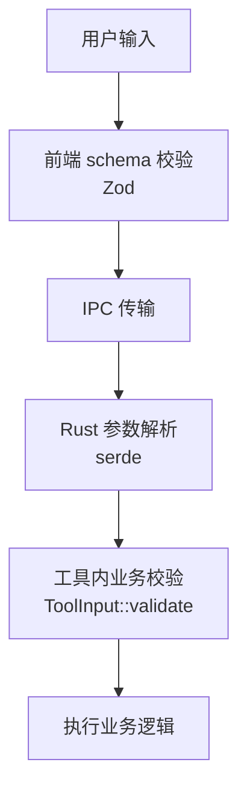
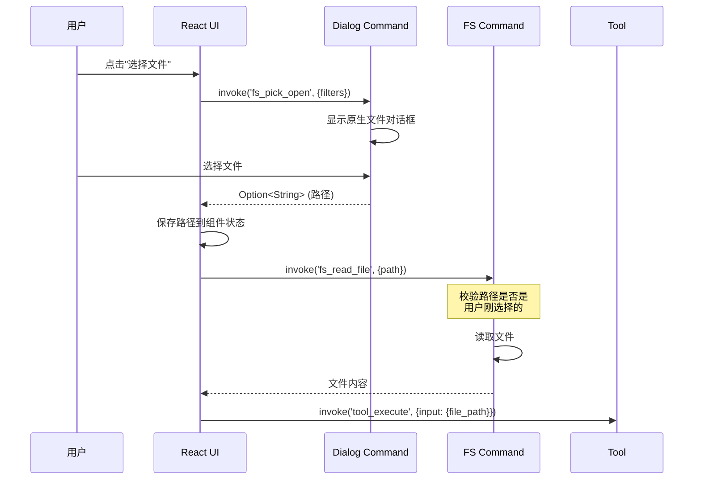
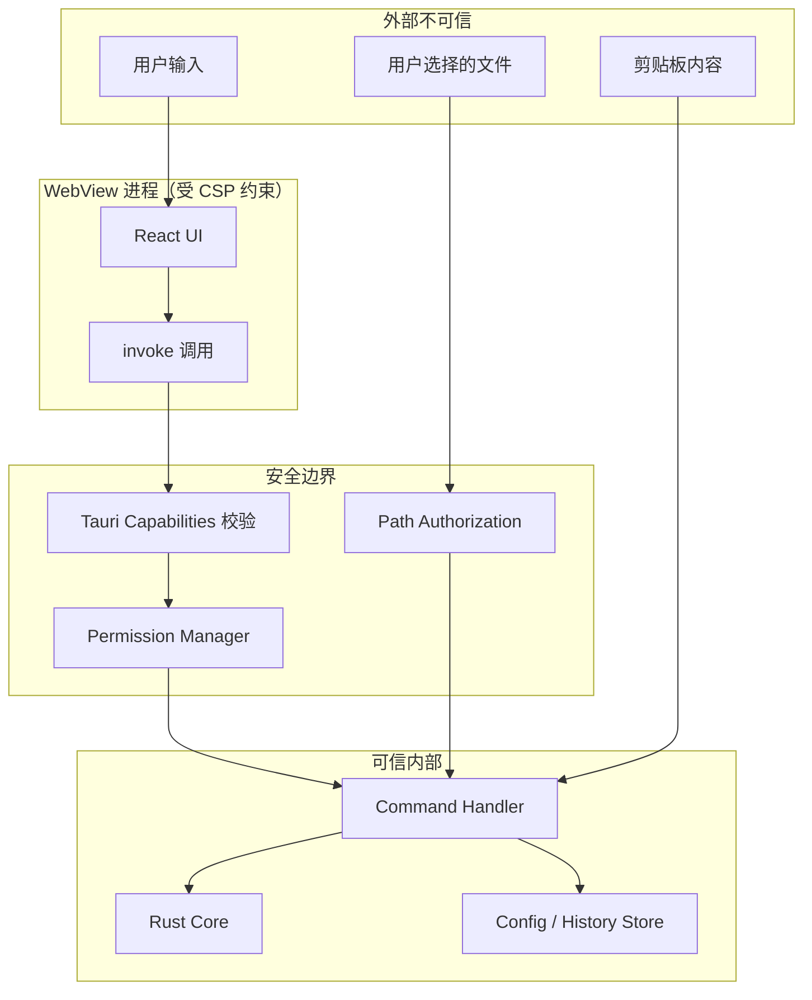

## 目录

- [1. 背景与目的](#1-背景与目的)
- [2. 核心概念](#2-核心概念)
- [3. 详细设计](#3-详细设计)
  - [3.1 零网络请求原则](#31-零网络请求原则)
  - [3.2 输入校验与清洗](#32-输入校验与清洗)
  - [3.3 文件系统沙箱](#33-文件系统沙箱)
  - [3.4 剪贴板访问控制](#34-剪贴板访问控制)
  - [3.5 Tauri 权限模型](#35-tauri-权限模型)
  - [3.6 依赖供应链安全](#36-依赖供应链安全)
- [4. 关键流程](#4-关键流程)
  - [4.1 安全边界图](#41-安全边界图)
  - [4.2 威胁模型 STRIDE](#42-威胁模型-stride)
- [5. 设计决策记录](#5-设计决策记录)
  - [5.1 零网络原则的严格执行](#51-零网络原则的严格执行)
  - [5.2 文件系统权限粒度](#52-文件系统权限粒度)
- [6. 注意事项与约束](#6-注意事项与约束)
- [7. 相关文档](#7-相关文档)

---

## 1. 背景与目的

Qraft 处理的开发数据往往包含敏感信息：JWT Token、API Key、内部接口报文、配置文件、用户凭证。如果应用本身成为数据泄露通道（如自动上报、剪贴板监听、文件系统越权），会带来严重的安全风险。

Qraft 把"零网络、本地优先"作为核心价值主张，安全是这一主张的基石。本文档的目标：

1. **明确安全底线**：列出不可妥协的安全规则
2. **设计防护层**：从输入、文件系统、剪贴板、网络、依赖多维度防护
3. **权限最小化**：基于 Tauri capabilities 模型，最小化授权
4. **可审计**：所有安全相关决策有记录，依赖可追溯

---

## 2. 核心概念

| 概念 | 定义 |
|------|------|
| 零网络原则 | 默认禁止任何外网请求，从架构层杜绝数据外泄 |
| 文件系统沙箱 | 仅允许用户显式选择的文件，禁止任意路径访问 |
| 剪贴板显式触发 | 不后台监听剪贴板，需用户点击按钮读取 |
| Tauri Capabilities | Tauri V2 的权限模型，细粒度控制 API 访问 |
| 依赖审计 | 用 cargo-audit / pnpm audit 检测已知漏洞 |
| SBOM | Software Bill of Materials，依赖清单 |
| STRIDE | 威胁建模框架（Spoofing/Tampering/Repudiation/Info Disclosure/Denial of Service/Elevation） |

---

## 3. 详细设计

### 3.1 零网络请求原则

> 📌 **项目实际**
>
> Qraft 的核心安全承诺：**应用运行期间不发起任何外网请求**。这一原则通过以下机制强制保证：

#### Tauri CSP 配置

> 配置文件：`src-tauri/tauri.conf.json`

```json
{
  "app": {
    "security": {
      "csp": "default-src 'self'; img-src 'self' data:; style-src 'self'; script-src 'self'",
      "devCsp": null
    }
  }
}
```

- `default-src 'self'`：所有资源仅允许从应用自身加载
- `img-src 'self' data:`：允许 data URI 的图片（用于 QR 码等）
- `style-src 'self'`：Tailwind 在构建期生成 CSS 文件并由 `self` 加载，运行时不需要内联样式
- `script-src 'self'`：禁止外部脚本

> 📌 **项目实际**
>
> 不使用 `style-src 'unsafe-inline'`。Tailwind CSS 经 Vite 构建后产物为静态 CSS 文件，通过 `style-src 'self'` 即可加载。若未来引入需运行时注入内联样式的第三方组件，应改用 `nonce` 机制（Tauri 支持 CSP nonce 注入），而非放宽到 `unsafe-inline`。

#### 禁用 Tauri HTTP 插件

`Cargo.toml` 中**不引入** `tauri-plugin-http`，从源头禁止 Rust 侧发起网络请求：

```toml
# 禁止引入以下依赖
# tauri-plugin-http = "..."  # 禁用
# reqwest = "..."              # 禁用
# ureq = "..."                 # 禁用
```

> 💡 **建议方案**
>
> CI 中通过脚本检查 `Cargo.toml` 与 `package.json`，若引入网络相关依赖则报错：
>
> ```bash
> # scripts/check_no_network_deps.sh
> if grep -E "(reqwest|ureq|tauri-plugin-http|axios|node-fetch)" Cargo.toml package.json; then
>   echo "ERROR: network dependency detected"
>   exit 1
> fi
> ```

#### 唯一例外：自动更新

自动更新功能需要从 GitHub Releases 拉取更新清单。这是**唯一允许的网络请求**，且：

- 仅在用户显式点击"检查更新"时发起
- 仅访问 `https://github.com/qraft/qraft/releases`
- 用户可在设置中完全禁用自动更新
- 通过 Tauri Updater 的签名验证机制保证下载完整性

### 3.2 输入校验与清洗

#### 输入校验层级



#### 校验规则

| 输入字段 | 校验规则 |
|----------|----------|
| `text` | 长度 ≤ 10MB（流式工具放宽） |
| `file_path` | 必须是用户通过 `fs_pick_open` 选择的路径 |
| `params.*` | 符合 `ToolMetadata.input_schema` |
| `tool_id` | 存在于 ToolRegistry |

#### Rust 输入校验

```rust
// src-tauri/src/core/input.rs

impl ToolInput {
    pub fn validate(&self, meta: &ToolMetadata) -> Result<(), ToolError> {
        const MAX_TEXT_SIZE: usize = 10 * 1024 * 1024;

        if let Some(text) = &self.text {
            if text.len() > MAX_TEXT_SIZE && !meta.streaming_supported {
                return Err(ToolError::InputTooLarge {
                    size: text.len(),
                    max: MAX_TEXT_SIZE,
                });
            }
        }

        // file_path 与 text 不可同时为空
        if self.text.is_none() && self.file_path.is_none() {
            return Err(ToolError::InvalidInput(
                "either 'text' or 'file_path' must be provided".into()
            ));
        }

        Ok(())
    }
}
```

### 3.3 文件系统沙箱

#### 访问规则

| 操作 | 允许路径 | 实现方式 |
|------|----------|----------|
| 读文件 | 用户通过对话框选择的文件 | `tauri-plugin-dialog` + 显式授权 |
| 写文件 | 用户通过对话框选择的位置 | `tauri-plugin-dialog` + 显式授权 |
| 配置文件 | 应用专属目录 | `directories::ProjectDirs` |
| 历史记录 | 应用专属目录 | `directories::ProjectDirs` |
| 日志文件 | 应用专属目录 | `directories::ProjectDirs` |

**禁止**：

- 任意路径读写（如 `/etc/passwd`、`C:\Windows\System32`）
- 后台扫描文件系统
- 读取其他应用的配置

#### Tauri fs 权限配置

> 配置文件：`src-tauri/capabilities/default.json`

```json
{
  "identifier": "default",
  "windows": ["main"],
  "permissions": [
    "core:default",
    "fs:allow-read-text-file",
    "fs:allow-write-text-file"
  ]
}
```

仅允许特定 fs 命令，且这些命令的 `path` 参数必须是用户通过对话框选择的。

#### 文件访问流程



#### 路径校验

```rust
// src-tauri/src/commands/fs.rs

use std::collections::HashSet;
use std::sync::Mutex;

#[derive(Default)]
pub struct AuthorizedPaths {
    inner: Mutex<HashSet<String>>,
}

impl AuthorizedPaths {
    pub fn authorize(&self, path: &str) {
        self.inner.lock().unwrap().insert(path.to_string());
    }

    pub fn is_authorized(&self, path: &str) -> bool {
        self.inner.lock().unwrap().contains(path)
    }

    pub fn revoke(&self, path: &str) {
        self.inner.lock().unwrap().remove(path);
    }
}

#[tauri::command]
async fn fs_read_file(
    path: String,
    state: tauri::State<'_, AuthorizedPaths>,
) -> Result<String, AppError> {
    if !state.is_authorized(&path) {
        return Err(AppError::Permission(format!(
            "path not authorized: {}", path
        )));
    }
    let content = tokio::fs::read_to_string(&path).await
        .map_err(|e| AppError::from(FsError::from(e)))?;
    Ok(content)
}
```

### 3.4 剪贴板访问控制

#### 访问规则

> 📌 **项目实际**
>
> Qraft **不后台监听剪贴板**。所有剪贴板访问必须由用户显式触发（点击按钮或快捷键）。这是隐私保护的核心要求。

#### 实现方式

```rust
// src-tauri/src/commands/clipboard.rs

use tauri_plugin_clipboard_manager::ClipboardExt;

#[tauri::command]
async fn clipboard_read(app: tauri::AppHandle) -> Result<String, AppError> {
    let text = app.clipboard().read_text()
        .map_err(|e| AppError::Unknown(e.to_string()))?;
    tracing::info!(length = text.len(), "clipboard read");
    Ok(text)
}

#[tauri::command]
async fn clipboard_write(app: tauri::AppHandle, text: String) -> Result<(), AppError> {
    app.clipboard().write_text(&text)
        .map_err(|e| AppError::Unknown(e.to_string()))?;
    tracing::info!(length = text.len(), "clipboard write");
    Ok(())
}
```

#### 剪贴板使用场景

| 场景 | 触发方式 |
|------|----------|
| 粘贴输入 | 用户点击"粘贴"按钮 或 Ctrl+V |
| 复制输出 | 用户点击"复制"按钮 或 Ctrl+C |
| 自动填充建议 | 用户点击"从剪贴板填充"按钮 |

**禁止**：

- 定时轮询剪贴板
- 后台监听剪贴板变化
- 自动把剪贴板内容写入历史记录

### 3.5 Tauri 权限模型

#### Capabilities 配置

> 配置文件：`src-tauri/capabilities/default.json`

```json
{
  "identifier": "default",
  "description": "Default capability for main window",
  "windows": ["main"],
  "permissions": [
    "core:default",
    "core:window:allow-minimize",
    "core:window:allow-maximize",
    "core:window:allow-close",
    "dialog:allow-open",
    "dialog:allow-save",
    "fs:allow-read-text-file",
    "fs:allow-write-text-file",
    "clipboard-manager:allow-read-text",
    "clipboard-manager:allow-write-text",
    "updater:default"
  ]
}
```

#### 权限矩阵

| Command | 权限 | 限制 |
|---------|------|------|
| `fs_read_file` | `fs:allow-read-text-file` | 仅授权路径 |
| `fs_write_file` | `fs:allow-write-text-file` | 仅授权路径 |
| `fs_pick_open` | `dialog:allow-open` | 无 |
| `fs_pick_save` | `dialog:allow-save` | 无 |
| `clipboard_read` | `clipboard-manager:allow-read-text` | 显式触发 |
| `clipboard_write` | `clipboard-manager:allow-write-text` | 无 |
| `app_open_external` | `shell:allow-open` | 仅 https:// |
| `tool_execute` | `core:default` | 无 |
| `app_check_update` | `updater:default` | 可禁用 |

#### 最小权限原则

- 每个权限都明确列出，不使用通配符
- 未列出的命令前端无法调用
- 新增 Command 必须在 capabilities 中声明

### 3.6 依赖供应链安全

#### 依赖审计

```yaml
# .github/workflows/security.yml
name: Security
on: [push, pull_request, schedule]

jobs:
  audit:
    runs-on: ubuntu-latest
    steps:
      - uses: actions/checkout@v4
      - uses: rustsec/audit-check@v2.0.0
        with:
          token: ${{ secrets.GITHUB_TOKEN }}

      - uses: actions/setup-node@v4
        with:
          node-version: '20'
      - run: npm install -g pnpm
      - run: pnpm install --frozen-lockfile
      - run: pnpm audit --audit-level moderate

      - name: cargo-deny
        uses: EmbarkStudios/cargo-deny-action@v1
        with:
          arguments: --all-features
```

#### cargo-deny 配置

```toml
# deny.toml
[advisories]
db-urls = ["https://github.com/rustsec/advisory-db"]
vulnerability = "deny"
unmaintained = "warn"
yanked = "deny"
notice = "warn"

[licenses]
allow = [
    "MIT", "Apache-2.0", "BSD-2-Clause", "BSD-3-Clause",
    "ISC", "Unicode-DFS-2016", "Zlib", "MPL-2.0"
]
confidence-threshold = 0.8

[bans]
multiple-versions = "warn"
wildcards = "deny"

[sources]
unknown-registry = "deny"
unknown-git = "deny"
allow-registry = ["https://github.com/rustsec/advisory-db"]
```

#### SBOM 生成

每次发布生成 SBOM（Software Bill of Materials）：

```bash
# Rust SBOM
cargo cyclonedx -f json --override-filename qraft-rust-sbom

# Node SBOM
pnpm dlx cyclonedx-npm --output-file qraft-npm-sbom.json
```

SBOM 随 Release 一起发布，便于用户审计。

---

## 4. 关键流程

### 4.1 安全边界图



### 4.2 威胁模型 STRIDE

| 威胁类型 | 风险 | 缓解措施 |
|----------|------|----------|
| **S**poofing（伪装） | 攻击者伪装成 Qraft 应用 | 代码签名（Windows Authenticode / macOS 公证） |
| **T**ampering（篡改） | 攻击者篡改应用二进制 | 自动更新签名验证、安装包校验和 |
| **R**epudiation（抵赖） | 用户否认操作 | 历史记录不可篡改（原子写入） |
| **I**nformation Disclosure（信息泄露） | 敏感数据外泄 | 零网络原则、剪贴板显式触发、历史脱敏 |
| **D**enial of Service（拒绝服务） | 大输入导致应用卡死 | 输入大小限制、超时、流式处理 |
| **E**levation of Privilege（提权） | 工具获得超出授权的权限 | Tauri Capabilities 最小权限、文件系统沙箱 |

---

## 5. 设计决策记录

### 5.1 零网络原则的严格执行

| 方案 | 灵活性 | 安全性 |
|------|--------|--------|
| **绝对零网络**（选定） | 极低 | 最高 |
| 允许白名单网络 | 中 | 中 |
| 用户可配置网络 | 高 | 低 |

**决策理由**：Qraft 的核心价值主张是"数据不出本机"。任何网络请求都会让用户怀疑数据是否外泄。即使有白名单，用户也难以验证。绝对零网络是最简单也最可信的承诺。

**例外**：自动更新是唯一例外，且用户可禁用。

### 5.2 文件系统权限粒度

| 方案 | 用户体验 | 安全性 |
|------|----------|--------|
| **用户显式选择每个文件**（选定） | 稍繁琐 | 高 |
| 允许特定目录访问 | 中 | 中 |
| 任意路径访问 | 高 | 低 |

**决策理由**：工具类应用偶尔需要读文件，但不应有常驻的文件系统访问权。用户显式选择每个文件虽然繁琐，但每次访问都有用户知情同意，最安全。

---

## 6. 注意事项与约束

### 6.1 安全审计

> 📌 **项目实际**
>
> 每次发布前必须执行：
>
> 1. `cargo audit` 通过（无未修复漏洞）
> 2. `pnpm audit` 通过（无 moderate 及以上漏洞）
> 3. `cargo deny check` 通过
> 4. SBOM 生成并随 Release 发布
> 5. 代码签名与公证完成
> 6. CSP 配置审计（grep 检查无 `unsafe-inline` 等宽松策略）

### 6.2 日志与隐私

日志中禁止包含：

- 用户输入的原始内容
- 文件路径（仅记录文件名）
- 剪贴板内容
- JWT Token、API Key 等敏感字段

日志格式示例：

```rust
tracing::info!(
    tool_id = %meta.id,
    input_bytes = text.len(),
    duration_ms = elapsed.as_millis(),
    "tool executed"
);
// 不记录 text 内容
```

### 6.3 安全配置不可由用户降级

- CSP 配置硬编码，用户不可修改
- 文件系统沙箱不可关闭
- 剪贴板监听不可启用
- 网络访问不可启用

用户唯一可禁用的安全相关功能是"自动更新检查"。

### 6.4 加密存储评估（待补充）

当前配置与历史明文存储。若用户有更高安全需求，评估：

- 方案 A：用 OS keychain 存储敏感字段（如用户自定义工具的 API Key）
- 方案 B：用户主密码加密整个配置文件

MVP 不实现，v1.0 评估用户反馈后决定。

---

## 7. 相关文档

- [01-project-overview.md](./01-project-overview.md) — 项目全览（零网络原则的提出）
- [04-system-architecture.md](./04-system-architecture.md) — 系统架构（权限校验在分层中的位置）
- [09-interface-design.md](./09-interface-design.md) — 接口设计（Command 权限校验）
- [10-error-handling.md](./10-error-handling.md) — 错误处理（权限拒绝错误）
- [13-security.md](./13-security.md) — 本文（安全机制）
- [14-build-and-distribution.md](./14-build-and-distribution.md) — 打包分发（代码签名与公证）
- [17-dev-workflow.md](./17-dev-workflow.md) — 开发规范（安全相关代码审查）
