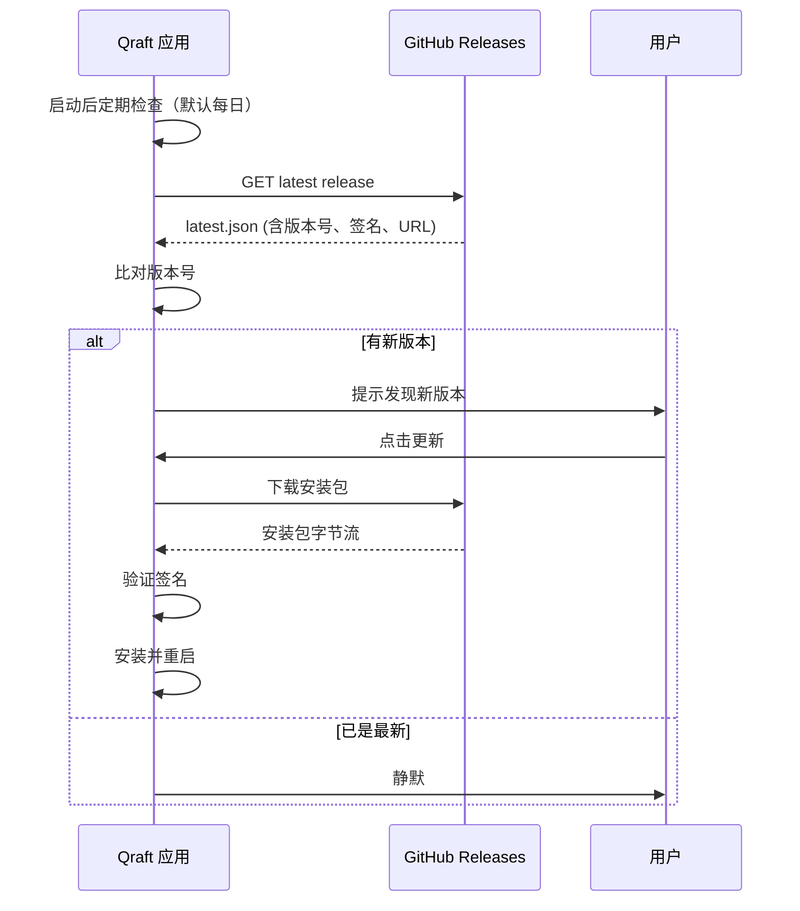
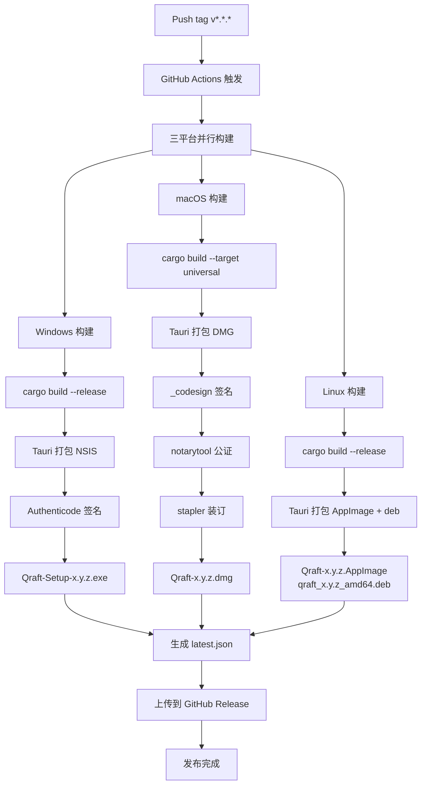
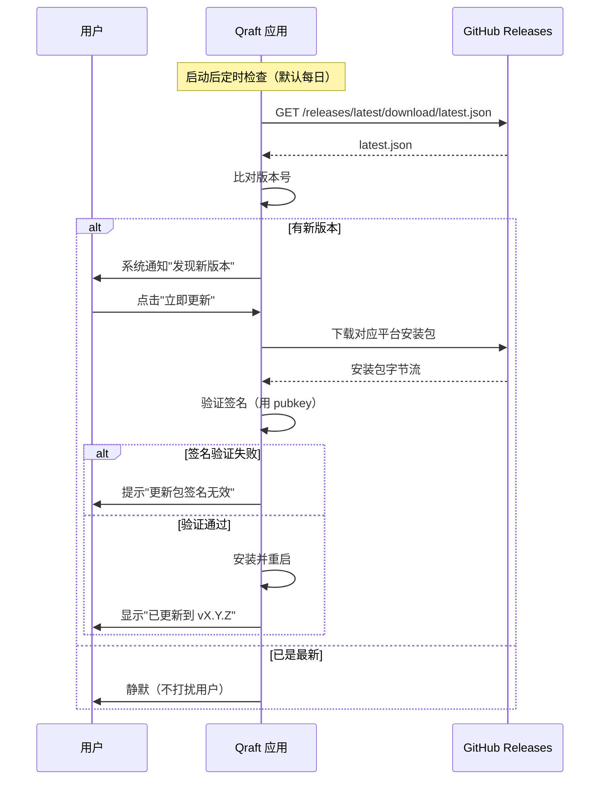

## 目录

- [1. 背景与目的](#1-背景与目的)
- [2. 核心概念](#2-核心概念)
- [3. 详细设计](#3-详细设计)
  - [3.1 Windows 打包](#31-windows-打包)
  - [3.2 macOS 打包](#32-macos-打包)
  - [3.3 Linux 打包](#33-linux-打包)
  - [3.4 Tauri Updater 自动更新](#34-tauri-updater-自动更新)
  - [3.5 代码签名与公证](#35-代码签名与公证)
  - [3.6 CI/CD 构建流水线](#36-cicd-构建流水线)
- [4. 关键流程](#4-关键流程)
  - [4.1 三平台打包流程图](#41-三平台打包流程图)
  - [4.2 自动更新时序](#42-自动更新时序)
- [5. 设计决策记录](#5-设计决策记录)
  - [5.1 Windows 安装器选择](#51-windows-安装器选择)
  - [5.2 Linux 分发格式](#52-linux-分发格式)
- [6. 注意事项与约束](#6-注意事项与约束)
- [7. 相关文档](#7-相关文档)

---

## 1. 背景与目的

Qraft 需要支持 Windows / macOS / Linux 三平台。每个平台有自己的打包格式、签名机制、自动更新方式。如果不统一管理，会导致：

1. **用户体验不一致**：不同平台安装方式差异大
2. **发布流程繁琐**：每次发布手动打包三平台
3. **安全风险**：未签名的安装包会被系统警告，用户可能被钓鱼
4. **更新困难**：手动更新让用户失去耐心

本文档的目标：

1. **统一打包流程**：基于 Tauri V2 的三平台打包配置
2. **代码签名全覆盖**：三平台均签名，避免系统警告
3. **自动更新**：基于 Tauri Updater 的静默更新
4. **CI/CD 自动化**：tag 推送即触发三平台构建与发布

---

## 2. 核心概念

| 概念 | 定义 |
|------|------|
| NSIS | Windows 的安装器格式（Nullsoft Scriptable Install System） |
| MSI | Windows 的企业级安装包格式（Windows Installer） |
| DMG | macOS 的磁盘镜像分发格式 |
| AppImage | Linux 的便携式应用格式 |
| deb / rpm | Linux 的发行版特定包格式 |
| 代码签名 | 用私钥对二进制签名，证明来源可信 |
| 公证（Notarization） | Apple 对 macOS 应用的安全审查 |
| Universal Binary | macOS 上同时包含 x86_64 与 aarch64 的二进制 |
| Tauri Updater | Tauri 内置的应用自动更新机制 |

---

## 3. 详细设计

### 3.1 Windows 打包

#### 安装器选择

> 📌 **项目实际**
>
> Windows 主用 **NSIS** 安装器，因为它轻量、定制性强、用户体验好。MSI 作为企业部署的备选，但不在 MVP 范围。

#### Tauri 配置

```json
// src-tauri/tauri.conf.json
{
  "bundle": {
    "active": true,
    "targets": ["nsis"],
    "icon": [
      "icons/32x32.png",
      "icons/128x128.png",
      "icons/128x128@2x.png",
      "icons/icon.icns",
      "icons/icon.ico"
    ],
    "windows": {
      "nsis": {
        "installMode": "perMachine",
        "languages": ["English", "SimplifiedChinese"],
        "displayLanguageSelector": false
      },
      "webviewInstallMode": {
        "type": "downloadBootstrapper"
      }
    }
  }
}
```

#### WebView2 处理

Windows 上的 WebView 来自 WebView2 Runtime。两种处理方式：

| 方式 | 包体积 | 用户体验 |
|------|--------|----------|
| **downloadBootstrapper**（选定） | 小（依赖系统安装） | 首次启动自动下载安装 |
| embedBootstrapper | 中（含 bootstrapper） | 离线可用 |
| offlineInstaller | 大（含完整 WebView2） | 完全离线 |

**决策**：`downloadBootstrapper`，包体积小，绝大多数 Windows 10/11 已预装 WebView2。

#### 签名

使用 Authenticode 代码签名证书（EV 或 OV）：

```bash
# CI 中签名
signtool sign /f cert.pfx /p ${{ secrets.CERT_PASSWORD }} \
  /tr http://timestamp.digicert.com /td sha256 /fd sha256 \
  Qraft-Setup-*.exe
```

### 3.2 macOS 打包

#### Universal Binary

> 📌 **项目实际**
>
> macOS 必须构建 **Universal Binary**（同时支持 Intel 与 Apple Silicon），避免为不同架构分发多个包。

```bash
# Tauri 自动构建 Universal Binary
rustup target add aarch64-apple-darwin
rustup target add x86_64-apple-darwin
pnpm tauri build --target universal-apple-darwin
```

#### Tauri 配置

```json
// src-tauri/tauri.conf.json
{
  "bundle": {
    "targets": ["dmg", "app"],
    "macOS": {
      "signingIdentity": "Developer ID Application: Your Name (XXXXXXXXXX)",
      "entitlements": "entitlements.plist",
      "exceptionDomain": "",
      "frameworks": [],
      "providerShortName": "Qraft",
      "minimumSystemVersion": "11.0"
    }
  }
}
```

#### entitlements.plist

```xml
<?xml version="1.0" encoding="UTF-8"?>
<!DOCTYPE plist PUBLIC "-//Apple//DTD PLIST 1.0//EN" "http://www.apple.com/DTDs/PropertyList-1.0.dtd">
<plist version="1.0">
<dict>
    <key>com.apple.security.app-sandbox</key>
    <false/>
    <key>com.apple.security.network.client</key>
    <false/>
    <key>com.apple.security.files.user-selected.read-only</key>
    <true/>
    <key>com.apple.security.files.user-selected.read-write</key>
    <true/>
</dict>
</plist>
```

#### 公证流程

```bash
# 1. 签名
codesign --deep --force --verify --verbose \
  --sign "Developer ID Application: Your Name (XXXXXXXXXX)" \
  --options runtime \
  --entitlements entitlements.plist \
  Qraft.app

# 2. 压缩
ditto -c -k --keepParent Qraft.app Qraft.zip

# 3. 公证
xcrun notarytool submit Qraft.zip \
  --apple-id "your@email.com" \
  --password ${{ secrets.APPLE_APP_SPECIFIC_PASSWORD }} \
  --team-id "XXXXXXXXXX" \
  --wait

# 4. 装订票据
xcrun stapler staple Qraft.app
```

### 3.3 Linux 打包

#### 分发格式优先级

| 格式 | 优先级 | 优点 | 缺点 |
|------|--------|------|------|
| **AppImage** | P0（选定） | 单文件、免安装、跨发行版 | 用户需手动 chmod +x |
| deb | P1 | Ubuntu/Debian 原生 | 仅 Debian 系 |
| rpm | P2 | Fedora/RHEL 原生 | 仅 RedHat 系 |
| FlatPak | P2 | 沙箱、商店分发 | 沙箱限制可能影响工具 |
| Snap | P3 | 商店分发 | 严格沙箱、启动慢 |

#### Tauri 配置

```json
// src-tauri/tauri.conf.json
{
  "bundle": {
    "targets": ["appimage", "deb"],
    "linux": {
      "deb": {
        "depends": ["libwebkit2gtk-4.1-0", "libssl3"]
      },
      "appimage": {
        "bundleMediaFramework": true
      }
    }
  }
}
```

#### AppImage 注意事项

- AppImage 内置所有依赖，体积稍大（~30MB）
- 用户首次运行需 `chmod +x Qraft-x86_64.AppImage`
- 集成到桌面环境需用 AppImageLauncher 等工具

### 3.4 Tauri Updater 自动更新

#### 更新机制



#### 更新配置

```json
// src-tauri/tauri.conf.json
{
  "plugins": {
    "updater": {
      "active": true,
      "endpoints": [
        "https://github.com/qraft/qraft/releases/latest/download/latest.json"
      ],
      "pubkey": "BASE64_PUBLIC_KEY"
    }
  }
}
```

#### latest.json 格式

```json
{
  "version": "0.2.0",
  "notes": "Bug fixes and performance improvements",
  "pub_date": "2026-08-01T00:00:00Z",
  "platforms": {
    "windows-x86_64": {
      "signature": "dW50cnVzdGVkIGNvbW1lbnQ6...",
      "url": "https://github.com/qraft/qraft/releases/download/v0.2.0/Qraft-Setup-0.2.0.exe"
    },
    "darwin-universal": {
      "signature": "dW50cnVzdGVkIGNvbW1lbnQ6...",
      "url": "https://github.com/qraft/qraft/releases/download/v0.2.0/Qraft-0.2.0.dmg"
    },
    "linux-x86_64": {
      "signature": "dW50cnVzdGVkIGNvbW1lbnQ6...",
      "url": "https://github.com/qraft/qraft/releases/download/v0.2.0/Qraft-0.2.0.AppImage"
    }
  }
}
```

#### 签名密钥管理

```bash
# 生成密钥对
pnpm tauri signer generate -w ~/.tauri/qraft.key

# 公钥写入 tauri.conf.json
# 私钥存为 GitHub Secret: TAURI_PRIVATE_KEY
# 密码存为 GitHub Secret: TAURI_KEY_PASSWORD
```

#### 灰度发布

> 💡 **建议方案**
>
> 通过 latest.json 的多版本管理实现灰度：
>
> 1. **canary**：`latest-canary.json`，仅向勾选"实验性更新"的用户推送
> 2. **stable**：`latest.json`，向所有用户推送
> 3. **回滚**：发布旧版本的 latest.json 覆盖

### 3.5 代码签名与公证

#### 签名矩阵

| 平台 | 签名类型 | 证书来源 |
|------|----------|----------|
| Windows | Authenticode（EV 推荐） | DigiCert / Sectigo |
| macOS | Developer ID Application | Apple Developer Program |
| Linux | 无强制要求（可选 GPG） | 自签名 |

#### 证书管理

- 证书与私钥存为 GitHub Secrets
- macOS 应用专用密码存为 `APPLE_APP_SPECIFIC_PASSWORD`
- Tauri 签名私钥存为 `TAURI_PRIVATE_KEY`

#### 用户验证

| 平台 | 验证方式 |
|------|----------|
| Windows | SmartScreen 通过 EV 证书立即建立声誉 |
| macOS | Gatekeeper 检查签名 + 公证票据 |
| Linux | 用户自行验证 checksum |

### 3.6 CI/CD 构建流水线

#### GitHub Actions 矩阵构建

```yaml
# .github/workflows/release.yml
name: Release
on:
  push:
    tags: ['v*']

jobs:
  build:
    strategy:
      fail-fast: false
      matrix:
        include:
          - platform: windows-latest
            target: x86_64-pc-windows-msvc
          - platform: macos-latest
            target: universal-apple-darwin
          - platform: ubuntu-22.04
            target: x86_64-unknown-linux-gnu

    runs-on: ${{ matrix.platform }}
    steps:
      - uses: actions/checkout@v4

      - name: Setup Rust
        uses: dtolnay/rust-toolchain@stable
        with:
          targets: ${{ matrix.target }}

      - name: Setup Node
        uses: actions/setup-node@v4
        with:
          node-version: '20'

      - name: Setup pnpm
        run: npm install -g pnpm

      - name: Install frontend deps
        run: pnpm install --frozen-lockfile

      - name: Install Linux deps
        if: matrix.platform == 'ubuntu-22.04'
        run: |
          sudo apt update
          sudo apt install -y libwebkit2gtk-4.1-dev libssl-dev libgtk-3-dev \
            libayatana-appindicator3-dev librsvg2-dev

      - name: Build Tauri
        uses: tauri-apps/tauri-action@v0
        env:
          GITHUB_TOKEN: ${{ secrets.GITHUB_TOKEN }}
          TAURI_PRIVATE_KEY: ${{ secrets.TAURI_PRIVATE_KEY }}
          TAURI_KEY_PASSWORD: ${{ secrets.TAURI_KEY_PASSWORD }}
          # macOS
          APPLE_CERTIFICATE: ${{ secrets.APPLE_CERTIFICATE }}
          APPLE_CERTIFICATE_PASSWORD: ${{ secrets.APPLE_CERTIFICATE_PASSWORD }}
          APPLE_SIGNING_IDENTITY: ${{ secrets.APPLE_SIGNING_IDENTITY }}
          APPLE_ID: ${{ secrets.APPLE_ID }}
          APPLE_PASSWORD: ${{ secrets.APPLE_APP_SPECIFIC_PASSWORD }}
          APPLE_TEAM_ID: ${{ secrets.APPLE_TEAM_ID }}
          # Windows
          TAURI_SIGNING_PRIVATE_KEY: ${{ secrets.WINDOWS_CERTIFICATE }}
          TAURI_SIGNING_PRIVATE_KEY_PASSWORD: ${{ secrets.WINDOWS_CERTIFICATE_PASSWORD }}
        with:
          tagName: ${{ github.ref_name }}
          releaseName: 'Qraft ${{ github.ref_name }}'
          releaseDraft: true
          prerelease: false
          args: --target ${{ matrix.target }}
```

---

## 4. 关键流程

### 4.1 三平台打包流程图



### 4.2 自动更新时序



---

## 5. 设计决策记录

### 5.1 Windows 安装器选择

| 方案 | 优点 | 缺点 |
|------|------|------|
| **NSIS**（选定） | 轻量、定制性强、用户友好 | 企业部署能力弱 |
| MSI | 企业级、组策略支持 | 开发复杂、定制弱 |
| Portable ZIP | 免安装 | 无快捷方式、不自更新 |

**决策理由**：Qraft 面向个人开发者，企业部署需求弱。NSIS 的定制性强（自定义安装界面、语言选择），用户体验好。MSI 作为 v1.0 评估选项。

### 5.2 Linux 分发格式

| 方案 | 覆盖范围 | 沙箱 | 用户便利 |
|------|----------|------|----------|
| **AppImage + deb**（选定） | 大部分发行版 | 无 | 高 |
| FlatPak | 商店分发 | 严格 | 中 |
| Snap | 商店分发 | 严格 | 中 |
| 仅 deb | Debian 系 | 无 | Debian 系高 |

**决策理由**：AppImage 单文件免安装，覆盖所有 Linux 发行版。deb 覆盖 Debian/Ubuntu 用户。两者结合覆盖 90% Linux 桌面用户。FlatPak/Snap 的沙箱会限制文件系统访问，与 Qraft 的工具场景冲突。

---

## 6. 注意事项与约束

### 6.1 版本号规范

遵循 SemVer：

- `v0.x.y`：MVP 阶段
- `v1.0.0`：首个稳定版
- `v1.x.y`：功能更新
- `v2.0.0`：破坏性变更

每个版本号对应一个 git tag，CI 自动触发构建。

### 6.2 发布前检查清单

> 📌 **项目实际**
>
> 发布前必须确认：
>
> 1. 所有 P0 测试通过
> 2. `cargo audit` 无漏洞
> 3. `pnpm audit` 无漏洞
> 4. 三平台本地构建成功
> 5. 签名证书未过期
> 6. macOS 公证账号可用
> 7. CHANGELOG 已更新
> 8. 版本号已更新（Cargo.toml + package.json + tauri.conf.json）
> 9. latest.json 准备就绪

### 6.3 回滚策略

若新版本有严重 bug：

1. 立即用旧版本号重新发布（覆盖 latest.json）
2. GitHub Release 标记新版本为 `pre-release` 或撤回
3. 通过应用内"回滚"功能（v1.0 评估）让用户回到上一版本

### 6.4 包体积监控

每次发布测量包体积：

- >30MB 阻断发布
- 比上次增加 >2MB 在 Release Notes 中说明原因

### 6.5 [待补充: 内测分发渠道]

CI 自动发布到 GitHub Releases。但内测用户可能不便使用 GitHub。评估：

- 通过 GitHub Actions 自动分发到内测用户邮箱
- 集成 Squirrel.Mac / Sparkle 等更新框架（但 Tauri Updater 已足够）

### 6.6 [待补充: 私有仓库发布的签名密钥轮换]

Tauri 签名密钥应定期轮换（每年一次）。需要：

- 文档化轮换流程
- 在 latest.json 中支持多 pubkey 过渡期
- 旧 pubkey 在过渡期后废弃

---

## 7. 相关文档

- [01-project-overview.md](./01-project-overview.md) — 项目全览（三平台支持承诺）
- [03-tech-stack.md](./03-tech-stack.md) — 技术栈（Tauri V2 与构建工具）
- [11-testing-strategy.md](./11-testing-strategy.md) — 测试策略（CI 中的测试阶段）
- [13-security.md](./13-security.md) — 安全机制（代码签名与公证的安全意义）
- [17-dev-workflow.md](./17-dev-workflow.md) — 开发规范（发布流程与版本管理）
- [19-roadmap.md](./19-roadmap.md) — 路线图（v1.0/v2.0 的分发演进）
