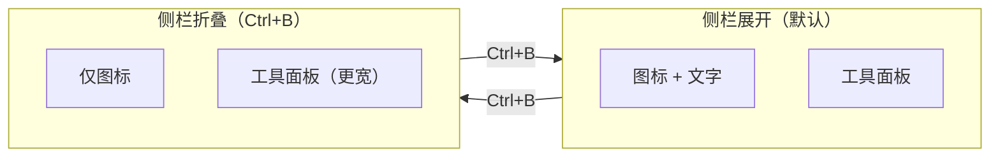
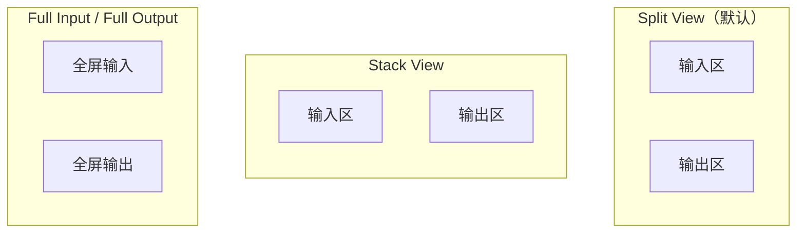
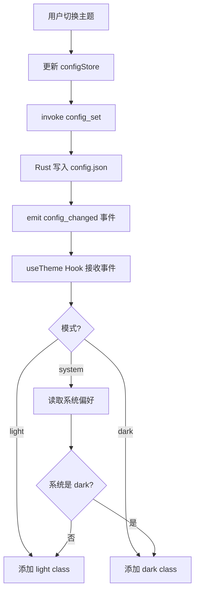
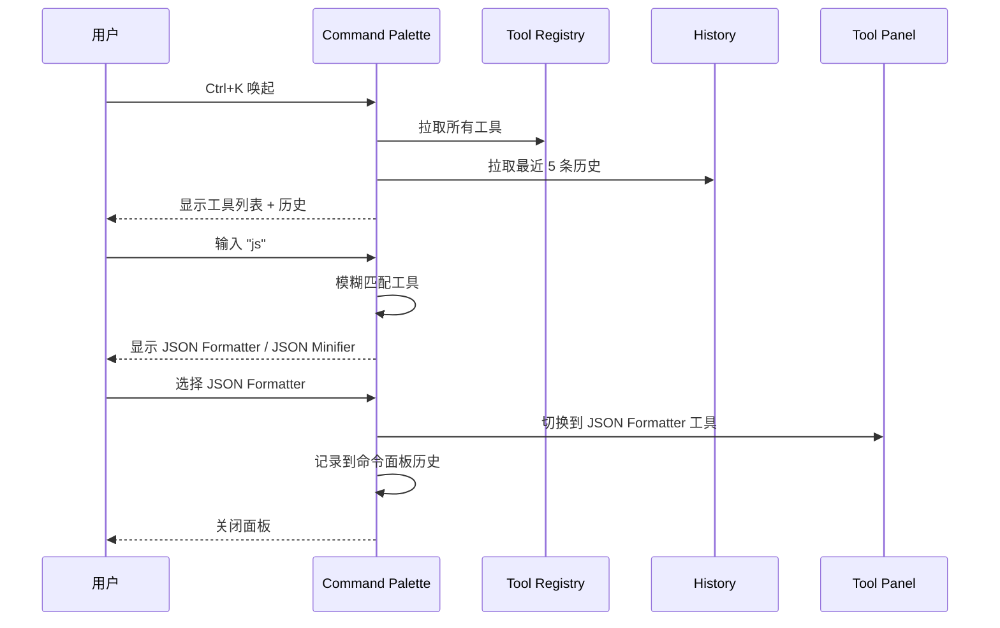

## 目录

- [1. 背景与目的](#1-背景与目的)
- [2. 核心概念](#2-核心概念)
- [3. 详细设计](#3-详细设计)
  - [3.1 shadcn/ui 组件使用规范](#31-shadcnui-组件使用规范)
  - [3.2 设计 Token](#32-设计-token)
  - [3.3 暗色与亮色主题](#33-暗色与亮色主题)
  - [3.4 响应式布局策略](#34-响应式布局策略)
  - [3.5 工具面板布局模式](#35-工具面板布局模式)
  - [3.6 快捷键体系](#36-快捷键体系)
- [4. 关键流程](#4-关键流程)
  - [4.1 主题切换流程](#41-主题切换流程)
  - [4.2 命令面板交互流程](#42-命令面板交互流程)
- [5. 设计决策记录](#5-设计决策记录)
  - [5.1 组件库选择](#51-组件库选择)
  - [5.2 主题切换方案](#52-主题切换方案)
- [6. 注意事项与约束](#6-注意事项与约束)
- [7. 相关文档](#7-相关文档)

---

## 1. 背景与目的

Qraft 是 34 个（规划）工具的集合，UI 是用户接触工具的直接界面。如果 UI 风格不统一，会导致：

1. **学习成本高**：每个工具的交互方式都不同
2. **视觉混乱**：颜色、间距、字体不一致
3. **维护困难**：样式代码重复、修改一处要改多处
4. **无障碍差**：键盘导航、对比度等无障碍特性缺失

本文档定义 Qraft 的 UI 设计体系，目标是：

1. **统一视觉**：所有工具遵循同一套设计 Token 与组件
2. **统一交互**：相同操作在所有工具中行为一致
3. **暗色优先**：开发者偏好暗色，亮色作为备选
4. **键盘友好**：所有操作可键盘完成，定义快捷键体系

---

## 2. 核心概念

| 概念 | 定义 |
|------|------|
| Design Token | 设计变量（颜色、间距、字体等），用 CSS 变量定义 |
| shadcn/ui | 基于 Radix UI + Tailwind 的源码即组件方案 |
| Tool Panel | 工具面板，每个工具的主操作界面 |
| Command Palette | 命令面板，Ctrl+K 唤起的全局搜索 |
| Split View | 分栏视图，左输入右输出 |
| Theme | 主题（light / dark / system） |

---

## 3. 详细设计

### 3.1 shadcn/ui 组件使用规范

#### 引入原则

> 📌 **项目实际**
>
> 1. **按需引入**：用 `pnpm dlx shadcn@latest add <component>` 按需添加组件，不引入全量包
> 2. **源码可改**：组件源码复制到 `src/components/ui/`，可自由修改
> 3. **不依赖全量包**：不安装 `shadcn-ui` 整包，每个组件独立
> 4. **统一目录**：所有 shadcn 组件放在 `src/components/ui/`

#### 必备组件清单

| 组件 | 用途 |
|------|------|
| Button | 按钮 |
| Input | 单行输入 |
| Textarea | 多行输入 |
| Select | 下拉选择 |
| Switch | 开关 |
| Slider | 滑块 |
| Dialog | 模态框 |
| Sheet | 侧滑面板 |
| Tabs | 标签页 |
| Tooltip | 提示气泡 |
| Toast / Sonner | 通知 |
| Command | 命令面板（基于 cmdk） |
| ScrollArea | 滚动区域 |
| Separator | 分隔线 |
| Label | 标签 |
| Form | 表单（配合 React Hook Form） |

#### 组件使用示例

```typescript
// src/tools/Base64Codec.tsx

import { Button } from '@/components/ui/button';
import { Textarea } from '@/components/ui/textarea';
import { Select, SelectContent, SelectItem, SelectTrigger, SelectValue } from '@/components/ui/select';
import { Switch } from '@/components/ui/switch';

export function Base64Codec() {
  return (
    <div className="grid grid-cols-2 gap-4 h-full">
      <div className="flex flex-col gap-2">
        <Textarea
          placeholder="Enter text to encode/decode"
          className="flex-1 font-mono"
        />
      </div>
      <div className="flex flex-col gap-2">
        <Textarea readOnly className="flex-1 font-mono" />
      </div>
      <div className="col-span-2 flex items-center gap-4">
        <Select defaultValue="encode">
          <SelectTrigger className="w-32">
            <SelectValue />
          </SelectTrigger>
          <SelectContent>
            <SelectItem value="encode">Encode</SelectItem>
            <SelectItem value="decode">Decode</SelectItem>
          </SelectContent>
        </Select>
        <div className="flex items-center gap-2">
          <Switch id="url-safe" />
          <label htmlFor="url-safe">URL Safe</label>
        </div>
        <Button>Execute</Button>
      </div>
    </div>
  );
}
```

### 3.2 设计 Token

#### CSS 变量定义

```css
/* src/styles/globals.css */

@layer base {
  :root {
    /* 背景 */
    --background: 0 0% 100%;
    --foreground: 222.2 84% 4.9%;

    /* 卡片 */
    --card: 0 0% 100%;
    --card-foreground: 222.2 84% 4.9%;

    /* 弹出层 */
    --popover: 0 0% 100%;
    --popover-foreground: 222.2 84% 4.9%;

    /* 主色 */
    --primary: 221.2 83.2% 53.3%;
    --primary-foreground: 210 40% 98%;

    /* 次要色 */
    --secondary: 210 40% 96.1%;
    --secondary-foreground: 222.2 47.4% 11.2%;

    /* 静音色 */
    --muted: 210 40% 96.1%;
    --muted-foreground: 215.4 16.3% 46.9%;

    /* 强调色 */
    --accent: 210 40% 96.1%;
    --accent-foreground: 222.2 47.4% 11.2%;

    /* 危险色 */
    --destructive: 0 84.2% 60.2%;
    --destructive-foreground: 210 40% 98%;

    /* 边框 */
    --border: 214.3 31.8% 91.4%;
    --input: 214.3 31.8% 91.4%;
    --ring: 221.2 83.2% 53.3%;

    /* 圆角 */
    --radius: 0.5rem;

    /* 间距 */
    --space-1: 0.25rem;
    --space-2: 0.5rem;
    --space-3: 0.75rem;
    --space-4: 1rem;
    --space-6: 1.5rem;
    --space-8: 2rem;

    /* 字体 */
    --font-sans: 'Inter', system-ui, sans-serif;
    --font-mono: 'JetBrains Mono', 'Fira Code', monospace;
    --font-size-sm: 0.875rem;
    --font-size-base: 1rem;
    --font-size-lg: 1.125rem;
  }

  .dark {
    --background: 222.2 84% 4.9%;
    --foreground: 210 40% 98%;
    /* ... 暗色模式变量 */
  }
}
```

#### Tailwind 配置

```typescript
// tailwind.config.ts

export default {
  darkMode: 'class',
  theme: {
    extend: {
      colors: {
        background: 'hsl(var(--background))',
        foreground: 'hsl(var(--foreground))',
        primary: {
          DEFAULT: 'hsl(var(--primary))',
          foreground: 'hsl(var(--primary-foreground))',
        },
        // ... 其他颜色映射到 CSS 变量
      },
      borderRadius: {
        lg: 'var(--radius)',
        md: 'calc(var(--radius) - 2px)',
        sm: 'calc(var(--radius) - 4px)',
      },
      fontFamily: {
        sans: ['var(--font-sans)'],
        mono: ['var(--font-mono)'],
      },
    },
  },
};
```

### 3.3 暗色与亮色主题

#### 主题切换实现

```typescript
// src/lib/theme.ts

import { useEffect } from 'react';
import { useConfigStore } from '@/store/configStore';

type Theme = 'light' | 'dark' | 'system';

export function useTheme() {
  const themeMode = useConfigStore((s) => s.theme.mode);

  useEffect(() => {
    const root = document.documentElement;
    root.classList.remove('light', 'dark');

    const effective = themeMode === 'system'
      ? getSystemTheme()
      : themeMode;

    root.classList.add(effective);
  }, [themeMode]);

  // 监听系统主题变化
  useEffect(() => {
    if (themeMode !== 'system') return;

    const mq = window.matchMedia('(prefers-color-scheme: dark)');
    const handler = () => {
      const root = document.documentElement;
      root.classList.remove('light', 'dark');
      root.classList.add(getSystemTheme());
    };
    mq.addEventListener('change', handler);
    return () => mq.removeEventListener('change', handler);
  }, [themeMode]);
}

function getSystemTheme(): 'light' | 'dark' {
  return window.matchMedia('(prefers-color-scheme: dark)').matches
    ? 'dark'
    : 'light';
}
```

#### MVP 主题策略

> 📌 **项目实际**
>
> MVP 阶段**仅支持暗色主题**，亮色主题推迟到 v1.0。理由：
>
> 1. 开发者偏好暗色（80%+ 用户）
> 2. 代码编辑器场景暗色更舒适
> 3. 减少 MVP 工作量，专注核心功能

### 3.4 响应式布局策略

#### 桌面端优先

Qraft 是纯桌面端，不考虑移动端。但仍需响应不同窗口大小：

| 窗口大小 | 布局调整 |
|----------|----------|
| ≥ 1200px | 完整三栏：侧栏 + 工具面板 + 历史/收藏 |
| 800-1200px | 双栏：侧栏 + 工具面板（历史可折叠） |
| < 800px | 不支持（最小窗口 800x600） |

#### 最小窗口约束

```typescript
// src-tauri/src/main.rs

tauri::Builder::default()
    .setup(|app| {
        let window = app.get_window("main").unwrap();
        window.set_min_size(Some(tauri::LogicalSize::new(800.0, 600.0)))?;
        Ok(())
    })
```

#### 侧栏可折叠



### 3.5 工具面板布局模式

#### 三种布局模式



#### 各模式适用场景

| 模式 | 适用工具 | 优势 |
|------|----------|------|
| **Split View**（默认） | JSON / Base64 / Hash | 输入输出并排对比 |
| Stack View | UUID / Password | 输入短，输出长 |
| Full Input | Regex / Diff | 输入是大文本 |
| Full Output | Markdown Preview | 输出是大内容 |

#### 用户切换

用户可在工具面板右上角切换布局，选择会持久化到 `tool_prefs`：

```typescript
interface ToolPref {
  layout?: 'split' | 'stack' | 'full-input' | 'full-output';
  // ... 其他工具特定偏好
}
```

### 3.6 快捷键体系

#### 全局快捷键

| 快捷键 | 功能 | 可配置 |
|--------|------|--------|
| `Ctrl+K` / `Cmd+K` | 命令面板 | 是 |
| `Ctrl+B` / `Cmd+B` | 切换侧栏 | 是 |
| `Ctrl+,` / `Cmd+,` | 打开设置 | 是 |
| `Ctrl+P` / `Cmd+P` | 工具切换 | 是 |
| `Ctrl+Shift+C` | 复制输出 | 是 |
| `Ctrl+L` | 清空输入 | 是 |
| `Ctrl+Enter` | 执行工具 | 是 |
| `Ctrl+H` | 打开历史 | 是 |
| `Ctrl+F` | 工具内搜索 | 是 |
| `Esc` | 关闭对话框/面板 | 是 |

> 全部 10 个快捷键均持久化到 `UserConfig.shortcuts`（`ShortcutBinding`），与 [08-data-model.md](./08-data-model.md) §3.2 的定义一一对应，可在设置中自定义。

#### 工具内快捷键

每个工具可定义自己的快捷键（在 `ToolMetadata` 中声明，由前端渲染提示）。

#### 快捷键配置存储

```typescript
// src/store/configStore.ts

interface ShortcutBinding {
  open_command_palette: string; // "Ctrl+K"
  toggle_sidebar: string;       // "Ctrl+B"
  execute_tool: string;          // "Ctrl+Enter"
  clear_input: string;           // "Ctrl+L"
  copy_output: string;           // "Ctrl+Shift+C"
  toggle_settings: string;        // "Ctrl+,"
  switch_tool: string;            // "Ctrl+P"
  open_history: string;           // "Ctrl+H"
  search: string;                // "Ctrl+F"
  close_panel: string;           // "Esc"
}
```

#### 实现示例

```typescript
// src/hooks/useShortcut.ts

import { useEffect } from 'react';
import { useConfigStore } from '@/store/configStore';

export function useShortcut(
  key: keyof ShortcutBinding,
  handler: () => void,
  deps: any[] = []
) {
  const shortcut = useConfigStore((s) => s.shortcuts[key]);

  useEffect(() => {
    const parsed = parseShortcut(shortcut);
    const handlerWrapper = (e: KeyboardEvent) => {
      if (matchShortcut(e, parsed)) {
        e.preventDefault();
        handler();
      }
    };
    window.addEventListener('keydown', handlerWrapper);
    return () => window.removeEventListener('keydown', handlerWrapper);
  }, [shortcut, ...deps]);
}

// 使用
useShortcut('open_command_palette', () => setPaletteOpen(true));
```

---

## 4. 关键流程

### 4.1 主题切换流程



### 4.2 命令面板交互流程



---

## 5. 设计决策记录

### 5.1 组件库选择

| 方案 | 优点 | 缺点 |
|------|------|------|
| **shadcn/ui**（选定） | 源码可控、Tailwind 原生、可裁剪 | 需逐个引入 |
| MUI | 生态完整、组件丰富 | 包体积大、样式系统独立 |
| Ant Design | 企业级组件 | 设计风格固定、体积大 |
| Chakra UI | API 简洁 | 性能稍逊 |

**决策理由**：Qraft 是工具类应用，组件需求简单（按钮、输入框、对话框等）。shadcn/ui 按需引入、源码可控、与 Tailwind 一致，是最优解。

### 5.2 主题切换方案

| 方案 | 优点 | 缺点 |
|------|------|------|
| **CSS 变量 + class 切换**（选定） | 简单、Tailwind 原生支持 | 需手动管理 |
| next-themes | 现成方案 | 引入额外依赖 |
| CSS-in-JS 动态 | 灵活 | 性能差 |

**决策理由**：shadcn/ui 默认用 CSS 变量方案，自实现简单几行代码即可。引入 next-themes 增加依赖且其 SSR 特性 Qraft 不需要。

---

## 6. 注意事项与约束

### 6.1 视觉一致性

> 📌 **项目实际**
>
> 1. **颜色统一**：所有工具使用 `primary` `secondary` 等 Token 颜色，禁止硬编码 `#xxxxxx`
> 2. **间距统一**：用 Tailwind 的 `gap-2` `gap-4` 等，不写 `margin: 13px`
> 3. **字体统一**：UI 文字用 `font-sans`，代码用 `font-mono`
> 4. **圆角统一**：用 `rounded-md` `rounded-lg`，不写 `border-radius: 7px`

### 6.2 无障碍

- 所有交互元素可键盘导航（Tab / Shift+Tab）
- 颜色对比度 ≥ WCAG AA 标准（4.5:1）
- 图标按钮有 `aria-label`
- 表单字段有 `label` 关联

### 6.3 字体加载

```css
/* src/styles/globals.css */
@font-face {
  font-family: 'Inter';
  src: url('/fonts/Inter.woff2') format('woff2');
  font-display: swap;
}

@font-face {
  font-family: 'JetBrains Mono';
  src: url('/fonts/JetBrainsMono.woff2') format('woff2');
  font-display: swap;
}
```

字体文件打包到应用内（不依赖 Google Fonts），遵守零网络原则。

### 6.4 亮色主题完整定义（待补充）

MVP 阶段仅暗色，亮色主题推迟到 v1.0。需补充：

- 完整亮色 Token 定义
- 亮色模式下的对比度验证
- 工具面板在亮色下的视觉调优

### 6.5 自定义主题色（待补充）

用户可能希望自定义强调色（accent color）。需评估：

- 提供预设色板（5-10 种）
- 用户自定义颜色选择器
- 颜色持久化与全应用同步

---

## 7. 相关文档

- [02-glossary.md](./02-glossary.md) — 术语表（Command Palette / Theme 等定义）
- [03-tech-stack.md](./03-tech-stack.md) — 技术栈（shadcn/ui / Tailwind 选型）
- [06-tool-plugin-system.md](./06-tool-plugin-system.md) — 工具插件体系（input_schema 与 UI 渲染）
- [07-tool-catalog.md](./07-tool-catalog.md) — 工具目录（每个工具的 UI 需求）
- [12-performance.md](./12-performance.md) — 性能优化（React 渲染优化）
- [16-state-management.md](./16-state-management.md) — 状态管理（主题状态、布局偏好）
- [17-dev-workflow.md](./17-dev-workflow.md) — 开发规范（UI 代码规范）
