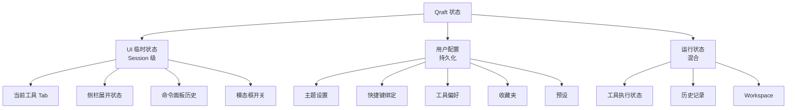
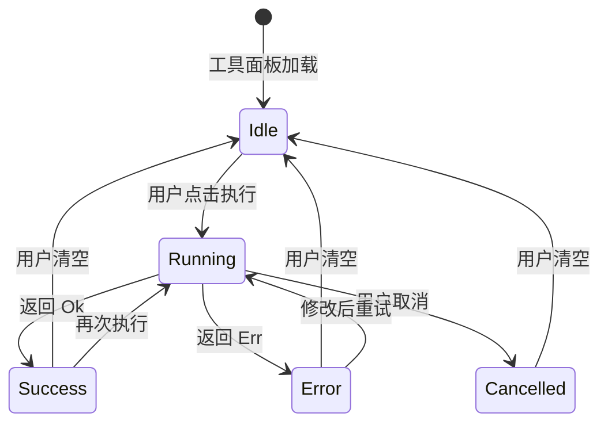
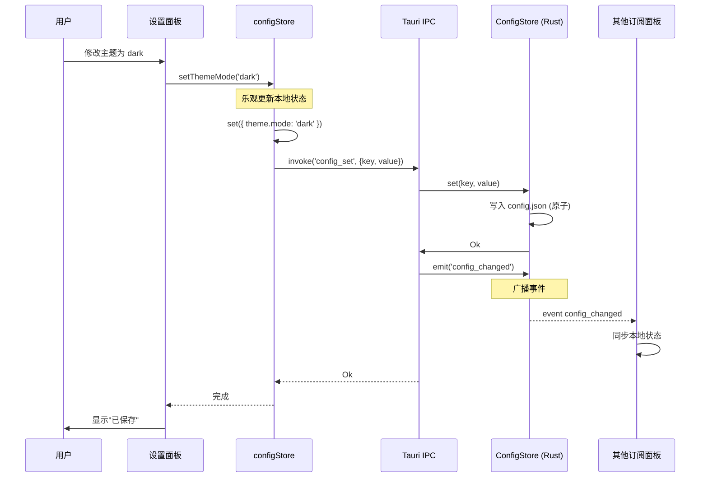
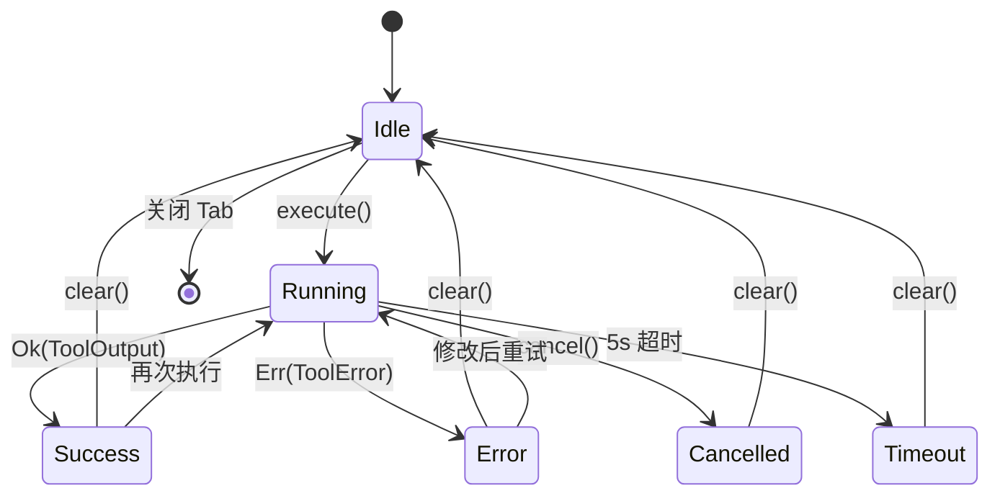

## 目录

- [1. 背景与目的](#1-背景与目的)
- [2. 核心概念](#2-核心概念)
- [3. 详细设计](#3-详细设计)
  - [3.1 状态分类](#31-状态分类)
  - [3.2 React 侧状态方案](#32-react-侧状态方案)
  - [3.3 Rust 侧状态持久化](#33-rust-侧状态持久化)
  - [3.4 用户配置读写流程](#34-用户配置读写流程)
  - [3.5 工具运行状态管理](#35-工具运行状态管理)
  - [3.6 剪贴板监听与自动填充](#36-剪贴板监听与自动填充)
- [4. 关键流程](#4-关键流程)
  - [4.1 配置读写时序](#41-配置读写时序)
  - [4.2 工具执行状态机](#42-工具执行状态机)
- [5. 设计决策记录](#5-设计决策记录)
  - [5.1 状态管理库选型](#51-状态管理库选型)
  - [5.2 持久化时机](#52-持久化时机)
- [6. 注意事项与约束](#6-注意事项与约束)
- [7. 相关文档](#7-相关文档)

---

## 1. 背景与目的

Qraft 是一个有大量状态的应用：用户配置、工具运行状态、历史记录、UI 临时状态、Workspace 等。如果状态管理混乱，会导致：

1. **状态不一致**：同一配置在多个组件显示不同值
2. **持久化丢失**：用户设置重启后失效
3. **性能问题**：无关状态更新触发组件重渲染
4. **调试困难**：状态变更路径不清

本文档定义 Qraft 的状态管理方案，目标是：

1. **分层管理**：UI 临时状态、用户配置、运行状态分层
2. **单一来源**：每类状态有唯一的 source of truth
3. **持久化策略**：什么状态持久化、何时持久化
4. **性能可控**：精细 selector 避免无关重渲染

---

## 2. 核心概念

| 概念 | 定义 |
|------|------|
| UI 临时状态 | Session 级状态，关闭应用即丢失（如当前展开的分类） |
| 用户配置 | 持久化状态，跨会话保留（如主题、快捷键） |
| 工具运行状态 | 工具执行中的状态（执行中/完成/错误/取消） |
| Zustand Store | 前端状态容器，基于 React Hook |
| Selector | 从 Store 订阅特定字段，避免全量订阅 |
| ConfigStore | Rust 侧配置存储，负责持久化 |
| HistorySink | 工具执行后写入历史的接口 |

---

## 3. 详细设计

### 3.1 状态分类



| 状态类型 | 存储位置 | 持久化时机 |
|----------|----------|------------|
| UI 临时状态 | React 内存（Zustand） | 不持久化 |
| 用户配置 | Rust ConfigStore | 变更时立即写入 |
| 工具执行状态 | React 内存（Zustand） | 不持久化（仅 Workspace 中的 output 持久化） |
| 历史记录 | Rust HistoryStore | 工具执行后异步写入 |
| Workspace | Rust WorkspaceStore | 关闭应用时写入 |

### 3.2 React 侧状态方案

#### Zustand Store 设计

```typescript
// src/store/configStore.ts

import { create } from 'zustand';

interface ConfigState {
  // 用户配置
  theme: ThemeConfig;
  general: GeneralConfig;
  shortcuts: ShortcutBinding;
  toolPrefs: Record<string, ToolPref>;
  favorites: Favorite[];

  // 加载状态
  loaded: boolean;

  // Actions
  load: () => Promise<void>;
  setThemeMode: (mode: ThemeMode) => Promise<void>;
  setShortcut: (key: keyof ShortcutBinding, value: string) => Promise<void>;
  setToolPref: (toolId: string, pref: Partial<ToolPref>) => Promise<void>;
  addFavorite: (toolId: string, group?: string) => Promise<void>;
  removeFavorite: (toolId: string) => Promise<void>;
}

export const useConfigStore = create<ConfigState>((set, get) => ({
  theme: { mode: 'dark', accentColor: '#3b82f6' },
  general: { language: 'en', fontSize: 14, maxHistory: 100, confirmOnClear: true },
  shortcuts: defaultShortcuts,
  toolPrefs: {},
  favorites: [],
  loaded: false,

  load: async () => {
    const config = await invokeCommand<UserConfig>('config_get', {});
    set({
      theme: config.theme,
      general: config.general,
      shortcuts: config.shortcuts,
      toolPrefs: config.toolPrefs,
      favorites: config.favorites,
      loaded: true,
    });
  },

  setThemeMode: async (mode) => {
    set((s) => ({ theme: { ...s.theme, mode } }));
    await invokeCommand('config_set', { key: 'theme.mode', value: mode });
  },

  // ... 其他 actions
}));
```

#### Session Store（UI 临时状态）

```typescript
// src/store/sessionStore.ts

import { create } from 'zustand';

interface SessionState {
  // 工具 Tab
  activeTabId: string | null;
  openTabs: string[];  // tool_id 列表

  // UI 状态
  sidebarCollapsed: boolean;
  expandedCategories: string[];
  commandPaletteOpen: boolean;
  commandPaletteHistory: string[];

  // Actions
  setActiveTab: (toolId: string | null) => void;
  toggleSidebar: () => void;
  setCommandPaletteOpen: (open: boolean) => void;
  addCommandHistory: (query: string) => void;
}

export const useSessionStore = create<SessionState>((set) => ({
  activeTabId: null,
  openTabs: [],
  sidebarCollapsed: false,
  expandedCategories: ['formatter', 'encoder'],
  commandPaletteOpen: false,
  commandPaletteHistory: [],

  setActiveTab: (toolId) => set({ activeTabId: toolId }),
  toggleSidebar: () => set((s) => ({ sidebarCollapsed: !s.sidebarCollapsed })),
  setCommandPaletteOpen: (open) => set({ commandPaletteOpen: open }),
  addCommandHistory: (query) =>
    set((s) => ({
      commandPaletteHistory: [
        query,
        ...s.commandPaletteHistory.filter(q => q !== query)
      ].slice(0, 20),
    })),
}));
```

#### 工具执行状态 Store

```typescript
// src/store/toolExecutionStore.ts

import { create } from 'zustand';

interface ToolExecutionState {
  // 按 tab_id 索引的执行状态
  executions: Record<string, Execution>;

  // Actions
  startExecution: (tabId: string, toolId: string, input: ToolInput) => void;
  completeExecution: (tabId: string, output: ToolOutput) => void;
  failExecution: (tabId: string, error: CommandError) => void;
  cancelExecution: (tabId: string) => void;
  clearExecution: (tabId: string) => void;
}

interface Execution {
  status: 'idle' | 'running' | 'success' | 'error' | 'cancelled';
  toolId: string;
  input?: ToolInput;
  output?: ToolOutput;
  error?: CommandError;
  startedAt?: number;
  completedAt?: number;
}

export const useToolExecutionStore = create<ToolExecutionState>((set) => ({
  executions: {},

  startExecution: (tabId, toolId, input) =>
    set((s) => ({
      executions: {
        ...s.executions,
        [tabId]: {
          status: 'running',
          toolId,
          input,
          startedAt: Date.now(),
        },
      },
    })),

  completeExecution: (tabId, output) =>
    set((s) => ({
      executions: {
        ...s.executions,
        [tabId]: {
          ...s.executions[tabId],
          status: 'success',
          output,
          completedAt: Date.now(),
        },
      },
    })),

  // ... 其他 actions
}));
```

#### 历史 Store

```typescript
// src/store/historyStore.ts

import { create } from 'zustand';

interface HistoryState {
  entries: HistoryEntry[];
  loading: boolean;
  hasMore: boolean;

  load: (limit?: number) => Promise<void>;
  loadMore: () => Promise<void>;
  search: (query: string) => Promise<void>;
  delete: (id: string) => Promise<void>;
  clear: (toolId?: string) => Promise<void>;
}

export const useHistoryStore = create<HistoryState>((set, get) => ({
  entries: [],
  loading: false,
  hasMore: true,

  load: async (limit = 50) => {
    set({ loading: true });
    const entries = await invokeCommand<HistoryEntry[]>('history_list', { limit, offset: 0 });
    set({ entries, loading: false, hasMore: entries.length === limit });
  },

  loadMore: async () => {
    if (!get().hasMore || get().loading) return;
    set({ loading: true });
    const offset = get().entries.length;
    const more = await invokeCommand<HistoryEntry[]>('history_list', { limit: 50, offset });
    set((s) => ({
      entries: [...s.entries, ...more],
      loading: false,
      hasMore: more.length === 50,
    }));
  },

  // ... 其他 actions
}));
```

### 3.3 Rust 侧状态持久化

#### ConfigStore 实现

```rust
// src-tauri/src/store/config.rs

use std::path::PathBuf;
use async_trait::async_trait;
use atomicwrites::{AtomicFile, OverwriteBehavior};
use parking_lot::RwLock;
use serde_json::Value;
use crate::core::context::ConfigStore as ConfigStoreTrait; // 定义见 09-interface-design.md §3.4

pub struct ConfigStore {
    config: RwLock<UserConfig>,
    path: PathBuf,
}

impl ConfigStore {
    /// 启动时加载配置（同步构造，不阻塞异步运行时）
    pub fn load() -> Result<Self, ConfigError> {
        let path = config_path()?;
        let config = if path.exists() {
            let json = std::fs::read_to_string(&path)?;
            let mut config: UserConfig = serde_json::from_str(&json)?;
            config = migrate_config(config);
            config
        } else {
            UserConfig::default()
        };

        Ok(Self {
            config: RwLock::new(config),
            path,
        })
    }

    fn persist(&self) -> Result<(), ConfigError> {
        let config = self.config.read().clone();
        let json = serde_json::to_string_pretty(&config)?;

        let af = AtomicFile::new(&self.path, OverwriteBehavior::AllowOverwrite);
        af.write(|f| f.write_all(json.as_bytes()))
            .map_err(|e| ConfigError::IoError(e.into()))
    }
}

/// 实现 09-interface-design.md §3.4 的 `ConfigStore` trait（异步，便于未来扩展）
#[async_trait]
impl ConfigStoreTrait for ConfigStore {
    async fn get_all(&self) -> Result<UserConfig, ConfigError> {
        Ok(self.config.read().clone())
    }

    async fn get(&self, key: &str) -> Result<Value, ConfigError> {
        let config = self.config.read();
        get_by_path(&*config, key)
    }

    async fn set(&self, key: &str, value: Value) -> Result<(), ConfigError> {
        {
            let mut config = self.config.write();
            set_by_path(&mut *config, key, value)?;
        }
        self.persist()
    }
}

/// 配置 / 历史 / 工作区位于同一配置基目录（与 08-data-model.md §3.2 统一）
fn config_dir() -> Result<PathBuf, ConfigError> {
    let proj_dirs = directories::ProjectDirs::from("dev", "qraft", "Qraft")
        .ok_or(ConfigError::NotFound)?;
    std::fs::create_dir_all(proj_dirs.config_dir())?;
    Ok(proj_dirs.config_dir().to_path_buf())
}

pub fn config_path() -> Result<PathBuf, ConfigError> { Ok(config_dir()?.join("config.json")) }
pub fn history_path() -> Result<PathBuf, ConfigError> { Ok(config_dir()?.join("history.jsonl")) }
pub fn workspace_path() -> Result<PathBuf, ConfigError> { Ok(config_dir()?.join("workspace.json")) }
```

#### WorkspaceStore 实现

```rust
// src-tauri/src/store/workspace.rs

pub struct WorkspaceStore {
    workspace: RwLock<Workspace>,
    path: PathBuf,
    dirty: RwLock<bool>,
}

impl WorkspaceStore {
    /// 启动时加载上次持久化的 Workspace（由 Tauri `setup` 钩子调用）。
    /// 文件不存在或解析失败时返回默认 Workspace，不阻塞启动。
    pub fn load_on_startup(&self) -> Result<(), WorkspaceError> {
        if !self.path.exists() {
            return Ok(());
        }
        let content = std::fs::read_to_string(&self.path)?;
        let workspace: Workspace = serde_json::from_str(&content)?;
        *self.workspace.write() = workspace;
        *self.dirty.write() = false;
        Ok(())
    }

    pub fn save_on_quit(&self) -> Result<(), WorkspaceError> {
        if !*self.dirty.read() {
            return Ok(());
        }
        let workspace = self.workspace.read().clone();
        let json = serde_json::to_string(&workspace)?;
        let af = AtomicFile::new(&self.path, OverwriteBehavior::AllowOverwrite);
        af.write(|f| f.write_all(json.as_bytes()))?;
        Ok(())
    }
}
```

### 3.4 用户配置读写流程

#### 读取流程

1. 应用启动时，前端调用 `config_get`（无 key）拉取全量配置
2. 存入 Zustand configStore
3. 组件通过 selector 订阅需要的字段

#### 写入流程

1. 用户在 UI 修改配置
2. 前端先乐观更新 Zustand store（即时反馈）
3. 调用 `config_set` 写入 Rust ConfigStore
4. Rust 写入成功后 emit `config_changed` 事件
5. 所有打开的设置面板订阅事件，自动刷新（避免不同步）
6. 若 Rust 写入失败，回滚 Zustand store 并提示

### 3.5 工具运行状态管理

#### 状态机



#### Hook 封装

```typescript
// src/hooks/useToolExecution.ts

import { useCallback, useState } from 'react';
import { invokeCommand, CommandError } from '@/lib/ipc';

interface UseToolExecutionResult {
  status: 'idle' | 'running' | 'success' | 'error' | 'cancelled';
  output?: ToolOutput;
  error?: CommandError;
  execute: (input: ToolInput) => Promise<void>;
  cancel: () => void;
}

export function useToolExecution(toolId: string): UseToolExecutionResult {
  const [status, setStatus] = useState<UseToolExecutionResult['status']>('idle');
  const [output, setOutput] = useState<ToolOutput>();
  const [error, setError] = useState<CommandError>();

  const execute = useCallback(async (input: ToolInput) => {
    setStatus('running');
    setError(undefined);

    try {
      const result = await invokeCommand<ToolOutput>('tool_execute', {
        toolId,
        input,
      });
      setOutput(result);
      setStatus('success');
    } catch (e) {
      if (e instanceof CommandError) {
        if (e.code === 'ERR_CANCELLED') {
          setStatus('cancelled');
        } else {
          setError(e);
          setStatus('error');
        }
      }
    }
  }, [toolId]);

  const cancel = useCallback(async () => {
    // 触发取消令牌
    await invokeCommand('tool_cancel', { taskId: '...' }).catch(() => {});
  }, []);

  return { status, output, error, execute, cancel };
}
```

### 3.6 剪贴板监听与自动填充

> 📌 **项目实际**
>
> Qraft **不后台监听剪贴板**（隐私原则）。但提供"从剪贴板填充"功能：用户在工具面板点击按钮，主动读取剪贴板内容填入输入框。

#### 智能识别（v1.0 评估）

> 💡 **建议方案**
>
> v1.0 评估"智能识别剪贴板内容并推荐工具"功能：
>
> 1. 用户按 Ctrl+Shift+V 全局快捷键
> 2. 应用读取剪贴板（用户显式触发）
> 3. 检测内容类型（JSON / Base64 / JWT / URL 等）
> 4. 推荐对应工具，用户确认后填充

这是 DevToys 的标志性功能，可作为 v1.0 的差异化竞争点。

#### 实现示例

```typescript
// src/hooks/useClipboardFill.ts

import { invokeCommand } from '@/lib/ipc';

export function useClipboardFill() {
  return async (setValue: (text: string) => void) => {
    try {
      const text = await invokeCommand<string>('clipboard_read');
      setValue(text);
      toast.success('已从剪贴板填充');
    } catch (e) {
      toast.error('剪贴板读取失败');
    }
  };
}
```

---

## 4. 关键流程

### 4.1 配置读写时序



### 4.2 工具执行状态机



---

## 5. 设计决策记录

### 5.1 状态管理库选型

| 方案 | 包体积 | API 简洁 | TS 支持 | 中间件 |
|------|--------|----------|---------|--------|
| **Zustand**（选定） | ~1KB | 极简 | 优 | 够用 |
| Redux Toolkit | ~16KB | 中 | 优 | 丰富 |
| Jotai | ~3KB | 简单 | 优 | 中 |
| Valtio | ~3KB | 简单 | 中 | 少 |
| Recoil | ~20KB | 简单 | 优 | 中 |

**决策理由**：

- Qraft 状态规模中等，不需要 Redux 的复杂中间件
- Zustand 的 hook-based API 最简洁，学习成本最低
- Selector 模式可避免无关重渲染

### 5.2 持久化时机

| 方案 | 优点 | 缺点 |
|------|------|------|
| **变更即持久化**（选定，配置） | 数据不丢失 | 写入频繁 |
| 防抖持久化 | 减少写入 | 崩溃丢失数据 |
| 关闭时持久化 | 一次写入 | 崩溃丢失全部 |

**决策**：

- **用户配置**：变更即持久化（每次 `config_set` 立即写盘）
- **Workspace**：关闭时持久化（避免每次状态变化都写盘）
- **历史记录**：异步写入（不阻塞工具返回）

---

## 6. 注意事项与约束

### 6.1 状态同步约束

> 📌 **项目实际**
>
> 1. **Rust 是配置的 source of truth**：前端 Zustand 是缓存，必须与 Rust 同步
> 2. **乐观更新需可回滚**：先更新前端，IPC 失败时回滚
> 3. **事件订阅需清理**：组件卸载时 `unlisten`，避免内存泄漏
> 4. **避免循环更新**：事件触发 store 更新，store 更新不应再触发事件

### 6.2 性能约束

- **精细 selector**：避免 `useConfigStore((s) => s)` 全量订阅
- **批量更新**：相邻的多个 setState 合并
- **虚拟列表**：历史记录、收藏夹等大列表用虚拟滚动

### 6.3 调试

```typescript
// 开发模式启用 Zustand devtools
import { devtools } from 'zustand/middleware';

export const useConfigStore = create<ConfigState>()(
  devtools(
    (set, get) => ({ /* ... */ }),
    { name: 'configStore', enabled: import.meta.env.DEV }
  )
);
```

### 6.4 Workspace 大输入处理（待补充）

Workspace 存储工具 Tab 的完整 input/output。若用户在 Tab 中粘贴 5MB JSON：

- 选项 A：完整存入 Workspace（启动恢复完整，但文件大）
- 选项 B：截断存储（启动提示"输入过大未恢复"）
- 选项 C：大输入跳过存储（启动时 Tab 为空）

待 [12-performance.md](./12-performance.md) 确定阈值后选择。

### 6.5 多窗口状态隔离（待补充）

当前架构假设单窗口。若 v2.0 引入多窗口，每个窗口的状态需要独立 store 实例，或共享 store 但用 windowId 区分。

---

## 7. 相关文档

- [02-glossary.md](./02-glossary.md) — 术语表（Workspace / Session / User Config 等定义）
- [08-data-model.md](./08-data-model.md) — 数据模型（UserConfig / History 等结构）
- [09-interface-design.md](./09-interface-design.md) — 接口设计（config_set / history_list 等 Command）
- [12-performance.md](./12-performance.md) — 性能优化（React 渲染优化、selector 优化）
- [13-security.md](./13-security.md) — 安全机制（剪贴板访问控制）
- [15-ui-design-system.md](./15-ui-design-system.md) — UI 设计体系（主题状态、布局偏好）
