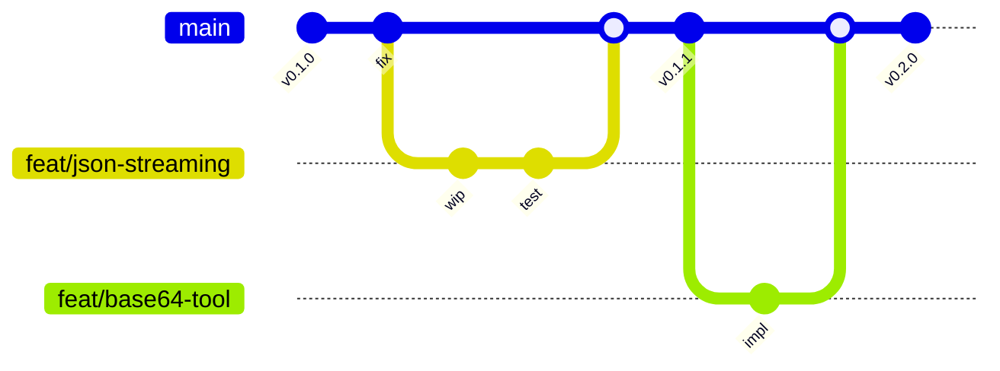
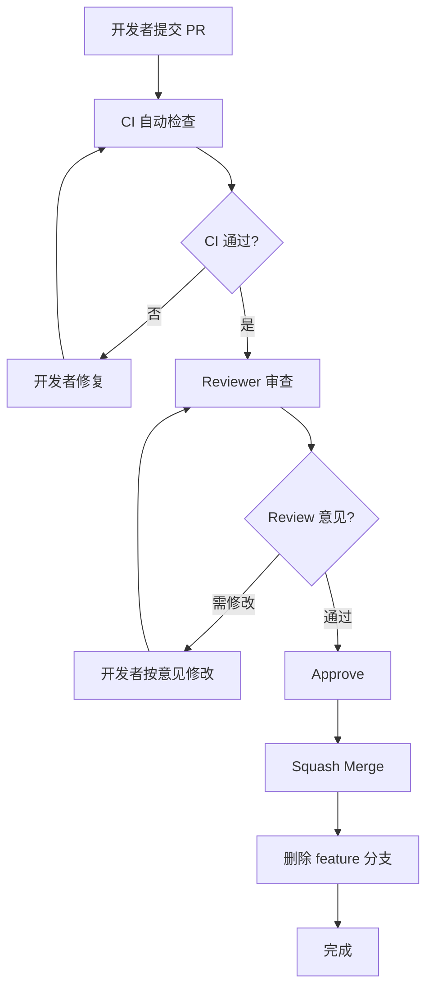
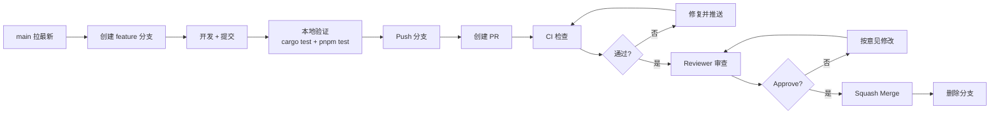
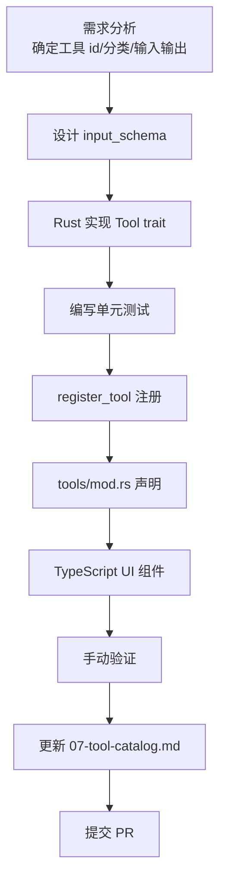

## 目录

- [1. 背景与目的](#1-背景与目的)
- [2. 核心概念](#2-核心概念)
- [3. 详细设计](#3-详细设计)
  - [3.1 Monorepo 目录结构](#31-monorepo-目录结构)
  - [3.2 Rust 代码规范](#32-rust-代码规范)
  - [3.3 TypeScript 代码规范](#33-typescript-代码规范)
  - [3.4 Git 分支策略](#34-git-分支策略)
  - [3.5 Commit 规范](#35-commit-规范)
  - [3.6 PR Review 流程](#36-pr-review-流程)
  - [3.7 新增工具开发 Checklist](#37-新增工具开发-checklist)
- [4. 关键流程](#4-关键流程)
  - [4.1 PR 流程图](#41-pr-流程图)
  - [4.2 新增工具流程](#42-新增工具流程)
- [5. 设计决策记录](#5-设计决策记录)
  - [5.1 分支策略选择](#51-分支策略选择)
  - [5.2 Commit 规范选择](#52-commit-规范选择)
- [6. 注意事项与约束](#6-注意事项与约束)
- [7. 相关文档](#7-相关文档)

---

## 1. 背景与目的

Qraft 是跨 Rust / TypeScript 双语言栈的项目，需要团队协作。如果没有统一规范，会导致：

1. **代码风格不一**：每个开发者风格不同，代码 review 难
2. **命名混乱**：Rust 与 TypeScript 命名规则不同，容易混淆
3. **协作冲突**：分支管理不清导致频繁合并冲突
4. **质量参差**：缺少 review 流程导致 bug 流入主干

本文档定义 Qraft 的开发规范与工作流，目标是：

1. **统一风格**：Rust 与 TypeScript 各自的代码风格
2. **统一流程**：从分支到 PR 到合并的标准化流程
3. **质量保证**：通过 CI 与 review 双重把关
4. **新成员友好**：照着规范做就能产出合格代码

---

## 2. 核心概念

| 概念 | 定义 |
|------|------|
| Trunk-based | 主干开发，短期 feature 分支 |
| Conventional Commits | 规范化 commit message（feat / fix / docs 等） |
| PR Review | Pull Request 代码审查 |
| Checklist | 新增工具的必查清单 |
| Lint | 代码静态检查（clippy / eslint） |
| Format | 代码格式化（rustfmt / prettier） |

---

## 3. 详细设计

### 3.1 Monorepo 目录结构

```
qraft/
├── .github/
│   ├── workflows/              # CI/CD 配置
│   │   ├── ci.yml              # PR 触发的测试
│   │   ├── release.yml         # tag 触发的发布
│   │   └── security.yml        # 安全审计
│   └── PULL_REQUEST_TEMPLATE.md
├── src/                        # React 前端源码
│   ├── components/
│   │   └── ui/                 # shadcn/ui 组件
│   ├── tools/                  # 工具 UI 组件
│   ├── store/                  # Zustand stores
│   ├── hooks/                  # 自定义 hooks
│   ├── lib/                    # 工具函数
│   │   └── ipc.ts              # Tauri invoke 封装
│   ├── types/                  # TypeScript 类型
│   ├── styles/                 # 全局样式
│   ├── main.tsx                # 入口
│   └── App.tsx                 # 根组件
├── src-tauri/                  # Rust + Tauri 后端
│   ├── src/
│   │   ├── commands/           # IPC Command
│   │   ├── core/               # 核心引擎
│   │   ├── store/              # 持久化存储
│   │   ├── tools/              # 工具实现
│   │   ├── main.rs
│   │   └── lib.rs
│   ├── tests/                  # 集成测试
│   │   └── fixtures/           # 测试数据
│   ├── benches/                # 基准测试
│   ├── capabilities/           # Tauri 权限配置
│   ├── Cargo.toml
│   ├── tauri.conf.json
│   └── rust-toolchain.toml
├── docs/                       # 用户文档
├── prd/                        # 架构文档（本目录）
├── scripts/                    # 构建/发布脚本
├── .editorconfig
├── .gitignore
├── .nvmrc
├── package.json
├── pnpm-lock.yaml
├── vite.config.ts
├── tsconfig.json
├── tailwind.config.ts
├── README.md
└── CHANGELOG.md
```

### 3.2 Rust 代码规范

#### 格式化

```toml
# src-tauri/rustfmt.toml
edition = "2024"
max_width = 100
tab_spaces = 4
use_field_init_shorthand = true
use_try_shorthand = true
```

CI 强制 `cargo fmt --check`。

#### Lint

```toml
# src-tauri/Cargo.toml
[lints.clippy]
all = "deny"
pedantic = "warn"
nursery = "warn"
unwrap_used = "warn"
expect_used = "warn"
panic = "warn"
todo = "warn"
dbg_macro = "deny"
print_stdout = "deny"
```

CI 强制 `cargo clippy -- -D warnings`。

#### 命名规范

| 元素 | 风格 | 示例 |
|------|------|------|
| 类型（struct/enum/trait） | UpperCamelCase | `ToolRegistry` |
| 函数 / 方法 | snake_case | `tool_execute` |
| 模块 | snake_case | `json_formatter` |
| 常量 / 静态 | SCREAMING_SNAKE_CASE | `DEFAULT_TIMEOUT` |
| 字段 | snake_case | `tool_id` |
| 泛型 | 单大写或 UpperCamelCase | `T`, `Tool` |
| 生命周期 | 短小写 | `'a`, `'ctx` |

#### 模块组织

```rust
// 推荐：单文件工具实现
// src-tauri/src/tools/json_formatter.rs

pub struct JsonFormatter;
impl JsonFormatter { /* ... */ }

#[async_trait]
impl Tool for JsonFormatter { /* ... */ }

static METADATA: ToolMetadata = /* ... */;
register_tool!(JsonFormatter, &METADATA);

#[cfg(test)]
mod tests { /* ... */ }
```

#### 错误处理规范

- 禁止生产代码 `unwrap()` / `expect()`（除测试）
- 用 `?` 传播错误
- 错误类型实现 `thiserror::Error`
- 跨层错误用 `AppError` 统一

#### 注释规范

```rust
/// 工具执行入口
///
/// # 参数
/// - `input`: 用户输入与工具参数
/// - `ctx`: 运行时上下文
///
/// # 返回
/// - `Ok(ToolOutput)`: 执行成功
/// - `Err(ToolError)`: 执行失败
pub async fn execute(&self, input: ToolInput, ctx: &ToolContext) -> Result<ToolOutput, ToolError>;

// SAFETY: 此处调用 Windows API，OpenClipboard 后必须 CloseClipboard，
// 用 RAII guard ClipboardGuard 保证即使 panic 也会关闭
unsafe fn read_clipboard() -> Result<String, ToolError> { /* ... */ }

// TODO(v1.0): 实现 StreamingTool trait
// FIXME: 当前实现在大输入时内存占用过高
```

### 3.3 TypeScript 代码规范

#### 格式化

```json
// .prettierrc
{
  "semi": true,
  "singleQuote": true,
  "trailingComma": "all",
  "printWidth": 100,
  "tabWidth": 2,
  "arrowParens": "always"
}
```

#### Lint

```javascript
// eslint.config.js
export default [
  ...eslint.configs.recommended,
  ...typescriptEslint.configs.recommended,
  ...react.configs.recommended,
  {
    rules: {
      '@typescript-eslint/no-unused-vars': ['error', { argsIgnorePattern: '^_' }],
      '@typescript-eslint/no-explicit-any': 'error',
      'react/react-in-jsx-scope': 'off',
      'react/prop-types': 'off',
    },
  },
];
```

#### 命名规范

| 元素 | 风格 | 示例 |
|------|------|------|
| 类型 / 接口 | UpperCamelCase | `ToolInput`, `UserConfig` |
| 变量 / 函数 | camelCase | `toolExecute`, `useTool` |
| 常量 | SCREAMING_SNAKE_CASE | `DEFAULT_TIMEOUT` |
| React 组件 | UpperCamelCase | `JsonFormatter` |
| Hook | `use` 前缀 + camelCase | `useToolExecution` |
| 文件（组件） | PascalCase | `JsonFormatter.tsx` |
| 文件（非组件） | kebab-case | `ipc-client.ts` |
| CSS 类 | kebab-case | `tool-panel` |
| 路径别名 | `@/` | `@/components/ui/button` |

#### 目录别名

```json
// tsconfig.json
{
  "compilerOptions": {
    "paths": {
      "@/*": ["./src/*"]
    }
  }
}
```

#### React 组件规范

```typescript
// 推荐：函数组件 + Hooks
import { memo, useState } from 'react';

interface Props {
  toolId: string;
  onExecute: (input: ToolInput) => Promise<ToolOutput>;
}

// 用 memo 包裹避免无关重渲染
export const ToolPanel = memo(function ToolPanel({ toolId, onExecute }: Props) {
  const [input, setInput] = useState('');

  return (
    <div className="grid grid-cols-2 gap-4">
      {/* ... */}
    </div>
  );
});

// 禁止：class 组件（除 Error Boundary）
```

### 3.4 Git 分支策略

#### Trunk-based Development



#### 分支命名

| 分支类型 | 命名 | 示例 |
|----------|------|------|
| 主干 | `main` | `main` |
| 功能 | `feat/<scope>` | `feat/json-streaming` |
| 修复 | `fix/<scope>` | `fix/jwt-parser-crash` |
| 重构 | `refactor/<scope>` | `refactor/executor` |
| 文档 | `docs/<scope>` | `docs/glossary` |
| 测试 | `test/<scope>` | `test/registry` |
| 发布 | `release/v<x.y.z>` | `release/v0.2.0` |

#### 规则

- `main` 分支始终可发布
- feature 分支生命周期 < 7 天
- PR 必须通过 CI 与 review 才能合并
- 合并用 squash merge（保持 main 历史整洁）
- 禁止直接 push 到 `main`

### 3.5 Commit 规范

#### Conventional Commits

```
<type>(<scope>): <subject>

<body>

<footer>
```

#### Type 清单

| Type | 含义 | 示例 |
|------|------|------|
| `feat` | 新功能 | `feat(json): add streaming support` |
| `fix` | bug 修复 | `fix(jwt): handle expired token` |
| `docs` | 文档 | `docs(prd): add glossary` |
| `style` | 格式（不影响逻辑） | `style: rustfmt` |
| `refactor` | 重构 | `refactor(executor): simplify timeout` |
| `test` | 测试 | `test(json): add proptest` |
| `chore` | 构建/工具 | `chore(ci): update actions` |
| `perf` | 性能 | `perf(hash): use rayon parallel` |
| `revert` | 回滚 | `revert: feat(json-streaming)` |

#### Scope 清单

| Scope | 含义 |
|-------|------|
| `json` / `base64` / `jwt` 等 | 具体工具 |
| `core` | 核心引擎 |
| `ui` | 前端 UI |
| `ipc` | IPC 层 |
| `security` | 安全 |
| `ci` | CI/CD |
| `docs` | 文档 |
| `deps` | 依赖升级 |

#### 示例

```
feat(jwt): add JWT parser with header/payload display

- Implement JwtParser Tool
- Decode base64 segments using Base64Codec
- Display expiry time in ISO 8601
- Add 8 unit tests

Closes #123
```

### 3.6 PR Review 流程

#### PR 模板

```markdown
<!-- .github/PULL_REQUEST_TEMPLATE.md -->

## 变更说明
<!-- 简述本次变更的目的 -->

## 变更类型
- [ ] 新功能 (feat)
- [ ] Bug 修复 (fix)
- [ ] 重构 (refactor)
- [ ] 文档 (docs)
- [ ] 测试 (test)
- [ ] 构建/CI (chore)

## 关联 Issue
Closes #

## Checklist
- [ ] 代码通过 `cargo fmt --check` 与 `pnpm format --check`
- [ ] 代码通过 `cargo clippy -- -D warnings` 与 `pnpm lint`
- [ ] 新增/修改的功能有测试覆盖
- [ ] 测试通过 `cargo test` 与 `pnpm test`
- [ ] 性能未退化（基准测试对比）
- [ ] 包体积未增加 >500KB
- [ ] 文档已更新（如涉及）
- [ ] CHANGELOG 已更新（用户可见变更）

## 截图/录屏
<!-- 如涉及 UI 变更，附截图或录屏 -->

## 其他说明
<!-- Reviewer 需要关注的重点、设计决策等 -->
```

#### Review 流程



#### Review 关注点

> 📌 **项目实际**
>
> Reviewer 必须检查：
>
> 1. **架构合规**：是否遵守 Rust-first 原则、三层架构
> 2. **类型同步**：跨 IPC 的 Rust/TS 类型是否一致
> 3. **错误处理**：是否返回正确的 ToolError 变体
> 4. **测试覆盖**：是否覆盖正常/边界/错误场景
> 5. **性能影响**：是否引入性能退化
> 6. **安全合规**：是否引入网络依赖、是否处理敏感数据
> 7. **命名一致**：是否符合 [02-glossary.md](./02-glossary.md) 术语表

### 3.7 新增工具开发 Checklist

新增工具时必须完成的 8 项：

```markdown
## 新增工具 Checklist

### Rust 侧
- [ ] 1. 创建 `src-tauri/src/tools/<tool_name>.rs` 文件
- [ ] 2. 实现 `Tool` trait（metadata + execute）
- [ ] 3. 定义 `static METADATA: ToolMetadata`（id/name/category/schema 等）
- [ ] 4. 调用 `register_tool!(...)` 宏注册
- [ ] 5. 在 `tools/mod.rs` 声明模块
- [ ] 6. 编写至少 5 个单元测试（正常/边界/错误）
- [ ] 7. 工具无 `tauri::` 依赖（仅依赖 Core 模块）
- [ ] 8. 工具无状态（无可变字段）

### TypeScript 侧
- [ ] 9. 创建 `src/tools/<ToolName>.tsx` 组件
- [ ] 10. 根据 `input_schema` 渲染表单
- [ ] 11. 调用 `invokeCommand('tool_execute', ...)` 执行
- [ ] 12. 错误处理（switch error.code）
- [ ] 13. 用 `useToolExecution` hook 管理状态
- [ ] 14. 用 `React.memo` 包裹组件

### 文档
- [ ] 15. 在 [07-tool-catalog.md](./07-tool-catalog.md) 更新工具清单
- [ ] 16. CHANGELOG 添加条目

### 验证
- [ ] 17. `cargo test` 通过
- [ ] 18. `pnpm test` 通过
- [ ] 19. `pnpm tauri dev` 手动验证
- [ ] 20. 基准测试无退化
```

---

## 4. 关键流程

### 4.1 PR 流程图



### 4.2 新增工具流程



---

## 5. 设计决策记录

### 5.1 分支策略选择

| 方案 | 优点 | 缺点 |
|------|------|------|
| **Trunk-based**（选定） | 简单、合并快、CI 反馈快 | 需要特性开关 |
| GitFlow | 适合大版本发布 | 复杂、合并冲突多 |
| GitHub Flow | 简单 | 无 release 分支 |

**决策理由**：Qraft 是持续交付的小团队项目，trunk-based 最适合。短期 feature 分支 + squash merge 保持 main 历史整洁。

### 5.2 Commit 规范选择

| 方案 | 优点 | 缺点 |
|------|------|------|
| **Conventional Commits**（选定） | 标准化、可生成 changelog | 学习成本 |
| 自由格式 | 灵活 | 难以追踪 |
| GitMoji | 直观 | 主观性强 |

**决策理由**：Conventional Commits 是行业标准，可自动生成 CHANGELOG，与语义化版本兼容。

---

## 6. 注意事项与约束

### 6.1 不可妥协的规则

> 📌 **项目实际**
>
> 以下规则 PR Review 中**一票否决**：
>
> 1. **UI 实现业务逻辑**：违反 Rust-first 原则
> 2. **引入网络依赖**：违反零网络原则
> 3. **`unwrap()` 进入生产代码**：违反错误处理规范
> 4. **`unsafe` 无 SAFETY 注释**：违反 unsafe 边界规则
> 5. **未通过 CI**：所有 CI 检查必须绿
> 6. **未更新 CHANGELOG**（用户可见变更）：违反发布规范

### 6.2 性能预算

- PR 不能让冷启动增加 >20ms
- PR 不能让基准测试退化 >10%
- PR 不能让包体积增加 >500KB

### 6.3 文档同步

涉及以下变更时必须同步更新文档：

| 变更 | 文档 |
|------|------|
| 新增工具 | [07-tool-catalog.md](./07-tool-catalog.md) |
| 新增 Command | [09-interface-design.md](./09-interface-design.md) |
| 新增错误码 | [10-error-handling.md](./10-error-handling.md) |
| 新增术语 | [02-glossary.md](./02-glossary.md) |
| 架构变更 | [04-system-architecture.md](./04-system-architecture.md) |

### 6.4 [待补充: 贡献者协议]

开源贡献需签署 CLA（Contributor License Agreement）。具体协议文本与签署流程待法务确认后补充。

### 6.5 [待补充: 代码所有权]

CODEOWNERS 文件需定义每个目录的 reviewer。当前团队规模小，所有 PR 由 maintainer review，待团队扩大后细化。

---

## 7. 相关文档

- [02-glossary.md](./02-glossary.md) — 术语表（命名规范的基础）
- [03-tech-stack.md](./03-tech-stack.md) — 技术栈（工具链版本）
- [05-rust-core-engine.md](./05-rust-core-engine.md) — Rust 核心引擎（新增工具详细步骤）
- [06-tool-plugin-system.md](./06-tool-plugin-system.md) — 工具插件体系（工具开发规范）
- [11-testing-strategy.md](./11-testing-strategy.md) — 测试策略（CI 与测试要求）
- [14-build-and-distribution.md](./14-build-and-distribution.md) — 打包分发（发布流程）
- [18-known-issues.md](./18-known-issues.md) — 已知问题（当前限制）
- [19-roadmap.md](./19-roadmap.md) — 路线图（贡献方向）
