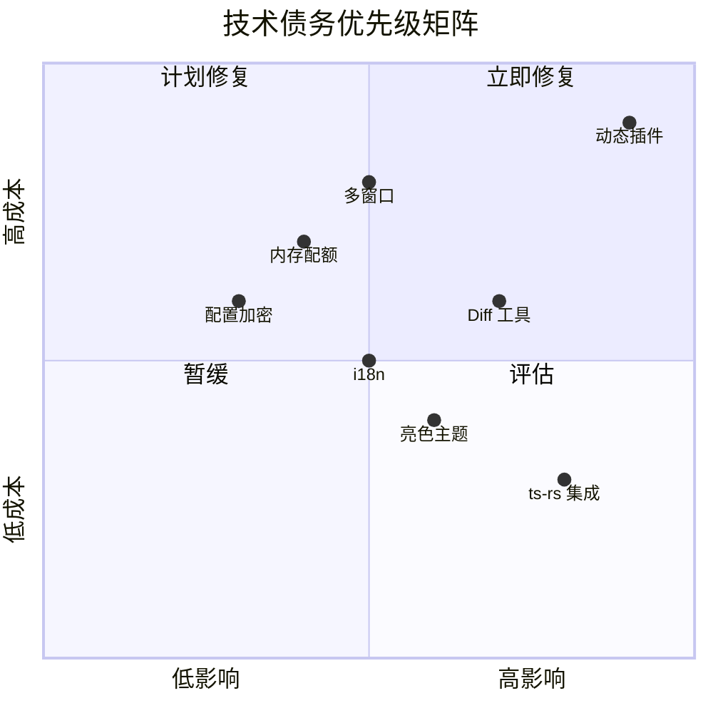
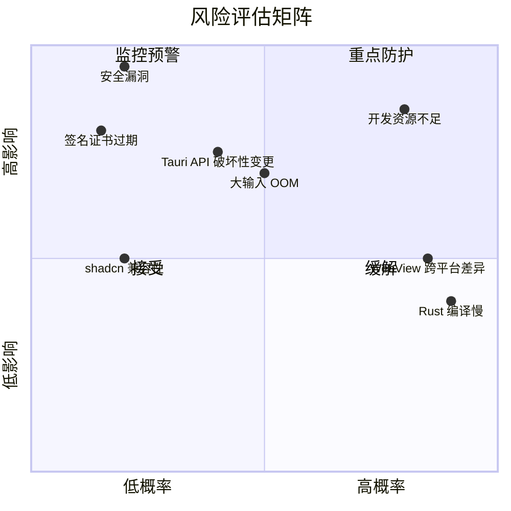

## 目录

- [1. 背景与目的](#1-背景与目的)
- [2. 核心概念](#2-核心概念)
- [3. 详细设计](#3-详细设计)
  - [3.1 当前限制](#31-当前限制)
  - [3.2 待优化项](#32-待优化项)
  - [3.3 风险清单](#33-风险清单)
  - [3.4 与 DevToys 功能差距分析](#34-与-devtoys-功能差距分析)
- [4. 关键流程](#4-关键流程)
  - [4.1 技术债务分类矩阵](#41-技术债务分类矩阵)
  - [4.2 风险矩阵](#42-风险矩阵)
- [5. 设计决策记录](#5-设计决策记录)
- [6. 注意事项与约束](#6-注意事项与约束)
- [7. 相关文档](#7-相关文档)

---

## 1. 背景与目的

任何项目都有技术债务与已知问题，关键是**诚实记录、有计划偿还**。如果假装不存在，债务会复利增长，最终拖垮项目。

本文档的目的：

1. **诚实记录**：列出 Qraft 当前所有的限制、债务、风险
2. **优先级排序**：明确哪些必须修复、哪些可暂缓
3. **责任到人**：每项债务有负责人与计划解决版本
4. **差距分析**：与 DevToys 对比，明确追赶方向

本文档**不回避问题**，所有已知短板都公开记录。

---

## 2. 核心概念

| 概念 | 定义 |
|------|------|
| 当前限制 | 当前架构或实现不支持的能力 |
| 待优化项 | 当前可工作但有改进空间的项 |
| 技术债务 | 为快速交付而做的妥协，需后续偿还 |
| 风险 | 可能影响项目成功的不确定因素 |
| 与 DevToys 差距 | DevToys 已有但 Qraft 缺失的功能 |

---

## 3. 详细设计

### 3.1 当前限制

#### 架构限制

| 限制 | 描述 | 影响 | 计划解决版本 |
|------|------|------|--------------|
| L1. 静态工具注册 | 工具必须编译进二进制，无法运行时加载 | 用户无法安装第三方工具 | v2.0 引入动态插件 |
| L2. 单窗口架构 | 仅支持单主窗口 | 无法多工具并行窗口 | v2.0 评估多窗口 |
| L3. 无移动端 | Tauri V2 支持移动端但 Qraft 未实现 | 移动用户无法使用 | 不计划（项目定位桌面） |
| L4. 无 Web 部署 | 纯桌面应用 | Web 用户无法使用 | 不计划（隐私优先） |
| L5. 无账号系统 | 本地应用，无用户账号 | 无云同步、无跨设备 | 不计划（隐私优先） |
| L6. 仅英文 UI | 无 i18n | 非英语用户不便 | v1.0 评估 i18n |
| L7. ~~仅暗色主题~~ | ✅ 已解决:实现 5 套主题(obsidian/deep-sea/twilight/emerald-night/daylight)+ 自定义强调色 | — | 已于 v0.1 完成 |

#### 平台限制

| 平台 | 限制 |
|------|------|
| Windows | 依赖 WebView2 Runtime（Win10/11 通常预装） |
| macOS | 最低系统版本 11.0（Big Sur） |
| Linux | Wayland 下剪贴板兼容性待验证 |

#### 工具限制

| 工具 | 限制 |
|------|------|
| 流式工具 | MVP 仅 JSON Formatter 与 Hash Calculator 支持 |
| Diff 工具 | ✅ 已实现(TextCompare,支持行级/行内 diff) |
| 文件类工具 | 仅支持用户显式选择，无目录扫描 |
| QR 码生成 | ✅ 已实现(QrcodeTool,支持生成与解码) |

### 3.2 待优化项

#### 性能待优化

| 项 | 当前状态 | 目标 | 优先级 |
|----|----------|------|--------|
| 内存分配器 | 系统 malloc | mimalloc | P1 |
| 内存配额机制 | 无强制限制 | 工具内存配额 | P2 |
| IPC 性能基准 | 未测量 | 1MB 输入 <50ms | P1 |
| Linux WebView 性能 | WebKitGTK 较慢 | 接近 Windows | P2 |
| Rust 编译时间 | 较慢（debug） | <30s 增量编译 | P1 |

#### 工程化待优化

| 项 | 当前状态 | 目标 | 优先级 |
|----|----------|------|--------|
| ts-rs 集成 | 计划中 | 自动生成 TS 类型 | P0 |
| 内存监控面板 | 无 | dev 模式可见 | P2 |
| 错误报告导出 | 无 | 一键导出错误日志 | P1 |
| 配置加密 | 明文存储 | keychain 集成 | P2 |
| SBOM 自动生成 | 手动 | CI 自动生成 | P1 |

#### UI 待优化

| 项 | 当前状态 | 目标 | 优先级 |
|----|----------|------|--------|
| ~~亮色主题~~ | ✅ 已实现(daylight 主题) | — | 已完成 |
| ~~自定义强调色~~ | ✅ 已实现(用户可选 HEX 色) | — | 已完成 |
| UI Token 全量化 | ✅ 已实现(字号/间距/动画/Monaco 主题色 token 化) | — | 已于 v0.1 完成 |
| 命令面板模糊搜索 | 简单 includes | fuse.js 模糊匹配 | P1 |
| 工具收藏分组 | 平铺 | 多级分组 | P2 |

### 3.3 风险清单

#### 技术风险

| 风险 | 概率 | 影响 | 缓解措施 |
|------|------|------|----------|
| Tauri V2 API 破坏性变更 | 中 | 高 | 锁版本、关注 release notes |
| WebView 跨平台渲染差异 | 高 | 中 | 三平台 E2E 测试 |
| Rust 编译时间过长 | 高 | 中 | sccache、增量编译 |
| shadcn/ui 与 React 19 兼容性 | 低 | 中 | 锁版本、关注上游 |
| 大输入导致 OOM | 中 | 高 | 输入限制、流式处理 |
| 流式工具取消不彻底 | 中 | 中 | cancel_token 充分传递 |

#### 项目风险

| 风险 | 概率 | 影响 | 缓解措施 |
|------|------|------|----------|
| 开发资源不足 | 高 | 高 | 严格控制 MVP 范围 |
| 用户调研不足 | 高 | 中 | MVP 发布后做问卷 |
| 与 DevToys 差距过大 | 中 | 中 | 差异化（Rust 性能、跨平台一致） |
| 安全漏洞 | 低 | 极高 | cargo audit、code review |
| 签名证书过期 | 低 | 高 | 提前 30 天预警 |

#### 外部依赖风险

| 依赖 | 风险 | 缓解措施 |
|------|------|----------|
| Tauri | 项目维护中断 | 监控社区活跃度，必要时 fork |
| inventory crate | 维护停滞 | 已稳定，必要时切 linkme |
| shadcn/ui | 商业模式变更 | 源码已复制，无依赖 |
| WebView2 | 微软策略变更 | 监控，必要时切换打包方式 |

### 3.4 与 DevToys 功能差距分析

#### DevToys 已有但 Qraft 缺失（v0.1 MVP）

| DevToys 功能 | Qraft 状态 | Qraft 计划 |
|--------------|------------|------------|
| Smart Detection（剪贴板智能识别） | 无 | v1.0 实现 |
| 文本对比（Diff） | 无 | v1.0 实现 |
| YAML 格式化 | 无 | v2.0 实现 |
| TOML 格式化 | 无 | v2.0 实现 |
| SQL 格式化 | 无 | v2.0 实现 |
| Markdown 预览 | 无 | v2.0 实现 |
| QR 码生成 | 无 | v2.0 实现 |
| 证书解析 | 无 | v2.0 实现 |
| 公钥解析 | 无 | v2.0 实现 |
| Image Metadata | 无 | v2.0 实现 |
| 多窗口独立工具 | 无 | v2.0 评估 |
| 工具收藏分组 | 简单 | v1.0 增强 |
| 工具使用频率排序 | 无 | v1.0 评估 |

#### Qraft 已有/计划但 DevToys 缺失（差异化优势）

| Qraft 特性 | DevToys 状态 |
|------------|--------------|
| Rust 实现 | C# 实现 |
| 三平台一等公民 | Windows 优先 |
| <30MB 包体积 | ~80MB |
| <500ms 启动 | ~1-2s |
| <150MB 内存 | ~200-400MB |
| 流式处理大文件 | 有限支持 |
| 工具间依赖表达 | 无 |
| 完整 Plugin 体系（v2.0） | 无动态插件 |

#### 差距分析结论

> 📌 **项目实际**
>
> Qraft 与 DevToys 的差距集中在**工具数量与高级功能**。Qraft 的优势集中在**性能、跨平台、架构现代化**。
>
> 策略：
>
> 1. MVP 不追求工具数量，专注核心 10 个工具 + 稳定架构
> 2. v1.0 追赶 DevToys 的常用功能（Diff、Smart Detection）
> 3. v2.0 实现差异化（动态插件、社区市场）

---

## 4. 关键流程

### 4.1 技术债务分类矩阵

### 4.2 风险矩阵

---

## 5. 设计决策记录

### 5.1 何时引入技术债务

> 📌 **项目实际**
>
> Qraft 允许在以下情况引入技术债务（需 PR 中明确标注 `Tech Debt:`）：
>
> 1. **MVP 交付压力**：为按时交付 MVP，部分功能可简化实现
> 2. **等待上游**：依赖的库未发布所需功能，临时 workaround
> 3. **不确定性**：需求不确定时先用简单实现验证
>
> **禁止**引入债务的场景：
>
> 1. 安全相关代码（不允许妥协）
> 2. 核心架构（不允许妥协）
> 3. 仅因懒惰（不允许）

### 5.2 债务追踪

每项技术债务必须：

1. 在本文档登记
2. 在代码中用 `// TODO(v1.0): ...` 标注
3. 在 GitHub Issue 中跟踪
4. 在对应版本的 [19-roadmap.md](./19-roadmap.md) 中排期

---

## 6. 注意事项与约束

### 6.1 文档维护

> 📌 **项目实际**
>
> 本文档每月 review 一次：
>
> 1. 已解决的项标记为 `[Resolved vX.Y.Z]` 并移到底部归档区
> 2. 新发现的项及时添加
> 3. 优先级与计划版本随项目演进调整

### 6.2 风险预警

- 签名证书过期前 30 天在 CI 中告警
- 依赖审计发现 critical 漏洞立即告警
- Tauri / shadcn/ui 主版本发布时 review 兼容性

### 6.3 用户调研数据（待补充）

当前差距分析基于社区经验。MVP 发布后需对 50+ 用户做调研，校准：

- 真实高频工具排序
- DevToys 用户切换意愿
- 缺失功能的优先级

### 6.4 性能基线数据（待补充）

性能风险（编译时间、启动速度、内存）当前无实测数据。需在 MVP 完成后建立基线：

- 三平台冷启动时间
- 空闲内存占用
- 增量编译时间
- 包体积

---

## 7. 相关文档

- [01-project-overview.md](./01-project-overview.md) — 项目全览（与 DevToys 的整体对比）
- [03-tech-stack.md](./03-tech-stack.md) — 技术栈（依赖相关风险）
- [12-performance.md](./12-performance.md) — 性能优化（性能债务）
- [14-build-and-distribution.md](./14-build-and-distribution.md) — 打包分发（签名证书风险）
- [17-dev-workflow.md](./17-dev-workflow.md) — 开发规范（技术债务管理流程）
- [19-roadmap.md](./19-roadmap.md) — 路线图（债务偿还计划）
