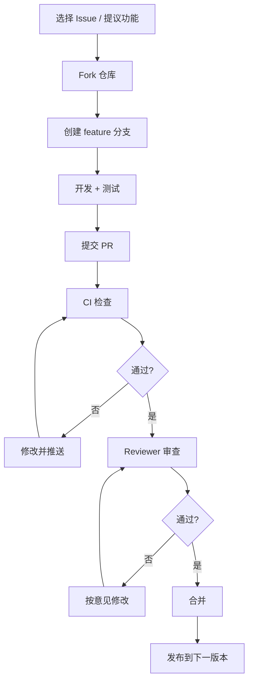
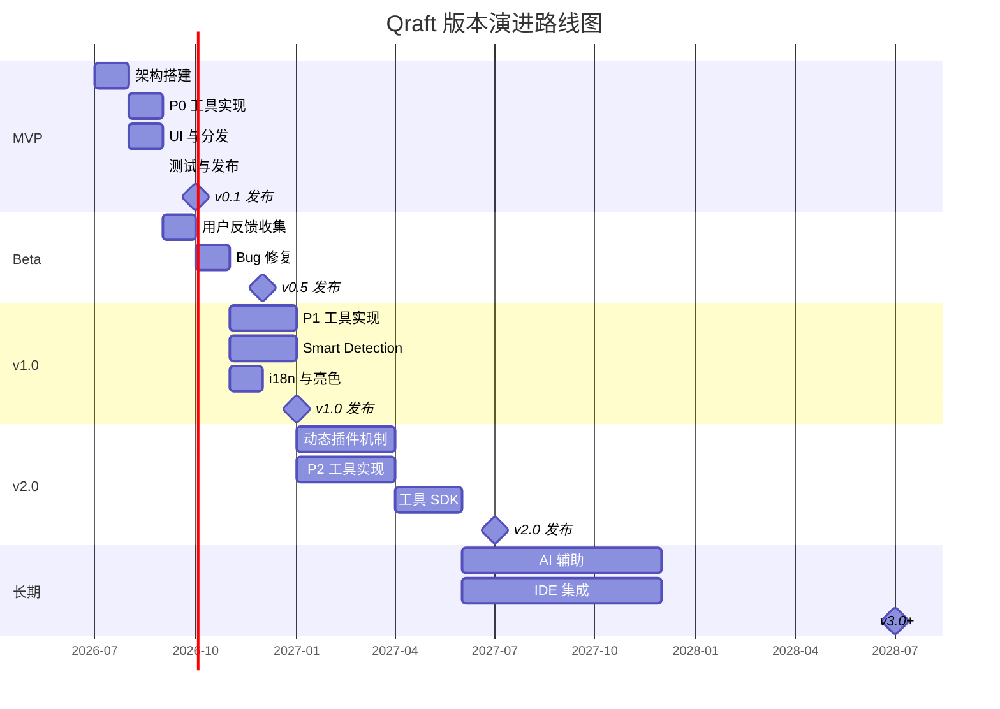
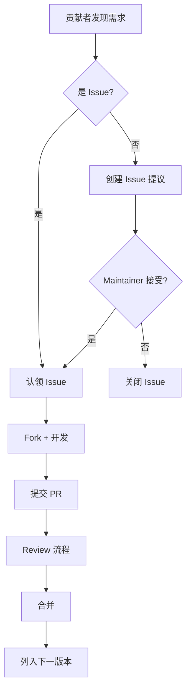

## 目录

- [1. 背景与目的](#1-背景与目的)
- [2. 核心概念](#2-核心概念)
- [3. 详细设计](#3-详细设计)
  - [3.1 里程碑定义](#31-里程碑定义)
  - [3.2 MVP（v0.1）](#32-mvpv01)
  - [3.3 v1.0](#33-v10)
  - [3.4 v2.0](#34-v20)
  - [3.5 长期愿景](#35-长期愿景)
  - [3.6 社区贡献指南](#36-社区贡献指南)
- [4. 关键流程](#4-关键流程)
  - [4.1 里程碑 Gantt 图](#41-里程碑-gantt-图)
  - [4.2 版本功能矩阵](#42-版本功能矩阵)
  - [4.3 贡献流程](#43-贡献流程)
- [5. 设计决策记录](#5-设计决策记录)
  - [5.1 MVP 范围划定](#51-mvp-范围划定)
  - [5.2 版本节奏](#52-版本节奏)
- [6. 注意事项与约束](#6-注意事项与约束)
- [7. 相关文档](#7-相关文档)

---

## 1. 背景与目的

Qraft 是一个有长期愿景的项目，不可能一蹴而就。如果没有清晰的路线图，会导致：

1. **范围蔓延**：MVP 想做太多，迟迟无法发布
2. **优先级混乱**：每个版本做什么靠拍脑袋
3. **用户期待失管**：用户不知道什么时候能用到什么功能
4. **贡献者迷茫**：社区不知道往哪个方向贡献

本文档定义 Qraft 的版本演进路线，目标是：

1. **明确里程碑**：MVP / v1.0 / v2.0 的范围与目标
2. **时间承诺**：每个里程碑的预期时间（虽不强制，但有指引）
3. **功能优先级**：明确哪些功能先做、哪些后做
4. **社区引导**：告诉贡献者哪些方向欢迎贡献

---

## 2. 核心概念

| 概念 | 定义 |
|------|------|
| MVP | 最小可行版本，验证核心架构与价值主张 |
| v1.0 | 首个稳定版本，覆盖大部分日常需求 |
| v2.0 | 扩展版本，引入插件机制与高级功能 |
| 里程碑 | 标志性版本节点，有明确范围与目标 |
| 贡献者 | 为项目提交代码、文档、Issue 的社区成员 |
| 长期愿景 | 项目 3-5 年的终极目标 |

---

## 3. 详细设计

### 3.1 里程碑定义

| 里程碑 | 版本 | 预期时间 | 核心目标 |
|--------|------|----------|----------|
| MVP | v0.1 | 启动后 3 个月 | 验证架构 + 10 个核心工具 |
| Beta | v0.5 | 启动后 5 个月 | 公测，收集反馈 |
| 稳定版 | v1.0 | 启动后 6 个月 | 30+ 工具 + 完整功能 |
| 扩展版 | v2.0 | 启动后 12 个月 | 动态插件 + 工具 SDK |
| 长期 | v3.0+ | 启动后 24 个月+ | AI 辅助、IDE 集成 |

### 3.2 MVP（v0.1）

#### 范围

**核心架构**：

- [x] 三层架构（Rust Core / Tauri Shell / React UI）
- [x] Tool trait 与 ToolRegistry
- [x] ToolExecutor（含超时、panic 隔离）
- [x] 配置存储（ConfigStore）
- [x] 历史记录（HistoryStore）

**P0 工具（10 个）**：

- [x] json_formatter
- [x] json_minifier
- [x] base64_codec
- [x] url_codec
- [x] jwt_parser
- [x] uuid_generator
- [x] hash_calculator
- [x] timestamp_converter
- [x] color_converter
- [x] regex_tester

**UI 基础**：

- [x] 侧边导航
- [x] 工具面板（Split View）
- [x] 命令面板（Ctrl+K）
- [x] 历史记录面板
- [x] 设置面板
- [x] 暗色主题

**分发**：

- [x] Windows NSIS 安装包
- [x] macOS DMG（Universal Binary）
- [x] Linux AppImage + deb
- [x] 代码签名与公证
- [x] Tauri Updater 自动更新

**质量**：

- [x] 单元测试覆盖率 ≥80%
- [x] 三平台 E2E 测试
- [x] CI/CD 流水线
- [x] `cargo audit` 通过

#### 不在 MVP 范围

- 收藏夹分组
- Workspace 命名保存
- 工具 Preset
- 流式进度 UI（后端支持，UI 简化）
- 国际化（仅英文）
- 亮色主题
- Smart Detection（剪贴板智能识别）

#### 成功标准

| 指标 | 目标 |
|------|------|
| 冷启动时间 | <500ms |
| 包体积 | <30MB |
| 空闲内存 | <150MB |
| 10MB JSON 解析 | <500ms |
| P0 工具测试覆盖率 | ≥80% |
| GitHub Star | 100+（3 个月内） |

### 3.3 v1.0

#### 范围

**P1 工具（12 个）**：

- [ ] hmac_generator
- [ ] diff_tool
- [ ] json_diff
- [ ] cron_parser
- [ ] hash_text
- [ ] hex_codec
- [ ] html_encoder
- [ ] number_base_converter
- [ ] lorem_ipsum_generator
- [ ] password_generator
- [ ] case_converter
- [ ] xml_formatter

**新增功能**：

- [ ] Smart Detection（剪贴板智能识别并推荐工具）
- [ ] 工具收藏分组
- [ ] 工具 Preset 保存与加载
- [ ] Workspace 命名保存
- [ ] 亮色主题
- [ ] i18n（中文支持）
- [ ] 命令面板模糊搜索（fuse.js）
- [ ] 错误报告导出

**质量提升**：

- [ ] 单元测试覆盖率 ≥85%
- [ ] 性能基准监控
- [ ] SBOM 自动生成
- [ ] 内存分配器优化（mimalloc）

#### 成功标准

| 指标 | 目标 |
|------|------|
| 工具总数 | 22+ |
| GitHub Star | 1000+ |
| 月活用户 | 5000+ |
| 用户调研满意度 | ≥4.0/5 |

### 3.4 v2.0

#### 范围

**P2 工具（10+ 个）**：

- [ ] qr_code_generator
- [ ] sql_formatter
- [ ] markdown_preview
- [ ] certificate_parser
- [ ] public_key_parser
- [ ] nanoid_generator
- [ ] byte_converter
- [ ] text_diff_inspector
- [ ] image_metadata
- [ ] json_path_tester
- [ ] yaml_formatter
- [ ] toml_formatter

**核心新特性**：

- [ ] 动态插件加载（`.qraft-plugin` 格式）
- [ ] 工具 SDK 与文档
- [ ] 社区工具市场（如规模允许）
- [ ] 多窗口支持
- [ ] 工具使用频率排序
- [ ] 自定义强调色

**架构演进**：

- [ ] Tool trait 扩展支持动态加载
- [ ] 插件签名验证机制
- [ ] 插件沙箱（独立进程或 WASM）

#### 成功标准

| 指标 | 目标 |
|------|------|
| 工具总数 | 32+（内置）+ 社区插件 |
| GitHub Star | 5000+ |
| 月活用户 | 20000+ |
| 社区贡献者 | 20+ |
| 第三方插件数 | 10+ |

### 3.5 长期愿景

#### v3.0+（启动后 24 个月+）

**AI 辅助**：

- [ ] AI 推荐工具（基于剪贴板内容与历史）
- [ ] AI 解释工具输出（如解释 JWT 字段含义）
- [ ] AI 生成正则表达式、Cron 表达式

**IDE 集成**：

- [ ] VSCode 扩展（在 IDE 内调用 Qraft 工具）
- [ ] JetBrains 插件
- [ ] 命令行工具（`qraft-cli`）

**协作**：

- [ ] Workspace 分享（导出/导入）
- [ ] 工具配置同步（局域网，非云端）

**平台扩展**：

- [ ] 移动端（iOS / Android，Tauri V2 已支持）
- [ ] Web 版（受限于零网络原则，可能不实现）

#### 终极愿景

> 💡 **建议方案**
>
> Qraft 的长期愿景是成为**开发者本地工具箱的事实标准**：
>
> - 像 Homebrew 之于包管理，Qraft 之于开发工具
> - 开发者每天打开 Qraft 处理 8-15 次碎片操作
> - 社区贡献的工具覆盖所有长尾需求
> - 与 IDE 深度集成，从工具箱到工作流

### 3.6 社区贡献指南

#### 欢迎的贡献类型

| 类型 | 难度 | 优先级 |
|------|------|--------|
| 新增 P1/P2 工具 | 中 | 高 |
| Bug 修复 | 低-中 | 高 |
| 文档改进 | 低 | 中 |
| 性能优化 | 高 | 中 |
| 测试补充 | 低-中 | 中 |
| i18n 翻译 | 低 | 中（v1.0+） |
| 主题设计 | 中 | 低（v1.0+） |

#### 贡献流程

#### 新增工具贡献模板

贡献新工具时，PR 必须包含：

1. Rust 实现（`src-tauri/src/tools/<name>.rs`）
2. 至少 5 个单元测试
3. TypeScript UI 组件
4. `07-tool-catalog.md` 更新
5. CHANGELOG 条目

详见 [17-dev-workflow.md](./17-dev-workflow.md#37-新增工具开发-checklist)。

#### 行为准则

- 尊重所有贡献者，不论经验水平
- 用建设性语言 review
- 假设善意（assume good faith）
- 聚焦技术问题，不人身攻击

---

## 4. 关键流程

### 4.1 里程碑 Gantt 图

### 4.2 版本功能矩阵

| 功能 | v0.1 | v0.5 | v1.0 | v2.0 | v3.0+ |
|------|------|------|------|------|-------|
| 三层架构 | ✅ | ✅ | ✅ | ✅ | ✅ |
| 10 个 P0 工具 | ✅ | ✅ | ✅ | ✅ | ✅ |
| 12 个 P1 工具 | - | 部分 | ✅ | ✅ | ✅ |
| 10+ 个 P2 工具 | - | - | - | ✅ | ✅ |
| 暗色主题 | ✅ | ✅ | ✅ | ✅ | ✅ |
| 亮色主题 | - | - | ✅ | ✅ | ✅ |
| i18n | - | - | ✅ | ✅ | ✅ |
| Smart Detection | - | - | ✅ | ✅ | ✅ |
| 收藏分组 | - | 简单 | ✅ | ✅ | ✅ |
| 工具 Preset | - | - | ✅ | ✅ | ✅ |
| Workspace 命名 | - | - | ✅ | ✅ | ✅ |
| 动态插件 | - | - | - | ✅ | ✅ |
| 多窗口 | - | - | - | ✅ | ✅ |
| AI 辅助 | - | - | - | - | ✅ |
| IDE 集成 | - | - | - | - | ✅ |
| 移动端 | - | - | - | - | 评估 |

### 4.3 贡献流程

---

## 5. 设计决策记录

### 5.1 MVP 范围划定

| 方案 | 工具数 | 优点 | 缺点 |
|------|--------|------|------|
| **10 个 P0**（选定） | 10 | 快速交付、验证架构 | 工具少 |
| 20 个 | 20 | 功能丰富 | 交付慢、风险高 |
| 5 个 | 5 | 极快交付 | 价值不足 |

**决策理由**：10 个 P0 工具覆盖六大分类与所有架构特性（流式、文件、依赖、双向转换），既验证架构又提供实用价值。少于 10 个无法覆盖架构特性，多于 10 个交付时间风险高。

### 5.2 版本节奏

| 方案 | 节奏 | 优点 | 缺点 |
|------|------|------|------|
| **3-6-12 月**（选定） | MVP 3M / v1.0 6M / v2.0 12M | 平衡 | 需稳定投入 |
| 快速迭代 | 每月一版 | 用户反馈快 | 质量难保证 |
| 大版本 | 每年一版 | 质量高 | 反馈慢 |

**决策理由**：3 个月 MVP 验证可行性，6 个月 v1.0 达到稳定，12 个月 v2.0 引入扩展。这个节奏对小团队可控。

---

## 6. 注意事项与约束

### 6.1 路线图不是承诺

> 📌 **项目实际**
>
> 本路线图是**计划指引**，不是**硬性承诺**。实际进度可能因以下因素调整：
>
> 1. 开发资源变化
> 2. 用户反馈调整优先级
> 3. 上游依赖（Tauri / Rust）的重大变更
> 4. 不可抗力
>
> 路线图每 3 个月 review 一次，根据实际情况调整。

### 6.2 优先级调整原则

优先级调整遵循：

1. **安全 > 稳定 > 功能**：安全漏洞立即修复，哪怕推迟功能
2. **用户需求 > 内部规划**：大量用户请求的功能优先级上调
3. **架构健康 > 短期交付**：不为按时交付牺牲架构

### 6.3 社区贡献管理

- 所有贡献通过 PR，无直接 push 权限
- Maintainer 在 7 天内响应 PR
- 重要决策通过 GitHub Discussion 公开讨论
- 贡献者协议（CLA）待 [17-dev-workflow.md](./17-dev-workflow.md) 补充

### 6.4 [待补充: 商业模式]

当前 Qraft 是开源项目，无商业模式。长期可能评估：

- 完全免费 + 接受赞助（GitHub Sponsors）
- 企业版付费功能（如团队共享 Workspace）
- 插件市场抽成（v2.0 引入插件后）

具体决策待用户规模达到一定程度后评估。

### 6.5 [待补充: 项目治理]

当前项目由创始团队决策。长期需评估：

- 是否成立委员会
- 是否接受外部 Maintainer
- 决策投票机制

---

## 7. 相关文档

- [01-project-overview.md](./01-project-overview.md) — 项目全览（长期愿景的起点）
- [06-tool-plugin-system.md](./06-tool-plugin-system.md) — 工具插件体系（v2.0 动态插件的技术基础）
- [07-tool-catalog.md](./07-tool-catalog.md) — 工具目录（P0/P1/P2 工具清单）
- [14-build-and-distribution.md](./14-build-and-distribution.md) — 打包分发（每个版本的发布流程）
- [17-dev-workflow.md](./17-dev-workflow.md) — 开发规范（贡献流程的详细规范）
- [18-known-issues.md](./18-known-issues.md) — 已知问题（路线图中需解决的问题）
