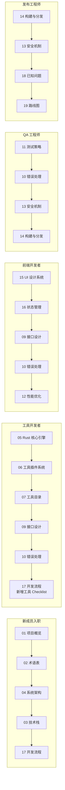
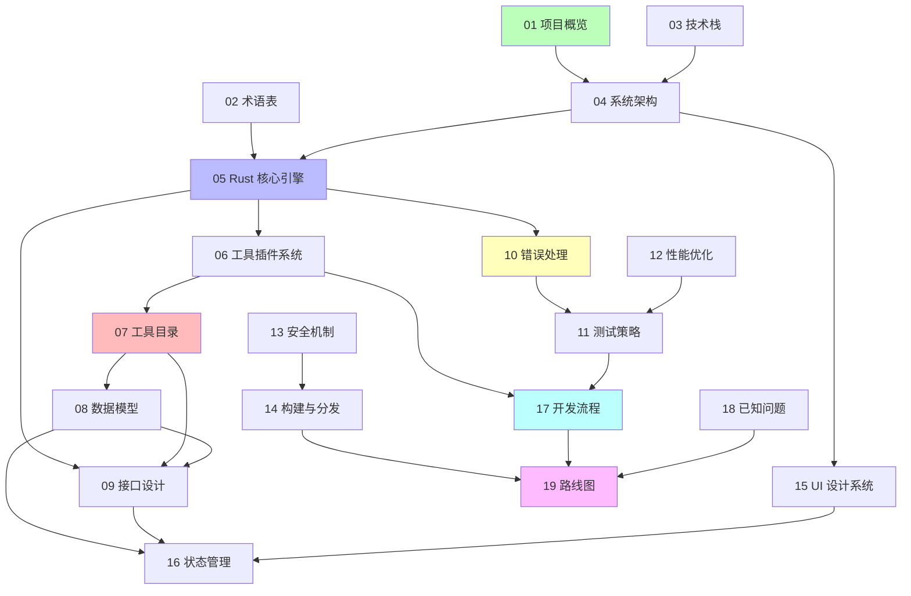
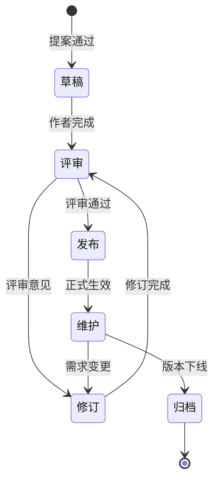

# Qraft 项目文档总索引

> **文档版本**：v1.0.0  
> **最后更新**：2026-07-25  
> **文档总数**：19 篇 + 本索引  
> **维护者**：Qraft 核心团队

---

## 一、文档体系概述

### 1.1 文档目标

本文档体系旨在为 Qraft 项目（一个面向开发者的本地开发工具箱，定位对标 DevToys）提供**完整、自洽、可追溯**的设计与工程依据，覆盖以下维度：

- **是什么**：项目定位、术语共识、技术选型
- **怎么建**：系统架构、核心引擎、插件机制、工具清单
- **如何交互**：数据模型、接口契约、错误处理
- **如何保障**：测试策略、性能优化、安全机制
- **如何交付**：构建打包、UI 规范、状态管理、开发流程
- **走向哪里**：当前问题、版本路线图

### 1.2 设计原则

| 原则 | 说明 |
|------|------|
| **单一事实来源** | 每个关键决策只在一篇文档中详述，其他文档通过链接引用 |
| **代码可追溯** | 文档中的接口、类型、错误码必须与代码实现一一对应 |
| **图表优先** | 复杂逻辑使用 Mermaid 图表表达，降低阅读成本 |
| **版本化演进** | 文档与代码版本同步演进，重大变更需记录 ADR |
| **可审计性** | 关键设计决策记录（ADR）保留决策时的上下文与权衡 |

### 1.3 文档结构图

```mermaid
graph TD
    INDEX[INDEX.md<br/>总索引]
    INDEX --> A[项目认知层<br/>01-03]
    INDEX --> B[架构设计层<br/>04-06]
    INDEX --> C[功能规格层<br/>07-09]
    INDEX --> D[质量保障层<br/>10-13]
    INDEX --> E[交付运维层<br/>14-16]
    INDEX --> F[流程治理层<br/>17-19]
    
    A --> A1[01 项目概览]
    A --> A2[02 术语表]
    A --> A3[03 技术栈]
    
    B --> B1[04 系统架构]
    B --> B2[05 Rust 核心引擎]
    B --> B3[06 工具插件系统]
    
    C --> C1[07 工具目录]
    C --> C2[08 数据模型]
    C --> C3[09 接口设计]
    
    D --> D1[10 错误处理]
    D --> D2[11 测试策略]
    D --> D3[12 性能优化]
    D --> D4[13 安全机制]
    
    E --> E1[14 构建与分发]
    E --> E2[15 UI 设计系统]
    E --> E3[16 状态管理]
    
    F --> F1[17 开发流程]
    F --> F2[18 已知问题]
    F --> F3[19 路线图]
    
    style INDEX fill:#f9f,stroke:#333,stroke-width:2px
    style A fill:#bfb,stroke:#333
    style B fill:#bbf,stroke:#333
    style C fill:#fbb,stroke:#333
    style D fill:#ffb,stroke:#333
    style E fill:#fbf,stroke:#333
    style F fill:#bff,stroke:#333
```



---

## 二、文档目录

### 2.1 项目认知层（01-03）

> 面向所有读者，建立对项目的基本认知。

| 序号 | 文档 | 核心内容 | 阅读时长 |
|------|------|---------|---------|
| 01 | [项目概览](./01-project-overview.md) | 项目背景、定位、目标用户、与 DevToys 差异化、整体架构图、目录结构 | 8 分钟 |
| 02 | [术语表](./02-glossary.md) | 29 个核心术语，按架构层/引擎层/工具层/数据层/接口层/运行时层 6 类组织 | 5 分钟 |
| 03 | [技术栈](./03-tech-stack.md) | 9 层技术栈全景（Rust/Tauri/React/TS/shadcn/Vite/pnpm/cargo/Tailwind），版本约束、选型理由、环境搭建 | 12 分钟 |

### 2.2 架构设计层（04-06）

> 面向架构师与核心开发者，描述系统骨架。

| 序号 | 文档 | 核心内容 | 阅读时长 |
|------|------|---------|---------|
| 04 | [系统架构](./04-system-architecture.md) | 三层架构（Rust Core / Tauri Shell / React UI）、模块划分、进程/线程模型、通信机制 | 15 分钟 |
| 05 | [Rust 核心引擎](./05-rust-core-engine.md) | `Tool` trait 系统、输入/输出抽象、错误类型层级、注册与发现机制、执行器（超时/panic 隔离） | 20 分钟 |
| 06 | [工具插件系统](./06-tool-plugin-system.md) | 注册机制（宏 + inventory）、元数据规范、分类体系、生命周期管理、热插拔评估 | 15 分钟 |

### 2.3 功能规格层（07-09）

> 面向工具开发者与前端开发者，描述具体功能契约。

| 序号 | 文档 | 核心内容 | 阅读时长 |
|------|------|---------|---------|
| 07 | [工具目录](./07-tool-catalog.md) | 34 个工具清单（P0/P1/P2 分级），10 个 P0 工具的详细规格（输入/输出/错误码/示例） | 25 分钟 |
| 08 | [数据模型](./08-data-model.md) | 工具输入/输出数据流模型、配置存储结构、历史记录模型、剪贴板模型 | 18 分钟 |
| 09 | [接口设计](./09-interface-design.md) | Tauri IPC Command 规范、Rust 公共 Trait、请求/响应 JSON 示例、事件流 | 20 分钟 |

### 2.4 质量保障层（10-13）

> 面向 QA 与资深开发者，描述质量与安全性策略。

| 序号 | 文档 | 核心内容 | 阅读时长 |
|------|------|---------|---------|
| 10 | [错误处理](./10-error-handling.md) | Rust 错误类型层级（ToolError/EngineError/AppError）、`thiserror`+`anyhow` 分工、前端 Error Boundary、超时与 panic 隔离 | 18 分钟 |
| 11 | [测试策略](./11-testing-strategy.md) | 测试金字塔、Rust 单元/集成/属性/基准测试、React 组件测试、Tauri E2E 测试、覆盖率目标 | 20 分钟 |
| 12 | [性能优化](./12-performance.md) | 大 JSON 流式解析、Rust 多线程策略、内存限制与保护、React 渲染优化、虚拟列表 | 18 分钟 |
| 13 | [安全机制](./13-security.md) | 输入校验与净化、文件系统沙箱、剪贴板访问控制、零网络请求原则、依赖供应链安全、Tauri 权限模型 | 20 分钟 |

### 2.5 交付运维层（14-16）

> 面向发布工程师与前端开发者，描述构建交付与界面规范。

| 序号 | 文档 | 核心内容 | 阅读时长 |
|------|------|---------|---------|
| 14 | [构建与分发](./14-build-and-distribution.md) | Windows（NSIS/MSI）、macOS（DMG+公证）、Linux（AppImage/deb）打包，Tauri Updater 自动更新、签名流程、CI/CD 流水线 | 22 分钟 |
| 15 | [UI 设计系统](./15-ui-design-system.md) | shadcn/ui 使用规范、设计 Tokens、暗黑/明亮主题、布局栅格、可访问性（a11y） | 18 分钟 |
| 16 | [状态管理](./16-state-management.md) | React 状态方案选型（Zustand；React Query 预留，未启用）、Rust 侧状态持久化、用户配置读写流程、剪贴板状态机 | 16 分钟 |

### 2.6 流程治理层（17-19）

> 面向全体协作者，描述协作流程与项目演进。

| 序号 | 文档 | 核心内容 | 阅读时长 |
|------|------|---------|---------|
| 17 | [开发流程](./17-dev-workflow.md) | Monorepo 目录结构、Rust/TS 代码规范、Git 分支策略、Commit 规范、PR Review 流程、新增工具 Checklist | 20 分钟 |
| 18 | [已知问题](./18-known-issues.md) | 当前限制（架构/平台/工具）、优化项（性能/工程/UI）、风险列表、与 DevToys 功能差距分析 | 12 分钟 |
| 19 | [路线图](./19-roadmap.md) | MVP（v0.1）、v1.0、v2.0、长期愿景、社区贡献指南 | 15 分钟 |

---

## 三、阅读建议路径

### 3.1 按角色推荐



### 3.2 按场景推荐

| 场景 | 推荐阅读顺序 |
|------|-------------|
| **新增一个工具** | 17（Checklist） → 05（Tool trait） → 06（注册机制） → 07（参考同类工具） → 09（IPC 契约） → 11（编写测试） |
| **排查工具执行错误** | 10（错误码定义） → 05（执行器与隔离） → 09（IPC 返回结构） → 18（已知问题） |
| **性能调优** | 12（优化方案） → 05（多线程） → 16（React 渲染） → 11（基准测试） |
| **新增平台打包** | 14（构建分发） → 13（权限模型） → 03（依赖版本） → 18（平台限制） |
| **理解整体设计** | 01 → 04 → 05 → 06 → 07 → 08 → 09 |
| **评估升级风险** | 18（已知问题） → 19（路线图） → 03（依赖版本约束） |

### 3.3 按时间预算推荐

| 时间预算 | 推荐阅读组合 |
|---------|-------------|
| **30 分钟速览** | 01 项目概览 + 04 系统架构 + 19 路线图 |
| **2 小时入门** | 01 + 02 + 03 + 04 + 05 + 17 |
| **半天深入** | 上述 + 06 + 07 + 09 + 10 |
| **1 天全面** | 全部 19 篇（按 3.1 角色路径选读重点章节） |

---

## 四、文档关联关系

### 4.1 核心依赖关系



### 4.2 关键交叉引用表

| 源文档 | 章节 | 引用目标 | 引用目的 |
|--------|------|---------|---------|
| 01 项目概览 | 整体架构图 | 04 系统架构 | 详述架构分层 |
| 04 系统架构 | 三层通信 | 09 接口设计 | 详述 IPC 契约 |
| 05 Rust 核心引擎 | Tool trait | 06 工具插件系统 | 详述注册机制 |
| 06 工具插件系统 | 元数据规范 | 07 工具目录 | 落地为具体工具 |
| 07 工具目录 | 工具输入输出 | 08 数据模型 | 详述数据结构 |
| 09 接口设计 | 错误响应 | 10 错误处理 | 详述错误码 |
| 10 错误处理 | 测试策略 | 11 测试策略 | 详述测试方法 |
| 11 测试策略 | 性能基准 | 12 性能优化 | 详述优化手段 |
| 13 安全机制 | 权限模型 | 14 构建与分发 | 详述打包配置 |
| 15 UI 设计系统 | 组件状态 | 16 状态管理 | 详述状态流转 |
| 17 开发流程 | Checklist | 05/06/07/09 | 串联开发步骤 |
| 18 已知问题 | 路线图 | 19 路线图 | 详述演进计划 |

---

## 五、文档规范

### 5.1 命名规范

```
prd/
├── INDEX.md                          # 总索引（本文件）
├── 01-project-overview.md            # 序号-英文短横线名称.md
├── 02-glossary.md
├── ...
└── 19-roadmap.md
```

**规则**：
- 序号两位数，从 01 起，连续递增
- 名称使用英文短横线命名（kebab-case），不使用中文、空格、下划线
- 文件扩展名统一为 `.md`
- 新增文档追加序号，**不重排已有序号**

### 5.2 文档统一结构

每篇文档遵循以下章节结构（可按需裁剪）：

```markdown
# 文档标题

> 元信息块

---

## 1. 背景与目的
## 2. 核心概念
## 3. 详细设计
  ### 3.1 ...
  ### 3.2 ...
## 4. 关键流程（Mermaid 图）
## 5. 设计决策记录（ADR）
## 6. 关联文档
## 7. 相关文档
```

> 说明：变更记录为可选小节。当前各内容文档统一以 `## 7. 相关文档` 收尾，变更记录仅在总索引 INDEX.md 第十节集中维护；若某篇文档需独立记录变更，可追加 `## 8. 变更记录`。

### 5.3 图表规范

- **架构图**：使用 `graph TD`（自上而下）或 `graph LR`（自左向右）
- **流程图**：使用 `flowchart TD`，含分支判断
- **时序图**：使用 `sequenceDiagram`，标注参与者与消息
- **状态图**：使用 `stateDiagram-v2`
- **类图**：使用 `classDiagram`
- 颜色语义：绿色=正常路径，黄色=警告，红色=错误，蓝色=信息

### 5.4 代码块规范

- Rust 代码：```` ```rust ````
- TypeScript/TSX 代码：```` ```typescript ```` 或 ```` ```tsx ````
- JSON 示例：```` ```json ````
- Shell 命令：```` ```bash ````
- TOML 配置：```` ```toml ````
- 行号：不在代码块中包含行号

---

## 六、维护说明

### 6.1 文档生命周期



### 6.2 变更记录规范

变更记录统一在总索引 INDEX.md 第十节集中维护（见本文档"十、变更记录"）。各内容文档当前以 `## 7. 相关文档` 收尾，如需在单篇文档内记录变更，可追加 `## 8. 变更记录` 小节，格式如下：

```markdown
## 8. 变更记录

| 版本 | 日期 | 变更内容 | 作者 |
|------|------|---------|------|
| v1.0.0 | 2026-07-25 | 初始版本 | @xxx |
| v1.1.0 | 2026-08-01 | 新增 X 章节描述 Y | @yyy |
```

### 6.3 文档审查节奏

| 节奏 | 触发条件 | 审查范围 |
|------|---------|---------|
| **每次发布** | 版本发布前 | 全部文档与代码一致性 |
| **每季度** | 季度回顾 | 18 已知问题 + 19 路线图 |
| **重大变更** | 架构/技术栈调整 | 影响范围相关的文档 |
| **PR 触发** | PR 涉及文档章节 | 受影响的章节 |

### 6.4 反馈渠道

- **文档错误**：提 Issue，标签 `documentation`
- **内容建议**：提 Issue，标签 `documentation` + `enhancement`
- **紧急修订**：直接提 PR，@核心团队 Review

### 6.5 文档版本与代码版本对应

| 文档版本 | 对应代码版本 | 说明 |
|---------|-------------|------|
| v1.0.0 | v0.1.0 (MVP) | 初始文档体系，对应 MVP 发布 |

---

## 七、快速检索

### 7.1 按关键词检索

| 关键词 | 推荐文档 |
|--------|---------|
| Tool trait | 05, 06, 09 |
| ToolRegistry | 05, 06 |
| ToolExecutor | 05, 10 |
| IPC Command | 09, 16 |
| ToolError | 10, 05 |
| 流式解析 | 12, 07 (json_formatter) |
| 沙箱 | 13, 14 |
| 主题切换 | 15, 16 |
| 自动更新 | 14, 19 |
| 性能基准 | 11, 12 |
| Tauri 权限 | 13, 14 |
| Monorepo | 17 |
| ADR | 全部文档的"设计决策记录"章节 |
| P0 工具 | 07 |
| 热插拔 | 06 |

### 7.2 按错误现象检索

| 现象 | 推荐文档 |
|------|---------|
| 工具执行超时 | 10, 05 |
| 工具 panic | 10, 05 |
| IPC 调用失败 | 09, 10, 16 |
| 大输入卡顿 | 12, 07 |
| 内存占用过高 | 12, 13 |
| 主题不生效 | 15, 16 |
| 配置丢失 | 08, 16 |
| 打包失败 | 14, 03 |
| 更新失败 | 14, 13 |
| 测试失败 | 11, 10 |

---

## 八、统计信息

### 8.1 文档规模

| 维度 | 数值 |
|------|------|
| 文档总数 | 19 篇 + 索引 1 篇 |
| 总字数（估算） | 约 70,000 字 |
| Mermaid 图表数 | 约 80 个 |
| 代码示例数 | 约 200 段 |
| 表格数 | 约 60 个 |

### 8.2 章节覆盖度

| 章节 | 覆盖率 |
|------|--------|
| 背景与目的 | 19/19 (100%) |
| 核心概念 | 19/19 (100%) |
| 详细设计 | 19/19 (100%) |
| 关键流程图 | 17/19 (89%) |
| 设计决策记录 | 16/19 (84%) |
| 关联文档 | 19/19 (100%) |
| 变更记录 | 0/19（各内容文档暂未单列，统一在 INDEX.md 维护）|

---

## 九、关联文档

- 所有 19 篇文档（见第二节"文档目录"）
- 项目源代码仓库：`qraft` Monorepo
- 上游依赖文档：
  - [Tauri V2 官方文档](https://tauri.app/)
  - [React 19 官方文档](https://react.dev/)
  - [Rust 官方文档](https://www.rust-lang.org/)
  - [shadcn/ui 官方文档](https://ui.shadcn.com/)

---

## 十、变更记录

| 版本 | 日期 | 变更内容 | 作者 |
|------|------|---------|------|
| v1.0.0 | 2026-07-25 | 初始版本：建立完整 19 篇文档体系 + 总索引 | Qraft 核心团队 |
