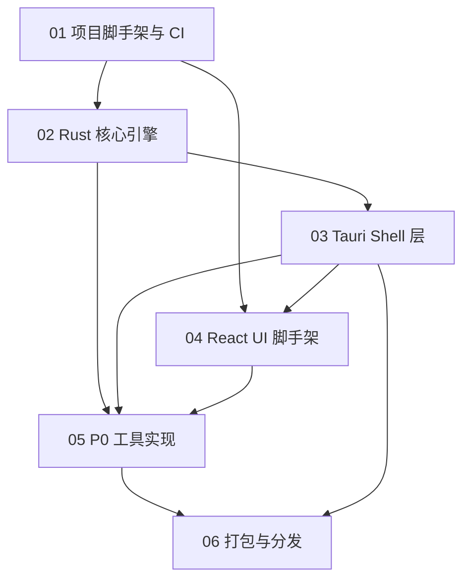

# Qraft MVP (v0.1) 实现计划总览

> **For agentic workers:** 本目录包含 6 份独立可执行的子计划。每份子计划使用 `- [ ]` 复选框语法跟踪进度,严格遵循 TDD(先写失败测试 → 实现 → 通过 → 提交)。执行前请阅读本文件了解依赖关系与执行顺序。

**Goal:** 交付 Qraft v0.1 MVP——一个跨 Windows/macOS/Linux 的本地开发工具箱,包含 10 个 P0 工具、三层架构(Rust Core / Tauri Shell / React UI)、暗色主题 UI、三平台安装包与自动更新。

**Architecture:** 严格三层架构,依赖方向单向向下:UI → Shell → Core。Rust Core 不依赖 Tauri 类型,通过 trait 接收外部能力(如 `HistorySink`),保证可独立单元测试。工具通过 `inventory` crate 编译期注册,`ToolExecutor` 提供超时与 panic 隔离。

**Tech Stack:** Rust (stable, edition 2024) + Tauri V2 + React 19 + TypeScript 5.5 + shadcn/ui + Vite 5 + pnpm 9 + Tailwind CSS 3.4 + Zustand 5 + tokio + serde + thiserror + anyhow + inventory + async_trait

---

## 一、子计划清单

| 序号 | 文档 | 子系统 | 任务数 | 依赖 |
|------|------|--------|--------|------|
| 01 | [01-project-bootstrap.md](./01-project-bootstrap.md) | 项目脚手架与 CI | ~40 | 无 |
| 02 | [02-rust-core-engine.md](./02-rust-core-engine.md) | Rust 核心引擎 | ~90 | 01 |
| 03 | [03-tauri-shell-layer.md](./03-tauri-shell-layer.md) | Tauri Shell 层 | ~70 | 02 |
| 04 | [04-react-ui-scaffold.md](./04-react-ui-scaffold.md) | React UI 脚手架 | ~85 | 01, 03(部分) |
| 05 | [05-p0-tools.md](./05-p0-tools.md) | 10 个 P0 工具实现 | ~170 | 02, 03, 04 |
| 06 | [06-distribution-packaging.md](./06-distribution-packaging.md) | 打包与分发 | ~50 | 05 |

**总计约 505 个 bite-sized 步骤**,每步 2-5 分钟可完成。

## 二、依赖关系图



## 三、推荐执行顺序

### 阶段 A:地基(01 + 02 并行起步)

1. **完整执行 01** — 项目脚手架与 CI(串行,所有后续任务的基础)
2. **执行 02** — Rust 核心引擎(01 完成后开始)

### 阶段 B:桥接(03)

3. **执行 03** — Tauri Shell 层(02 完成后开始,桥接 Core 与 UI)

### 阶段 C:界面(04,可与 03 后半段并行)

4. **执行 04** — React UI 脚手架(03 的 IPC Command 定义完成后即可开始 UI 接入)

### 阶段 D:工具(05)

5. **执行 05** — 10 个 P0 工具(02/03/04 完成后开始,工具可按任意顺序实现,但建议按本文档顺序以利用复用)

### 阶段 E:交付(06)

6. **执行 06** — 打包与分发(05 完成后开始)

## 四、执行约定

### 4.1 TDD 循环

每个任务严格遵循 5 步循环:

1. **写失败测试** — 给出完整测试代码
2. **运行测试验证失败** — 给出命令与预期失败信息
3. **写最小实现** — 给出完整实现代码
4. **运行测试验证通过** — 给出命令与预期通过信息
5. **提交** — 给出 `git add` + `git commit` 命令

### 4.2 提交规范

遵循 [Conventional Commits](https://www.conventionalcommits.org/):

```
<type>(<scope>): <description>

types: feat | fix | refactor | test | chore | docs | ci | build
scopes: core | shell | ui | tool:<tool_id> | build | ci
```

示例:`feat(core): add Tool trait and metadata`,`test(tool:base64): add edge case tests`。

### 4.3 文件路径约定

- Rust 文件:`src-tauri/src/<path>.rs`
- TS/TSX 文件:`src/<path>.tsx` 或 `src/<path>.ts`
- 测试文件:Rust 内联 `#[cfg(test)] mod tests`;TS 同目录 `*.test.ts(x)`
- 配置文件:项目根目录

### 4.4 命令约定

| 操作 | 命令 |
|------|------|
| Rust 测试(单个) | `cargo test -p qraft <test_name> -- --nocapture` |
| Rust 测试(全部) | `cargo test` |
| Rust Lint | `cargo clippy -- -D warnings` |
| Rust 格式化 | `cargo fmt --check` |
| 前端测试 | `pnpm test -- <pattern>` |
| 前端 Lint | `pnpm lint` |
| 完整开发 | `pnpm tauri dev` |
| 仅前端 | `pnpm dev` |

### 4.5 错误码与类型同步

跨 IPC 边界的类型(`ToolInput` / `ToolOutput` / `ToolError` / `ToolMetadata` 等)在 Rust 与 TS 中各有一份定义,必须保持同步。本计划在涉及处会显式标注两侧的代码。CI 校验通过 `cargo test --features export-ts`(ts-rs)对比生成结果与 `src/types/` 内容。

## 五、成功标准

执行完所有子计划后,Qraft v0.1 应满足:

| 指标 | 目标 | 验证方式 |
|------|------|----------|
| 冷启动时间 | <500ms | 手动计时 + Tauri 启动日志 |
| 包体积 | <30MB | 三平台构建产物体积 |
| 空闲内存 | <150MB | 系统进程监控 |
| 10MB JSON 解析 | <500ms | `cargo bench` 基准 |
| P0 工具测试覆盖率 | ≥80% | `cargo tarpaulin` + `pnpm test --coverage` |
| 三平台安装包 | 可安装可运行 | CI 构建产物 + 手动冒烟 |
| 自动更新 | 可检测并安装更新 | Tauri Updater 集成测试 |

## 六、相关 PRD 文档

执行本计划前必读:

- [01-project-overview.md](../01-project-overview.md) — 项目定位与三层架构
- [03-tech-stack.md](../03-tech-stack.md) — 技术栈版本锁定
- [04-system-architecture.md](../04-system-architecture.md) — 系统架构与通信机制
- [05-rust-core-engine.md](../05-rust-core-engine.md) — Tool trait 与注册机制
- [07-tool-catalog.md](../07-tool-catalog.md) — 10 个 P0 工具规格
- [08-data-model.md](../08-data-model.md) — 数据模型
- [09-interface-design.md](../09-interface-design.md) — IPC Command 契约
- [10-error-handling.md](../10-error-handling.md) — 错误类型层级
- [11-testing-strategy.md](../11-testing-strategy.md) — 测试策略
- [13-security.md](../13-security.md) — 安全机制(权限、CSP、沙箱)
- [14-build-and-distribution.md](../14-build-and-distribution.md) — 打包分发
- [15-ui-design-system.md](../15-ui-design-system.md) — UI 设计系统
- [16-state-management.md](../16-state-management.md) — 状态管理
- [17-dev-workflow.md](../17-dev-workflow.md) — 开发规范

## 七、变更记录

| 版本 | 日期 | 变更内容 | 作者 |
|------|------|---------|------|
| v1.0.0 | 2026-07-25 | 初始版本:6 份子计划 + 总览 | Qraft 团队 |
