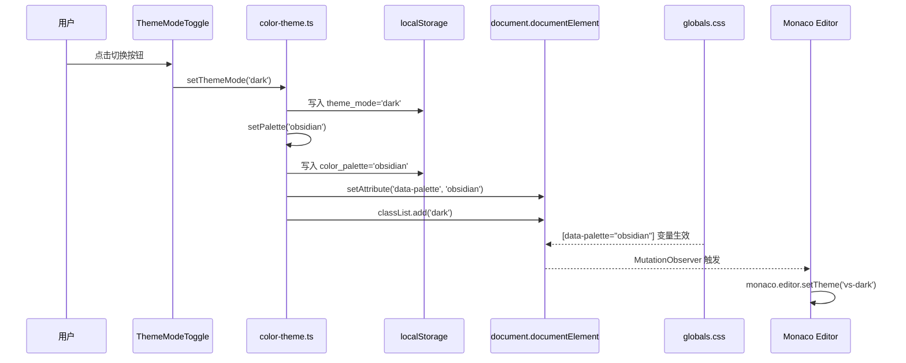
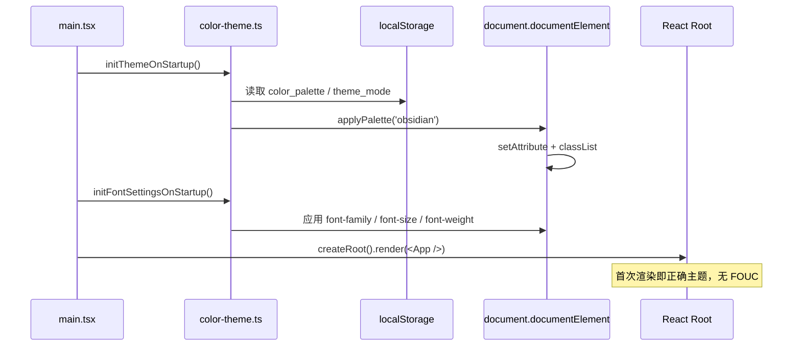

# 主题重构设计文档

> **版本**：v1.1
> **创建日期**：2026-07-26
> **参考来源**：`wait-home/desktop` 的三层主题架构
> **v1.1 变更**：默认主题改为浅色（daylight）；UI 文案"色板"统一改为"主题"；强调缓存机制

---

## 1. 技术决策

### 1.1 三层主题架构（移植自 wait-home）

```
Layer 1: design-tokens.ts   ← 主题定义（OKLCH 语义化字段）
Layer 2: globals.css         ← [data-palette="..."] CSS 选择器注入变量
Layer 3: color-theme.ts      ← 无闪烁切换器（applyPalette + localStorage 缓存）
```

**理由**：与 wait-home 完全对齐，CSS 变量切换无需 React 重渲染，性能最佳；OKLCH 感知均匀，主题视觉协调。

**UI 命名约定**：用户可见文案统一使用"主题"（如"黑曜石主题"、"自定义主题"、"主题切换"）。代码内部保留 `palette`/`PaletteId`/`ColorPalette` 等标识符，以区分"主题模式"（ThemeMode: light/dark/system）。

### 1.2 Tailwind v4 升级

**关键变更**：
- `@import "tailwindcss"` 替代 `@tailwind base/components/utilities`
- `@custom-variant dark (&:is(.dark *))` 替代 `darkMode: 'class'`
- `@theme inline { --color-...: var(--...) }` 替代 `tailwind.config.ts` 的 `theme.extend.colors`
- 移除 `tailwind.config.ts`（v4 用 CSS 配置）

**兼容性**：现有 `bg-background text-foreground` 等 utility class 无需修改，因为 `--color-background` 仍映射到 `--background`。

### 1.3 Monaco 编辑器集成方案

**选型**：`@monaco-editor/react`（社区主流，React 友好封装）

**加载策略**：默认 CDN 加载（`loader.config({ paths: { vs: 'https://cdn.jsdelivr.net/npm/monaco-editor@x.x.x/min/vs' } })`），避免 vite 打包体积膨胀。离线场景可后续切换为本地 worker。

**主题映射**：
- 深色主题（obsidian/deep-sea/twilight/emerald-night/custom）→ Monaco `vs-dark`
- 亮色主题（daylight）→ Monaco `vs`

通过监听 `data-palette` 属性变化，调用 `monaco.editor.setTheme()` 切换。

### 1.4 字体设置（移植自 wait-home）

新增 Rust IPC 命令 `list_system_fonts` 返回 `Vec<FontInfo> { family, display_name }`。前端通过 `font-kit` crate 获取系统字体列表（与 wait-home 一致）。

### 1.5 默认主题与缓存策略（v1.1 新增）

**默认主题**：首次启动（localStorage 无 `color_palette` 与 `theme_mode` 记录）时，默认 `ThemeMode = 'light'`，映射到 `daylight` 主题。

**与 wait-home 的差异**：wait-home 默认 `ThemeMode = 'system'`，qraft 按用户要求改为 `light`。

**缓存键**（全部存 localStorage，重启自动恢复）：

| 键名 | 含义 | 默认值 |
|------|------|--------|
| `theme_mode` | 主题模式（light/dark/system） | `'light'` |
| `color_palette` | 主题 ID（obsidian/deep-sea/twilight/emerald-night/daylight/custom/system） | `'daylight'` |
| `custom_palette_accent` | 自定义主题的 accent 色（HEX） | `null` |
| `font_family` | 界面字体族名称 | `null`（系统默认） |
| `mono_font_family` | 代码字体族名称 | `null`（默认 JetBrains Mono） |
| `font_size_level` | 字号级别（0-4） | `1`（标准） |
| `font_weight_level` | 字重级别（0-4） | `1`（常规） |

**关键实现**：
- `getStoredThemeMode()` 未设置时返回 `'light'`（非 wait-home 的 `'system'`）
- `getStoredPaletteId()` 未设置时返回 `'daylight'`（非 wait-home 的 `'system'`）
- `DEFAULT_PALETTE_ID = 'daylight'`
- 所有 set* 函数同步写入 localStorage，确保刷新/重启后恢复

## 2. 文件结构

```
src/
├── lib/
│   ├── design-tokens.ts     ← 新增：5 套预设色板 + 自定义派生
│   ├── color-theme.ts       ← 新增：applyPalette/setPalette/setThemeMode
│   ├── theme.ts             ← 新增：字体设置（applyFontFamily/FontSize/FontWeight）
│   └── utils.ts             ← 现有
├── components/
│   ├── ui/
│   │   ├── code-editor.tsx  ← 新增：Monaco 封装组件
│   │   ├── theme-mode-toggle.tsx  ← 新增：主题模式循环切换按钮
│   │   └── ...              ← 现有 shadcn 组件
│   ├── SettingsPanel.tsx    ← 重构：色板网格 + 字体设置
│   ├── SideNav.tsx          ← 改造：使用 --sidebar-* 变量 + 集成 ThemeModeToggle + 中文分类
│   ├── ToolPanel.tsx        ← 微调：中文化
│   ├── HistoryPanel.tsx     ← 改造：中文化
│   └── CommandPalette.tsx   ← 微调：已有中文，无需改动
├── tools/
│   ├── JsonFormatter.tsx    ← 替换 Textarea → CodeEditor（language="json"）
│   ├── JsonMinifier.tsx     ← 同上
│   ├── Base64Codec.tsx      ← 替换 Textarea → CodeEditor（language="plaintext"）+ 中文化
│   ├── UrlCodec.tsx         ← 同上
│   ├── JwtParser.tsx        ← 替换 Textarea → CodeEditor + 中文化
│   ├── HashCalculator.tsx   ← 同上
│   └── RegexTester.tsx      ← 替换 Textarea → CodeEditor + 中文化
├── styles/
│   └── globals.css          ← 重写：OKLCH 色板 + @custom-variant dark + @theme inline
├── App.tsx                  ← 微调：empty state 已是中文
└── main.tsx                 ← 新增：initThemeOnStartup + initFontSettingsOnStartup 调用

src-tauri/src/commands/
└── app.rs                   ← 新增：list_system_fonts IPC 命令
```

## 3. 主题定义（OKLCH）

### 3.1 5 套预设主题

| ID | 显示名 | 模式 | 主色调 | 适用场景 |
|----|--------|------|--------|---------|
| `obsidian` | 黑曜石 | 深色 | 蓝调 264° | VS Code Dark+ 风格 |
| `deep-sea` | 深海 | 深色 | 青蓝 220° | 冷色调偏好 |
| `twilight` | 暮光 | 深色 | 橙红 25° | 暖色调偏好 |
| `emerald-night` | 翡翠夜 | 深色 | 翠绿 162° | 护眼偏好 |
| `daylight` | 日光 | 亮色 | 蓝 264° | **默认主题** |

### 3.2 自定义主题派生规则

固定深色基底 + accent 派生关键交互色：

```
primary = accent
ring = accent
sidebarPrimary = accent
sidebarAccent = color-mix(in srgb, accent 20%, transparent)
accentBg = color-mix(in srgb, accent 15%, transparent)
其余字段 = obsidian 基底值
```

### 3.3 主题模式 → 主题映射

```
light  → daylight（默认）
dark   → obsidian
system → 监听 prefers-color-scheme（dark→obsidian, light→daylight）
```

## 4. 关键实现步骤

### 步骤 1：升级 Tailwind v4

1. 卸载 `tailwindcss@3`、`autoprefixer`、`postcss` 旧版
2. 安装 `tailwindcss@4` + `@tailwindcss/vite` + `tailwindcss-animate@4`
3. 删除 `tailwind.config.ts`、`postcss.config.js`
4. `vite.config.ts` 添加 `@tailwindcss/vite` 插件
5. 重写 `globals.css`：`@import "tailwindcss"` + `@custom-variant dark` + `@theme inline`

### 步骤 2：移植主题三层架构

1. 新建 `src/lib/design-tokens.ts`：复制 wait-home 的 5 套主题定义 + `deriveCustomPalette`，但 `DEFAULT_PALETTE_ID` 改为 `'daylight'`
2. 新建 `src/lib/color-theme.ts`：复制 `applyPalette/setPalette/setThemeMode/initColorThemeOnStartup`，但 `getStoredThemeMode()` 默认返回 `'light'`，`getStoredPaletteId()` 默认返回 `'daylight'`
3. 新建 `src/lib/theme.ts`：复制字体设置函数（与 wait-home 一致，无修改）
4. 重写 `src/styles/globals.css`：5 个 `[data-palette="..."]` 块 + `@theme inline` 映射

### 步骤 3：main.tsx 启动初始化

```typescript
import { initThemeOnStartup, initFontSettingsOnStartup } from './lib/theme';
initThemeOnStartup();
initFontSettingsOnStartup();
```

### 步骤 4：新增 Rust `list_system_fonts` 命令

```rust
#[derive(Serialize)]
pub struct FontInfo {
    pub family: String,
    pub display_name: String,
}

#[tauri::command]
pub fn list_system_fonts() -> Result<Vec<FontInfo>, AppError> {
    // 使用 font-kit 枚举系统字体
}
```

在 `capabilities/tool.json` 注册权限。

### 步骤 5：封装 Monaco CodeEditor 组件

```typescript
// src/components/ui/code-editor.tsx
interface CodeEditorProps {
  value: string;
  onChange?: (value: string) => void;
  language?: 'json' | 'plaintext';
  readOnly?: boolean;
  placeholder?: string;
  className?: string;
  'data-testid'?: string;
}
```

- 使用 `@monaco-editor/react` 的 `Editor` 组件
- `useEffect` 监听 `document.documentElement.dataset.palette` 变化切换 Monaco 主题
- 高度 100%，最小高度 200px

### 步骤 6：替换 7 个工具的 Textarea

按工具逐一替换 `<Textarea>` 为 `<CodeEditor>`，同步中文化文案。JSON 类工具用 `language="json"`，其他用 `language="plaintext"`。

### 步骤 7：重构 SettingsPanel

- 移除原 `themeMode` Select
- 新增"主题"卡片：主题网格（6 个 ThemeCard：5 预设 + 自定义 + 跟随系统）+ 自定义 accent 拾色器
- 新增"字体"卡片：字体族下拉 + 字号按钮组 + 字重按钮组 + 预览区
- 保留：最大历史数、JSON 缩进、确认清空、快捷键
- 所有 Label 中文化
- **卡片标题用"主题"，不出现"色板"字样**

### 步骤 8：改造 SideNav

- `bg-card` → `bg-sidebar text-sidebar-foreground`
- 分类标签中文化：Formatter→格式化 / Encoder→编解码 / Generator→生成器 / Parser→解析器 / Converter→转换器 / Comparator→比较器
- 底部集成 `<ThemeModeToggle variant="sidebar" />`

### 步骤 9：中文化所有 UI 文案

逐文件扫描英文文案，替换为中文。重点：
- SettingsPanel：`SHORTCUT_KEYS` 的 label、`Theme Mode`/`Font Size`/`Max History`/`Save`/`Reset`
- HistoryPanel：`Clear History`/`No history`
- ToolPanel：`Tool not found`
- 工具组件：`Input`/`Output`/`Format`/`Execute`/`Minify`/`Testing`/`Running`/`Parsing`/`Computing` 等

### 步骤 10：同步更新测试

- `SettingsPanel.test.tsx`：英文断言 → 中文
- `HistoryPanel.test.tsx`：同上
- `ToolPanel.test.tsx`：同上
- 工具测试：`data-testid` 保留，断言文案中文化

## 5. 关键流程图

### 5.1 主题切换流程



### 5.2 启动无闪烁流程



## 6. 设计决策记录（ADR）

### ADR-01：为何选择 Tailwind v4 而非保持 v3

- **决策**：升级到 v4
- **理由**：用户明确要求对齐 wait-home；v4 的 `@theme inline` 语法更简洁；OKLCH + color-mix 在 v4 有原生支持
- **代价**：需迁移配置文件，但有 wait-home 现成参考

### ADR-02：为何选择 `@monaco-editor/react` 而非 `monaco-editor` 原生

- **决策**：使用 `@monaco-editor/react`
- **理由**：React 封装，自动管理生命周期；默认 CDN 加载避免打包膨胀；API 简洁
- **代价**：依赖 CDN，离线场景需后续配置

### ADR-03：为何不引入 TanStack Query

- **决策**：保持现有 Zustand 架构
- **理由**：qraft 已用 Zustand 管理 config/history/toolState，引入 Query 增加复杂度；wait-home 用 Query 是因业务模块多，qraft 仅 10 个工具无需
- **代价**：字体列表加载需手动管理 loading 状态

## 7. 注意事项

1. **`next-themes` 包移除**：现有 `package.json` 引入了 `next-themes` 但未实际使用，本次重构移除
2. **`darkMode: 'class'` 移除**：v4 用 `@custom-variant dark (&:is(.dark *))` 替代
3. **测试快照**：若有视觉快照测试需重新生成
4. **Tauri CSP**：Monaco CDN 需在 `tauri.conf.json` 的 CSP 中允许 `script-src` 加载 jsdelivr
5. **WebView2 兼容**：Tauri 2 强制 Chromium 111+，OKLCH 与 color-mix 可用
6. **默认主题差异（v1.1）**：qraft 默认 `light` + `daylight`，wait-home 默认 `system`，移植时需修改 `getStoredThemeMode` 与 `getStoredPaletteId` 的默认返回值
7. **UI 文案统一（v1.1）**：所有用户可见的"色板"改为"主题"（如设置页卡片标题"颜色主题"→"主题"、ThemeCard 组件名等）；代码内部 `palette`/`PaletteId` 标识符保留不变
8. **缓存机制（v1.1）**：所有主题相关选择（模式、ID、自定义 accent、字体三件套）必须写入 localStorage，`setPalette`/`setThemeMode`/`applyFontFamily` 等函数内部已包含写入逻辑，无需额外处理

## 8. 相关文档

- [需求文档](./requirements.md)
- [wait-home/desktop 源码](C:\Develop\project\00_AI\wait-home\desktop)
- [qraft 15-ui-design-system.md](../15-ui-design-system.md)
- [qraft 16-state-management.md](../16-state-management.md)
